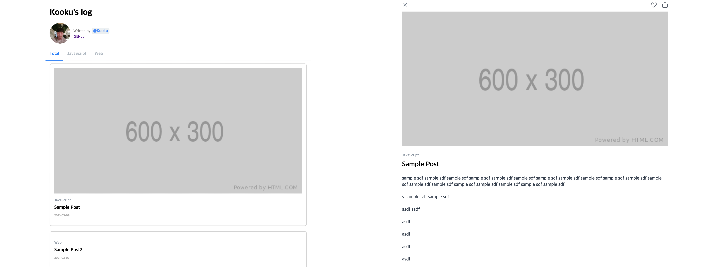
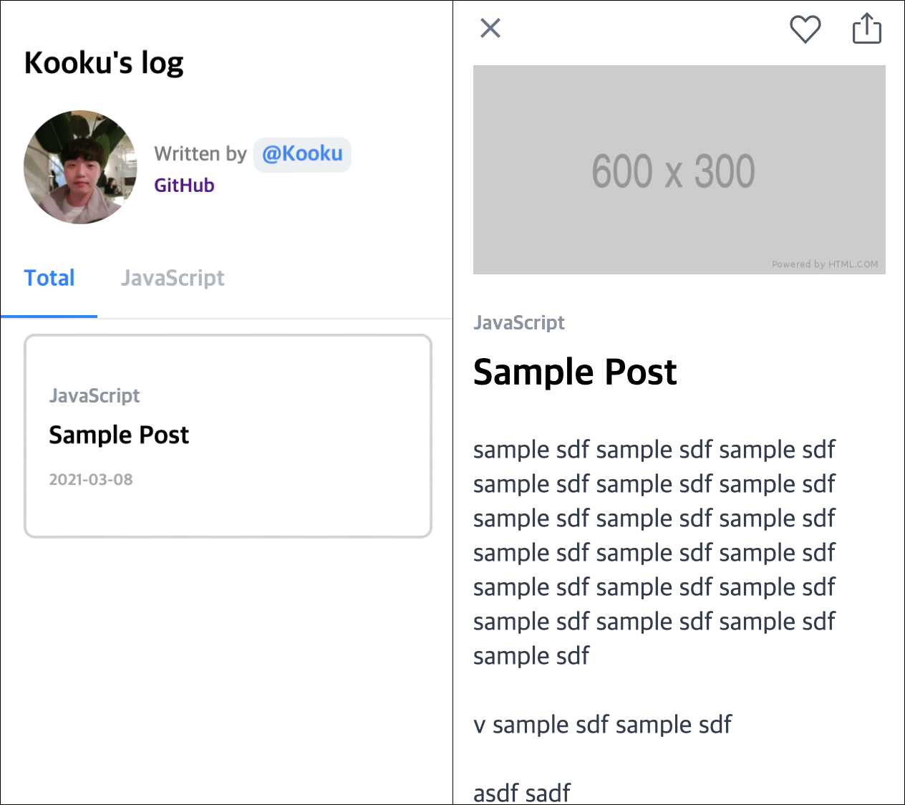
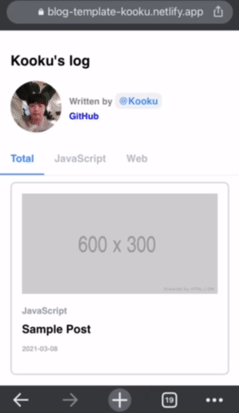
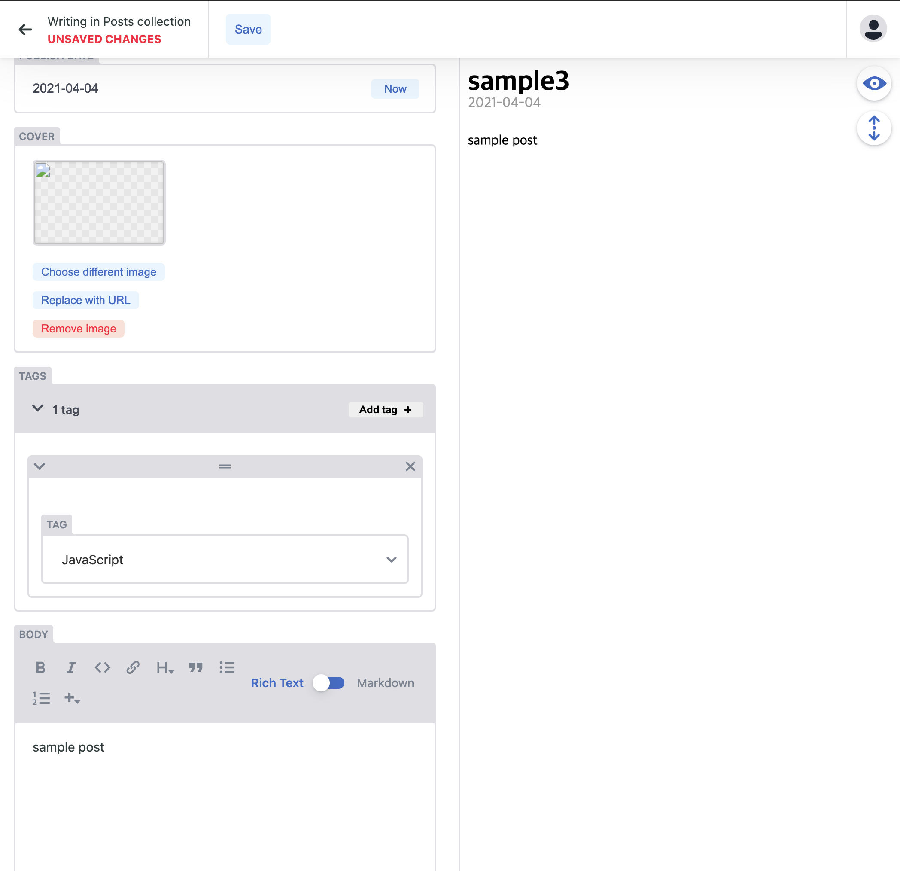

# Blog-Template

[](https://app.netlify.com/sites/blog-template-kooku/deploys)

Blog Template with next.js &amp; emotion &amp; netlify-cms

> Blog Template based on Next.js

In this template

- netlify-cms
- Configurable
- Enhance UX
- Shared Link

## Demo

- [Demo Site](http://blog-template-kooku.netlify.app/)

### PC



### Mobile





## Quick Start

### 1. create Blog

fork this repository

### 2. Start developing.

```shell
$ yarn
$ yarn dev
# open localhost:3000
```

### 3. Update config

You can write...

- update config at `/meta-config.ts`

```ts
export default {
  title: "Kooku's log",
  author: 'Kooku',
  introduction: 'Development Blog',
  siteUri: '',
  profile: '/profile.png',
  social: {
    github: 'kooku94', // Your GitHub account
    medium: '', // Your Medium account
    facebook: '' // Your Facebook account
  }
};
```

### 4. Publish with [netlify](https://netlify.com)

[](https://app.netlify.com/start/deploy?repository=https://github.com/kooku94/blog-template-kooku)

### 5. Add post with [Netlify CMS](https://www.netlifycms.org/)

you can posting with netlify cms..



if you want customize cms tool, edit `/public/admin/config.yml`

## LICENSE

[MIT](./LICENSE)

<div align="center">

<sub><sup>Project by <a href="https://github.com/kooku94">@Kooku</a></sup></sub>

</div>
