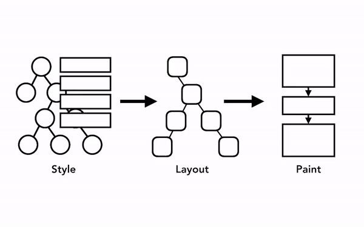

<!--truncate-->

> 출처: [developers.google.com](https://developers.google.com/web/fundamentals/performance/rendering/?hl=ko)

JS와 CSS를 이용하여 animation을 구현해야할 때 성능 상 가장 고려해야할 부분이 Reflow(Layout) 와 Repaint(Paint)를 최소화하는 것이다.

<small> DOM 트리 및 스타일, 레이아웃 트리, 페인트 트리의 순서로 생성된다</small>

렌더링 파이프라인에서 파악해야 할 가장 중요한 점은 각 단계에서 이전 작업의 결과가 새 데이터를 만드는 데 사용된다는 것이다. 예를 들어 레이아웃 트리에서 변경이 생겨 문서의 일부가 영향을 받으면 페인팅 순서도 새로 생성해야 한다.

요소에 애니메이션을 적용하면 브라우저는 모든 프레임 사이에서 이러한 작업을 해야 한다. 대부분의 디스플레이 장치는 화면을 초당 60번 새로 고친다(60fps). 요소의 움직임이 모든 프레임에 반영되어야 사람이 볼 때 부드럽게 느껴진다. 애니메이션에서 프레임이 누락되면 웹 페이지가 '버벅대는(janky)' 것처럼 보인다.

화면 주사율에 맞추어 렌더링 작업이 이루어져도 이 작업은 메인 스레드에서 실행되기 때문에 애플리케이션이 JavaScript를 실행하는 동안 렌더링이 막힐 수 있다.
JavaScript 작업을 작은 덩어리로 나누고 `requestAnimationFrame()` 메서드를 사용해 프레임마다 실행하도록 스케줄을 관리할 수 있다.  하지만 이건 JavaScript의 실행을 끊김없이 하는데 도움을 줄 뿐 실제로 메인쓰레드가 수행하는 작업의 양은 줄어들지 않는다.
메인쓰레드가 수행하는 작업의 양을 줄이는 작업이 바로 Reflow와 Repaint를 최소화하는 것이다.

## Reflow(Layout)

DOM Tree 와 CSSOM로 만든 Render Tree를 바탕으로 DOM을 Viewport 내에 놓일 정확한 위치와 크기를 계산하여 적용하는 단계이다.
이 단계에서는 해당 DOM의 크기와 위치를 계산할 시 주변 노드(부모, 자식)들에 영향을 받게 된다. 따라서 이미 계산된 Layout에서 한 노드만 다시 계산하여도 주변 모든 노드들도 다시 계산하게 된다.
css 에서 다음의 속성들을 건드리게 되면 Reflow단계를 수행하게 된다.

- padding
- margin
- display
- border
- position
- float
- overflow
- font-family
- vertical-align
- clear
- bottom
- left
- right
- font-weight
- white-space
- etc..

## Repaint(Paint)

Layout에서 계산된 결과를 바탕으로 Viewport에서 픽셀을 채워넣는 단계이다.
밑의 속성들이 변경되면 Repaint 단계가 일어난다.

- Visibility
- background
- text-decoration
- background-image
- background-repeat
- border0radius
- box-shadow
- background-size
- etc...

만약 기존 CSS에서 background-color만 바꾸게 된다면 Reflow단계를 건너뛰고 Repaint단계만 수행하게 된다.

## Composite

opacity, transform등의 속성은 Reflow, Repaint 단계를 거치지 않는다.
Reflow, Repaint를 모두 건너 뛰게 되어 연산이 절대적으로 줄게 된다.
따라서 animation을 구현할 때 transform을 통해서 구현하는 것이 성능 상에 이점이 많다.

특히나 Composite의 이점은 메인 스레드와 별개로 작동이 된다. Compositor thread는 JavaScript 실행이나 스타일 계산을 기다리지 않아, Composite만 하는 animation이 성능상 가장 부드럽다고 보는 이유이다.
(Layout이나 Paint를 다시 계산해야할 경우에는 main thread가 관여하게 된다.)

## 정리

animation 성능을 향상(부드러운 animation)시키기 위해서는 Reflow와 Repaint를 최소화하는게 중요하다.
width, height, left, right등의 요소를 사용하기 보다는 다음의 네가지 요소를 이용해서 animation을 구현하자.

- opacity
- translate
- rotate
- scale

실제로 React나 Vue에서 Virtual Dom을 사용하는 이유가 Reflow, Repaint를 여러번 하지않고, 모아서 한꺼번에 처리해 성능을 높히기 위함이다.

경우에 따라서는 Reflow를 해야만 하는 경우가 있다. 이러한 경우에는 해당 node를 position: absolute or fixed로 변경하는게 좋다. 그 이유는 Reflow를 사용할 시 부모, 자식등 영향을 받는 모든 node들이 계산하게 되는데, absolute, fixed일 경우 부모에게 종속되지 않는 새로운 layer에 그려지게 된다.

따라서 만약 해당 node에 reflow가 발생하게 된다면 해당 layer만 새로 업데이트 된다.

### Reference

- [Reflow, Repaint, Composit에 영향을 미치는 속성들을 더 알고싶다면 여기를 참고하자](https://csstriggers.com/)
- [Rendering process & performance에 대한 내용](https://developers.google.com/web/fundamentals/performance/rendering/?hl=ko)
- [Render-tree Construction, Layout, and Paint](https://developers.google.com/web/fundamentals/performance/critical-rendering-path/render-tree-construction?hl=en)
- [hight performance animation의 조금 더 깊은 내용](https://www.html5rocks.com/en/tutorials/speed/high-performance-animations/)
- [최신 브라우저의 내부 살펴보기](https://d2.naver.com/helloworld/5237120)
