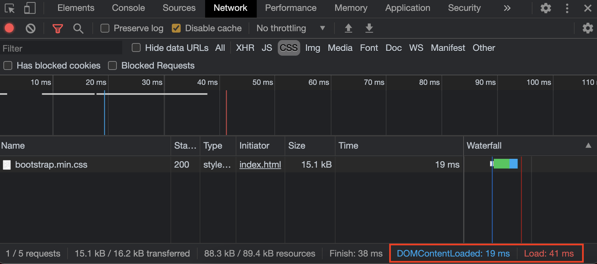

기본적으로 CSS는 rendering-blocking resource입니다. 브라우저가 렌더링을 하기 위한 render tree를 생성하기 위해서는 DOM tree 와 CSSOM이 모두 필요합니다. CSSOM이 만들어지지 않았다면 render tree도 만들수가 없는거죠. <br/>
CSS가 사용 가능해질 때까지(CSSOM이 만들어질 때까지)렌더링이 차단되기에 **media type**과 **media query**를 사용하여 문제를 해결할 수 있습니다.

```html
<link href="style.css" rel="stylesheet" />
<link href="print.css" rel="stylesheet" media="print" />
<link href="other.css" rel="stylesheet" media="(min-width: 40em)" />
```

첫 번째 줄은 항상 렌더링을 차단합니다. 반면에 두 번째 stylesheet 는 콘텐츠가 인쇄될 때만 렌더링을 차단합니다. 마지막 stylesheet는 브라우저가 실행하는 **media query**와 일치할 때 브라우저가 렌더링을 차단합니다.

### media="all"


### media="print"



## 마무리

styleseet 설정으로 성능을 높힐 수 있는 방법을 살펴보았습니다. 렌더링을 빠르게 하기 위한 한 가지 팁으로만 생각하면 될 것 같습니다.

## Reference

- [Render-Blocking CSS :: developer.google.com](https://developers.google.com/web/fundamentals/performance/critical-rendering-path/render-blocking-css)
