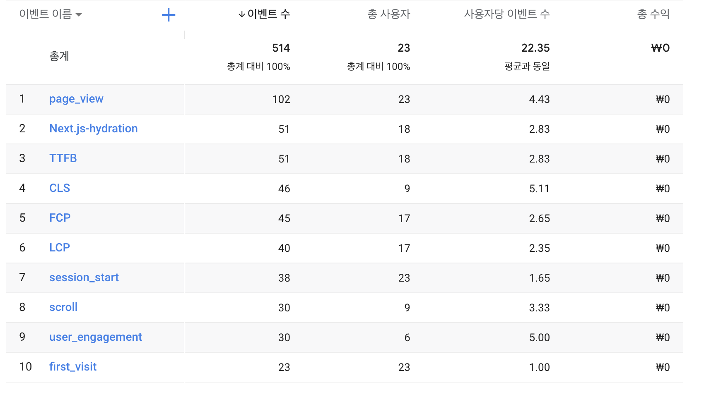

CRA를 통해 프로젝트를 생성하면 Web-Vitals를 봤을 겁니다. 이 Web Vitals은 어떤 작업을 하고 어떻게 사용하는 것 일까요?

<!--truncate-->

## Overview

Web Vietals은 웹에서 좋은 사용자 경험을 제공하는데 필수적인 품질에 대해 구글이 제공하는 지표입니다.

Google은 web 성능을 측정할 수 있는 여러 tools들을 제공했지만 일부 개발자들만 유용하게 사용할 뿐 많은 개발자들이 무관심했습니다.
이러한 문제를 해결하기 위해 Web Vitals의 환경을 단순화하고 사이트 성능 지표에 가장 중요한 Core Web Vitals에 집중하도록 돕게 발전했습니다.

## Core Web Vitals

Core Web Vitals는 Web Vitals 중 가장 중요하게 생각되는 부분집합으로 LCP(Largest Contents Pain), FID(First Input Delay), CLS(Cumulative Layout Shift)가 포함되어 있습니다.

- **Largest Contentful Paint (LCP)**: 페이지가 처음 로드되기 시작한 시점을 기준으로 뷰포트 내에 표시되는 가장 큰 이미지 또는 텍스트 블록의 렌더링 시간을 측정합니다.
- **First Input Delay (FID)**: 사용자가 페이지와 처음 상호작용한 시간(ex: 링크나 버튼을 클릭하거나 JavaScript 기반 컨트롤을 사용할 때)부터 실제로 이벤트 핸들러 처리를 시작할 수 때까지의 시간을 측정합니다.
- **Cumulative Layout Shift (CLS)**: 예기치 않은 _layout sift_ 에 대한 모든 개별 레이아웃 이동 점수들의 합계를 측정합니다. *layout sift*는 element가 렌더링 된 프레임에서 다음 프레임으로 위치가 변경될때 마다 발생합니다.

## Core Web Vitals을 측정하고 레포팅할 수 있는 Tools

Google은 Core Web Vitals가 모든 web 경험에서 매우 중요하다고 생각합니다. 결과적으로 인기있는 Web Vitals 측정 도구들은 Core Web Vitals을 측정할 있습니다.

|                                                                                                        | LCP | FID | CLS |
| ------------------------------------------------------------------------------------------------------ | --- | --- | --- |
| [Chrome User Experience Report](https://developers.google.com/web/tools/chrome-user-experience-report) | ✔   | ✔   | ✔   |
| [PageSpeed Insights](https://developers.google.com/speed/pagespeed/insights/)                          | ✔   | ✔   | ✔   |
| [Search Console (Core Web Vitals report)](https://support.google.com/webmasters/answer/9205520)        | ✔   | ✔   | ✔   |

## JavaScript로 Core Web Vitals 측정하기

Core Web Vitals는 standard web API를 사용하여 JavaScript에서 측정할 수 있습니다.

가장 쉬운 방법은 [web-vitals](https://github.com/GoogleChrome/web-vitals) JavaScript library를 사용하는 방법입니다. 크기가 작고, production에서 사용할 때도 문제가 없으며 위에 나열된 Google tools에서 측정하는 방식으로 동일하게 측정합니다.

```js
import { getCLS, getFID, getLCP } from "web-vitals";

function sendToAnalytics(metric) {
  const body = JSON.stringify(metric);
  // Use `navigator.sendBeacon()` if available, falling back to `fetch()`.
  (navigator.sendBeacon && navigator.sendBeacon("/analytics", body)) ||
    fetch("/analytics", { body, method: "POST", keepalive: true });
}

getCLS(sendToAnalytics);
getFID(sendToAnalytics);
getLCP(sendToAnalytics);
```

Web Vitals library를 사용하여 Core Web Vitals를 측정하고 analytics endpoints로 전송하도록 사이트를 구성한 후, data를 집계하고 레포팅하여 페이징 방문자들의 75%이상이 권장 thresholds를 충족하는지 확인해야합니다.

## Use Case

저는 Next.js 프로젝트에 web-vitals를 적용해보았습니다.
https://nextjs.org/docs/advanced-features/measuring-performance

```jsx
export function reportWebVitals({ id, name, label, value }) {
  // Use `window.gtag` if you initialized Google Analytics as this example:
  // https://github.com/vercel/next.js/blob/canary/examples/with-google-analytics/pages/_document.js
  window.gtag("event", name, {
    event_category:
      label === "web-vital" ? "Web Vitals" : "Next.js custom metric",
    value: Math.round(name === "CLS" ? value * 1000 : value), // values must be integers
    event_label: id, // id unique to current page load
    non_interaction: true, // avoids affecting bounce rate.
  });
}
```

다음과 같이 구글 analytics에서 이벤트가 로깅된 것을 확인할 수 있습니다.



로깅된 결과를 그래프로 볼 수 있는, GoogleChromeLabs에서 만든 오픈소스가 존재하는데, 바로 [Web Vitals Report](https://github.com/GoogleChromeLabs/web-vitals-report) 입니다. 참고로 [Web Service](https://web-vitals-report.web.app/)도 제공하고 있습니다.

GA4는 아직 지원하지 않기에, GA4 이하에서만 확인할 수 있습니다.
제공하는 정보를 보면, 모바일 or 데스크탑으로 유입된 유저들에 대한 Core Web Vitals를 수집하고, 평균점수를 확인 할 수 있습니다. 페이지별 Web Vitals과 여러 유저환경에서의 점수를 측정할 수 있어, 잘 활용한다면 매우 유의미한 결과를 얻을 수 있을 것이라 생각됩니다.

