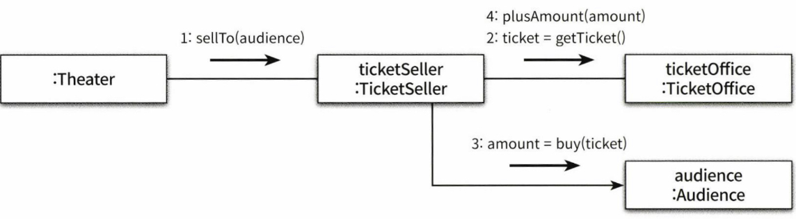

프론트엔드에서의 설계방식의 변천사를 소개한 뒤 앞으로 어떻게 컴포넌트를 만들어야 할지 저의 생각을 이야기 해보겠습니다.

<!--truncate-->

## Presentational and Container Components

이전 jQuery로 프론트를 개발하던 시기에는 dom과 비즈니스 로직이 뒤섞여 코드가 짜여졌습니다. 이렇게 코드가 짜여지니 가독성이 매우 떨어지고, 버그와 에러는 항상 내재되어 있었습니다.  
이런 문제를 해결하기 위해서 관심사를 분리하기 시작했습니다. 상태를 관리하는 곳, 비동기 로직을 처리하는 곳, 비즈니스 로직을 처리하는 곳, dom과 스타일을 보여주는 곳.  
관심사 분리는 설계와 관련된 책을 읽으면 항상 등장하는 개념이지만, 프론트엔드 엔지니어들은 [Presentational and Container Components](https://medium.com/@dan_abramov/smart-and-dumb-components-7ca2f9a7c7d0)로 많이 익숙할 것 같습니다.
Container Component에서는 비즈니스 로직을 처리하고 Presentational Component에서는 View를 처리하도록 컴포넌트를 분리한 패턴입니다.

이렇게 분리하면 뭐가 좋을까요? Container는 dom 과 style등 마크업을 하는데 전혀 관여하지 않고 여러 Presentaional Component들이 어떻게 동작해야하는지 관리합니다. store에 연결하여 데이터를 받아 presentaional component에 전달하고, presentaional component의 버튼이 클릭되면 어떻게 동작해야하는지 등도 container component가 관리하죠. 그리고 persentaional component는 스타일과 마크업만 신경씁니다.

이렇게 각 컴포넌트가 하는 역할이 분리되니 비즈니스 로직의 수정사항이 발생했을 때는 container component만 view의 수정사항이 발생했을 때는 presentaional component만 고치면 됩니다. 가독성과 유지보수성이 높아졌죠.

## 절차적 프로그래밍과 객체지향 프로그래밍

### 절차적 프로그래밍

객체지향을 공부하면 절차지향을 객체지향과 비교하며 많이 소개하곤 합니다. 프로그램을 작게 쪼개면 데이터(Data)와 프로세스(Process)로 나눌 수 있는데 프로세스와 데이터를 별도의 모듈에 위치시키는 방식을 절차적 프로그래밍(Procedural Programming)이라고 부릅니다. 위에서 보았던 Presentaional and Container Components 패턴이 대표적인 절차적 프로그래밍입니다.

적차적 프로그래밍에서 이야기하는 데이터를 프론트에서는 dom 객체로 생각하고 프로세스를 dom 객체를 컨트롤하는 메서드 혹은 함수라 생각하면 될 것 같습니다. 절차적 프로그래밍에서는 많은 컴포넌트(presentaional component)들이 수동적입니다. 모든 처리가 Container Component에서 이루어지고 Presentational component들은 단지 데이터를 받아 보여주는 역할만 수행하기 때문입니다. 처음에는 이게 원하는 방식이었지만 하나의 Container Component가 너무 많은 Presentaional Component들을 handling할 때 문제가 생겼습니다. presentaional component가 많아지게 되면 많은 props drilling 그리고 ref를 통해 dom을 조작해야하는 경우가 있을 때 Container Componnt에는 매우 많은 비즈니스 로직이 들어가고 커지게 됩니다. A Presentaional Component를 handling하는 로직, B Presentaional Component를 controll하는 로직이 모두 하나의 컴포넌트에 있는 것이죠.

<small><em>책임이 중앙집중된 절차적 프로그래밍 (참고: 오브젝트)</em></small>

 

### 객체지향 프로그래밍

객체지향 프로그래밍에서는 이를 지양합니다. 자신의 데이터는 스스로 처리하도록 프로세스를 데이터가 있는 곳으로 이동시키죠. 이렇게 되면 데이터와 프로세스가 동일한 모듈 내부로 위치하게 되고 각 모듈은 능동적으로 변하게 됩니다. A Component를 조작하는 비즈니스 로직이 A Component에 존재하게 되어 다른 Component에 의존하지 않게 되는 것이죠.

<small><em>책임이 분산된 객체지향 프로그래밍 (참고: 오브젝트)</em></small>

 

## 각각의 장단점을 분석해보자

`Presentaional and Container Components` 와 객체지향 프로그래밍 모두 장단점이 분명했습니다.
`Presentaional and Container Components`에서는 관심사 분리가 확실했지만 props drilling과 container component가 관리하는 presentational component가 많아 container component가 복잡해진다.  
객체지향 프로그래밍에서는 의존성이 줄어들고 관심사 props drilling이 일어나지 않지만 비즈니스 로직과 뷰가 한 컴포넌트에 존재함으로써 유지보수와 가독성이 우려된다.

### Container component 분리

우선 `Presentaional and Container Components`의 단점을 해결할 수 있는 방법들을 생각해봅시다.  
지금 딱 떠오르는 방법은 container component를 쪼개면 되지 않을까? 생각이 들었습니다. Container Component가 컨트롤하고 담당하는 부분을 쪼개면 container component가 작아지고 하나의 Container Component가 책임지고 있는 presentational component들이 적어지니 문제가 해결될 것 같기도 합니다. 하지만 이렇게 되면 container component들 끼리 소통하는 경우 props로 또 내려주거나 global store에 데이터를 넣어줘야합니다 ㅠㅠ 컨테이너를 쪼개긴 했지만 이를 위해 추가되어야 할 로직들이 많아졌습니다. 과연 올바른 방법일까요?

### Custom Hooks

객체지향에서 가지고 있었던 문제였던 하나의 컴포넌트에서 뷰와 비즈니스 로직이 들어있던 문제는 어떻게 해결할 수 있을까요? react 16.7에서 hooks가 나왔고 custom hooks를 많은 개발자 들이 사용하게 되었습니다. 공통된 비즈니스 로직들을 추상화하여 custom hooks로 만들면? 컴포넌트 안에 들어있던 비즈니스 로직들을 어느정도 분리할 수 있지 않을까요?

여기서 또 고민인게... 과연 공통된 비즈니스 로직이 얼마나 되느냐인 겁니다. 실제로 각 컴포넌트가 할 일들은 매우 지역적이고 해당 컴포넌트에서만 사용될 로직이 대부분일 겁니다. 따라서 공통된 비즈니스 로직들을 hooks로 빼더라도 컴포넌트에 남아있는 비즈니스 로직이 많겠죠.

> 최근 recoil 과 server-state library인 SWR & react-query가 나오면서 이전 redux-saga & redux-thunk 를 사용할 때 처럼 작성해야할 로직이 많지는 않을 것이라는게 다행이긴 할 것 같네요.

## 비즈니스 로직 쪼개기

지금 문제는 컴포넌트에 들어가는 비즈니스 로직들이 많다는 것이기에 로직들을 역할에 따라 구별해야할 필요성이 생겼습니다. 이제 프론트에서 동작하는 비즈니스 로직들은 어떤게 있을지 구분해보겠습니다.

- 서버와 통신하는 로직 (api)
- dom을 조작하는 로직 (ref)
- client-state 를 관리하는 로직 (redux, recoil, useState)
- Event handler (button, input)

더 있을 것 같지만 지금 생각나는건 이정도네요.

우선 위 4개의 로직들은 관심사가 다르니 구별해야하는건 확실한 것 같습니다.

**서버와 통신하는 로직**은 react-query와 같은 server-state library를 사용하거나 custom-hooks로 모두 빼면 될 것 같습니다.

**dom을 조작하는 로직**은 조금 애매하긴 하지만 추상화 시킬 수 있는 여지는 충분합니다. dom의 위치를 조작한다던가 scroll을 조작하는 건 custom-hooks로 뺄 수 있을 것 같습니다. 물론 매우 지역적인 로직일 경우에는 공통적인 부분만 custom-hooks로 처리하고 나머지는 callback function을 통해 처리할 수도 있을 것 같습니다.

**client-state**의 경우 요즘 redux-toolkit 도 나오고 recoil도 나오면서 useSelector, useDispatch 등을 통해 한두줄로 짤 수 있습니다.

**Event-handler**의 경우 대부분 해당 컴포넌트에서만 사용되는 경우가 많을꺼라 공통로직이 거의 없을 것이고 컴포넌트 내부에서 구현해야할 것 입니다.

## 결론

컴포넌트를 어떻게 쪼개냐에 따라 달라지겠지만 하나의 컴포넌트는 자신이 필요한 데이터는 자신이 요청해 받아오고 그 데이터를 functional 혹은 custom-hooks로 가공해 사용하게 됩니다.  
Container Component에 있었던 Event handler는 컴포넌트 내부로 옮겨왔고, 자신의 컴포넌트에 있는 dom의 이벤트를 직접 핸들링합니다. 그리고 컴포넌트간의 통신은 props를 최대한 지양하고 global state를 통해 통신이 일어나도록 해야 합니다. props로 데이터를 전달하는 순간 절차적 프로그래밍으로 변모될 가능성이 농후하기 때문입니다. 따라서 컴포넌트 사이의 통신은 global state로, 컴포넌트의 비즈니스 로직들은 custom-hooks 혹은 컴포넌트 내부에서 일어나야 합니다. (공통 dom&styled를 추상화 시킨 컴포넌트를 사용할 때에만 props를 사용해야 합니다.)

각각의 컴포넌트가 이전의 container component의 역할을 수행한다고는 하지만 그렇다고 presentational component가 완전히 사라지는건 아닙니다. 공통적으로 사용되는 button, input, dialog, alert 들은 재사용할 수 있는 dom, style 요소들이 많습니다. 이런 부분은 common component 혹은 styled component로 따로 빼서 재사용하면 중복되는 코드나 스타일도 줄일 수 있을 것 같습니다.

`Presentaional and Container Components`와 뭐가 다르냐고 생각이 들 수 있습니다. `Presentaional and Container Components`가 비즈니스 로직을 처리하는 컴포넌트, view를 처리하는 컴포넌트로 관심사를 기준으로 컴포넌트를 구분했다면 이제는 컴포넌트를 책임과 역할 단위로 구분하고, 공통된 비즈니스 로직, 스타일, dom들을 추상화 시켜 뺌으로써 모든 컴포넌트가 작은 Container Component이자 Presentaional Component가 되는 것 입니다.
