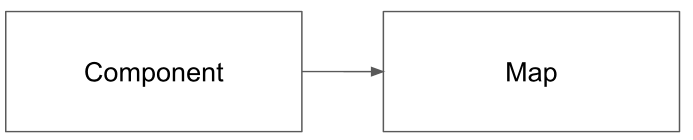

## 1) 좋은 설계는 왜 필요한 것인가?

왜 좋은 설계는 필요할까? 오브젝트나 클린 아키텍처에서 말하는 좋은 설계를 해야하는 이유는 다음과 같다.

<!--truncate-->

:::note 오브젝트

좋은 설계란 오늘의 기능을 수행하면서 내일의 변경을 수용할 수 있는 설계다.

:::

:::note 클린 아키텍처

소프트웨어 아키텍처의 목표는 필요한 시스템을 만들고 유지보수하는데 투입되는 인력을 최소화하는데 있다.

:::

두 책에서 이야기하는 좋은 설계의 목표는 동일하다. **유지보수**

우리가 흔히 공부하는 객체지향, 함수형 프로그래밍, TDD, DDD, etc.. 들과 고민들은 어떻게하면 유지보수하기 쉬운 프로그램을 만들까? 라는 고민에서 탄생했다고 개인적으로 생각한다.

## 2) 좋은 설계는 어떻게 할 수 있을까?

좋은 설계를 어떻게 할 수 있을까? 라는 고민을 개인적으로 많이 했으나 두루뭉실한 답변만 나올뿐 명쾌한 답변은 나오지 않았다. 하긴 상황에 따라 좋은 설계의 해법은 천차만별일 것이고 이런 해법들은 대부분 경헙에서 도출되는 것 같다. 이런 경험들은 직접겪지 않더라도 이미 경험하고 고민한 내용을 기술한 책으로 부터 간접적으로 얻을 수 있다. (이게 책을 읽어야하는 이유가 아닐까? 나의 pain point를 줄여주는 치트키)

좋은 소프트웨어를 만드는 일을 집짓기에 많이 비유하곤 한다. 집을 잘짓기 위해서는 기본적으로 좋은 벽돌이 필요하다. 아무리 건축사가 집을 잘짓더라도 벽돌이 안좋다면 집이 무너지기 쉬우니 말이다. 소프트웨어에서 좋은 벽돌은 clean code를 의미한다. 아무리 좋은 설계기법을 알고 있더라도 기본에 충실하자. 어떻게하면 가독성이 좋게 변수명을 짓고 함수를 만들 수 있을지(좋은 벽돌을 만들 수 있을지) 끊임없이 노력해야한다.

반대로 좋은 벽돌을 사용하더라도 빌딩의 아키텍처를 엉망으로 만들 수 있다. 그래서 좋은 벽돌로 좋은 좋은 아키텍처를 정의하는 원칙이 필요한데, 이게 바로 SOLID다.

즉 SOLID는 좋은 설계를 하기위한 원칙이다.

## 3) SOLID

### SRP: 단일 책임 원칙 (Single Responsibility Principle)

> 단일 모듈은 변경의 이유가 하나, 오직 하나뿐이어야 한다.

단일 책임 원칙을 _하나의 일만 해야한다_ 로 알고 있는 경우가 있는데 이는 잘못되었다. 그것은 함수는 반드시 하나의 일만 해야한다는 원칙이다. 클린 아키텍처보다는 클린 코드에 더 가깝다.

SRP에서 이야기하는 '모듈'의 정의는 함수와 데이터 구조로 구성된 응집된 집합이다.

#### 예제

지도 컴포넌트를 위한 커스텀 훅을 만들었다고 생각해보자. 이 커스텀 훅의 매개변수는 지도 컨테이너의 ref, 중심좌표, zoomLevel, 지도 타입(naver, kakao)이고 리턴값은 지도를 컨트롤하는 zoomIn, zoomOut 함수라고 하자.

```ts
interface Params {
  ref: RefObject<HTMLDivElement>;
  center: LatLng;
  zoomLevel: number;
  type: "naver" | "kakao";
}

function useMap({ ref, center, zoomLevel, type }: Params): Map {
  const [map, setMap] = useState<kakao.maps.Map | naver.maps.Map | null>(null);

  useEffect(() => {
    const mapElement = ref.current;

    if (!mapElement) {
      return;
    }

    if (type === "kakao") {
      const mapOption = {
        center: new kakao.maps.LatLng(center.latitude, center.longitude),
        level: zoomLevel,
      };
      const kakaoMap = new kakao.maps.Map(mapElement, mapOption);
      setMap(kakaoMap);
      return;
    }

    if (type === "naver") {
      const mapOption = {
        center: new naver.maps.LatLng(center.latitude, center.longitude),
        zoom: zoomLevel,
      };
      const naverMap = new naver.maps.Map(mapElement, mapOption);
      setMap(naverMap);
      return;
    }
  }, []);

  const zoomIn = () => {
    if (!map) {
      return;
    }

    if (type === "kakao") {
      map.setLevel(map.getLevel() - 1);
      return;
    }

    if (type === "naver") {
      map.setZoom(map.getZoom() + 1);
      return;
    }
  };
  const zoomOut = () => {
    if (!map) {
      return;
    }

    if (type === "kakao") {
      map.setLevel(map.getLevel() + 1);
      return;
    }

    if (type === "naver") {
      map.setZoom(map.getZoom() - 1);
      return;
    }
  };

  return {
    zoomIn,
    zoomOut,
  };
}

export default useMap;
```

네이버 지도가 필요한 곳에서 이 훅에 type을 naver로 넘겨주어 사용하고, 카카오 지도를 사용하는 곳에서는 type을 kakao로 넘겨줘서 사용할 것이다. 하지만 네이버 지도를 사용하는 곳에서는 마커를 찍는게 필요해 setMarker 함수를 추가했다고 해보자.

```ts
const setMarker = () => {
  const imageSize = new naver.maps.Size(markerSize.width, markerSize.height);
  const markerPosition = new naver.maps.LatLng(latitude, longitude);
  const marker = new naver.maps.Marker({
    position: markerPosition,
    image: markerImage,
    icon: {
      url: markerImageSrc,
      size: imageSize,
    },
  });

  marker.setMap(map);
};
```

시간이 흘러 카카오지도를 사용하는 곳에서도 마커를 찍는 기능이 필요했는데 모듈의 리턴값에 setMarker가 있어 그대로 사용했다. 하지만 원하는대로 동작하지 않았다. 혹은 naver, kakao 맵에서 사용되는 공통로직을 함수로 만들었는데 네이버 지도의 요구사항에 따라 공통로직을 수정했다가 카카오맵이 제대로 동작하지 않는 상황이 발생할 수도 있다.

모두 훅이 하나의 일만하는게 아니라 여러가지 일을 하기에 발생하는 문제이다. 즉 네이버지도를 사용하는 곳에서 발생하는 요구사항으로 인한 변경, 카카오지도를 사용하는 곳에서 발생하는 요구사항으로 인한 변경, 모듈의 변경을 발생시키는 포인트가 두가지이기 때문이다.

#### 결론

클린 아키텍처에서는 서로 다른 액터가 의존하는 코드를 서로 분리하라고 말한다.

### OCP: 개방-폐쇄 원칙 (Oepn-Closed Principle)

> 소프트웨어 개체는 확장에는 열려 있어야 하고, 변경에는 닫혀 있어야한다.

만약 요구사항을 살짝 확장하는 데 소프트웨어를 엄청나게 수정해야 한다면 잘못 설계된 것이다. 소프트웨어 아키텍처가 훌륭하다면 변경되는 코드의 양이 가능한 한 최소화될 것이다.

어떻게 하면 될까? 서로 다른 목적으로 변경되는 요소를 적절하게 분리하고, 이들 요소 사이의 의존성을 체계화함으로써 변경량을 최소화할 수 있다.

#### 예시

카카오지도의 기능에 건물들이 카카오캐릭터로 바꾸어 보여주는 api가 있다고하자. 이 api는 mapHooks의 인터페이스에 추가하는게 맞을까? 카카오지도 모듈로 부터 발생한 변경으로 부터 네이버지도 모듈과 상위지도 모듈을 보호하려면 모듈을 분리하고 의존성 방향을 상위지도 모듈 방향으로 향하게하여 지도 모듈과 네이버지도 모듈을 보호해야한다.


#### 결론

아키텍트는 기능이 어떻게, 왜, 언제 발생하는지에 따라서 기능을 분리하고, 분리한 기능을 컴포넌트의 계층구조로 조직화한다. 컴포넌트 계층구조를 이와 같이 조직화하면 저수준 컴포넌트에서 발생한 변경으로부터 고수준 컴포넌트를 보호할 수 있다.

OCP의 목표는 시스템을 확장하기 쉬운 동시에 변경으로 인해 시스템이 너무 많은 영향을 받지 않도록 하는데 있다. 이런 목표를 달성하려면 시스템을 컴포넌트 단위로 분리하고, 저수준 컴포넌트에서 발생한 변경으로부터 고수준 컴포넌트를 보호할 수 있는 형태의 의존성 계층구조가 만들어지도록 해야 한다.

### LSP: 리스코프 치환 원칙 (Liskov Substitution Principle)

> 잘 정의된 인터페이스와 그 인터페이스의 구현체끼리는 상호 치환이 가능하다.

#### 예제

Map의 인터페이스를 잘 정의했다면 NaverMap을 사용하는 컴포넌트에서 KakaoMap으로 변경해달라는 요청이 들어왔을 때 모듈만 바꿔낌으로써 해결할 수 있다.


```ts
function useKakaoMap({ ref, center, zoomLevel }: Params): Map {
  const [map, setMap] = useState<kakao.maps.Map | null>(null);

  useEffect(() => {
    const mapElement = ref.current;

    if (!mapElement) {
      return;
    }
    const mapOption = {
      center: new kakao.maps.LatLng(center.latitude, center.longitude),
      level: zoomLevel,
    };
    const kakaoMap = new kakao.maps.Map(mapElement, mapOption);
    setMap(kakaoMap);
  }, []);

  const zoomIn = () => {
    if (!map) {
      return;
    }

    map.setLevel(map.getLevel() - 1);
    return;
  };
  const zoomOut = () => {
    if (!map) {
      return;
    }

    map.setLevel(map.getLevel() + 1);
    return;
  };

  return {
    zoomIn,
    zoomOut,
  };
}

export default useKakaoMap;
```

```ts
function useNaverMap({ ref, center, zoomLevel }: Params): Map {
  const [map, setMap] = useState<naver.maps.Map | null>(null);

  useEffect(() => {
    const mapElement = ref.current;

    if (!mapElement) {
      return;
    }

    const mapOption = {
      center: new naver.maps.LatLng(center.latitude, center.longitude),
      zoom: zoomLevel,
    };
    const naverMap = new naver.maps.Map(mapElement, mapOption);
    setMap(naverMap);
  }, []);

  const zoomIn = () => {
    if (!map) {
      return;
    }

    map.setZoom(map.getZoom() + 1);
    return;
  };

  const zoomOut = () => {
    if (!map) {
      return;
    }

    map.setZoom(map.getZoom() - 1);
    return;
  };

  return {
    zoomIn,
    zoomOut,
  };
}

export default useNaverMap;
```

### ISP: 인터페이스 분리 원칙 (Interface Segregation Principle)

> 불필요한 것에 의존하지 않도록 해라

#### 예제

지도 모듈의 인터페이스에 모든 지도기능들을 포함시켜본다고 생각해보자. 로드뷰기능을 지도모듈에 포함시켜 달라는 요구사항이 생겼다고 해보자. 로드뷰기능이 과연 지도모듈을 사용하는 모든 곳들에 필요할까? 실제로 사용되는 곳은 매우 한정적일 것이다. 이렇게 필요 이상으로 많은 걸 포함하는 모듈에 의존하게 되면 사용하지 않는 것들에도 의존성이 생겨버리게 되어 문제가 발생하게 된다.

그래서 이럴때는 모듈을 쪼개고 인터페이스를 분리시키는 것이 좋다. 정말로 연관있는, 그리고 관련있는 것들만 의존할 수 있게 하는 모듈을 만들자.


#### 마무리

불필요한 짐을 실은 무언가에 의존하면 예상치도 못한 문제에 빠진다.

### DIP: 의존성 역전 원칙 (Dependency Inversion Principle)

> 유연성이 극대화된 시스템은 소스 코드 의존성이 추상에 의존하며 구체에는 의존하지 않는 시스템이다.

우리는 변동성이 큰 구체적인 요소에 의존하는 것을 피해야한다.

#### 예제

지도가 포함된 컴포넌트안에서 바로 지도 라이브러리를 호출해서 사용한다고 해보자.

```tsx title="카카오지도 모듈"
import { useRef } from "react";

function Map() {
    const [map, setMap] = useState<naver.maps.Map | null>(null);

  useEffect(() => {
    const mapElement = ref.current;

    if (!mapElement) {
      return;
    }

    const mapOption = {
      center: new naver.maps.LatLng(center.latitude, center.longitude),
      zoom: zoomLevel,
    };
    const naverMap = new naver.maps.Map(mapElement, mapOption);
    setMap(naverMap);
  }, []);

  const setZoom = (zoomLevel: int) => {
    if (!map) {
      return;
    }

    map.setZoom(zoomLevel);
    return;
  };

  const getZoom = () => {
    if (!map) {
      return;
    }

    return map.getZoom();
  };

  return {
    setZoom
    getZoom,
  };
}
```

여기에서 네이버지도를 카카오지도로 변경해달라는 요청이 있다면 어떻게 해야할까? 우선 카카오지도는 줌을 컨트롤하는 메소드로 `setZoom`, `getZoom` 이 아니라 `setLevel`, `getLevel`을 사용한다.

Map 커스텀훅을 사용하고 있는 모든 컴포넌트를 수정해야하는 상황이 생겼다. 이는 컴포넌트가 네이버지도라는 구체적인 구현에 의존성이 있기에 발생한 문제이다. 이 문제를 해결하기 위해 네이버지도, 카카오지도, 구글지도 등 모든 지도의 공통적인 요구사항 즉 지도의 최상위 요구사항을 정립해야한다. 이 요구사항은 어느 플랫폼의 지도든 기능이 포함되어 있을 것이다. 이 요구사항을 **안정된 추상 인터페이스**라고 부르고 이 안정된 추상 인터페이스를 바탕으로 여러 플랫폼의 지도를 구현하게 되면 지도 플랫폼을 바꾸더라도 다른 변경없이 사용할 수 있게 된다.

```tsx title="안정된 추상 인터페이스를 구현한 지도 모듈"
function useNaverMap({ ref, center, zoomLevel }: Params): Map {
  const [map, setMap] = useState<naver.maps.Map | null>(null);

  useEffect(() => {
    const mapElement = ref.current;

    if (!mapElement) {
      return;
    }

    const mapOption = {
      center: new naver.maps.LatLng(center.latitude, center.longitude),
      zoom: zoomLevel,
    };
    const naverMap = new naver.maps.Map(mapElement, mapOption);
    setMap(naverMap);
  }, []);

  const zoomIn = () => {
    if (!map) {
      return;
    }

    map.setZoom(map.getZoom() + 1);
    return;
  };

  const zoomOut = () => {
    if (!map) {
      return;
    }

    map.setZoom(map.getZoom() - 1);
    return;
  };

  return {
    zoomIn,
    zoomOut,
  };
}

export default useNaverMap;
```

의존성 방향이 어떻게 달라졌는지 살펴보자.



Map이라는 네이버지도라는 sdk에 강하게 의존적인 Component는 Map의 구현이 변경되거나 수정이 발생할 때 필연적으로 Component의 수정이 필요했다.


안정된 추상 인터페이스를 기반으로 Navermap을 구현했다면 인터페이스가 변하지 않는다면 Component의 수정은 필요없다. Map에서 발생한 변경이 다른 곳으로 전파되지 않음을 뜻한다.

#### 안정된 추상화

추상 인터페이스에 변경이 생기면 이를 구체화한 구현체들도 따라서 수정해야 한다. 반대로 구체적인 구현체에 변경이 생기도라도 그 구현체가 구현하는 인터페이스는 변경될 필요가 없다.

안정된 소프트웨어 아키텍처란 변동성이 큰 구현체에 의존하는 일은 지양하고, 안정된 추상 인터페이스를 선호하는 아키텍처라는 뜻이다.

## 4) 마무리

> 작성중..
