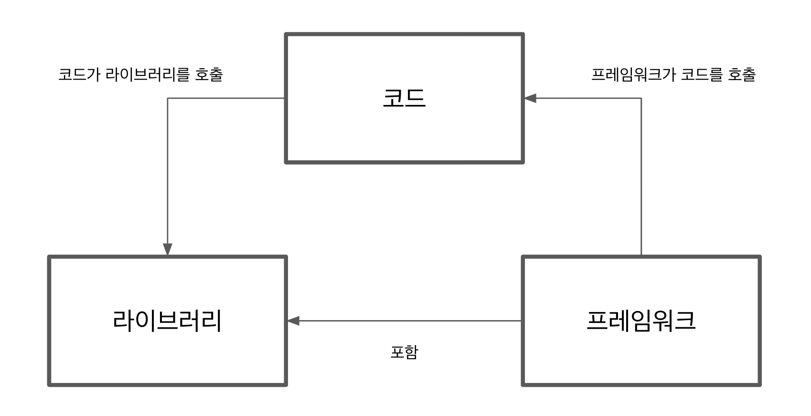

:::note

프레임워크는 필요 없다. 중요한 것은 그림이지 프레임(그림틀)이 아니다.
<small>클라우스 킨스키(Klaus Kinski)</small>

:::

## 프레임워크란?

캠브리지 사전의 정의는 다음과 같다.

> 무언가를 만들 수 있는 지지 구조

이 정의는 소프트웨어 프레임워크의 일반적인 개념과 일치한다.

라이브러리와 프레임워크의 차이는 무엇일까? 발표할 때 즐겨 사용하는 정의는 다음과 같다.

> 프레임워크는 코드를 호출한다. 코드는 라이브러리를 호출한다.

프레임워크는 내부적으로 하나 이상의 라이브러리를 사용할 수 있지만, 개발자가 모듈식 프레임워크를 선택하면 프레임워크를 단일 단위나 여러 모듈로 보는 개발자에게는 이러한 사실이 숨겨진다.



### 프레임워크와 라이브러리 비교

```ts title="앵귤러 Service 예제"
import { Injectable } from "@angular/core";
import { HttpClient } from "@angular/common/http";

const URL = "http://example.api.com/";

@Injectable({
  providedIn: "root",
})
export class peopleService {
  constructor(private http: HttpClient) {}
  list() {
    return this.http.get(URL);
  }
}
```

```ts title="앵귤러 Component 예제"
import { Component, OnInit } from "@angular/core";
import { PeopleService } from "../people.service";

@Component({
  selector: "people-list",
  templateUrl: "./people-list.component.html",
})
export class PeopleListComponent implements OnInit {
  constructor(private peopleService: PeopleService) {}

  ngOnInit() {
    this.loadList();
  }

  loadList(): void {
    this.peopleService
      .getHeroes()
      .subscribe((people) => (this.people = people));
  }
}
```

```ts title="Moment.js 예제"
import moment from "moment";

const DATE_FORMAT = "DD/MM/YYY";

export const formatDate = (date) => {
  return moment(date).format(DATE_FORMAT);
};
```

앵귤러에서 PeopleListComponent가 PeopleService와 상호작용하게 하려면 @Injectable 어노테이션을 사용하고 생성자에 인스턴스를 넣어야 한다.

Moment.js는 애플리케이션 코드를 어떻게 구성해야 하는지에 대해 특별한 형식을 요구하지 않는다. 그저 가져와 사용하기만 하면 된다.

### 리액트에 대해 이야기해보자

리액트 홈페이지에서 리액트는 '사용자 인터페이스 구축을 위한 자바스크립트 라이브러리'라고 정의돼 있다.

그러나 현실은 복잡하다. 리액트의 주요 제약 사항은 선언적 패러다임의 사용이다. DOM을 직접 조작하는 대신 구성 요소의 상태를 수정한다. 그러면 리액트가 대신 DOM을 수정한다.

```tsx title="리액트 선언적 피턴"
import React, { Componnet } from "react";
import posed from "react-pose";

const Box = posed.div({
  hidden: { opacity: 0 },
  visible: { opacity: 1 },
  transition: {
    ease: "linear",
    duration: 500,
  },
});

class PosedExample extends Component {
  constructor(props) {
    super(props);
    this.state = {
      isVisible: true,
    };

    this.toggle = this.toggle.bind(this);
  }

  toggle() {
    this.setState({
      isVisible: !this.state.isVisible,
    });
  }

  render() {
    const { isVisible } = this.state;
    const pose = isVisible ? "visible" : "hidden";

    return (
      <div>
        <Box className="box" pose={pose} />
        <button onClick={this.toggle}>Toggle</button>
      </div>
    );
  }
}
```

윗 코드를 보면 알겠지만 컴포넌트를 다룰 때 직접 조작하지 않고 상태를 맵핑하고 상태를 변경하면 된다. 이것이 리액트에서 사용되는 선언적 패턴의 핵심이다.

```tsx title="리액트 명령형 패턴"
class PosedExample extends Component {
  constructor(props) {
    super(props);
    this.state = {
      isVisible: true,
    };

    this.toggle = this.toggle.bind(this);
  }

  toggle() {
    this.setState({
      isVisible: !this.state.isVisible,
    });
  }

  componentDidUpdate(prevProps, prevState) {
    const { isVisible } = this.state;
    if (prevState.isVisible !== isVisible) {
      const animation = isVisible ? showKeyframes : hideKeyframes;
      this.div.animate(animation, animationTiming);
    }
  }

  return() {
    return (
      <div>
        <div
          ref={(div) => {
            this.div = div;
          }}
          className="box"
        />
        <button onClick={this.toggle}>Toggle</button>
      </div>
    );
  }
}
```

리액트에서 선언적 패턴이 아닌 명령형 패턴을 사용하는 경우도 있다(저자가 리액트가 라이브러리가 아닌 프레임워크라고 믿는 이유)

## 자바스크립트 프레임워크 연혁

### 제이쿼리

2006년 존 레식이 만든 제이쿼리는 모든 자바스크립트 프레임워크의 모체가 됐다. 실제 제품 환경에서 가장 많이 사용되는 프레임워크다. 오늘날 프론트엔드 개발자들이 제이쿼리를 우습게 여기는 경향이 있지만 제이쿼리는 현대 웹 개발의 초석 역할을 했다.

### 앵귤러JS

앵귤러JS는 2009년 미스코 헤브리에 의해 부수적인 프로젝트로 개발됐다. 나중에 그는 구글의 직원이 됐고 이런 이유로 앵귤러JS는 지금은 구글 엔지니어가 관리한다. 1.0 버전은 2011년 5월에 릴리스됐다. 앵귤러JS는 단일 페이지 애플리케이션을 주류로 만드는 데 큰 역할을 했다.

가장 주목할 만한 기능은 양방향 데이터 바인딩이다.

양방향 데이터 바인딩 덕분에 개발자는 웹 애플리케이션을 빠르게 작성할 수 있게 됐다. 그러나 양방향 데이터 바인딩이 대규모 애플리케이션에는 적합하지 않기 때문에 시간이 지나자 많은 개발자가 앵귤러JS를 떠났다.

### 래액트

2011년 페이스북에서 만들어 2013년 오픈소스로 공개한 리액트는 현재 가낭 인기 있는 프론트엔드 라이브러리다. 리액트는 선언적 패러다임으로 동작한다. 일반적으로 DOM을 직접 수정하는 대신 setState 메서드로 상태를 변경하면 리액트가 나머지 작업을 수행한다.

### 앵귤러

앵귤러는 원래 앵귤러JS의 새로운 버전으로 시작됐기 때문에 이전에는 앵귤러2로 불렸다. 프로젝트의 팀은 시맨틱 버전 관리를 매우 진지하게 여겼기 때문에 앵귤러2는 완전히 다른 프레임워크가 됐고 두 버전 사이의 완전히 다른 접근 방식으로 인해 프로젝트는 중단됐다.

## 기술 부채

### 프레임워크 비용

모든 프레임워크는 기술 부채를 갖고 있다. 프레임워크는 아키텍처 자체에 이미 비용을 포함하고 있다. 시간이 지남에 따라 시장이나 다른 요인으로 인해 소프트웨어의 변경이 필요하며, 아키텍처 역시 변경돼야 한다. 대부분의 경우 이런 변경이 필요한 상황에서 장애물이 된다.

## 기술 투자

프레임워크가 항상 기술 부채를 갖고 있다면 어떻게 프레임워크가 좋다고 말할 수 있겠는가? 하지만 기술 부채가 항상 나쁜 것만은 아니라는 사실을 명심하자. 합리적인 이유로 빠른 솔루션을 사용한다면 기술 부채가 아니라 기술 투자가 된다. 합리적인 이유로 선정된 프레임워크는 비용이 아니라 자산이다.
