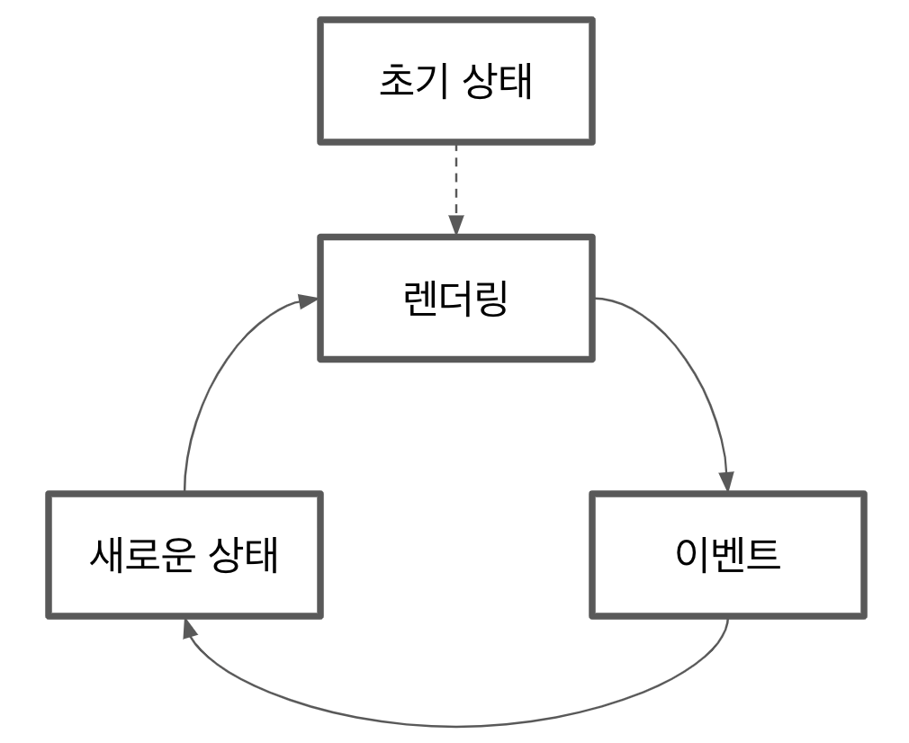

## YAGNI 원칙

프로젝트에서 가장 중요한 기능에 초점을 맞춰 개발하고 새로운 요구가 생기면 이에 따라 아키텍처를 지속적으로 발전시켜 나간다.

이것이 YAGNI(You aren't gonna need it: 정말 필요하다고 간주할 떄까지 기능을 추가하지 마라) 라고 하는 익스트림 프로그래밍 원칙 중 하나다.

> 당신이 필요하다고 예측할 떄가 아니라 실제로 필요할 떄 구현하라.
>
> <small>존 제프리스</small>

## DOM 이벤트 API

이벤트는 웹 애플리케이션에서 발생하는 동작으로, 브라우저는 사용자에게 이를 알려줘 사용자는 어떤 방식으로든 반응할 수 있다.

마우스 이벤트, 키보드 이벤트, 뷰 이벤트를 포함한 사용자가 트리거한 이벤트에 반응할 수 있고, 새로운 이벤트를 생성할 수도 있다. 이벤트에 반응하기 위해서는 이벤트를 트리거한 DOM 요소에 이벤트 핸들러 콜백을 연결해야 한다.

:::tip

뷰나 시스템 이벤트의 경우 이벤트 핸들러를 window 객체에 연결해야 한다.

| 이벤트명         | 발생하는 시점                                                          |
| :--------------- | :--------------------------------------------------------------------- |
| cached           | 매니페스트에 나열된 리소스가 다운로드되었고, 애플리케이션이 캐시될 때. |
| error            | 리소스 로드가 실패했을 때.                                             |
| abort            | 리소스 로딩이 중단되었을 때.                                           |
| load             | 리소스와 그 의존 리소스의 로딩이 끝났을 때.                            |
| beforeunload     | window, document 및 그 리소스가 언로드되려고 할 때.                    |
| unload           | document 또는 의존 리소스가 언로드될 때.                               |
| fullscreenchange | 엘리먼트가 전체화면 모드로 변경되었거나 일반 모드로 돌아왔을 때.       |
| fullscreenerror  | 기술적인 이유나 권한 거절을 이유로 전체화면 모드 전환이 불가능했을 때. |
| resize           | 다큐먼트 뷰가 리사이즈되었을 때.                                       |
| scroll           | 다큐먼트 뷰나 엘리먼트가 스크롤되었을 때.                              |
| cut              | 선택이 잘라내어진 후 클립보드로 복사되었을 때                          |
| copy             | 선택이 클립보드로 복사되었을 때                                        |
| paste            | 클립보드의 항목이 붙여너어졌을 때                                      |
| ...              | ...                                                                    |

:::

### 속성에 핸들러 연결

이벤트 핸들러를 DOM 요소에 연결하는 방법은 빠르지만 지저분한 방법으로 on\* 속성을 사용할 수 있다.

```javascript title="onclick 속성에 클릭 핸들러 연결"
const button = document.querySelector("button");
button.onclick = () => {
  console.log("Click managed using onclick property");
};
```

위와 같이 빠르게 핸들러를 이벤트에 연결할 수 있다. 하지만 이 방법은 나쁜방법으로 간주되는데 가장 큰 이유는 속성을 사용하면 한번에 하나의 핸들러만 연결할 수 있기 때문이다. 따라서 코드가 onclick 핸들러를 덮어 쓰면 원래 핸들러는 영원히 손실된다.

### addEventListener로 핸들러 연결

모든 DOM 노드에는 EventTarget 인터페이스가 구현되어 있다. 이 인터페이스의 addEventListener 메서드는 이벤트 핸들러를 DOM 노드에 추가해준다.

```javascript title="addEventListener로 클릭 이벤트 핸들러 연결"
const button = document.querySelector("button");
button.addEventListener("click", () => {
  console.log("Clicked using addEventListener");
});
```

addEventListener는 property 메서드와 달리 복수개의 핸들러를 연결할 수 있다.

```javascript title="복수의 클릭 이벤트 핸들러"
const button = document.querySelector("button");
button.addEventListener("click", () => {
  console.log("First handler");
});
button.addEventListener("click", () => {
  console.log("Second handler");
});
```

DOM에 요소가 더 이상 존재하지 않으면 메모리 누수를 방지하고자 이벤트 리스너도 삭제해야 한다. 이를 위해 removeEventListener 메서드를 사용해야 한다.

```javascript title="이벤트 핸들러 삭제"
const button = document.querySelector("button");
const firstHandler = () => {
  console.log("First handler");
};
const secondHandler = () => {
  console.log("Second handler");
};

button.addEventListener("click", firstHandler);
button.addEventListener("click", secondHandler);

window.setTimeout(() => {
  button.removeEventListenr("click", firstHandler);
  button.removeEventListenr("click", secondHandler);
  console.log("Removed Event Handlers");
}, 1000);
```

가장 중요한 점은 이벤트 핸들러를 제거하려면 removeEventListener 메서드에 매개변수로 전달할 수 있도록 이에 대한 참조를 유지해야 한다는 것이다.

### 이벤트 객체

이벤트 핸들러는 DOM 노드나 시스템에서 생성한 이벤트를 나타내는 매개변수가 포함된다. 이벤트에는 포인터 좌표, 이벤트 타입, 이벤트를 트리거한 요소 같은 정보들이 포함되어 있다.

### DOM 이벤트 라이프사이클

```javascript
button.addEventListener("click", handler, false);
```

세 번째 매개변수는 useCapture라고 불리며 기본값은 false다. 이 매개변수가 선택 사항이긴 하지만 이상적으로 폭넓은 브라우저 호환성을 얻으려면 포함시켜야 한다.

이벤트 라이프 사이클은 다음과 같은데 useCapture에 ture를 사용하면 버블 단계 대신 캡처 단계에 이벤트 핸들러를 추가한다는 것을 의미한다.

1. Capture Phase: 이벤트가 html에서 Target Element 로 이동한다.
2. Target Phase: 이벤트가 Target Element에 도달한다.
3. Bubbling Phase: 이벤트가 Target Element에서 html로 이동한다.

버블 단계에서는 핸들러가 상향식으로 처리되는 반면 캡처 단계에서는 반대로 처리된다. 생성된 모든 DOM 이벤트에 대해 브라우저는 캡처 단계를 실행한 다음 버블 단계를 실행한다는 것을 명심하자.

이런 여러 단계가 존재하게 된 데는 역사적인 배경이 있다. Web 표준이 정립되지 않던 시기에 일부 브라우저는 캡처 단계만 지원한 반면 다른 브라우저들은 버블 단계만 지원했기 때문이다.

### 사용자 정의 이벤트 사용


<small>https://www.w3.org/TR/2014/WD-DOM-Level-3-Events-20140925/#figure-event-inheritance</small>

DOM 이벤트 API에서는 사용자 정의 이벤트 타입을 정의하고 다른 이벤트처럼 처리할 수 있다.

```javascript title="사용자 정의 이벤트 발생"
const EVENT_NAME = "FiveCharInputValue";
const input = document.querySelector("input");

input.addEventListener("input", () => {
  const { length } = input.value;
  console.log("input length", length);
  if (length === 5) {
    const time = new Date().getTime();
    const event = new CustomEvent(EVENT_NAME, {
      detail: {
        time,
      },
    });

    input.dispatchEvent(event);
  }
});

input.addEventListener(EVNET_NAME, (e) => {
  console.log("handling custom event...", e.detail);
});
```

input 이벤트를 관리할 때 값 자체의 길이를 확인하여 길이가 5라면 FiveCharInputValue 이벤트를 발생시킨다.

## TodoMVC에 이벤트 추가

### 렌더링 엔진 리뷰

2장에서 구현한 렌더링 엔진의 문제점은 일부가 DOM 요소 대신 문자열로 동작한다는 것이다.

```javascript title="Todos component"
const getTodoElement = (todo) => {
  const { text, completed } = todo;

  return `
    <li ${completed ? 'class="completed"' : ""}>
      <div class="view">
        <input
          ${completed ? "checked" : ""}
          class="toggle"
          type="checkbox"
        >
        <label>${text}</label>
        <button class="destroy"></button>
      </div>
      <input class="edit" value="${text}">
    </li>
  `;
};

export default (targetElement, { todos }) => {
  const newTodoList = targetElement.cloneNode(true);
  const todosElements = todos.map(getTodoElement).join("");
  newTodoList.innerHTML = todosElements;
  return newTodoList;
};
```

### 템플릿 요소

document.createElement API를 사용해 DOM 노드를 생성할 수 있다.

```javascript title="document.createElement"
const newDiv = document.createElement("div");
if (!condition) {
  newDiv.classList.add("disabled");
}

const newSpan = document.createElement("span");
newSpan.textContent = "Hello World!";

newDiv.appendChild(newSpan);
```

이 API를 이용해 빈 li를 생성한 후 다양한 핸들러들을 추가할 수 있지만 코드를 읽고 유지하기 어렵다. 더 나은 옵션은 index.html 파일의 template 태그안에 todo 요소의 마크업을 해두는 것이다. template 태그는 렌더링 엔진의 '스탬프'로 사용할 수 있는 보이지 않는 태그다.

```html title="todo 항목 template 요소"
<template id="todo-item">
  <li>
    <div class="view">
      <input class="toggle" type="checkbox" />
      <label></label>
      <button class="destroy"></button>
    </div>
    <input class="edit" />
  </li>
</template>
```

```javascript title="template을 이용해 todo item 생성"
let template;

const createNewTodoNode = () => {
  if (!template) {
    template = document.getElementById("todo-item");
  }

  return template.content.firstElementChild.cloneNode(true);
};

const getTodoElement = (todo) => {
  const { text, complated } = todo;

  const element = createNewTodoNode();

  element.querySelector("input.edit").value = text;
  element.querySelector("label").textContent = text;

  if (completed) {
    element.classList.add("completed");
    element.querySelector("input.toggle").checked = true;
  }

  return element;
};

export default (targetElement, { todos }) => {
  const newTodoList = targetElement.cloneNode(true);

  newTodoList.innerHTML = "";

  todos.map(getTodoElement).forEach((element) => {
    newTodoList.appendChild(element);
  });

  return newTodoList;
};
```

이제 템플릿을 활용해 모든 컴포넌트에 적용해보자.

```html title="전체 앱에 템플릿 사용"
<body>
  <template id="todo-item">
    <!-- todo 항목 내용을 여기에 놓는다 -->
  </template>
  <template id="todo-app">
    <section class="todoapp">
      <!-- 앱 내용을 여기에 놓는다 -->
    </section>
  </template>
  <div id="root">
    <div data-component="app"></div>
  </div>
</body>
```

app이라는 컴포넌트가 생겼다. 이 컴포넌트는 새로 작성된 template을 사용해 콘텐츠를 생성한다.

```javascript title="template로 작성한 앱 컴포넌트"
let tempalte;

const createAppElement = () => {
  if (!template) {
    template = document.getElementById("todo-app");
  }

  return template.content.firstElementChild.cloneNode(true);
};

export default (targetElement) => {
  const newApp = targetElement.cloneNode(true);
  newApp.innderHTML = "";
  newApp.appendChild(createAppElement());
  return newApp;
};
```

### 기본 이벤트 처리 아키텍처

문자열 대신 DOM 요소로 동작하는 새로운 렌더링 엔진을 작성했다. 이제 이벤트 핸들러를 애플리케이션에 연결해보자.

새로운 상태마다 새로운 dom tree를 생성해 virtual dom 알고리즘을 적용할 수 있다. 이 시나리오에서는 모든 이벤트 다음에 상태를 조작한 후 새로운 상태로 메인 렌더링 함수를 호출한다.



이제 구현을 해보자.

```javascript title="이벤트를 가진 컨트롤러"
const state = {
  todos: [],
  currentFilter: 'All'
}

const events = {
  deleteItem: (index) => {
    state.todos.splice(index, 1);
    render();
  },
  addItem: (text) => {
    state.todos.push({
      text,
      completed: false
    })
  }
}

const render = () => {
  window.requestAnimationFrame(() => {
    const main document.querySelector('#root');
    const newMain = registry.renderRoot(main, state, events);

    applyDiff(document.body, main, newMain);
  });
};

render();
```

events를 매개변수로 전달함으로써 모든 구성요소가 events에 접근할 수 있게 되었다. 실제 애플리케이션에서는 개발자가 핸들러를 빠르게 추가하고 새로운 렌더링 주기를 자동으로 호출하는 데 도움이 되는 '이벤트 레지스트리'를 생성하는 것이 좋다.

```javascript title="addItem 이벤트를 가진 앱 컴포넌트"
let template;

const getTemplate = () => {
  if (!template) {
    template = document.getElementById("todo-app");
  }

  return template.content.firstElementChild.cloneNode(true);
};

const addEvents = (targetElement, events) => {
  targetElement.querySelector(".new-todo").addEventListener("keypress", (e) => {
    if (e.key === "Enter") {
      events.addItem(e.target.value);
      e.target.value = "";
    }
  });
};

export default (targetElement, state, events) => {
  const newApp = targetElement.cloneNode(true);

  newApp.innerHTML = "";
  newApp.appendChild(getTemplate());

  addEvents(newApp, events);

  return newApp;
};
```

```javascript title="이벤트를 가진 todo 컴포넌트"
const getTodoElement = (todo, index, events) => {
  const { text, completed } = todo;

  const element = createNewTodoNode();

  element.querySelector("input.edit").value = text;
  element.querySelector("label").value = text;

  if (completed) {
    element.classList.add("complated");
    element.querySelector("input.toggle").checked = true;
  }

  const handler = (e) => events.deleteItem(index);

  element.querySelector("button.destroy").addEventListener("click", handler);

  return element;
};

export default (targetElement, { todos }, events) => {
  const newTodoList = targetElement.cloneNode(true);

  newTodoList.innerHTML = "";

  todos
    .map((todo, index) => getTodoElement(todo, index, events))
    .forEach((element) => newTodoList.appendChild(element));

  return newTodoList;
};
```

## 이벤트 위임

다음은 이벤트 위임을 기반으로 윗 코드를 수정한 버전이다.

```javascript title="이벤트 위임 기반의 todo 컴포넌트"
const getTodoElement = (todo, index) => {
  const { text, completed } = todos;

  const element = creatNewTodoNode();

  element.querySelector("input.edit").value = text;
  element.querySelector("label").textContent = text;

  if (completed) {
    element.classList.add("completed");
    element.querySelector("input.toggle").checked = true;
  }

  element.querySelector("button.destroy").dataset.index = index;

  return element;
};

export default (targetElement, state, events) => {
  const { todos } = state;
  const { deleteItem } = events;
  const newTodoList = targetElement.cloneNode(true);

  newTodoList.innerHTML = "";

  todos
    .map((todo, index) => getTodoElement(todo, index))
    .forEach((element) => newTodoList.appendChild(element));

  newTodoList.addEventListener("click", (e) => {
    if (e.target.matches("button.destroy")) {
      deleteItem(e.target.dataset.index);
    }
  });

  return newTodoList;
};
```

이전의 컴포넌트와 달리 리스트 자체에 하나의 이벤트 핸들러만 연결돼 있다. 행마다 별도의 이벤트 핸들러를 갖지 않는다. 리스트가 길다면 이 방법으로 성능과 메모리 사용성을 개선시킬 수 있다.
