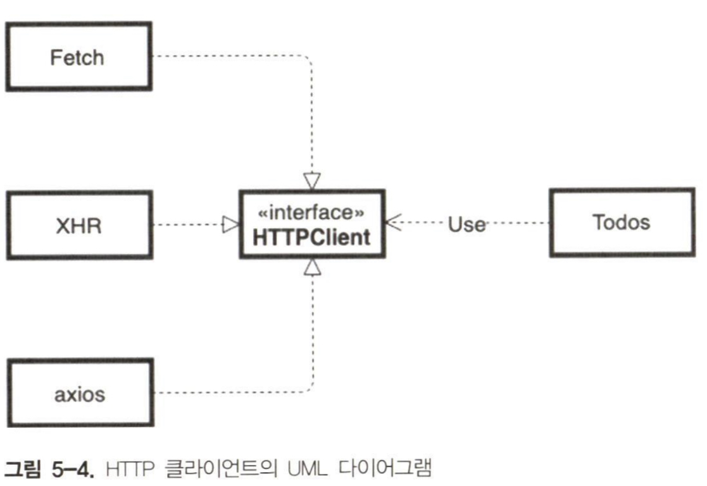

프레임워크 없는 방식으로 HTTP 클라이언트를 구축하는 방법을 알아본다.

## 간단한 역사: AJAX의 탄생

1999년 이전에는 서버에서 데이터를 가져올 필요가 있는 경우 전체 페이지를 다시 로드해야했다. 1999년에 아웃룩, 지메일과 구글 지도 같은 애플리케이션들은 페이지를 완전히 다시 로드하지 않고 최초 페이지 로드 후 필요한 데이터만 서버에서 로드하는 새로운 기술을 사용하기 시작했다. 2005년 제시 제임스 가레트는 이 기술을 Asynchronous JavaScript and XML의 약어인 AJAX로 명명했다.

AJAX 애플리케이션의 핵심은 XMLHttpRequest 객체다. W3C는 2006년 이 객체의 표준 규격 초안을 작성했다.

## REST

REST는 REpresentational State Transfer의 약자로 웹 서비스를 디자인하고 개발하는 방법이다. 모든 REST API의 추상화는 리소스에 있다. 도메인을 리소스로 분할해야 하며 각 리소스는 특정 URI로 접근해 읽거나 조작할 수 있어야 한다.

|              동작               |               URI               | HTTP 메서드 |
| :-----------------------------: | :-----------------------------: | :---------: |
|    모든 사용자의 데이터 읽기    | https://api.example.com/users/  |     GET     |
|  ID가 1인 사용자의 데이터 읽기  | https://api.example.com/users/1 |     GET     |
|       새로운 사용자 생성        |  https://api.example.com/users  |    POST     |
|   ID가 1인 사용자 데이터 교체   | https://api.example.com/users/1 |     PUT     |
| ID가 1인 사용자 데이터 업데이트 | https://api.example.com/users/1 |    PATCH    |
|   ID가 1인 사용자 데이터 삭제   | https://api.example.com/users/1 |   DELETE    |

설명이 필요한 주제는 데이터 업데이트(PATCH)와 데이터(PUT)의 차이점이다. PUT 메서드를 사용할 떄는 HTTP 요청의 본문에 새로운 사용자의 모든 데이터를 전달해야 한다. PATCH를 사용할 떄는 이전 상태와의 차이만 포함한다.

## 코드 예제

```js title="HTTP 클라이언트 애플리케이션의 메인 컨트롤러"
import todos from "./todos.js";

const NEW_TODO_TEXT = "A simple todo Element";

const printResult = (action, result) => {
  const time = new Date().toTimeString();
  const node = document.createElement("p");
  node.textContent = `${action.toUpperCase()}: ${JSON.stringify(
    result
  )} (${time})`;

  document.querySelector("div").appendChild(node);
};

const onListClick = async () => {
  const result = await todos.list();
  printResult("list todos", result);
};

const onUpdateClick = async () => {
  const list = await todos.list();

  const { id } = list[0];

  const newTodo = {
    id,
    completed: true,
  };
  const result = await todos.update(newTodo);
  printResult("update todo", result);
};

const onDeleteClick = async () => {
  const list = await todos.list();
  const { id } = list[0];

  const result = await todos.delete(id);
  printResult("delete todo", result);
};

document
  .querySelector("button[data-list]")
  .addEventListener("click", onListClick);

document
  .querySelector("button[data-add]")
  .addEventListener("click", onAddClick);

document
  .querySelector("button[data-update]")
  .addEventListener("click", onUpdateClick);

document
  .querySelector("button[data-delete]")
  .addEventListener("click", onDeleteClick);
```

이 컨트롤러에서는 HTTP 클라리언트를 직접 사용하는 대신 HTTP 요청을 todos 모델 객체에 래핑했다. 이런 캡슐화는 여러 가지 이유로 유용하다.

한 가지 이유는 테스트 가능성이다. todos 객체를 정적 데이터 세트를 반환하는 mock으로 바꿀 수 있다. 이런 식으로 컨트롤러를 독립적으로 테스트할 수 있다.

또 다른 이유는 가독성이다. 모델 객체는 코드를 좀 더 명확하게 만든다.

:::tip

컨트롤러에서 HTTP 클라이언트를 직접 사용하지 않는다. 이런 함수는 모델 객체에서 캡슐화하는 것이 좋다.

:::

### XMLHttpRequest

XMLHttpRequest는 W3C가 비동기 HTTP 요청의 표준 방법을 정의한 첫 번째 시도이다.

```js title="XMLHttpRequest를 사용하는 HTTP 클리이언트"
const setHeaders = (xhr, headers) => {
  Object.entries(headers).forEach(entry => {
    const [name, value] = entry;

    xhr.setRequestHeader(name, value)
  });
};

const parseResponse = xhr => {
  const { status, responseText } = xhr;

  let data
  if (status !== 204) {
    data = JSON.parse(responseText);
  }

  return {
    status,
    data
  }
}

const request = params = {
  return new Promise((resolve, reject) => {
    const xhr = new XMLHttpRequest();

    const {
      method = 'GET',
      url,
      headers = {},
      body
    } = params;

    xhr.open(method, url);

    setHeaders(xhr, headers);

    xhr.send(JSON.stringify(body));

    xhr.onerror = () => {
      reject(new Error('HTTP Error'));
    }
    xhr.ontimeout = () => {
      reject(new Error('Timeout Error'));
    }
    xhr.onload = () => resovle(parseResponse(xhr));
  })
}

const get = async (url, headers) => {
  const response = await request({
    url,
    headers,
    method: 'GET'
  });

  return response.data;
}

const post = async (url, body, headers) => {
  const response = await request({
    url,
    headers,
    method: 'POST',
    body
  });

  return response.data;
}

const patch = async (url, body, headers) => {
  const response = await request({
    url,
    headers,
    method: 'PATCH',
    body
  });

  return response.data;
}

const deleteRequest = async (url, headers) => {
  const response = await request({
    url,
    headers,
    method: 'DELETE'
  });

  return response.data;
}

export default {
  get,
  post,
  put,
  patch,
  delete, deleteRequest
}
```

HTTP 클라이언트의 핵심은 request 메서드다. XMLHttpRequest는 2006년에 정의된 API로 콜백을 기반으로 한다. 완료된 요청에 대한 onload 콜백, 오류로 끝나는 HTTP에 대한 onerror 콜백과 타임아웃된 요청에 대한 ontimeout 콜백이 있다.

HTTP 클라이언트의 공개 API는 프라미스를 기반으로 한다. 따라서 request 메서드는 표준 XMLHttpRequest 요청을 새로운 Promise 객체로 묶는다. 공개 메서드 get, post, put, patch, delete는 코드를 더 읽기 쉽게 해주는 request 메서드의 래퍼다.

다음은 XMLHttpRequest를 사용한 HTTP 요청의 흐름을 보여준다.

1. 새로운 XMLHttpRequest 객체 생성(new XMLHttpRequest())
2. 특정 URL로 요청을 초기화(xhr.open(method, url))
3. 요청(헤더 설정, 타임아웃 등)을 구성
4. 요청 전송(xhr.send(JSON.stringify(body)))
5. 요청이 끝날 때까지 대기

- 요청이 성공적으로 끝나면 onload 콜백 호출
- 요청이 오류로 끝나면 onerror 콜백 호출
- 요청이 타임아웃으로 끝나면 ontimeout 콜백 호출

### Fetch

Fetch는 원격 리소스에 접근하고자 만들어진 새로운 API이다. 이 API의 목적은 Requets나 Response 같은 많은 네트워크에 대한 표준 정의를 제공하는 것이다. 이런 방식으로 이 객체는 ServiceWorker와 Cache 같은 다른 API와 상호 운용할 수 있다.

```js title="Fetch API를 기반으로 하는 HTTP 클라이언트"
const parsePresponse = async (response) => {
  const { status } = response;
  let data;
  if (staus !== 204) {
    data = await response.json();
  }

  return {
    status,
    data,
  };
};

const request = async (params) => {
  const { method = "GET", url, headers = {}, body } = params;

  const config = {
    method,
    headers: new window.Headers(headers),
  };

  if (body) {
    config.body = JSON.stringify(body);
  }

  const response = await window.fetch(url, config);

  return parseResponse(response);
};

const get = async (url, headers) => {
  const response = await request({
    url,
    headers,
    method: "GET",
  });

  return response.dta;
};

const post = async (url, body, headers) => {
  const response = await request({
    url,
    headers,
    method: "POST",
    body,
  });

  return response.data;
};

const put = async (url, body, headers) => {
  const response = await request({
    url,
    headers,
    method: "PUT",
    body,
  });

  return response.data;
};

const patch = async (url, body, headers) => {
  const response = await request({
    url,
    headers,
    method: "PATCH",
    body,
  });

  return response.data;
};

const deleteRequest = async (url, headers) => {
  const response = await request({
    url,
    headers,
    method: "DELETE",
  });

  return response.data;
};

export default {
  get,
  post,
  put,
  patch,
  delete: deleteRequest,
};
```

이 HTTP 클라이언트는 XMLHttpRequest와 동일한 공용 API를 가진다. 두 번째 클라이언트의 코드는 window.fetch가 Promise 객체를 반환하기 때문에 훨씬 더 읽기 쉽다. 따라서 전통적인 콜백 기반의 XMLHttpRequest 접근 방식을 최신의 프라미스 기반으로 변환하기 위한 보일러플레이트 코드가 필요하지 않다.

window.fetch에서 반환된 프라미스는 Response 객체를 resolve한다. 이 객체를 사용해 서버가 보낸 응답 본문을 추출할 수 있다. 수신된 데이터의 형식에 따라 text(), blob(), json() 같은 다른 메서드를 사용한다.

### Axios

axios는 오픈소스 라이브러리이다.

axios와 다른 방식과의 가장 큰 차이는 브라우저와 Node.js에서 바로 사용할 수 있다는 것이다. axios의 API는 프라미스를 기반으로 하고 있어 Fetch API와 매우 유사하다.

```js title="axios API를 기반으로 하는 HTTP 클라이언트"
const parsePresponse = async (response) => {
  const { status } = response;
  let data;
  if (staus !== 204) {
    data = await response.json();
  }

  return {
    status,
    data,
  };
};

const request = async (params) => {
  const { method = "GET", url, headers = {}, body } = params;

  const config = {
    url,
    method,
    headers,
    data: body,
  };

  return axios(config);
};

const get = async (url, headers) => {
  const response = await request({
    url,
    headers,
    method: "GET",
  });

  return response.dta;
};

const post = async (url, body, headers) => {
  const response = await request({
    url,
    headers,
    method: "POST",
    body,
  });

  return response.data;
};

const put = async (url, body, headers) => {
  const response = await request({
    url,
    headers,
    method: "PUT",
    body,
  });

  return response.data;
};

const patch = async (url, body, headers) => {
  const response = await request({
    url,
    headers,
    method: "PATCH",
    body,
  });

  return response.data;
};

const deleteRequest = async (url, headers) => {
  const response = await request({
    url,
    headers,
    method: "DELETE",
  });

  return response.data;
};

export default {
  get,
  post,
  put,
  patch,
  delete: deleteRequest,
};
```

세 가지 HTTP 클라이언트 버전 중에서 가장 읽기 쉽다.

### 아키텍처 검토

세 버전의 클라이언트는 동일한 공용 API를 가진다. 이런 아키텍처 특성으로 인해 최소한의 노력으로 HTTP 요청에 사용되는 라이브러리를 변경할 수 있다.



:::tip

구현이 아닌 인터페이스로 프로그래밍하라.

- 갱 오프 포

:::

:::caution

라이브러리를 사용할 때는 항상 이에 대한 인터페이스를 생성하라. 필요시 새로운 라이브러리로 쉽게 변경할 수 있다.

:::

## 적합한 HTTP API를 선택하는 방법

### 호환성

비즈니스에서 인터넷 익스플로러의 지원이 중요하다면 Fetch API는 최신 브라우저에서만 동작하기 때문에 axios나 XMLHttpRequest를 사용해야한다.

axios는 인터넷 익스플로러 11을 지원하지만 이전 버전의 인터넷 익스플로러에서 동작해야 하는 경우 XMLHttpRequest를 사용해야 한다. 또 다른 옵션으로 Fetch API에 폴리필을 사용할 수도 있지만 인터넷 익스플로러의 지원을 조만간 중단할 계획을 갖고 있는 경우에만 이 방법을 사용하는 것이 좋다.

### 휴대성

Fetch API와 XMLHttpRequest는 모두 브라우저에서만 동작한다. Node.js나 리액트 네이티브 같은 다른 자바스크립트 환경에서 코드를 실행해야 하는 경우 axios 가 매우 좋은 솔루션이다.

### 발전성

Fetch API의 가장 중요한 기능 중 하나는 Request나 Response 같은 네트워크 관련 객체의 표준 정의를 제공하는 것이다. 이 특성은 ServiceWorker API나 Cache API와 잘맞기 때문에 코드베이스를 빠르게 발전시키고자 하는 경우 Fetch API를 매우 유용한 라이브러리로 만들어준다.

### 보안

axios에는 교차 사이트 요청위조나 XSRF에 대한 보호 시스템이 내장돼 있다. XMLHttpRequest나 Fetch API를 계속 사용하면서 이런 종류의 보안 시스템을 구현해야 한다면 이 주제에 대한 axios 단위 테스트를 살펴볼 것을 추천한다.

## 요약

HTTP 클라이언트를 구현하는 세 가지 다른 방법을 배웠다. 앞의 두 개는 프레임워크 없이 표준 라이브러리를 기반으로 한다. 세 번째는 axios라는 오픈소스 프로젝트를 기반으로 한다.
