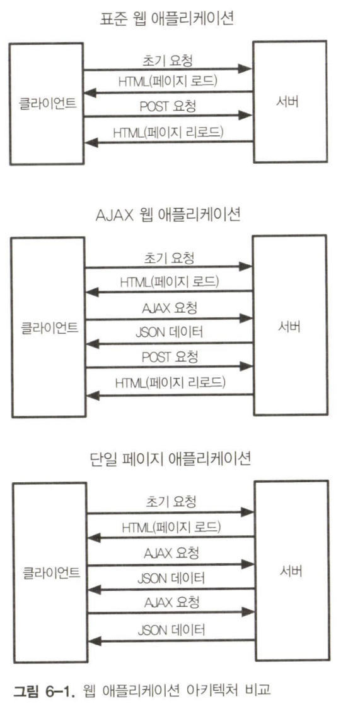
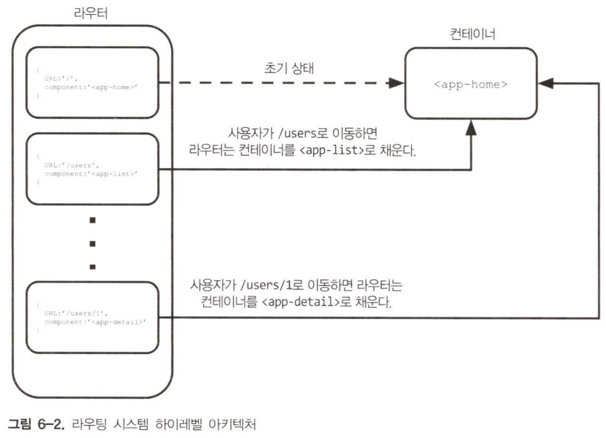

단일 페이지 애플리케이션(SPA, Single-Page Application)은 사용자가 웹 애플리케이션과 상호작용하는 방식을 획기적으로 바꾼 중요한 기술이다.

SPA의 정의와 핵심 기능 중 하나인 클라이언트 측 라우팅 시스템 구축 방법을 배운다.

## 단일 페이지 애플리케이션

단일 페이지 애플리케이션은 하나의 HTML 페이지로 실행되는 웹 애플리케이션이다. 사용자가 다른 뷰로 이동할 때 애플리케이션은 뷰를 동적으로 다시 그려 표준 웹 탐색 효과를 제공한다. 이 접근 방식은 표준 다중 페이지 애플리케이션에서 페이지 간 탐색 시 가용자가 경험할 수 있는 지연을 제거해 일반적으로 더 나은 사용자 경험을 제공한다. 이런 종류의 애플리케이션은 서버와의 상호작용을 위해 AJAX를 사용한다.



아키텍처 관점에서 보면 모든 라우팅 시스템은 최소 두 가지 핵심요소를 가진다. 첫 번째 요소는 애플리케이션의 경로 목록을 수집하는 레지스트리다. 가장 간단한 형태의 경로는 URL을 DOM 구성 요소에 매칭하는 객체다. 두 번째 중요한 요소는 현재 URL의 리스터다. URL이 변경되면 라우터는 본문의 내용을 현재 URL과 일치하는 경로에 바인딩된 구성 요소로 교체한다.



## 코드 예제

### 프래그먼트 식별자

모든 URL은 프래그먼트 식별자라고 불리는 해시(#)로 시작하는 선택적 부분을 포함할 수 있다. 프래그먼트 식별자의 목적은 웹 페이지의 특정 색션을 식별하는 것이다. `www.domain.org/foo.html#bar`를 예로 들어 보자. 이 URL에서 bar가 프래그먼트 식별자다.

프래그먼트 식별자가 포함된 URL을 탐색할 때 브라우저는 프래그먼트로 식별된 요소가 뷰포트의 맨 위에 오도록 페이지를 스크롤한다.

### 첫 번쨰 예제

```html title="기본 SPA 템플릿"
<body>
  <header>
    <a href="#/">Go To Index</a>
    <a href="#/list">Go To List</a>
    <a href="#/dummy">Dummy Page</a>
  </header>
  <main></main>
</body>
```

이 코드는 URL이 변경될 때 메인 컨테이너 내부에 현재 구성 요소를 넣는다.

```js title="기본 SPA Component"
export default (container) => {
  const home = () => {
    container.textContent = "This is Home page";
  };
  const list = () => {
    container.textContent = "This is List Page";
  };

  return {
    home,
    list,
  };
};
```

```js title="Not Found Component"
const notFound = () => {
  container.textContent = "Page Not Found!";
};
```

```js title="기본 라우터 구성"
import createRouter from "./router.js";
import createPages from "./pages.js";

const container = document.querySelector("main");
const pages = createPages(container);
const router = createRouter();

router
  .addRoute("#/", pages.home)
  .addRoute("#/list", pages.list)
  .setNotFound(pages.notFound)
  .start();
```

라우터는 세 가지 공개 메서드를 가진다. addRoute 메서드는 새 라우터와 프래그먼트로 구성된 구성 객체, component를 정의한다. setNotFound 메서드는 레지스트리에 없는 모든 프래그먼트에 대한 Component를 설정한다. start 메서드는 라우터를 초기화하고 URL 변경을 listen한다.

라우터의 공개 인터페이스를 분석했으니 구현을 살펴보자.

```js title="기본 라우터 구현"
export default () => {
  const routes = [];
  let notFound = () => {};

  const router = {};

  const checkRoutes = () => {
    const currentRoute = routes.find((route) => {
      return route.fragment === window.location.hash;
    });

    if (!currentRoute) {
      notFound();
      return;
    }

    currentRoute.component();
  };

  router.setNotFound = (cb) => {
    notFound = cb;
    return router;
  };

  router.start = () => {
    window.addEventListener("hashchange", checkRoutes);

    if (!window.location.hash) {
      window.location.hash = "#/";
    }

    checkRoutes();
  };

  return router;
};
```

프래그먼트 식별자는 location 객체의 hash 속성에 저장된다. 또한 현재 프래그먼트가 변경될 때마다 알림을 받는데 사용할 수 있는 hashchange 이벤트도 있다.

checkRoutes 메서드가 핵심이다. 이 메서드는 현재 프래그먼트와 일치하는 경로를 찾는다. 경로가 발견되면 해다 component 함수가 메인 컨테이너에 있는 contents를 대체한다. 발견되지 않으면 일반 notFound 함수가 호출된다. 메서드는 라우터가 시작될 때와 haschange 이벤트가 발생할 때마다 호출된다.

이전 예제에서는 앵커를 클릭하는 고전적인 방식으로 탐색이 되었지만 버튼을 클릭하는 등 프로그래밍 방식으로 뷰의 변경이 필요한 경우도 있다.
이를 위해 해더의 링크를 버튼으로 바꿔 애플리케이션을 변경해보자.

```html title="버튼에 데이터 속성 추가"
<body>
  <header>
    <button data-navigate="/">Go To Index</button>
    <button data-navigate="/list">Go To List</button>
    <button data-navigate="/dummy">Dummy Page</button>
  </header>
</body>
```

컨트롤러의 버튼에 이벤트 핸들러를 추가한다.

```js title="버튼에 navigate 추가"
const NAV_BTN_SELECTOR = "button[data-navigate]";

document.body.addEventListener("click", (e) => {
  const { target } = e;
  if (target.matches(NAV_BTN_SELECT)) {
    const { navigate } = target.dataset;
    router.navigate(navigate);
  }
});
```

프로그래밍 방식으로 다른 뷰로 이동하도록 라우터에 새로운 public method를 생성했다. 이 메서드는 새 프래그먼트를 가져와 location 객체에서 replace한다.

```js title="프로그래밍 방식으로 navigate"
router.navigate = (fragment) => {
  window.location.hash = fragment;
};
```

라우터의 내부를 변경할 때 표준 인터페이스를 유지하도록 함수에서 이 라인을 래핑해야 한다.

### 경로 매개변수

라우터에 path param 기능을 추가한다. 예를 들어 `http://location:8080#/order/1`에서 `order` 도메인 모델의 ID를 얻을 수 있다.

```js title="매개변수가 있는 component"
const detail = (params) => {
  const { id } = params;
  container.textContent = `This is Detail Page with Id ${id}`;
};

const anotherDetail = (params) => {
  const { id, anotherId } = params;
  container.textContent = `This is Detail Page with Id ${id} and AnotherId ${anotherId}`;
};
```

```js title="params path"
router
  .addRoute("#/", pages.home)
  .addRoute("#/list", pages.list)
  .addRoute("#/list/:id", pages.detail)
  .addRoute("#/list/:id/:anotherId", pages.anotherDetail)
  .setNotFound(pages.notFound)
  .start();
```

```js title="프래그먼트에서 매개변수 이름 추출"
const ROUTE_PARAMETER_REGEXP = /:(\w+)/g;
const URL_FRAGMENT_REGEXP = "C[^\\/]+)";

router.addRoute = (fragment, component) => {
  const params = [];

  const parsedFragment = fragment
    .replace(ROUTE_PARAMETER_REGEXP, (match, paramName) => {
      params.push(paramName);
      return URL_FRAGMENT_REGEXP;
    })
    .replace(/\//g, "\\/");

  routes.push({
    testRegExp: new RegExp(`^${parsedFragment}$`),
    component,
    params,
  });

  return router;
};
```

프래그먼트에서 param key를 추출하려면 정규식 `/:(\w+)/g`를 사용한다.

`#/list/:id/:anotherId` 프래그먼트를 addRoute 메서드에 인수로 전달하면 testRegExp 값이 `^#\/list\/[^\\/\+)\/([^\\/]+)$`가 되고, 이 경로가 location 객체의 현재 프래그먼트와 매칭되는지 확인하는 데 사용합니다.

이제 프래그먼트를 파싱했으므로 생성된 정규 표현식을 사용해 현재 프래그먼트의 올바른 경로를 선택하고 실제 매개변수를 추출합니다.

```js title="현재 프래그먼트에서 URL 매개변수 추출"
const extractUrlParams = (route, windowHash) => {
  if (route.params.length === 0) {
    return {};
  }

  const params = {};

  const matches = windowHash.match(route.testRegExp);

  matches.shift();

  matches.forEach((paramValue, index) => {
    const paramName = route.params[index];
    params[paramName] = paramValue;
  });

  return params;
};

const checkRoutes = () => {
  const { hash } = window.location;

  const currentRoute = routes.find((route) => {
    const { testRegExp } = route;
    return testRegExp.test(hash);
  });

  if (!currentRoute) {
    notFound();
    return;
  }

  const urlParams = extractUrlParams(currentRoute, window.location.hash);

  currentRoute.component(urlParams);
};
```

testRegExp를 사용해 현재 프래그먼트가 레지스트리의 경로 중 하나와 매칭되는지 확인한 후 동일한 정규식을 사용해 component 함수의 인수로 params를 추출한다.

extractUrlParams에서 String.matches 메서드는 일치하는 전체 문자열을 첫 번째 요소로 포함하는 Array를 반환한 다음 괄호 안에 캡처된 결과가 옵니다. 일치하는 것이 없으면 null이 반환됩니다. shift를 사용해 배열에서 첫 번째 요소를 삭제합니다.

전체 과정을 요악한 것입니다.

1. `#/list/:id/:anotherId` 프래그먼트가 addRoute 메서드로 전달된다.
2. addRoute 메서드는 두 개의 매개변수 이름(id와 anotherId)을 추출하고 정규식 `^\/list\/[^\\/\+)\/([^\\/\+)$`에서 프래그먼트를 변환한다.
3. 사용자가 `#/list/1/2` 같은 프래그먼트를 탐색할 때 checkRoutes 메서드는 정규식을 사용해 올바른 경로를 선택한다.
4. extractUrlParams 메서드는 이 객체의 현재 프래그먼트에서 실제 매개변수를 추출한다. `{ id: 1, anotherId: 2 }`
5. 객체가 DOM을 업데이트하는 compenent로 전달된다.

다음은 프래그먼트 식별자에 기반을 둔 라우터의 전체 코드다.

```js title="프래그먼트 식별자에 기반을 둔 라우터"
const ROUTE_PARAMETER_REGEXP = /:(\w+)/g;
const URL_FRAGMENT_REGEXP = "C[^\\/]+)";

const extractUrlParams = (route, windowHash) => {
  if (route.params.length === 0) {
    return {};
  }

  const params = {};

  const matches = windowHash.match(route.testRegExp);

  matches.shift();

  matches.forEach((paramValue, index) => {
    const paramName = route.params[index];
    params[paramName] = paramValue;
  });

  return params;
};

export default () => {
  const routes = [];
  let notFound = () => {};

  const router = {};

  const checkRoutes = () => {
    const { hash } = window.location;

    const currentRoute = routes.find((route) => {
      const { testRegExp } = route;
      return testRegExp.test(hash);
    });

    if (!currentRoute) {
      notFound();
      return;
    }

    const urlParams = extractUrlParams(currentRoute, window.location.hash);

    currentRoute.component(urlParams);
  };

  router.addRoute = (fragment, component) => {
    const params = [];

    const parsedFragment = fragment
      .replace(ROUTE_PARAMETER_REGEXP, (match, paramName) => {
        params.push(paramName);
        return URL_FRAGMENT_REGEXP;
      })
      .replace(/\//g, "\\/");

    routes.push({
      testRegExp: new RegExp(`^${parsedFragment}$`),
      component,
      params,
    });

    return router;
  };

  router.setNotFound = (cb) => {
    notFound = cb;
    return router;
  };

  router.navigate = (fragment) => {
    window.location.hash = fragment;
  };

  router.start = () => {
    window.addEventListener("hashchange", checkRoutes);

    if (!window.location.hash) {
      window.location.hash = "#/";
    }

    checkRoutes();
  };

  return router;
};
```

### History API

History API를 통해 개발자는 user navigation history를 조작할 수 있다.

|             method             |                            Description                             |
| :----------------------------: | :----------------------------------------------------------------: |
|             back()             |                history에서 이전 페이지로 이동한다.                 |
|           forward()            |                history에서 다음 페이지로 이동한다.                 |
|           go(index)            |                history에서 특정 페이지로 이동한다.                 |
|  pushState(state, title, URL)  |      history stack의 데이터를 푸시하고 제공된 URL로 이동한다.      |
| relaceState(state, title, URL) | history stack에서 가장 최근 데이터를 바꾸고 제공된 URL로 이동한다. |

라우팅을 위해 History API를 사용하는 경우 프래그먼트 식별자를 기반으로 경로를 지정할 필요가 없다. 실제 URL을 활용하면 된다.

```js title="프래그먼트 식별자에 기반을 둔 라우터"
const ROUTE_PARAMETER_REGEXP = /:(\w+)/g;
const URL_FRAGMENT_REGEXP = "C[^\\/]+)";
const TICKTIME = 250;

const extractUrlParams = (route, windowHash) => {
  if (route.params.length === 0) {
    return {};
  }

  const params = {};

  const matches = windowHash.match(route.testRegExp);

  matches.shift();

  matches.forEach((paramValue, index) => {
    const paramName = route.params[index];
    params[paramName] = paramValue;
  });

  return params;
};

export default () => {
  const routes = [];
  let notFound = () => {};
  let lastPathname;

  const router = {};

  const checkRoutes = () => {
    const { pathname } = window.location;
    if (lastPathname === pathname) {
      return;
    }

    lastPathname = pathname;

    const currentRoute = routes.find((route) => {
      const { testRegExp } = route;
      return testRegExp.test(hash);
    });

    if (!currentRoute) {
      notFound();
      return;
    }

    const urlParams = extractUrlParams(currentRoute, window.location.hash);

    currentRoute.component(urlParams);
  };

  router.addRoute = (fragment, component) => {
    const params = [];

    const parsedFragment = fragment
      .replace(ROUTE_PARAMETER_REGEXP, (match, paramName) => {
        params.push(paramName);
        return URL_FRAGMENT_REGEXP;
      })
      .replace(/\//g, "\\/");

    routes.push({
      testRegExp: new RegExp(`^${parsedFragment}$`),
      component,
      params,
    });

    return router;
  };

  router.setNotFound = (cb) => {
    notFound = cb;
    return router;
  };

  router.navigate = (fragment) => {
    window.history.pushState(null, null, path);
  };

  router.start = () => {
    checkRoutes();
    window.setInterval(checkRoutes, TICKTIME);
  };

  return router;
};
```

pushState 메서드는 새 URL로 이동하는 역할을 한다.

이전 방법과 가장 큰 차이점은 URL이 변경될 때 알림을 받을 수 있는 DOM 이벤트가 없다는 것이다. 비슷한 결과를 얻고자 setInterval을 사용해 경로가 변경되었는지 정기적으로 확인한다.

이제 path에서 앞부분 해시를 제거해야 한다.

```js title="프래그먼트 식별자 없이 경로 정의"
router
  .addRoute("/", pages.home)
  .addRoute("/list", pages.list)
  .addRoute("/list/:id", pages.detail)
  .addRoute("/list/:id/:anotherId", pages.anotherDetail)
  .setNotFound(pages.notFound)
  .start();
```

### 링크 사용

History API로 전환하려면 템플릿에 있는 링크를 업데이트해야 한다.

```html title="History API link navigation"
<header>
  <a href="/">Go To Index</a>
  <a href="/list">Go To List</a>
  <a href="/list/1">Go To Detail With Id 1</a>
  <a href="/list/2">Go To Detail With Id 2</a>
  <a href="/list/1/2">Go To Another Detail</a>
  <a href="/dummy">Dummy Page</a>
</header>
```

단순히 href 속성을 변경하는 것만으로는 충분하지 않다. 이 링크는 기대한대로 동작하지 않는다. Go To List 링크를 클릭하면 `http://localhost:8080/list/index.html`로 이동해 404 HTTP 오류가 발생한다.

링크가 동작하게 하려면 디폴트 동작을 변경해야 한다.

```html title="History API link navigation"
<header>
  <a data-navigation href="/">Go To Index</a>
  <a data-navigation href="/list">Go To List</a>
  <a data-navigation href="/list/1">Go To Detail With Id 1</a>
  <a data-navigation href="/list/2">Go To Detail With Id 2</a>
  <a data-navigation href="/list/1/2">Go To Another Detail</a>
  <a data-navigation href="/dummy">Dummy Page</a>
</header>
```

기본 탐색을 비활성화하고 라우터 navigate method를 사용한다.

```js title="내부 navigation link의 동작 변경"
const NAV_A_SELECTOR = "a[data-navigation]";

router.start = () => {
  checkRoutes();
  window.setInterval(checkRoutes, TICKTIME);

  document.body.addEventListener("click", (e) => {
    if (target.matches(NAV_A_SELECTOR)) {
      e.preventDefault();
      router.navigate(target.href);
    }
  });

  return router;
};
```

Event 객체의 preventDefault 메서드를 사용해 모든 DOM 요소의 표준 핸들러를 비활성화할 수 있다.

## 올바른 라우터를 선택하는 방법

History API는 인터넷 익스플로러 9 이하에서 지원되지 않지만 큰 문제는 아니다. 먼저 프레임워크 없는 구현으로 시작하고 아주 복잡한 것이 필요한 경우에만 서드파티 라이브러리로 전환할 것을 제안한다.

라우팅은 URL을 사용자가 보고 있는 화면을 매칭시킨다.

:::tip

프레임워크를 사용할 때는 라우팅을 위해 별도의 계층을 유지하는 것이 좋다.

:::
