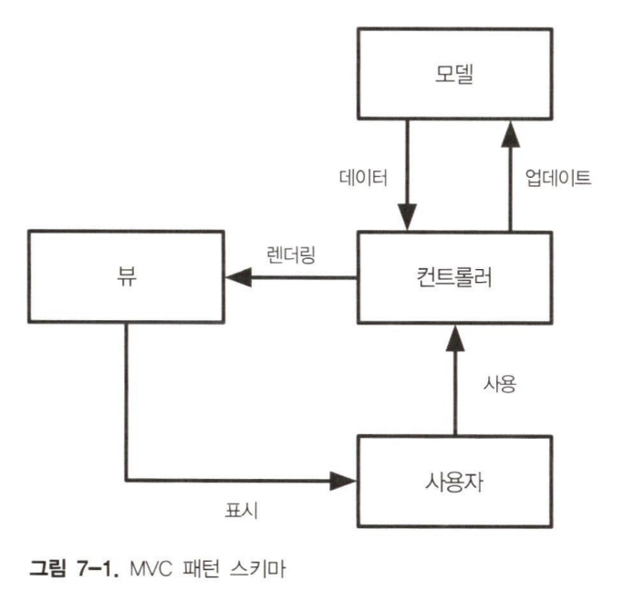
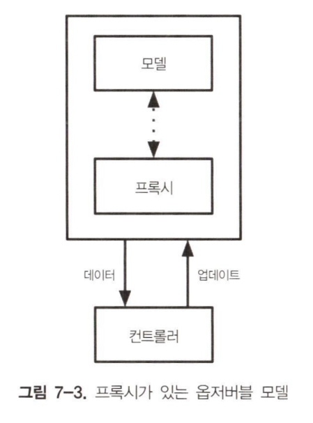
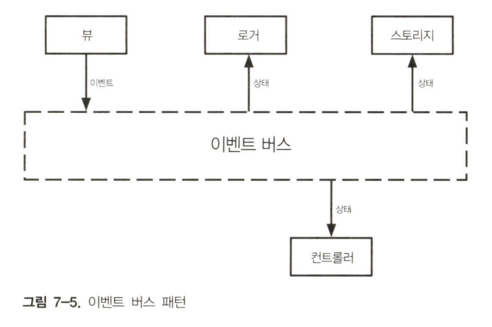

모든 종류의 클라이언트 애플리케이션의 효과적인 데이터 관리 방법을 상태 관리라고 한다.

## ToDoMVC 애플리케이션 리뷰

```js title="TodoMVC 컨트롤러"
import todosView from "./view/todos.js";
import counterView from "./view/counter.js";
import filtersView from "./view/filters.js";
import appView from "./view/app.js";
import applyDiff from "./applyDiff.js";

import registry from "./registry.js";

registry.add("app", appView);
registry.add("todos", todosView);
registry.add("counter", counterView);
registry.add("filters", filtersView);

const state = {
  todos: [],
  currentFilter: "All",
};

const events = {
  addItem: (text) => {
    state.todos.push({
      text,
      completed: false,
    });
  },
  updateItem: (index, text) => {
    state.todos[index].text = text;
    render();
  },
  deleteItem: (index) => {
    state.todos.splice(index, 1);
    render();
  },
  toggleItemCompleted: (index) => {
    const { completed } = state.todos[index];
    state.todos[index].completed = !completed;
    render();
  },
  completeAll: () => {
    state.todos = state.todos.filter((t) => !t.completed);
    render();
  },
  changeFilter: (filter) => {
    state.currentFilter = filter;
    render();
  },
};

const render = () => {
  window.requestAnimationFrame(() => {
    const main = document.querySelector("#root");
    const newMain = registry.renderRoot(main, state, events);

    applyDiff(document.body, main, newMain);
  });
};

render();
```

상태 관리 코드는 events 객체에 정의돼 있으며, 이 객체는 메서드를 DOM 핸들러에 연결하고자 View 함수에 전달된다.

## 모델-뷰-컨트롤러

상태를 컨트롤러에서 유지하는 것은 상태 관리의 좋은 방법은 아니다. 향상시키는 첫 번째 단계는 별도의 파일로 옮기는 것이다.

```js title="모델이 분리된 컨트롤러"
import modelFactory from "./model/model.js";

const model = modelFactory();

const events = {
  addItem: (text) => {
    model.addItem(text);
    render(model.getState());
  },
  updateItem: (index, text) => {
    model.updateItem(index, text);
    render(model.getState());
  },
  deleteItem: (index) => {
    model.deleteItem(index);
    render(model.getState());
  },
  toggleItemCompleted: (index) => {
    model.toggleItemCompleted(index);
    render(model.getState());
  },
  completeAll: () => {
    model.clearCompleted();
    render(model.getState());
  },
  changeFilter: (filter) => {
    model.changeFilter(filter);
    render(model.getState());
  },
};

const render = (state) => {
  //...
};

render(model.getState());
```

렌더링에 사용된 실제 데이터는 model 객체의 getState 메서드에서 반환된다.

```js title="TodoMVC 애플리케이션을 위한 간단한 모델 객체"
const cloneDeep = (x) => {
  return JSON.parse(JSON.stringify(x));
};

const INITIAL_STATE = {
  todos: [],
  currentFilter: "All",
};

export default (initialState = INITIAL_STATE) => {
  const state = cloneDeep(initialState);
  const getState = () => {
    return Object.freeze(cloneDeep(state));
  };

  const addItem = (text) => {
    if (!text) {
      return;
    }

    state.todos.push({
      text,
      completed: false,
    });
  };

  const updateItem = (index, text) => {
    if (!text) {
      return;
    }

    if (index < 0) {
      return;
    }

    if (!state.todos[index]) {
      return;
    }

    state.todos[index].text = text;
  };

  // 다른 메서드들...

  return {
    addItem,
    updateItem,
    deleteItem,
    //...
  };
};
```

model 객체에서 추출한 값은 불변이다. getState가 호출될 때마다 복사본을 생성한 다음 Object.freeze로 고정해 이를 수행한다.

불변 상태를 사용해 데이터를 전송하면 이 API의 소비자는 상태를 조작하는데 public method를 사용해야 한다. 이런 방법으로 비즈니스 로직이 Model 객체에 완전히 포함돼 있으면 애플리케이션의 다른 부분에 흩어지지 않는다. 이런 방식은 상태 관리 코드를 높은 수준의 테스트 가능성으로 유지하는데 도움이 된다.

```js title="TodoMVC 상태 객체용 test suite"
import stateFactory from "./state.js";

describe("external state", () => {
  test("data should be immutable", () => {
    const state = stateFactory();

    expect(() => {
      state.get().currentFilter = "WRONG";
    }).toThrow();
  });

  test("should add an item", () => {
    const state = stateFactory();

    state.addItem("dummy");

    const { todos } = state.get();

    expect(todos.length).toBe(1);
    expect(todos[0]).toEqual({
      text: "dummy",
      completed: false,
    });
  });

  test("should not add an item when a falsy text is provided", () => {
    const state = stateFactory();

    state.addItem("");
    state.addItem(undefined);
    state.addItem(0);
    state.addItem();
    state.addItem(false);

    const { todos } = state.get();

    expect(todos.length).toBe(0);
  });

  test("should update an item", () => {
    const state = stateFactory({
      todos: [
        {
          text: "dummy",
          completed: false,
        },
      ],
    });

    state.updateItem(0, "new-dummy");

    const { todos } = state.get();

    expect(todos[0].text).toBe("new-dummy");
  });

  test("should not update an item when an invalid index is provided", () => {
    const state = stateFactory({
      todos: [
        {
          text: "dummy",
          completed: false,
        },
      ],
    });

    state.updateItem(1, "new-dummy");

    const { todos } = state.get();

    expect(todos[0].text).toBe("dummy");
  });
});
```

todoMVC 애플리케이션을 위한 상태 관리 라이브러리의 첫 번째 버전은 고전적인 모델-뷰-컨트롤러 구현이다.



이 모델 객체가 다른 구현들의 기반이 된다.

1. 컨트롤러는 모델에서 초기 상태를 가져온다.
2. 컨트롤러는 뷰를 호출해 초기 상태를 렌더링한다.
3. 시스템이 사용자 입력을 받을 준비가 된다.
4. 사용자가 어떤 동작을 수행한다.
5. 컨트롤러는 올바른 Model 메서드로 사용자의 동작과 매핑한다.
6. 모델이 상태를 업데이트한다.
7. 컨트롤러는 모델에서 새로운 상태를 얻는다.
8. 컨트롤러는 뷰를 호출해 새로운 상태를 렌더링한다.
9. 시스템이 사용자 입력을 받을 준비가 됐다.

렌더링과 사용자 동작 사이의 루프를 렌더링 주기라고 한다.

### 옵저버블 모델

MVC 기반으로 작성한 첫 번째 상태 관리 코드는 우리의 유스케이스에서 잘 동작한다. 하지만 사용자가 동작을 수행할 때마다 Render 메서드를 수동으로 호출해야 하기 때문에 모델과 컨트롤러 간의 통합이 완벽하지 않다. 두가지 문제가 있다.
첫째, 상태 변경 훙에 렌더링을 수동으로 호출하는 방법은 오류가 발생하기 쉽다. 둘째, 동작이 상태를 변경하지 않을 때에도 render 메서드가 호출된다. 이들 문제는 관찰자 패턴을 기반으로 해결된다.

```js title="옵저버블 TodoMVC 모델"
const INITIAL_STATE = {
  todos: [],
  currentFilter: "All",
};

export default (initialState = INITIAL_STATE) => {
  const state = cloneDeep(initialState);
  let listeners = [];

  const addChangeListener = (listener) => {
    listeners.push(listener);
    listener(freeze(state));

    return () => (listeners = listeners.filter((l) => l !== listener));
  };

  const invokeListeners = () => {
    const data = freeze(state);
    listeners.forEach((l) => l(data));
  };

  const addItem = (text) => {
    if (!text) {
      return;
    }

    state.todos.push({
      text,
      completed: false,
    });

    invokeListeners();
  };

  const udpateItem = (index, text) => {
    if (!text) {
      return;
    }

    if (index < 0) {
      return;
    }

    if (!state.todos[index]) {
      return;
    }

    state.todos[index].text = text;

    invokeListeners();
  };

  // 다른 메서드들...

  return {
    addItem,
    updateItem,
    deleteItem,
    toggleItemCompleted,
    completeAll,
    clearCompleted,
    changeFilter,
    addChangeListener,
  };
};
```

```js title="옵저버블 모델을 위한 단위 테스트"
import modelFactory from "./model.js";
let model;

describe("observable model", () => {
  beforeEach(() => {
    model = modelFactory();
  });

  test("listeners should be invoked immediatly", () => {
    let counter = 0;
    model.addChangeListener((data) => {
      counter++;
    });

    expect(counter).toBe(1);
  });

  test("listeners should be invoked when changing data", () => {
    let counter = 0;
    model.addChangeListener((data) => {
      counter++;
    });
    model.addItem("dummy");
    expect(counter).toBe(2);
  });

  test("listeners should be removed when unsubscribing", () => {
    let counter = 0;
    const unsubscribe = model.addChangeListener((data) => {
      counter++;
    });
    unsubscribe();
    model.addItem("dummy");
    expect(counter).toBe(1);
  });

  test("state should be immutable", () => {
    model.addChangeListener((data) => {
      expect(() => {
        data.currentFilter = "WRONG";
      }).toThrow();
    });
  });
});
```

```js title="컨트롤러에서 옵저버블 모델 사용"
import modelFactory from "./model/model.js";

const model = modelFactory();

const { addChangeListener, ...events } = model;

const render = (state) => {
  window.requestAnimationFrame(() => {
    const main = document.querySelector("#root");
    const newMain = registry.renderRoot(main, state, events);

    applyDiff(document.body, main, newMain);
  });
};

addChangeListener(render);
```

이제 컨트롤러 코드가 더 간단해졌다. render 메서드를 모델에 바인딩하는 것은 해당 메서드를 리스너로 사용할 충분한 이유다. 뷰에 전달하는 이벤트로 사용하고자 모델에서 모든 메서드를 추출했음에 주목하자.

옵저버블 모델은 모델의 공개 인터페이스를 수정하지 않고 컨트롤러에 새로운 기능을 추가하는데 유용하다.

```js title="옵저버블 모델에서 사용되는 여러 리스너"
import stateFactory from "./model/state.js";

const loadState = () => {
  const serializedState = window.localStorage.getItem("state");

  if (!serializedState) {
    return;
  }

  return JSON.parse(serializedState);
};

const state = stateFactory(loadState());

const { addChangeListener, ...events } = state;

const render = (state) => {
  // 랜더링 코드
};

addChangeListener(render);

addChangeListener((state) => {
  Promise.resolve().then(() => {
    window.localStorage.setItem("state", JSON.stringify(state));
  });
});

addChangeListener((state) => {
  console.log(`Current State (${new Date().getTime()})`), state;
});
```

컨트롤러가 모델과 밀접하게 결합된다면 이 패턴을 고려하는 것이 좋다.

이번 절에서는 '모델'을 단일 객체로 가정했다. TodoMVC 같은 간단한 애플리케이션에서는 맞는 말이지만 실제 시나리오에서 '모델'은 애플리케이션의 다른 모든 도메인을 관리하는 Model 객체의 모음이다.

## 반응형 프로그래밍

반응형 프로그래밍은 앵귤러 팀이 앵귤러 프레임워크가 RxJS를 기반으로 하고 있다고 발표하면서 인기를 끌기 시작했다.

반응형 패러다임의 구현은 애플리케이션이 모델 변경, HTTP 요청, 사용자 동작, 탐색 등과 같은 이벤트를 방출할 수 있는 옵저버블로 동작하도록 구현하는 것을 의미한다.

:::tip

자신의 코드에서 여러 옵저버블을 사용하고 있다면 이미 반응형 패러다임으로 작업하고 있는 것이다.

:::

### 반응형 모델

다양한 모델 객체를 갖고 있는 복잡한 애플리케이션에서 옵저버블을 생성할 수 있는 쉬운 방법이 필요하다. 도메인 로직에만 집중하고 아키텍처 부분은 별도의 라이브러리로 넘겨야 한다. 다음 코드는 옵저버블 팩토리를 기반으로 하는 모델 객체를 보여준다.

```js title="팩토리로 구축된 옵저버블 TodoMVC 모델"
import observableFactory from "./observable.js";

const INITIAL_STATE = {
  todos: [],
  currentFilter: "All",
};

export default (initialState = INITIAL_STATE) => {
  const state = cloneDeep(initialState);
  const addItem = (text) => {
    if (!text) {
      return;
    }

    state.todos.push({
      text,
      completed: false,
    });
  };

  const udpateItem = (index, text) => {
    if (!text) {
      return;
    }

    if (index < 0) {
      return;
    }

    if (!state.todos[index]) {
      return;
    }

    state.todos[index].text = text;
  };

  // ...

  const model = {
    addItem,
    updateItem,
    deleteItem,
    // ...
  };

  return observableFactory(model, () => state);
};
```

```js title="옵저버블 팩토리"
export default (model, stateGetter) => {
  let listeners = [];

  const addChangeListener = (cb) => {
    listeners.push(cb);
    cb(freeze(stateGetter()));

    return () => {
      listeners = listeners.filter((element) => element !== cb);
    };
  };

  const invokeListeners = () => {
    const data = freeze(stateGetter());
    listeners.forEach((l) => l(data));
  };

  const wrapAction = (originalAction) => {
    return (...args) => {
      const value = originalAction(...args);
      invokeListeners();

      return value;
    };
  };

  const baseProxy = {
    addChangeListener,
  };

  return Object.keys(model)
    .filter((key) => {
      return typeof model[key] === "function";
    })
    .reduce((proxy, key) => {
      const action = model[key];
      return {
        ...proxy,
        [key]: wrapAction(action),
      };
    }, baseProxy);
};
```

프록시로 상태를 전달하고자 간단한 getter 함수를 사용해 모델에서 변경이 수행될 때마다 현재 상태를 가져온다.

반응형 상태 관리 아키텍처를 설계하는 좋은 방법은 간단한 옵저버블 모델을 생성하는 것이다. 그러면 둘 이상의 Model 객체가 필요할 때 옵저버블 팩토리 추상화를 생성할 수 있다.



### 네이티브 프록시

자바스크립트는 Proxy 객체를 통해 프록시를 생성할 수 있는 방법을 제공한다. 이 API를 사용하면 객체의 디폴트 동작을 사용자 정의 코드로 쉽게 래핑할 수 있다.

```js title="기본 프록시 객체 사용법"
const base = {
  foo: "bar",
};

const handler = {
  get: (target, name) => {
    console.log(`Getting ${name}`);

    return target[name];
  },
  set: (target, name, value) => {
    console.log(`Setting ${name} to ${value}`);
    target[name] = value;

    return true;
  },
};

const proxy = new Proxy(base, handler);

proxy.foo = "baz";
console.log(`Logging ${proxy.foo}`);
```

set 핸들러는 작업 성공을 나타내는 불리언 값을 반환해야한다. 다음 코드에서 Proxy 객체는 옵저버블 팩토리를 생성한다.

```js title="프록시 Object.freeze를 가지는 옵저버블 팩토리"
export default (initialState) => {
  let listeners = [];

  const proxy = new Proxy(cloneDeep(initialState), {
    set: (target, name, value) => {
      target[name] = value;
      listeners.forEach((l) => l(freeze(proxy)));

      return true;
    },
  });

  proxy.addChangeListener = (cb) => {
    listeners.push(cb);
    cb(freeze(proxy));

    return () => {
      listeners = listeners.filter((l) => l !== cb);
    };
  };

  return proxy;
};
```

## 이벤트 버스

이벤트 버스는 이벤트 주도 아키텍처를 구현하는 하나의 방법이다. EDA로 작업할 때 모든 상태 변경은 시스템에서 전달된 이벤트로 나타난다.

이벤트는 발생한 상황을 식별하는 이름과 이벤트 처리를 위해 의미 있는 정보를 담고 있는 페이로드로 정의된다.

```js title="항목 추가 이벤트"
const event = {
  type: "ITEM_ADDED",
  payload: "Buy Milk",
};
```

이벤트 버스 패턴의 기본 개념은 애플리케이션을 구성하는 '노드'들을 연결하는 단일 객체가 모든 이벤트를 처리한다는 것이다. 이벤트가 처리되면 결과가 연결된 모든 노드로 전송된다.



이벤트 버스의 동작 방식을 이해하고자 ITEM_ADDED 이벤트의 흐름을 분석해보자.

1. 뷰는 초기 상태를 렌더링한다.
2. 사용자가 폼을 작성하고 엔터키를 누른다.
3. DOM 이벤트가 뷰에 의해 캡처된다.
4. 뷰는 ITEM_ADDED 이벤트를 생성하고 버스로 보낸다.
5. 버스는 새로운 상태를 생성하는 이벤트를 처리한다.
6. 새로운 상태가 컨트롤러로 전송된다.
7. 컨트롤러가 뷰를 호출해 새로운 상태를 렌더링한다.
8. 시스템이 사용자 입력을 받을 준비가 됐다.

5 단계에서 버스가 새로운 상태를 생성하는 이벤트를 처리한다고 했다. 그러나 이벤트 버스는 아키텍처적 요소고, 따라서 도메인 관련 코드를 포함해서는 안되기 때문에 이는 잘못된 것이다. 이벤트 버스 패턴을 구현하려면 모델을 믹스에 추가해야 한다. 이 예제에서 모델은 이전 상태와 이벤트를 받아 새로운 버전의 상태를 반환하는 함수다.

이 패턴에서는 모델에서 subscriber로 전달되는 상태는 단일 객체라는 점에 유의하자.


### 프레임워크 없는 구현

```js title="프레임워크 없는 이벤트 버스"
export default (model) => {
  let listeners = [];
  let state = model();

  const subscribe = (listener) => {
    listeners.push(listener);

    return () => {
      listeners = listeners.filter((l) => l !== listener);
    };
  };

  const invokeSubscribers = () => {
    const data = freeze(state);
    listeners.forEach((l) => l(data));
  };

  const dispatch = (event) => {
    const newState = model(state, event);

    if (!newState) {
      throw new Error("model should always return a value");
    }

    if (newState === state) {
      return;
    }

    state = newState;

    invokeSubscribers();
  };

  return {
    subscribe,
    dispatch,
    getState: () => freeze(state),
  };
};
```

이 시나리오에서 모델은 입력으로 이전 상태와 이벤트를 받아 새로운 상태를 반환하는 함수다. 모델의 또 다른 중요한 특성은 순수함수라는 것이다. 순수함수는 반환값이 입력값에 의해서만 결정되는 함수를 말한다.

순수함수로 설계된 모델은 새로운 상태가 모델 자체의 내부 상태가 되므로 테스트 가능성을 크게 향상시킨다. 상태가 업데이트되면 항상 새 객체가 되므로, 이 특성을 사용해 성능을 최적화시킬 수 있다.

```js title="이벤트 버스용 테스트 suite"
import eventBusFactory from "./eventBus";
let eventBus;

const counterModel = (state, event) => {
  if (!event) {
    return {
      counter: 0,
    };
  }

  if (event.type !== "COUNTER") {
    return state;
  }

  return {
    counter: state.counter++,
  };
};

describe("eventBus", () => {
  beforeEach(() => {
    eventBus = eventBusFactory(counterModel);
  });

  test("subscribers should be invoked when the model catch the event", () => {
    let counter = 0;

    eventBus.subscribe(() => counter++);
    eventBus.dispatch({ type: "COUNTER" });

    expect(counter).toBe(1);
  });

  test('subscribers should not be invoked when the model does not catch the event', () => {
    let counter = 0;

    eventBus.subscribe(() => counter++);
    eventBus.dispatch({ type: 'NOT_COUNTER' });

    expect(counter).toBe(0);
  });

  test('subscribers should receive an immutable state', () =. {
    eventBus.dispatch({ type: 'COUNTER' });
    eventBus.subscribe((state) => {
      expect(() => {
        state.counter = 0;
      }).toThrow();
    })
  })

  test('should throw error if the model does not return a state', () => {
    const eventBus = eventBusFactory(() => {
      return undefined;
    });

    expect(() => {
      eventBus.dispatch({ type: 'EVENT' });
    }).toThrow();
  })
});
```

```js title="이벤트 버스 아키텍처를 위한 TodoMVC 모델"
const INITIAL_STATE = {
  todos: [],
  currentFilter: "All",
};

const addItem = (state, event) => {
  const text = event.payload;
  if (!text) {
    return state;
  }

  return {
    ...state,
    todos: [
      ...state.todos,
      {
        text,
        completed: false,
      },
    ],
  };
};

const updateItem = (state, event) => {
  const { text, index } = event.payload;
  if (!text) {
    return state;
  }

  if (index < 0) {
    return state;
  }

  if (!state.todos[index]) {
    return state;
  }

  return {
    ...state,
    todos: state.todos.map((todo, i) => {
      if (i === index) {
        todo.text = text;
      }

      return todo;
    }),
  };
};

const methods = {
  ITEM_ADDED: addItem,
  ITEM_UPDATED: updateItem,
};

export default (initalState = INITIAL_STATE) => {
  return (prevState, event) => {
    if (!prevState) {
      return cloneDeep(initialState);
    }

    const currentMethod = methods[event.type];

    if (!currentMethod) {
      return prevState;
    }

    return currentMethod(prevState, event);
  };
};
```

```js title="이벤트 버스 기반 TodoMVC 애플리케이션의 컨트롤러"
import eventBusFactory from "./model/eventBus.js";
import modelFactory from "./model/model.js";

const model = modelFactory();
const eventBus = eventBusFactory(model);

const render = (state) => {
  window.requestAnimationFrame(() => {
    const main = document.querySelector("#root");
    const newMain = registry.renderRoot(main, state, eventBus.dispatch);

    applyDiff(document.body, main, newMain);
  });
};

eventBus.subscribe(render);

render(eventBus.getState());
```

```js title="이벤트 버스를 사용하는 뷰 함수"
import eventCreators from "../model/eventCreators.js";

let template;

const getTemplate = () => {
  if (!template) {
    template = document.getElementById("todo-app");
  }

  return template.content.firstElementChild.cloneNode(true);
};

const addEvents = (targetElement, dispatch) => {
  targetElement.querySelector(".new-todo").addEventListener("keypress", (e) => {
    if (e.key === "Enter") {
      const event = eventCreators.addItem(e.target.value);
      dispatch(event);
      e.target.value = "";
    }
  });
};

export default (targetElement, state, dispatch) => {
  const newApp = targetElement.cloneNode(true);
  newApp.innerHTML = "";
  newApp.appendChild(getTemplate());

  addEvents(newApp, dispatch);

  return newApp;
};
```

```js title="이벤트 생성자"
const EVENT_TYPES = Object.freeze({
  ITEM_ADDED: "ITEM_ADDED",
  ITEM_UPDATED: "ITEM_UPDATED",
});

export default {
  addItem: (text) => ({
    type: EVENT_TYPES.ITEM_ADDED,
    payload: text,
  }),
  updateItem: (index, text) => ({
    type: EVENT_TYPES.ITEM_UPDATED,
    payload: {
      text,
      index,
    },
  }),
};
```

## 상태 관리 전략 비교

### 모델-뷰-컨트롤러

MVC는 구현하기 매우 간단하면서 많은 이점을 제공한다. 도메인 비즈니스 로직에 대한 테스트와 관심사 분리가 있다. MVC의 문제는 엄격한 패턴이 아니라는 것이다. 컴포넌트의 정의과 그 사이의 관계가 불분명할 수 있다. 뷰와 컨트롤러의 차이점이 무엇인가?라는 질문에 다양한 답변이 가능하다. 이에 약간씩 다른 버전의 MVC가 탄생할 수 있다.

## 반응형 프로그래밍

반응형 프로그래밍의 기본 아이디어는 애플리케이션이 옵저버블하다는 것이다. 이 접근방식은 '동일한 타입'의 객체로 작업하기 때문에 뛰어난 일관성을 보장해준다.

하지만 여전히 모든 옵저버블을 래핑하는 것이 간단하지는 않다.

아주 큰 추상화로 작업하기 때문에 생각보다 간단하지 않을 수 있고 애플리케이션이 커지면 문제가 될 수 있다. 어플리케니션이 커질수록 추상화에 적합하지 않은 부분이 생겨 확장성에 큰 문제가 될 수 있다.

### 이벤트 버스

이벤트 버스는 '모든 상태 변경은 이벤트에 의해 생성된다'는 엄격한 규칙을 기반으로 한다. 이 규칙 덕분에 애플리케이션의 복잡성을 애플리케이션의 크기에 비례하도록 유지할 수 있지만 다른 아키텍처에서는 애플리케이션이 커질수록 복잡성이 기하급수적으로 증가한다.

이벤트 버스 패턴을 엄격히 준수하면 이런 복잡성을 제거할 수 있다. 이런 특성 덕분에 첫번째 관심사가 코드 베이스의 확장성이라면 이벤트 버스가 매우 좋은 방법이 될 수 있다.

이벤트 버스는 사용하기 쉽고 구축도 쉽다. 또한 패턴 뒤에 숨겨져 있는 추상화가 반응형 프로그래밍의 추상화만큼 강하지 않기 때문에 단순하기도 하다. 이벤트 버스의 가장 큰 문제는 다변성이다. 모든 상태 업데이트에 대해 이벤트를 생성하고 버스를 통해 이벤트를 발송하고, 상태를 업데이트한 모델을 작성한 다음 새 상태를 리스터에 전송해야 한다.

|             | 단순성 | 일관성 | 확장성 |
| :---------- | :----: | :----: | :----: |
| MVC         |   O    |   X    |   X    |
| 반응형      |   X    |   O    |   -    |
| 이벤트 버스 |   -    |   X    |   O    |
