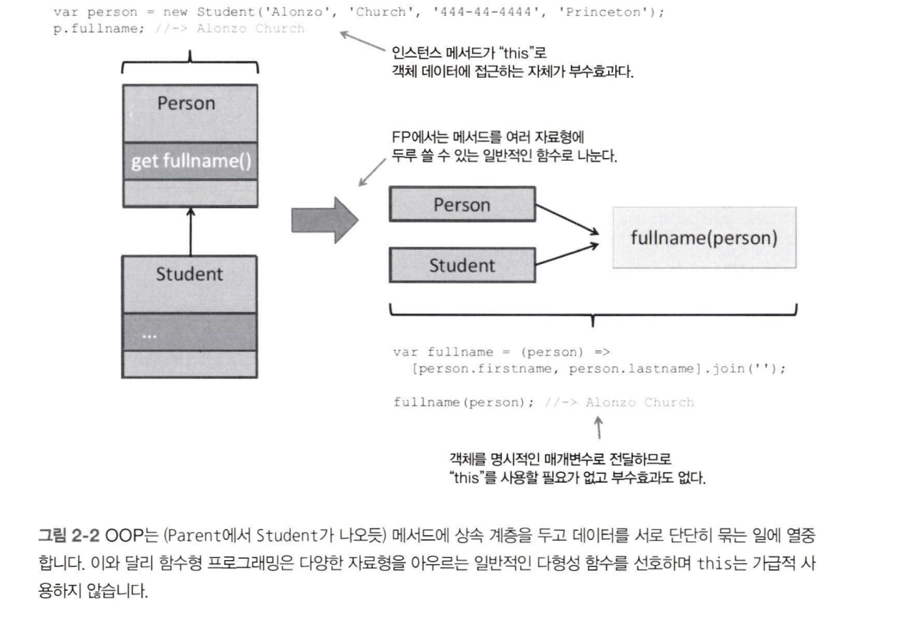

:::info 이 장의 내용

- 자바스크립트가 함수형 언어로 적합한 이유
- 자바스크립트는 다중 패러다임 개발이 가능한 언어
- 불변성 및 변경에 대한 정책
- 고계함수와 일급 함수
- 클로저와 스코프 개념
- 클로저의 활용

:::

> 

:::note [만약 헤밍웨이가 자바스크립트로 코딩한다면](한및미디어, 2016)

<div style={{ textAlign: 'center' }}>"자연어는 지배적인 패러다임이 없습니다. 자바스크립트도 마찬가지입니다. 개발자들은 절차적, 함수형, 객체지향형 접근 방법이 들어 있는 손가방에서 적절히 섞어 쓰면 됩니다."</div>

:::

## 2.1 왜 자바스크립트인가?

이유는 편재성(어디에너 있음) 때문입니다. 가장 널리 쓰이는 언어이자. 웹 세상을 대표하는 맹주 언어이기 때문입니다.

자바스크립트 구문은 C 언어와 비슷하지만 리스프, 스킴 같은 함수형 언어의 영향을 많이 받았습니다. 리스프, 스킴의 고계함수, 클로저, 배열 리터럴 등 공통점은 자바스크립트가 FP 기법을 활용할 수 있는 탁월한 플랫폼으로 발돋움하는 데 초석이 되었습니다. 사실 자바스크립트 함수는 주요 **작업 단위**로서 애플리케이션에게 할 일을 시키는 역할뿐만 아니라 객체 정의, 모듈 생성, 이벤트 처리 등의 책임도 맡습니다.

여러 가지 강력한 함수형 장치가 탑재되긴 했지만, 자바스크립트는 어디까지나 함수형인 동시에 객체지향 언어라는 사실을 명심해야 합니다.

## 2.2 함수형 대 객체지향

어떤 학습 관리 시스템의 Student 객체를 간단히 모형화한다고 합시다. Student는 클래스나 형식 계층 관점에서 성, 이름, 주소 같은 기본 속성을 포함한 Person의 하위형이라고 볼 수 있습니다.

:::note 객체지향 자바스크립트

객체 간의 관계를 **하위형** 혹은 **파생성**이라고 표현하는 건, 이들 사이에 존재하는 프로토타입 관계를 의미합니다. 자바스크립트는 객체지향 언어지만 자바 등 타 언어에서는 당연한 클래스 상속을 지원하지 않습니다.

ES6부터는 객체 간 프로토타입 링크를 class나 extends같이 보기 좋은 키워드로 설정 가능하게 단장했습니다. 직관적 코드로 객체 상속을 표현한 의도는 좋지만, 자바스크립트 프로토타입 체제의 진정한 작동 방식과 강력함을 애써 숨기는 꼴이 되고 말았습니다.

:::

추가할 기능이 있으면 Student 보다 더 구체화한 형식, 이를테면 CollegeStudent 같은 형식을 만들어 붙이면 됩니다. 객체지향 프로그램의 핵심이 새로운 파생 객체를 생성하여 코드를 재사용하는 것이지요. 문제는 모든 하위형에 적용할 필요가 없는 기존 객체에 추가할 때입니다. firstname, lastname은 Person과 하위형 모두 의미가 있지만, workAddress는 Student보다는 (Person의 파생형인) Employee 객체 전용 속성입니다. 객체지향과 함수형의 가장 중요한 차이점은 바로 이런 데이터(객체 속성)와 기능(함수)을 조작하는 방법에 있습니다.

명령형 코드로 이루어진 객체지향 애플리케이션은 인스턴스 메서드를 통해 가변 상태를 노출하고 조작할 수 있도록, 객체 기반의 캡슐화에 지나치게 의존한 채 가변 상태의 무결성을 유지합니다. 결국 객체의 데이터와 잘게 나뉜 기능이 단단히 유착되어 응집도가 높은 패키지가 형성됩니다. 결국 객체의 데이터와 잘게 나뉜 기능이 단단히 유착되어 응집도가 높은 패키지가 형성됩니다. 이는 객체지향 프로그램이 추구하는 목적이자, 모든 추상화의 주요 형태가 객체인 이유이기도 합니다.

한편, 함수형 프로그램은 호출자로부터 데이터를 숨길 필요 없이 소규모의, 아주 단순한 자료형만을 대상으로 움직입니다. 만사가 불변이니 얼마든지 객체를 직접 만져도 되지만, 객체 스코프 밖에 위치한 일반적인 함수를 거치는 편이 좋겠죠? 한마디로 데이터와 기능을 느슨하게 결합하는 겁니다. 함수형 코드는 잘게 나뉜 인스턴스 메소드 대신 여러 자료형에 두루 적용 가능하고 굵게 나뉜 연산에 더 의존합니다. 함수는 함수형 패러다임의 **주된 추상화 형태**입니다.


실제로 이 그래프의 교차점에서 두 패러다임을 함께 활용한, 최고의 객체지향 코드를 본 적이 있습니다. 그렇게 하려면 객체를 불변 개체(entity)나 불변 값으로 바라보고 기능을 함수로 분리하여 객체 내에서 작동되게끔 해야 합니다. Person 객체를 예로 들면 다음과 같습니다.

```js
get fullname() {
  return [this._firstname, this._lastname].join(' ');
}
```
> 메서드는 대게 this로 객체 상태에 접근합니다.

이는 다음과 같이 나눌 수 있습니다.

```js
var fullname = person => [person.firstname, person.lastname].join(' ');
```
> this는 사실상 전달받은 객체로 교체됩니다.

자바스크립트는 동적 형식 언어라서 2-2에서 보다시피 fullname()은 Person의 모든 파생형 객체(또는 여기선 firstname, lastname 속성을 지닌 객체 전부)에서 잘 작동합니다. 자바스크립트는 일반화한 다형성 함수를 지원합니다. 다시 말해, 기반형(Person)을 가리키는 레퍼런스를 사용하는 함수라면 파생성(Student, CollegeStudent) 객체에서도 문제없이 작동합니다.



[그림 2-2]에서 보다시피, fullname()을 독립형 함수로 분리하면 객체 데이터를 this로 접근할 이유가 사라집니다. this를 쓰면 메서드 스코프 밖에 위치한 인스턴스 수준의 데이터에 접근할 수 있어서 부수효과를 야기할 수 있습니다. 그래서 FP로 개발한 코드는 객체 데이터가 특정 코드에 종속되지 않아 재사용성, 유지보수성이 좋습니다.

파생성을 여럿 만들지 않고도 함수를 다른 함수의 인수로 전달하여 함수의 기능을 확장하는 방법도 있습니다. 먼저 Person 클래스와 하위 클래스 Student를 정의합니다.

```js title="코드 2-1 Person/Student 클래스 정의"
class Person {
  constructor(firstname, lastname, ssn) {
    this._firstname = firstname;
    this._lastname = lastname;
    this.ssn = ssn;
    this._address = null;
    this._birthYear = null;
  }

  get ssn() {
    return this._ssn;
  }

  get firstname() {
    return this._firstname;
  }

  get lastname() {
    return this._lastname;
  }

  get address() {
    return this._address;
  }

  get birthYear() {
    return this._birthYear;
  }

  // 세터 메서드는 객체 변이를 지원하기 위해서가 아니라, 생성자를 길게 쓰지 않고도 속성이 다른 객체를 쉽게 만들기 위해 사용됩니다. 객체는 일단 생성되고 내용이 채워지면 절대로 상태가 바뀌지 않습니다(이 문제는 이 장 후반부에서 다룹니다).
  set birthYear(year) {
    this._birthYear = year;
  }

  set address(addr) {
    this._address = addr;
  }

  toString() {
    return `Person(${this._firstname}, ${this._lastname})`;
  }
}

class Student extends Person {
  constructor(firstname, lastname, ssn, school) {
    super(firstname, lastname, ssn);
    this._school = school;
  }

  get school() {
    return this._school;
  }
}
```

어떤 사람(Person)과 거주 국가가 같은 사람을 전부 찾고, 어떤 학생(Student)과 거주 국가와 다니는 학교가 모두 같은 학생을 전부 찾는 코드를 개발하려고 합니다. 객체지향 스타일로 작성하면 다음과 같이 this와 super로 한 객체와 그 부모 객체가 단단히 결합된 코드가 되겠죠.

```js
// Person 클래스
personInSameCountry(friends) {
  var result = [];
  for(let idx in friends) {
    var friend = friends[idx];
    if (this.address.country === friend.address.country) {
      result.push(friend);
    }
  }
  return result;
}

// Student 클래스
studentsInSameCountryAndSchool(friends) {
  var closeFriends = super.peopleInSameCountry(friends);
  var result = [];
  for (let idx in closeFriends) {
    var friend = closeFriends[idx];
    if (friends.school === this.school) {
      result.push(friend);
    }
  }
  return result;
}
```
한편, 순수성과 참조 투명성에 기반을 둔 FP 방식을 따르면, 상태와 기능을 철저히 분리한 다음 이들을 다시 조합한 새로운 함수로 연산을 추가할 수 있습니다. 그러다 보면 데이터 저장만을 맡은 단순 객체와 이런 객체를 인자로 받아 작동하는 범용 함수를 만들 수 있고, 다시 이들을 합성하여 원하는 구체적인 기능을 수행할 수 있습니다. '합성'은 함수형 패러다임을 부각하는 또 다른 근본적인 특징입니다. 

```js title="mock 데이터"
var curry = new Student('Haskell', 'Curry', '111-11-1111', 'Penn State');
curry.address = new Address('US');

var turing = new Student('Alan', 'Turing', '222-22-2222', 'Princeton');
turing.address = new Address('England');

var church = new Student('Alonzo', 'Church', '333-33-333', 'Princeton');
church.address = new Address('US');

var kleene = new Student('Stephen', 'Kleene', '444-44-4444', 'Princeton');
kleene.address = new Address('US');
```

객체지향 프로그램은 Student의 메서드로 같은 학교를 다니는 학생을 찾습니다.

```js
church.studentsInSameCountryAndSchool([curry, turing, kleene]);
// => [kleene]
```

반면, 함수형 프로그램은 문제를 작은 함수들로 잘게 나눕니다.

```js
var selector = (country, school) => 
  (student) =>
    student.address.country === country &&
    student.school === school;

var findStudentsBy = (friends, selector) => friends.filter(selector);

findStudentsBy([curry, turing, church, kleene], selector('US', 'Princeton')); // -> [church, kleene]
```

객체지향은 데이터와 데이터 관계의 본질에 초점을 두는 반면, 함수형의 관심사는 해야 할 일, 즉 기능입니다.

다른 패러다임이지만 둘을 모으면 강력한 애플리케이션을 구축할 수 있습니다. 한편으론 애플리케이션을 구성하는 형식 간의 관계가 자연스러운 풍성한 도메인 모델을 손에 넣고, 다른 한편으론 이들 형식을 가지고 어떤 일을 할 수 있는 순수함수까지 거머쥘 수 있습니다.

### 2.2.1 자바스크립트 객체의 상태 관리
프로그램의 **상태**란 어느 한 시점에 찍은 모든 객체에 저장된 데이터의 스냅샷입니다. 객체 상태를 보호하는 측면에서 자바스크립트는 최악의 언어 중 하납니다. 자바스크립트 객체는 너무나 동적이어서 언제건 속성을 추가, 삭제, 수정할 수 있습니다.

자바스크립트의 이런 특성 덕분에 속성을 동적으로 생성하는 등 개발자는 여러 가지 잔재주를 부릴 자유가 있지만, 중대형 규모의 프로그램에서는 자칫 도저히 관리 안되는 코드로 발전할 소지가 있습니다.

코드를 순수함수로 작동시키면 이해/관리하기가 더 쉽다고 했습니다. 불변 기능을 지닌 불변 객체는 순수 객체로 볼 수 있습니다. 단순 객체에 했던 것처럼 함수에도 같은 추론이 가능합니다. 자바스크립트를 함수형 언어로 쓸 경우 상태 관리는 아주 중차대한 문제입니다.

### 2.2.2 객체를 값으로 취급
// TODO
