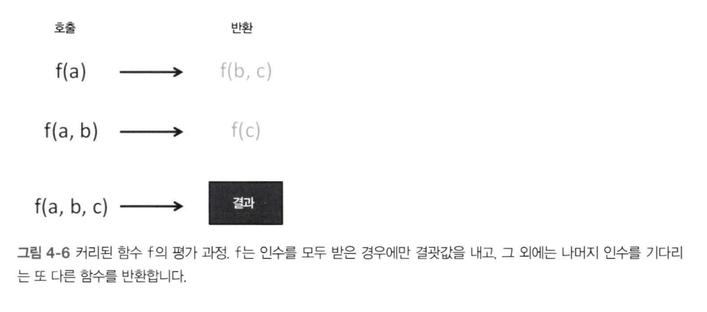

:::info 이 장의 내용

- 함수 체인과 함수 파이프라인 비교
- 함수형 라이브러리 람다JS 소개
- 커링, 부분 적용, 함수 바인딩 개념 탐구
- 함수 합성으로 모듈적인 프로그램 제작
- 함수 조합기로 프로그램의 흐름을 개선

:::

:::note [The Systems Bible](General Systemantics Press, 2012) 중에서

<div style={{ textAlign: 'center' }}>"잘 작동하는 복잡한 시스템은 십중팔구 잘 작동했던 단순한 시스템에서 진화한 경우가 많다."</div>

:::

대규모 소프트웨어 프로젝트에서 매우 중요한 특성 중 하나인 **모듈성**은, 프로그램을 더 작고 독립적인 부분으로 나눌 수 있는 정도를 뜻합니다. 모듈적 프로그램은 자신을 구성하는 부속들로부터 자신의 의미를 도출할 수 있다는 점에서 뚜렷이 구분됩니다. 모듈성은 개발자의 생산성을 높일 뿐만 아니라 코드 유지보수성 및 가독성을 향상시키는 데이도 도움이 됩니다.

프로그래밍 세계에서는 대부분 문제를 더 작은 조각으로 쪼갠 후, 이들을 다시 재구성하여 해법을 완성하는 방식을 선호합니다.

3장에서는 고수준 함수를 써서 하나의 래퍼 객체를 중심으로 단단히 결합된 메서드 체인으로 문제를 해결했습니다. 4장에서는 함수 합성을 통해 느슨하게 결합된 파이프라인을 만들고, 보다 유연한 독립적인 컴포넌트들을 재료 삼아 전체 프로그램을 구축하겠습니다. 컴포넌트 각자로는 별로 가치가 없지만 서로 뭉치면 작게는 함수, 크게는 온전한 모듈 형태로 만들어 전체 프로그램에 의미를 부여할 수 있습니다.

코드 모듈화는 쉬운 작업이 아닙니다. 선언적 함수 파이프라인을 통해 무인수 형태로 문제를 해결하려면 먼저 코드를 적정 수준으로 추상화해야 합니다.

## 4.1 메서드 체인 대 함수 파이프라인

**파이프라이닝**은 함수를 연결하는 또 다른 기법입니다. 함수형 프로그래밍에서 함수란 입력 형식과 출력 형식 간의 수학적인 매핑을 뜻합니다.

함수 체이닝과 파이프라이닝을 이해하려면 함수를 형식간의 매핑으로 바라보아야 합니다.

- 메서드를 체이닝 (단단한 결합, 제한된 표현성)
- 함수 파이프라인을 배열 (느슨한 결합, 유연성)

### 4.1.1 메서드를 여럿 체이닝

암시적으로 생성된 LodashWrapper 객체를 매개로 이들 함수를 서로 체이닝하면 물밑에서 전혀 새로운 자료구조를 만듭니다.

```js
_chain(names)
  .filter(isValid)
  .map((s) => s.replace(/_/, " "))
  .uniq()
  .map(_.startCase)
  .sort()
  .value();
```

> 뒤에 "점(.)"을 붙여 로대시JS의 다른 메서드를 호출합니다.

명령형 코드에 비해 분명히 구조적으로 향상됐고 가독성도 좋아졌습니다. 다만, 자신을 소유한 객체에 부자연스럽게 매여 있어 아쉽게도 체인에서 실행 가능한 메서드 가짓수가 줄고 코드의 표현성도 제약을 받습니다. 또한 다른(또는 직접 만든) 라이브러리 함수를 쉽게 연결할 수 없습니다.

고수준에서 보면 배열 메서드의 순차열은 [그림 4-3]과 같이 처리됩니다. 여기서 체인을 끊어 버리고 독립적인 함수열을 자유롭게 배열할 수 있으면 좋겠군요. 그래서 함수 파이프라인이 필요한 것입니다.


### 4.1.2 함수를 파이프라인에 나열

함수형 프로그래밍에서는 메서드 체이닝의 한계에서 벗어나, 출신에 관계없이 어떤 함수라도 유연하게 결합할 수 있습니다. **파이프라인**이란 한 함수의 출력이 다음 함수의 입력이 되게끔 느슨하게 배열한, 방향성 함수 순차열입니다.


체이닝은 객체 메서드를 통해 함수들을 단단히 결합하지만, 파이프라인은 함수 입출력을 서로 연결 지어 느슨하게 결합된 컴포넌트를 만듭니다. 단, 함수의 항수와 형식이 호환되지 않으면 연결할 수 없습니다.

## 4.2 함수 호환 요건

객체지향 프로그램에서는 파이프라인을 특정한 경우(보통 인증authentication/인가authorization 처리)에 드문드문 사용하지만, 함수형 프로그래밍에서는 파이프라인이 프로그램을 구축하는 유일한 수단입니다. 이 계산 단계가 코드에서는 함수로 표현되는데요. 각 함수는 두 가지 측면에서 입력과 출력이 서로 호환돼야 합니다.

- **형식**: 한 함수의 반환 형식과 수신 함수의 인수 형식이 일치해야 합니다.
- **항수**: 수신 함수는 앞 단계 함수가 반환한 값을 처리하기 위해 적어도 하나 이상의 매개 변수를 선언해야 합니다.

### 4.2.1 형식이 호환되는 함수

형식은 틀림없이 중요한 이슈지만, 자바스크립트는 함수가 취하는 인수 개수의 호환 여부가 더 중요합니다.

### 4.2.2 함수의 항수: 튜플

**항수**란 함수가 받는 인수의 개수입니다. 함수의 **길이**라고도 합니다. FP에서는 항수에 선언된 인수의 개수가 참조 투명성의 당연한 결과로서 복잡도와 정확히 비례하는 경우가 많습니다. 인수가 1개인 순수함수는 한 가지 용도, 즉 단일 책임을 담당하므로 가장 단순한 함수라고 볼 수 있습니다. 우리의 목표는 함수의 인수를 가능한 한 적게 하는 것입니다. 그래야 인수가 많은 함수보다 더 유연하고 다목적으로 활용할 수 있습니다.

함수형 언어는 **튜플**이라는 자료구조를 지원합니다. 튜플은 유한 원소를 지닌 정렬된 리스트로, 보통 한 번에 두세 게 값을 묶어 (a, b, c) 와 같이 씁니다.

튜플은 형식이 다른 원소를 한데 묶어 다른 함수에 건네주는 일이 가능한 불변성 자료구조입니다. 물론, 객체 리터럴이나 배열 같은 임의 형식으로 반환하는 방법도 있긴 합니다. 그래도 함수간에 데이터를 변환할 때에는 튜플이 다음 측면에서 더 유리합니다.

- **불변성:** 튜플은 한번 만들어지면 나중에 내용을 못 바꿉니다.
- **임의 형식의 생성 방지:** 튜플은 전혀 부관한 값을 서로 연관 지을 수 있습니다. 단지 데이터를 묶겠다고 새로운 형식을 정의하고 인스턴스화하는 건 괜스레 데이터 모형을 복잡하게 할 뿐입니다.
- **이형 배열의 생성 방지:** 형식이 다른 원소가 배열에 섞여 있으면 형식을 검사하는 방어 코드를 수반하므로 다루기가 까다롭습니다. 배열은 태생 자체가 동일한 형식의 객체를 담는 자료구조입니다.

## 4.3 커리된 함수를 평가

커링을 이해하려면 먼저 일반평가와 커리된 평가의 차이점을 인지해야 합니다. 자바스크립트에서는 비커리된 일반 함수를 호출할 때 인수가 모자라도 별문제 없이 실행됩니다. 이를테면 함수 f(a,b,c)를 호출할 때 a 값만 넣어도 자바스크립트 런타임은 b,c를 undefined로 자동 세팅하므로 f 함수는 정상적으로 실행됩니다. 하지만 안타깝게도 이런 자바스크립트 특성 탓에 언어 자체에서 커링을 기본 지원하지는 않는 듯합니다. 인수를 선언하지 않고 함수 안에서 arguments 객체에 전적으로 의존하는 건 문제를 키울 위험이 있습니다.

이와 달리 모든 매개 변수가 명시된 커리된 함수에 일부 인수만 넣어 호출하면, 함수가 실행되는게 아니라 모자란 나머지 인수가 다 채워지기를 기다리는 새로운 함수가 반환됩니다.



**커링**은 다변수 함수가 인수를 전부 받을 때까지 실행을 보류, 또는 '지연'시켜 단계별로 나뉜 단항 함수의 순차열로 전환하는 기법입니다.

curry는 (a,b,c)라는 입력을 인수가 하나뿐인 호출로 해체하는 함수 간의 매핑입니다.

```js title="코드 4-5 두 인수를 수동으로 커리
function curry2(fn) {
  return function (firstArg) {
    return function (secondArg) {
      return fn(firstArg, secondArg);
    };
  };
}
```

코드에서 보다시피, 반환된 함수는 나중에 사용할 인수를 포착하기 위해 함수 래퍼를 중첩한 코드에 불가합니다. 이런 점에서 커링은 어휘 스코프(클로저)의 또 다른 사례라고 볼 수도 있습니다.

```js
const name = curry2((last, first) => new StringPair(last, first));

[first, last] = name("Curry")("Haskell").values();
first; // -> 'Curry'
last; // -> 'Haskell'

name("Curry"); // -> Function
```

R.curry를 쓰면 인수 개수에 상관없이 순수 함수형 언어의 자동 커링 장치를 모방할 수 있습니다. 자동 커링은 선언된 인수 개수만큼 중첩된 함수 스코프를 인위적으로 생성하는 작업입니다.

커링은 다음 디자인 패ㅓㄴ을 구현할 때 많이 사용합니다.

- 함수 팩토리를 모방
- 재사용 가능한 모듈적 함수 템플릿을 구현

### 4.3.1 함수 팩토리를 모방

객체지향 세계에서 인터페이스는 클래스가 반드시 구현해야 할 규약을 정해놓은 추상적 형식입니다.
