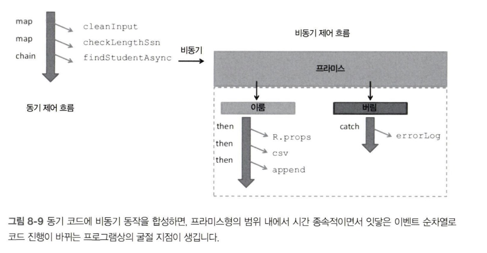

:::info 이 장의 내용

- 비동기 코드 개발의 어려움
- 함수형 기법으로 중첩된 콜백 사용을 막음
- 프라미스를 응용하여 비동기 코드를 능률화
- 함수 제너레이터로 데이터를 느긋하게 만듦
- 리액티브 프로그래밍 입문
- 리액티브 프로그래밍을 적용한 이벤트 중심 코드

:::

:::note 존 휴스, 1989년 논문에서

<div style={{ textAlign: 'center' }}>함수형 프로그래머는 함수형 프로그래밍이 엄청나게 유익하다고 주장합니다<br/>기존 프로그램보다 한 자릿수나 더 쩗은 함수형 프로그램이<br/>생산성은 외려 한 자릿수 더 생산적이라고 하지요.</div>

:::

## 8.1 골칫덩이 비동기 코드

비동기 코드는 다음의 문제가 있습니다.

- 함수 간에 일시적 의존 관계가 형성
- 어쩔 수 없이 콜백 피라미드의 늪에 빠짐
- 동기/비동기 코드의 호환되지 않는 조합

### 8.1.1 함수 간에 일시적 의존 관계가 형성

AJAX 요청으로 서버에서 학생 객체 리스트를 가져오는 함수가 있다고 합시다. getJSON은 비동기 함수여서 요청을 보내자마자 반환되어 본 프로그램으로 복귀하고 이어서 showStudents 함수를 호출합니다. 하지만 아직 원격 요청은 처리되지 않아 학생 객체는 null인 상태죠. 이벤트가 올바른 순서로 발생하도록 보장하려면 비동기 코드와 그다음 액션 사이에 일시적인 관계를 설정하는 수밖에 없습니다. 즉 showStudent를 콜백 함수 안에 넣는 것입니다.

**일시적 결합**(**일시적 응집**)은 어떤 함수를 논리적으로 묶어 실행할 때 발생합니다. 데이터가 도착할 때까지, 또는 다른 함수가 실행될 때까지 어떤 함수가 기다려야 하는 경우입니다. 데이터든 시간이든 어느 쪽에 의지하는 순간부터 부수효과가 발생합니다.

콜백 함수는 자바스크립트에서 많이 쓰이지만, 대량 데이터를 순차적으로 로드할 경우 확장하기가 어렵고 결국엔 악명 높은 콜백 피라미드에 빠지게 됩니다.

### 8.1.2 콜백 피라미드의 늪에 빠짐

콜백의 주용도는 처리 시간이 오래 걸리는 프로세스를 기다리는 도중 UI를 차단하지 않는 것 입니다. 콜백을 받는 함수는 값을 반환하는 대신 **제어의 역전**을 몸소 실천합니다.

이런 식의 제어의 역전 구조는 함수형 프로그램의 설계 사상과 정면으로 배치됩니다. 함수형 프로그램의 함수는 서로 독립적이며 값을 호출자에 즉시 반환해야 합니다. 게다가 이미 말했듯, 이미 중첩된 콜백에 비동기 로직을 더할 경우 상황은 더 악화됩니다.

```js title="[코드 8-3] 서버에서 SSN으로 학생 레코드를 조회"
var selector = document.querySelector;
selector('#search-button').addEventListener('click',
  function (event) {
    event.preventDefault();

    let ssn = selector('#student-ssn').value;
    if (!ssn) {
      console.log('경고: 올바른 SSN이 필요합니다!');
      return;
    }
    else {
      getJSON(`/students/${ssn}`, function (info) {
        selector('#student-info').innerHTML = info;
        selector('#student-info').addEventListener('mouseover',
          function() {
            getJSON(`/students/${info.ssn}/grades`,
              function (grades) {
                // ... 학생의 점수 리스트를 처리 ...
              });
          });
      })
      .fail(function() {
        console.log('에러 발생');
      });
    }
  });
```

소스 코드가 이런 모양새를 띄기 시작하면 개발자는 그나마 가독성을 높이고자 공백과 구문 배치에 열중하게 됩니다. 하지만 돼지 목에 진주 목걸이 격이죠.

### 8.1.3 연속체 전달 스타일

[코드 8-3]은 적절히 분해되지 않은 프로그램입니다. 중첩된 콜백 함수는 읽기도 어렵지만, 자기 스코프 및 자신이 중첩된 함수의 변수 스코프를 감싼 클로저를 만듭니다. [코드 8-3]에서 전체 점수를 처리하는 내부 콜백 함수는 불필요한 외부 데이터를 참조하는 레퍼런스를 간직하고 있습니다. 이런 코드를 **연속체 전달 스타일**(continuation-passing style, CPS)로 바꾸어 개선할 수 있습니다.

```js title="[코드 8-4] 연속체 전달 스타일(CPS)로 학생 조회 프로그램을 리팩터링"
var selector = document.querySelector;

selector('#search-button').addEventListener('click', handleClickEvent);

const processGrades = function (grades) {
  // ... 학생의 점수 리스트를 처리 ...
};

const handleMouseMovement = () => getJSON(`/students/${info.ssn}/grades`, processGrades);

const showStudent = function (info) {
  selector('#student-info').innerHTML = info;
  selector('#student-info').addEventListener(
    'mouseover', handleMouseMovement
  );
}

const handleError = error => console.log('에러 발생: ' + error.message);

const handleClickEvent = function (event) {
  event.preventDefault();

  let ssn = selector('#student-ssn').value;
  if(!ssn) {
    alert('잘못된 SSN입니다!');
    return;
  }
  else {
    getJSON(`/students/${ssn}`, showStudent).fail(handleError);
  }
}
```

여러 내부 콜백 함수를 개별 함수 또는 람다 표현식으로 나눈게 전부입니다. CPS는 비차단 프로그램의 조각들을 개별 컴포넌트로 분리하기 위한 프로그래밍 스타일입니다. 여기서 콜백 함수는 **현재 연속체**라고 부르며, 이 함수 자체를 호출자에게 반환값으로 돌려줍니다. CPS의 중요한 강점은 콘텍스트 스택의 효율이 좋다는 점입니다. [코드 8-4]처럼 완벽히 CPS로 작성된 프로그램은 다른 함수로 이어지는 과정에서 현재 함수의 콘텍스트를 정리하고 새 콘텍스트를 만들어 다음 함수를 지원하는 식으로 프로그램의 흐름을 계속 이어갑니다.

CPS 코딩은 코드에 잔존하는 일시적 의존 관계를 척결하고, 비동기 흐름을 선형적인 함수 평가 형태로 둔갑시키는 능력이 있습니다. 이런 스타일이 익숙하지 않은 사람이 코드를 보면 함수가 제때 실행되지 않는 이유를 몰라 적잖이 혼란스러워합니다. 그래서 시간이 오래 걸리는 연산은 프로그램에서 일급 객체로 만들어야 합니다.

## 8.2 비동기 로직을 프라미스로 일급화

무릇 함수형 프로그램이라면 이런 특성을 지녀야 합니다.

- 합성과 무인수 프로그래밍을 이용합니다.
- 중첩된 구조를 보다 선형적으로 흐르게 눌러 폅니다.
- 일시적 결합은 추상하기 때문에 개발자는 더 이상 신경 쓸 필요가 없습니다.
- 여러 콜백 대신, 단일 함수로 에러 처리 로직을 통합하여 코드 흐름을 원활하게 합니다.

**프라미스**라는 모나드를 소개합니다. 한마디로, 프라미스는 오래 걸리는 계산을 모나드로 감싸는 개념입니다.

이 책에서 배운 다른 모나드와 달리, 프라미스는 오래 걸리는 계산이 끝날 떄까지 '기다렸다가' 미리 매핑한 함수를 실행합니다. 비동기 호출에서 불가피한 지연의 문제를 프라미스라는 자료구조를 내세워 정면 돌파하는 겁니다. 반환값이 불확실한 함수를 Maybe, Either 모나드로 감쌌듯이, 프라미스는 우직하고 투명하게 데이터를 기다리는 개념입니다. 기존 콜백 기반의 접근방법에 비하면 더 간편하고 비동기 작업을 실행, 합성, 관리할 수 있는 대안이지요.

프라미스는 나중에 처리가 끝나는 값이나 함수를 감쌉니다. 프라미스를 이용하면 이런 작업 도중 실패해도 Maybe, Either와 아주 비슷하게 에러 처리 로직을 통합하여 대응할 수 있습니다. 또 프라미스는 처리할 작업의 상태 정보를 제공하므로 "데이터를 성공적으로 조회했는가?" 혹은 "작업 도중 에러는 안났는가?"등의 질문을 던질 수도 있습니다.

프라미스의 상태는 언제나 pending, fulfilled, rejected, settled 중 하나입니다.

프라미스를 사용하면 프로그램을 좀 더 효율적으로 파악할 수 있고 복잡하고 단단히 뭉친 콜백 매듭을 풀 수 있습니다. 모나드의 map 함수자처럼 일련의 중첩된 콜백 함수를 일련의 작업들로 전환할 수 있습니다.

프라미스 생성자는 비동기 작업을 삼싼 함수를 하나 받습니다. 이 함수는 resolve와 reject 콜백 2개를 받고, 각각 프라미스가 fulfilled/rejected 상태일 때 호출됩니다. Either 디자인 패턴과 강하게 통하는 대목입니다.

### 8.2.1 미래의 메서드 체인

프라미스 객체는 then 메서드를 지닙니다. 프라미스에 보관된 반환값에 어떤 연산을 수행하고 다시 프라미스 형태로 되돌리는 메서드죠. Promise.then 는 데이터 변환 작업을 서로 체이닝하고 여러 함수를 제때 그러모아 함수 사이의 일시적인 결합을 추상하는 용도로 쓰입니다. 덕분에 중첩 수준을 늘리지 않은 상태에서 의존하는 비동기 로직을 여러 단계로 체이닝할 수 있습니다.

```js title="[코드 8-5] getJSON을 프라미스화"
var getJSON = function (url) {
  return new Promise(function(resolve, reject) {
    let req = new XMLHttpRequest();
    req.responseType = 'json';
    req.open('GET', url);
    req.onload = function() {
      if(req.status == 200) {
        let data = JSON.parse(req.responseText);
        resolve(data);
      }
      else {
        reject(new Error(req.statusText));
      }
    };
    req.onerror = function() {
      if(reject) {
        reject(new Error('IO 에러'));
      }
    };
    req.send();
  });
};
```

API를 프라미스화하면 기존 콜백보다 훨씬 코드를 다루기 쉬워 여러보로 좋습니다. 데이터 조회뿐 아니라 오래 걸리는 어떤 종류의 작업도 프라미스로 감쌀 수 있기 때문에 then 메서드를 구현한 객체와 병용할 수 있습니다.

[코드 8-6]은 다음과 같이 함수형으로 바꾼 결과입니다.

- 비동기 호출을 중첩하는 대신 then으로 체이닝하고, 비동기 코드를 프라미스 모나드로 추상합니다.
- 변수를 선언하고 변이를 일으키는 코드는 모두 없애고 람다 함수를 우선합니다.
- 람다 JS의 커리된 함수를 적극 활용하여 정렬, 필터링, 매핑 등의 자료 변환 단계를 간소화합니다.
- 에러 처리 로직을 제일 마지막의 catchall 함수에 몰아 넣습니다.
- 데이터를 IO 모나드에 승급하여 부수효과 없이 DOM에 표시합니다.

```js title="[코드 8-6] 학생/점수 데이터를 비동기 호출로 조회"
getJSON('/students')
  .then(hide('spinner'))
  .then(R.filter(s => s.address.country == 'US'))
  .then(R.sortBy(R.prop('ssn')))
  .then(R.map(student => {
    return getJSON('/grades?ssn=' + student.ssn)
      .then(R.compose(Math.ceil,
        fork(R.divide, R.sum, R.length)))
          .then(grade => 
            IO.of(R.merge(student,
            { 'grade': grade }))
            .map(R.props(['ssn', 'firstname', 'lastname', 'grade']))
            .map(csv)
            .map(append('#student-info')).run())
  }))
  .catch(function(error) {
    console.log('에러 발생: ' + error.message);
  })
```

프라미스는 비동기 흐름을 숨기지만 시간 관념은 then으로 분명히 드러내기 때문에 getJSON(url)을 지역 저장소 호출 용도로 프라미스화한 getJSON(db)로 쉽게 바꿀 수 있고 그래도 코드는 정확히 똑같이 작동합니다. 이런 수준의 유연성을 **위치 투명성**이라고 합니다. 그리고 잘 보면 코드가 무인수 스타일입니다.


[코드 8-6]은 학생 정보를 가져와 한 번에 한 명씩 DOM에 추가하는데, 점수를 조회하는 작업을 직렬화한 까닭에 귀중한 시간을 낭비하고 있습니다. 이럴 때 쓰는 함수가 Promise.all() 입니다.

```js title="[코드 8-7] Promise.all()로 여러 항목을 한 번에 조회"
const average = R.compose(Math.ceil, fork(R.divide, R.sum, R.length));

getJSON('/students')
  .then(hide('spinner'))
  .then(R.map(student => '/grades?ssn=' + student.ssn))
  .then(gradeUrls => Promise.all(R.map(getJSON, gradesUrls)))
  .then(R.map(average))
  .then(average)
  .then(grade => IO.of(grade).map(console.log).run())
  .catch(error => console.log('에러 발생: ' + error.message));
```

인수에 포함된 모든 프라미스가 귀결되는 즉시 결과 프마리스도 귀결됩니다.

모나드는 체인 구성 용도로만 쓰기엔 적합하지 않습니다. 앞 장에서 배웠듯이 모나드는 합성 용도로도 효과적입니다.

### 8.2.2 동기/비동기 로직을 합성

지금까지 find 함수는 항상 동기적으로 작동했습니다. 다행히 프라미스는 코드를 거의 고치지 않아도 미래의 함수 합성과 동등하게 함수를 프라미스와 합성할 수 있도록 비동기 코드의 실행을 추상합니다. 우선 코드를 구현하기 앞서 필요한 도우미 함수 몇 가지를 작성합니다.

```js
// fetchStudentDBAsync :: DB -> String -> Promise(Student)
const fetchStudentDBAsync = R.curry(function (db, ssn) {
  return find(db, ssn);
});

// findStudentAsync :: String -> Promise
const findStudentAsync = fetchStudentDBAsync(db);

// then :: f -> Thenable -> Thenable
const then = R.curry(function (f, thenable) {
  return thenable.then(f);
});

// catchP :: f -> Promise -> Promise
const catchP = R.curry(function (f, promise) {
  return promise.catch(f);
});

// errorLog :: Error -> void
const errorLog = _.partial(logger, 'console', 'basic', 'ShowStudentAsync', 'Error');
```

[코드 8-9]는 이들 함수를 R.compose로 묶은 것입니다.

```js title="showStudent의 비동기 버전"
const showStudentAsync = R.compose(
  catchP(errorLog),
  then(append('#student-info')),
  then(csv),
  then(R.props(['ssn', 'firstname', 'lastname'])),
  chain(findStudentAsync),
  map(checkLengthSsn),
  lift(cleanInput)
);
```

[그림 8-9]에서 보다시피 findStudentAsync를 실행하면 전체 프로그램은 나머지 함수들을 계속 실행하기 위해서 비동기 함수가 데이터를 호출자에게 되돌려줄 때까지 기다립니다. 따라서 동시에 실행되진 않지만 나중에 함수 조합기로서의 본색을 드러낼 함수를 서로 붙여놓은 무인수 프로그램들을 합성하여 조정할 수 있습니다.



## 8.3 느긋한 데이터 생성

ES6의 가장 강력한 특성 중 하나는, 어떤 함수를 끝까지 실행하지 않아도 데이터 제공을 잠시 중단한 상태로 다른 함수들과 더불어 작동시키는 능력입니다. 그래서 육중한 자료구조를 당장 꼭 처리할 필요 없이 느긋하게 데이터를 생성하는 매개체로 함수를 활용할 수 있는 다양한 기회가 생깁니다.

제너레이터 함수는 `function*`라고 료기하는, 언어 수준에서 지원되는 장치입니다. 이 신종 함수는 역시 새로운 키워드인 yield를 만나면 함수밖으로 잠시 나갔다가 자신의 보관된 콘텍스트를 찾아 다시 돌아오는 독특한 움직임을 보입니다. 일반적인 함수 호출과 달리, 제너레이터 함수의 실행 콘텍스트는 잠정 중단했다가 언제라도 재개할 수 있어서 제너레이터로 다시 돌아올 수 있습니다.

제너레이터는 함수를 호출하는 시점에 내부적으로 이터레이터 객체를 생성하여 느긋함을 부오하고, 이터레이터는 매번 yield를 호출할 때마다 호출자에게 데이터를 돌려줍니다.

다음은 아주 긴 숫자 리스트 중 처음 세 원소만 취하는 코드입니다.

```js
function *range(start = 0, finish = Number.POSITIVE_INFINITY) {
  for(let i = start; i < finish; i++) {
    yield i; // 호출자로 돌아간 후에도 지역 변수의 바인딩 상태를 모두 기억합니다.
  }
}

const num = range(1);
num.next().value; // -> 1
num.next().value; // -> 2
num.next().value; // -> 3

// 또는

for (let n of range(1)) {
  console.log(n);
  if(n === threshold) {
    break;
  }
}// -> 1,2,3, ...
```

### 8.3.1 제너레이터와 재귀

일반 함수 호출과 마찬가지로 제너레이터도 다른 제너레이터를 얼마든지 호출할 수 있습니다.


이 트리의 가지에 담긴 데이터는 제너레이터를 이용하여 손쉽게 모형화할 수 있습니다.

```js
function* AllStudentsGenerator() {
  yield 'Church';

  yield 'Rosser';
  yield* RosserStudentGenerator();

  yield 'Turing';
  yield* TuringStudentGenerator();

  yield 'Kleene';
  yield* KleeneStudentGenerator();
}

function* RosserStudentGenerator() {
  yield 'Mendelson';
  yield 'Sacks';
}

function* TuringStudentGenerator() {
  yield 'Gandy';
  yield 'Sacks';
}

function* KleeneStudentGenerator() {
  yield 'Nelson';
  yield 'Constable';
}

for(let student of AllStudentGenerator()) {
  console.log(student);
}

/* 실행 결과:
Church
Rosser
Mendelson
Sacks
Turing
Gandy
Sacks
Kleene
Nelson
Constable
*/
```

같은 트리(각 노드에는 Person 객체가 있습니다)를 이번에는 재귀로 탐색해볼까요?

```js
function* TreeTraversal(node) {
  yield node.value;
  if(node.hasChildren()) {
    for(let child of node.children) {
      yield* TreeTraversal(child);
    }
  }
}

var root = node(new Person('Alonzo', 'Church', '111-11-1231'));

for(let person of TreeTraversal(root)) {
  console.log(person.lastname);
}
```

코드 실행 결과는 같습니다. for...of 루프 입장에서 보면 데이터가 소진될 때까지 안에서 이터레이터를 열심히 호출했을 뿐, 재귀가 일어났다는 사실조차 모릅니다.

### 8.3.2 이터레이터 프로토콜

제너레이터는 **이터레이터**와 밀접한 관계가 있습니다. 여느 자료구조처럼 루프로 반복시킬 수 있는 것도 이터레이터 덕분이죠. 제너레이터 함수는 내부적으로 이터레이터 프로토콜에 따라 yield 키워드로 값을 반환하는 next() 메서드가 구현된 Generator 객체를 반환합니다. 이 객체의 속성은 다음과 같습니다.

- done: 제일 마지막에 이터레이터가 전달되면 true, 그 외에는 false로 세팅됩니다. 즉, false는 이터레이터가 아직 도중에 다른 값을 생산할 수 있음을 의미합니다.
- value: 이터레이터가 반환한 값입니다.

다음은 range 제너레이터를 원시 형태로 구현한 코드입니다.

```js
function range(start, end) {
  return {
    [Symbol.iterator]() { // 반환된 객체가 (이터레이터 프로토콜을 구현한) 이터러블임을 나타냅니다.
      return.this;
    },
    next() {
      if (start < end) {
        return { value: start++, done: false };
      }
    };
  }
}
```

이렇게 제너레이터를 구현하면 특정한 패턴이나 명세를 따르는 어떤 종류의 데이터라도 만들어낼 수 있습니다.

## 8.4 RxJS를 응용한 함수형 리액티브 프로그래밍

이 절은 비동기 프로그램과 이벤트 기반 프로그램을 우아하게 엮은 RxJS라는 리액티브 라이브러리를 소개합니다. RxJS는 이 장 전반부에 설명했던 함수형 프라미스 기반의 예제와 비슷한 방식으로 작동하지만 더 높은 수준의 추상화를 제공하며 더 강력한 연산을 제공합니다. 우선 옵저버블 개념을 이해해야 합니다.

### 8.4.1 옵저버블 순차열로서의 데이터

**옵저버블**은 **구독** 가능한 모든 객체를 가리킵니다. 애플리케이션은 파일 읽기, 웹 서비스 호출, DB 쿼리, 시스템 통지 푸시, 사용자 입력 처리, 원소 컬렉션 탐색, 단순 문자열 파싱 등으로 비롯된 비동기 이벤트를 구독할 수 있습니다. **리액티브 프로그래밍**은 모든 데이터 제공원을 Rx.Observable 객체를 통해 **옵저버블 스트림**이라는 단일 개념으로 일원화합니다. 스트림이란 **시간의 흐름에 따라 밸상하는 이벤트의 순차열**입니다. 값을 추출하려면 구독은 필수입니다.

```js
Rx.Observable.range(1,3)
  .subscribe( // subscribe 메서드는 3개의 콜백 함수(순차열의 각 원소를 처리하는 함수, 예외가 나서 중단시키는 함수, 얌전히 끝내는 함수)를 받습니다.
    x => console.log(`다음: ${x}`),
    err => console.log(`에러: ${err}`),
    () => console.log('완료!')
  )
```

코드를 실행하면 1,2,3 세 숫자 범위로부터 옵저버블 순차열을 생성합니다. 맨 끝에서 스트림이 완료되었음을 알 수 있습니다.

```
다음: 1
다음: 2
다음: 3
완료!
```

Rx.Observable로 어떤 옵저버블 객체라도 감싸거나 승급하면 관찰된 값에 상이한 함수를 매핑/적용해서 원하는 출력을 얻도록 변환할 수 있습니다. 결국, 모나드입니다.

### 8.4.2 함수형 리액티브 프로그래밍

Rx.Observable 객체는 함수형과 리액티브, 두 프로그래밍 세상을 하나로 묶습니다. 이 객체는 5장의 map, of, join 등 최소한의 모나드 인터페이스에 해당하는 구현체와 스트림 조작에 특화된 메서드를 여럿 거느립니다. 

```js
Rx.Observable.of(1,2,3,4,5)
  .filter(x => x % 2 !== 0) // 짝수를 걸러냅니다.
  .map(x => x * x)
  .subscribe(x => console.log(`다음: ${4}`));
```

다음은 SSN 필드 입력값이 올바른지 검증하는 간단한 예제입니다.

```js
document.querySelector('#student-ssn')
  .addEventListener('change', function (event) {
    let value = event.target.value;
    value = value.replace(/^\s|\-|\s*$/g, '');
    console.log(value.length !== 9 ? '맞음' : '틀림')
  });
  // -> 444 맞음
  // -> 444-44-4444 틀림
```

change 이벤트가 비동기로 발생하기 때문에 어쩔 수 없이 콜백 함수 하나에 비즈니스 로직을 몰아넣었습니다. 페이지에 있는 버튼, 필드, 링크를 하나하나 이벤트 처리 코드로 쌓아 올리면 코드를 확장하기 곤란해집니다. 재사용성을 늘리려면 콜백에서 주요 로직을 끌어내 리팩터링할 수밖에 없습니다. 

기존 이벤트 기반 함수와 함수형 프로그래밍을 억지로 끼워 맞추어 잘 굴러가길 기대할 순 없습니다. 패러다임 자체가 다르니까요. 프라미스로 함수형과 비동기 함수의 부조화를 해결했던 것처럼 이벤트와 함수형 두 세계를 접목하기 위해 Rx.Observable로 추상화 계층을 둡니다. 사용자가 학생 SSN 입력 필드를 수정할 때 발동하는 change 이벤트를 리스팅하는 예제 코드를 스트림으로 모형화하는 것입니다.


이 점을 이용하면 명령형 이벤트 기반 코드를 FRP로 리팩터링할 수 있습니다. 이벤트를 구독하고 비즈니스 로직은 모두 순수함수로 구현하는 겁니다.

```js
Rx.Observable.fromEvent(
  document.querySelector('#student-ssn'), 'change'
  .map(x => x.target.value)
  .map(cleanInput)
  .map(checkLengthSsn)
  .subscribe(
    ssn => ssn.isRight ? console.log('valid') : console.log('Invalid')
  )
)
```

subscribe에 전달된 값을 Either로 감싸서 올바른 입력값이면 Right(SSN) 또는 LEFT(null)를 담습니다. 

### 8.4.3 RxJS와 프라미스

RxJS는 모든 프라미스 호환 객체를 옵저버블 순차열로 변환할 수 있습니다. 즉, 실행 시간이 긴 getJSON 함수를 감싸 귀결 시점에 그 값을 스트림으로 바꾸는 것이지요.

```js
Rx.Observable.fromPromise(getJSON('/students'))
  .map(R.sortBy(R.compose(R.toLower, R.prop('firstname')))) // 모든 학생 객체를 대소문자 구분없이 이름 순으로 정렬
  .flatMapLatest(student => Rx.Observable.from(student)) // 하나의 학생 각체 배열을 옵저버블한 학생 순차열로 바꿉니다.
  .filter(R.pathq(['address', 'contry'], 'US')) // 미국에 살지 않는 학생은 걸러냅니다.
  .subscribe(
    student => console.log(student.fullname),
    err => console.log(err)
  );

  // -> Alonzo Church
  // Haskell Curry
```

에러 처리 로직을 subscribe에 집중시킨 점을 눈여겨보세요. 만약 웹 서비스 접속이 끊기거나 하여 프라미스가 이뤄지지 않으면 에러를 죽 준파해서 에러 콜백 출력을 호출할 것입니다. (이런 일은 모나드가 제격이죠)

별문제가 없다면, 학생 각체 리스트를 (이름순으로) 정렬 후 flatMapLatest로 보내고 이 함수는 다시 response 객체를 학생의 옵저버블 배열로 바꿀 것입니다. 최종적으로, 미국에 살지 않는 학생을 스트림에서 걸러내고 결과를 출력합니다.

## 8.5 마치며

- 프라미스는 오랫동안 자바스크립트 프로그래머들의 골머리르 앓아온, 콜백 중심적인 설계를 함수형으로 해결하는 방안입니다.
- '미래의' 함수를 프라미스로 합성, 체이닝하면 일시적으로 의존 관계가 형성된 코드의 잡다한 저수준 로직을 추상할 수 있습니다.
- 제너레이터는 비동기 코드에 접근하는 또 다른 방안으로, 느긋한 이터레이터로 데이터를 쓸 수 있는 시점에 내어주는 프로그래밍 장치입니다.
- 함수형 리액티브 프로그래밍은 프로그램의 추상화 수준을 높여 이벤트를 논리적으로 독립된 단위로 다룰 수 있게 합니다. 덕분에 개발자는 복잡한 구현 상세에 시달리지 않고 본연의 업무에 전념할 수 있습니다.
