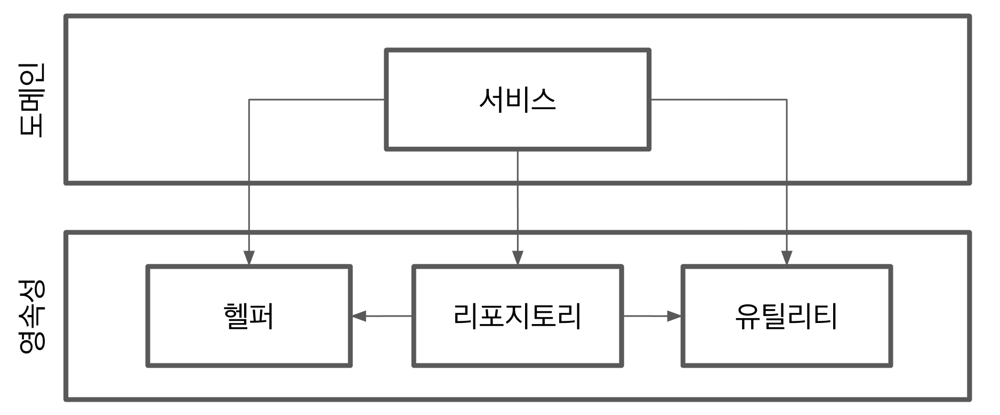
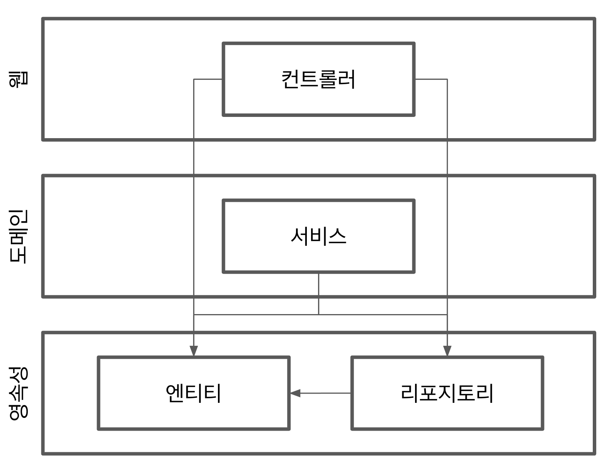

계층(layer)으로 구성된 애플리케이션을 개발해본 적이 있을 것이다.

:::tip
웹 계층 도메인 계층, 영속성 계층으로 구성된 전통적인 웹 애플리케이션 구조
:::

상위 수준 관점에서 일반적인 3계층 아키텍처를 표현한 그림이다. 맨 위의 **웹**계층에서는 요청을 받아 **도메인** 혹은 비즈니스 계층에 있는 서비스로 요청을 보낸다. 서비스에서는 필요한 비즈니스 로직을 수행하고, 도메인 엔티티의 현재 상태를 조회하거나 변경하기 위해 **영속성** 계층의 컴포넌트를 호출한다.

사실 계층형 아키텍터는 견고한 아키텍처 패턴이다. 계층을 잘 이해하고 구성한다면 다른 계층에 독립적인 도메인 로직을 작성할 수 있다. 원한다면 도메인 로직에 영향을 주지 않고 웹 계층과 영속성 계청에 사용된 기술을 변경할 수 있다. 기존 기능에 영향을 주지 않고 새로운 기능을 추가할 수도 있다.

잘 만들어진 계층형 아키텔처는 선택의 폭을 넓히고, 변화하는 요구사항과 외부 요인에 빠르게 적응할 수 있게 해준다.

그렇다면 계층형 아키텍처의 문제는 무엇일까?

계층형 아키텍처는 코드에 나쁜 습관들이 스며들기 쉽게 만들고 시간이 지날수록 소프트웨어를 점점 더 변경하기 어렵게 만드는 수많은 허점들을 노출한다.

## 계층형 아키텍처는 데이터베이스 주도 설계를 유도한다.

전통적인 계층형 아키텍처의 토대는 데이터베이스다.

웹 계층은 도메인에 의존하고, 도메인 계층은 영속성 계층에 의존하기 때문에 자연스레 데이터베이스에 의존하게 된다.

우리는 보통 비즈니스를 관장하는 규칙이나 정책을 반영한 모델을 만들어서 사용자가 이러한 규칙과 정책을 더욱 편리하게 활용할 수 있게 한다.

이떄 우리는 상태(state)가 아니라 행동(behavior)을 중심으로 모델링한다. 어떤 애플리케이션이든 상태가 중요한 요소이긴 하지만 행동이 상태를 바꾸는 주체이기 때문에 행동이 비즈니스를 이끌어간다.

전통적인 계층형 아키텍처에서는 데이터베이스의 구조를 먼저 생각하고, 이를 토대로 도메인 로직을 구현했을 것이다. 이는 의존성의 방향에 따라 자연스럽게 구현한 것이다. 하지만 비즈니스 관점에서는 전혀 맞지 않는 방법이다. 다른 무엇보다도 도메인 로직을 먼저 만들어야 한다. 그래야만 우리가 로직을 제대로 이해했는지 확인할 수 있다. 그리고 도메인 로직이 맞다는 것을 확인한 후에 이를 기반으로 영속성 계층과 웹 계층을 만들어야 한다.

데이터베이스 중심적인 아키텍처가 만들어지는 가장 큰 원인은 ORM(object-relational-mapping) 프레임워크를 사용하기 때문이다. ORM 프레임워크를 계층형 아키텍처와 결합하면 비즈니스 규칙을 영속성 관점과 섞고 싶은 유혹을 쉽게 받는다.

:::caution
도메인 계층에서 데이터베이스 엔티티를 사용하는 것은 영속성 계층과의 강한 결합을 유발한다.
:::

ORM에 의해 관리되는 엔티티들은 일반적으로 영속성 계층에 둔다. 계층은 아래 방향으로만 접근 가능하기 때문에 도메인 계층에서는 이러한 엔티티에 접근할 수 있다. 그리고 이러한 엔티티에 접근할 수 있다면 분명 사용되기 마련이다.

하지만 이렇게 되면 영속성 계층과 도메인 계층 사이에 강한 결합이 생긴다. 그러면 영속성 코드가 도메인 코드에 녹아들게 된다.

## 지금길을 택하기 쉬워진다.

전통적인 계층형 아키텍처에서 전체적으로 적용되는 유일한 규칙은, 특정한 계층에서는 같은 계층에 있는 컴포넌트나 아래에 있는 계층에만 접근 가능하다는 것이다.

따라서 만약 상위 계층에 위치한 컴포넌트에 접근해야 한다면 간단하게 컴포넌트를 계층 아래로 내려버리면 된다.

:::caution
영속성 계층에서는 모든 것에 접근 가능하기 때문에 시간이 지나면서 점점 비대해진다.
:::

영속성 계층은 컴포넌트를 아래 계층으로 내릴수록 비대해진다. 어떤 계층에도 속하지 않는 것처럼 보이는 헬퍼 컴포넌트나 유틸리티 컴포넌트들이 이처럼 아래 계층으로 내릴 가능성이 큰 후보다.

## 테스트하기 어려워진다.

계층형 아키텍처를 사용할 때 일반적으로 나타나는 변화의 형태는 계층을 건너뛰는 것이다. **엔티티**의 필드를 단 하나만 조작하면 되는 경우에 웹 계층에서 바로 영속성 계층에 접근하면 도메인 계층을 건드릴 필요가 없지 않을까?

:::caution
도메인 계층을 건너뛰는 것은 도메인 로직을 코드 여기저기에 흩어지게 만든다.
:::

두 가지 문제점이 생긴다.

첫 번째 문제는 단 하나의 필드를 조작하는 것에 불과하더라도 도메인 로직을 웹 계층에 구현하게 된다는 것이다. 만약 유스케이스가 확장된다면? 더 많은 도메인 로직을 웹 계층에 추가해서 애플리케이션 전반에 걸쳐 책임이 섞이고 핵심 도메인 로직들이 퍼져나갈 확률이 높다.

두 번째 문제는 웹 계층 테스트에서 도메인 계층뿐만 아니라 영속성 계층도 모킹해야 한다는 것이다. 이렇게 되면 단위 테스트의 복잡도가 올라간다. 그리고 테스트 설정이 복잡해지면 테스트를 작성하지 않는 방향으로 가는 첫걸음이다.

## 유스케이스를 숨긴다.

앞서 논의했듯이 계층형 아키텍처에서는 도메인 로직이 여러 계층에 걸쳐 흩어지기 쉽다. 유스케이스가 '간단'해서 도메인 계층을 생략한다면 웹 계층에 존재할 수도 있고, 도메인 계층과 영속성 계층 모두에서 접근할 수 있도록 특정 컴포넌트를 아래로 내렸다면 영속성 계층에 존재할 수도 있다. 이럴 경우 특정 코드의 위치를 찾는게 어려워진다.

심지어 문제가 더 심각할 수도 있다. 계층형 아키텍처는 도메인 서비스의 '너비'에 관한 규칙을 강제하지 않는다. 그렇기에 여러 개의 유스케이스를 담당하는 아주 넓은 서비스가 만들어지기도 한다.

:::caution
넓은 서비스는 코드 상에서 특정 유스케이스를 찾는 것을 어렵게 만든다.
:::

넓은 서비스는 영속성 계층에 많은 의존성을 갖게 되고, 다시 웹 레이어의 많은 컴포넌트가 이 서비스에 의존하게 된다. 그럼 서비스를 테스트하기도 어려워지고 작업해야 할 유스케이스를 책임지는 서비스를 찾기도 어려워진다.

고도로 특화된 좁근 도메인 서비스가 유스케이스 하나씩만 담당하게 한다면 좋을 것 같다.

## 동시 작업이 어려워진다.

계층형 아키텍처는 동시 작업이 어렵다. 개발자 3명이 새로운 유스케이스를 추가한다고 상상해보자. 한 명은 웹 계층에 필요한 기능을 추가할 수 있고, 다른 한 명은 도메인 계층에, 그리고 나머지 개발자는 영속성 계층에 기능을 추가할 수 있다.

계층형 아키텍처에서는 이렇게 작업할 수 없다. 모든 것이 영속성 계층 위에 만들어지기 때문에 영속성 계층을 먼저 개발해야 하고, 그다음에 도메인 계층을, 그리고 마지막으로 웹 계층을 만들어야 한다. 그렇기 때문에 특정 기능은 동시에 한 명의 개발자만 작업할 수 있다.

개발자들이 인터페이스를 먼저 같이 정의하고, 실제 구현을 기다릴 필요없이 인터페이스로 작업하면 될꺼라 생각하겠지만 데이터베이스 주도 설계를 하지 않는 경우에만 가능하다. 데이터베이스 주도 설계는 영속성 로직이 도메인 로직과 너무 뒤섞여서 각 측면을 개별적으로 작업할 수 없다.

코드에 넓은 서비스가 있다면 서로 다른 기능을 동시에 작업하기가 더욱 어렵다. 서로 다른 유스케이스에 대한 작업을 하게 되면 같은 서비스를 동시에 편집하는 상황이 발생한다.
