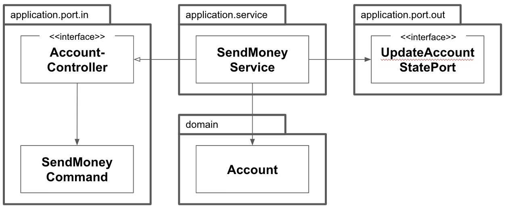

앞에서 논의한 아키텍처를 어떻게 실제 코드로 구현할지 살펴보자.

애플리케이션, 웹, 영속성 계층이 현재 아키텍처에서 아주 느슨하게 결합돼 있기 때문에 필요한 대로 도메인 코드를 자유롭게 모델링할 수 있다. DDD를 할 수도 있고, 풍부하거나 빈약한 도메인 모델을 구현할 수도 있고, 우리만의 방식을 만들어 낼수도 있다.

앞에서 소개한 육각형 아키텍처 스타일에서 유스케이스를 구현하기 위해 이 책에서 제시하는 방법을 알아보자.

육각형 아키텍처는 도메인 중심의 아키텍처에 적합하기 때문에 도메인 엔티티를 만드는 것으로 시작한 후 해당 도메인 엔티티를 중심으로 유스케이스를 구현하겠다.

## 도메인 모델 구현하기

한 계좌에서 다른 계좌로 송금하는 유스케이스를 구현해보자. 이를 객체지향적인 방식으로 모델링하는 한 가지 방법은 입금과 출금을 할 수 있는 Account 엔티티를 만들고 출금 계좌에서 돈을 출금해서 입금 계좌로 돈을 입금하는 것이다.

```java
package buckpal.domain;

public class Account {
  private AccountId id;
  private Money baselineBalance;
  private ActivityWindow activityWindow;

  public Money calculateBalance() {
    return Money.add(
      this.baselineBalance,
      this.activityWindow.calculateBalance(this.id)
    );
  }

  public boolean withdraw(Money money, AccountId targetAccountId) {
    if (!mayWithdraw(money)) {
      return false;
    }

    Activity withdrawal = new Activity(
      this.id,
      this.id,
      targetAccountId,
      LocalDateTime.now(),
      money
    );

    this.activityWindow.addActivity(withdrawal);
    return true;
  }

  private boolean mayWithdraw(Money money) {
    return Money.add(
      this.calculateBalance(),
      money.negate()
    ).isPositive();
  }

  public boolean deposit(Money money, AccountId sourceAccountId) {
    Activity deposit = new Activity(
      this.id,
      sourceAccountId,
      this.id,
      LocalDateTime.now(),
      money
    );
    this.activityWindow.addActivity(deposit);
    return true;
  }
}
```

Account 엔티티는 실제 계좌의 현재 스냅숏을 제공한다. 계좌에 대한 모든 입금과 출금은 Activity 엔티티에 포착된다. 한 계좌의 모든 활동을 항상 메모리에 올리는 것은 현명한 방법이 아니기에 Account 엔티티는 ActivityWindow 값 객체에서 포착한 지난 며칠간의 활동만 보유한다.

계좌의 현재 잔고를 계산하기 위해서 Account 엔티티는 activityWindow 의 첫 번째 활동 바로 전의 잔고를 표현하는 baselineBalance 속성을 가지고 있다. 현재 총 잔고는 baselineBalance에 activityWindow의 모든 활동들의 잔고를 합한 값이 된다.

이 모델 덕분에 계좌에서 일어나는 입금과 출금은 각각 withdraw() 와 deposit() 메서드에서처럼 새로운 활동을 활동창에 추가하는 것에 불과하다. 출금하기 전에는 잔고를 초과하는 금액은 출금할 수 없도록 하는 비즈니스 규칙을 검사한다.

이제 입금과 출금을 할 수 있는 Account 엔티티가 있으므로 이를 중심으로 유스케이스를 구현하기 위해 바깥 방향으로 나아갈 수 있다.

## 유스케이스 둘러보기

유스케이스가 실제로 무슨 일을 하는지 살펴보자. 일반적으로 유스케이스는 다음과 같은 단계를 따른다.

1. 입력을 받는다.
2. 비즈니스 규칙을 검증한다.
3. 모델 상태를 조작한다.
4. 출력을 반환한다.

유스케이스는 인커밍 어댑터로부터 입력을 받는다. 유스케이스 코드가 도메인 로직에만 신경써야 하고 입력 유효성 검증으로 오염되면 안 된다고 생각하여 입력 유효성 검증은 다른 곳에서 처리한다.

그러나 유스케이스는 **비즈니스 규칙**을 검증할 책임이 있다. 그리고 도메인 엔티티와 이 책임을 공유한다.

비즈니스 규칙을 충족하면 유스케이스는 입력을 기반으로 어떤 방법으로든 모델의 상태를 변경한다. 일반적으로 도메인 객체의 상태를 바꾸고 영속성 어댑터를 통해 구현된 포트로 이 상태를 전달해서 저장될 수 있게 한다. 유스케이스는 또 다른 아웃고잉 어댑터를 호출할 수도 있다.

마지막 단계는 아웃고잉 어댑터에서 온 출력값을, 유스케이스를 호출한 어댑터로 반환할 출력 객체로 변환하는 것이다.

1장에서 이야기한 넓은 서비스 문제를 피하기 위해서 모든 유스케이스를 한 서비스 클래스에 모두 넣지 않고 각 유스케이스별로 분리된 각각의 서비스로 만들겠다.

```java
package buckpal.application.service;

@RequiredArgsConstructor
@Transactional
public class SendMoneyService implements SendMoneyUseCase {
  private final LoadAccountPort loadAccountPort;
  private final AccountLock accountLock;
  private final UpdateAccountStatePort updateAccountStatePort;

  @Override
  public boolean sendMoney(SendMoneyCommand command) {
    // TODO: 비즈니스 규칙 검증
    // TODO: 모델 상태 조작
    // TODO: 출력 값 반환
  }
}
```

서비스는 인커밍 포트 인터페이스인 SendMoneyUseCase를 구현하고, 계좌를 불러오기 위해 아웃고잉 포트 인터페이스인 LoadAccountPort를 호출한다. 그리고 데이터베이스의 계좌 상태를 업데이트하기 위해 UpdateAccountStatePort를 호출한다.



:::note

하나의 서비스가 하나의 유스케이스를 구현하고, 도메인 모델을 변경하고, 변경된 상태를 저장하기 위해 아웃고잉 포트를 호출한다.

:::

## 입력 유효성 검증

호출하는 어댑터가 유스케이스에 입력을 전달하기 전에 입력 유효성을 검증하면 어떨까? 과연 유스케이스에서 필요로 하는 것을 호출자가 모두 검증했다고 믿을 수 있을까? 또 유스케이스는 하나 이상의 어댑터에서 호출될 텐데, 그러면 유효성 검증을 각 어댑터에서 전부 구현해야 한다. 그럼 그 과정에서 실수할 수도 있고 유효성 검증을 해야 한다는 사실을 잊어버리게 될 수도 있다.

애플리케이션 계층에서 입력 유효성을 검증해야 하는 이유는, 그렇게 하지 않을 경우 애플리케이션 코어의 바깥쪽으로부터 유효하지 않은 입력값을 받게 되고, 모델의 상태를 상태를 해칠 수 있기 때문이다.

유스케이스 클래스가 아닌 **입력 모델**이 이 문제를 다루도록 해보자. SendMoneyCommand 클래스의 생성자 내에서 입력 유효성을 검증할 것이다.

```java
package buckpal.applicaton.port.in;

@Getter
public class SendMoneyCommand {
  private final AccountId sourceAccountId;
  private final AccountId targetAccountId;
  private final Money;

  public SendMoneyCommand(
    AccountId sourceAccountId,
    AccountId targetAccountId,
    Money money
  ) {
    this.sourceAccountId = sourceAccountId;
    this.targetAccountId = targetAccountId;
    this.money = money;
    requireNonNull(sourceAccountId);
    requireNonNull(targetAccountId);
    requireNonNull(money);
    requireGreaterThan(money, 0);
  }
}
```

생성자에서 조건을 걸고 하나라도 위배되면 객체를 생성할 때 예외를 던져 객체 생성을 막으면 된다.

SendMoneyCommand의 필드에 final을 지정해 불변 필드로 만들었다. 따라서 일단 생성에 성공하고 나면 상태는 유효하고 이후에 잘못된 상태로 변경할 수 없다는 사실을 보장할 수 있다.

SendMoneyCommand는 유스케이스 API의 일부이기에 인커밍 포트 패키지에 위치한다. 그러므로 유효성 검증이 애플리케이션 코어에 남아있지만 신성한 유스케이스 코드를 오염시키지 않는다.

자바에는 Bean Validation API가 위의 유효성 검증을 대신 해준다.

```java
package buckpal.application.port.in;

@Getter
public class SendMoneyCommand extends SelfValidating<SendMoneyCommand> {
  @NotNull
  private final AccountId sourceAccountId;
  @NotNull
  private final AccountId targetAccountId;
  @NotNull
  private final Money;

  public SendMoneyCommand(
    AccountId sourceAccountId,
    AccountId targetAccountId,
    Money money
  ) {
    this.sourceAccountId = sourceAccountId;
    this.targetAccountId = targetAccountId;
    this.money = money;
    requireGreaterThan(money, 0);
    this.validateSelf();
  }
}
```

SelfValidating 추상 클래스는 validateSelf() 메서드를 제공하며, 생성자 코드의 마지막 문장에서 이 메서드를 호출하고 있다. 이 메서드가 필드에 지정된 Bean Validation 애너테이션(@NonNull 같은)을 검증하고, 유효성 검증 규칙을 위반할 경우 예외를 던진다.

입력 모델에 있는 유효성 검증 코드를 통해 유스케이스 구현체 주위에 오류 방지 계층(anti corruption layer)을 만들었다. 여기서 말하는 계층은 하위 계층을 호출하는 계층형 아키텍처에서의 계층이 아니라 잘못된 입력을 호출자에게 돌려주는 유스케이스 보호막을 의미한다.

## 생성자의 힘

앞에서 살펴본 입력 모델인 SendMoneyCommand는 생성자에 많은 책임을 지우고 있다. 클래스가 불변이기 때문에 생성자의 인자 리스트에는 클래스의 각 속성에 해당하는 파라미터들이 포함돼 있다. 그뿐만 아니라 생성자가 파라미터의 유효성 검증까지 하고 있기 때문에 유효하지 않은 상태의 객체를 만드는 것은 불가능하다.

만약 생성자 파라미터가 더 많다면 어떻게 해야 할까? 빌더 패턴을 사용하면 되지 않을까?  
빌더 패턴을 사용하면 다음과 같을 것이다.

```java
new SendMoneyCommandBuilder()
  .sourceAccountId(new AccountId(41L))
  .targetAccountId(new AccountId(42L))
  // ... 다른 여러 필드를 초기화
  .build();
```

괜찮은 것 같은가? 하지만 새로운 필더를 추가해야하는 경우 뺴먹을 수 있는 경우가 생긴다. 런타임에서는 에러를 던지겠지만 컴파일러 단에서 경고를 보내지 않기 때문이다.

긴 파라미터 리스트도 충분히 깔끔하게 포매팅할 수 있고 훌륭한 IDE들은 파라미터명 힌트도 준다. 그렇다면 컴파일러가 우리를 이끌도록 그대로 놔둬도 되지 않을까?

## 유스케이스마다 다른 입력 모델

다른 유스케이스에 동일한 입력 모델을 사용하고 싶을 때가 있다. 하지만 같은 입력 모델을 사용하는 경우 code smell이 발생하고 입력 모델에서 이루어지던 유효성 검증 로직이 유스케이스에 커스텀 유효성 검증 로직을 넣는 방식으로 바뀌게 된다. 이는 신성한 비즈니스 코드를 입력 유효성 검증과 관련된 관심사로 오염시킨다.

각 유스케이스 전용 입력 모델은 유스케이스를 훨씬 명확하게 만들고 다른 유스케이스와의 결합도 제거해서 불필요한 부수효과가 발생하지 않게 한다. 물론 비용이 안드는 것은 아니다. 들어오는 데이터를 각 유스케이스에 해당하는 입력 모델에 매핑해야 하기 때문이다.

## 비즈니스 규칙 검증하기

입력 유효성 검증은 유스케이스 로직의 일부가 아닌 반면, 비즈니스 규칙 검증은 분명히 유스케이스 로직의 일부다. 언제 입력 유효성을 검증하고 언제 비즈니스 규칙을 검증해야 할까?

둘 사이의 구분점은 비즈니스 규칙을 검증하는 것은 도메인 모델의 현재 상태에 접근해야 하는 반면, 입력 유효성 검증은 그럴 필요가 없다는 것이다. 입력 유효성을 검증하는 일은 @NotNull 애너테이션을 붙인 것처럼 선언적으로 구현할 수 있지만 비즈니스 규칙을 검증하는 일은 조금 더 맥락이 필요하다.

입력 유효성을 검증하는 것은 **구문상의(syntactical)** 유효성을 검증하는 것이라고도 할 수 있다. 반면 비즈니스 규칙은 유스케이스의 맥락 속에서 **의미적인(semantical)** 유효성을 검증하는 일이라고 할 수 있다.

"출금 계좌는 초과 출금되어서는 안된다"는 모델의 현재 상태에 접근해야 하기 때문에 비즈니스 규칙이고, "송금되는 금액은 9보다 커야 한다"는 규칙은 모델에 접근하지 않고도 검증될 수 있기에 유효성 검증으로 구현할 수 있다.
이러한 구분이 논쟁의 여지가 있음을 알고 있다. 송금액은 중요하기 때문에 검증하는 것을 비즈니스 규칙으로 다뤄야 한다고 주장할 수도 있다.

그러나 앞에서 보여준 것과 같은 구분법은 특정 유효성 검증 로직을 코드 상의 어느 위치에 둘지 결정하고 나중에 그것이 어디에 있는지 더 쉽게 찾는 데 도움이 된다. 그저 유효성 검증 로직이 현재 모델의 상태에 접근해야 하는지 여부만 확인하면 되기 때문이다.

비즈니스 규칙 검증은 어떻게 구현할까?

```java
package buckpal.domain;

public class Account {
  // ...

  public boolean withdraw(Money money, AccountId targetAccountId) {
    if (!mayWithdraw(money)) {
      return false;
    }

    // ...
  }
}
```

가장 좋은 방법은 비즈니스 규칙을 도메인 엔티티 안에 넣는 것이다. 이렇게 하면 이 규칙을 지켜야 하는 비즈니스 로직 바로 옆에 규칙이 위치하기 때문에 위치를 정하는 것도 쉽고 추론하기도 쉽다.

만약 도메인 엔티티에서 비즈니스 규칙을 검증하기가 여의치 않다면 유스케이스 코드에서 도메인 엔티티를 사용하기 전에 해도 된다.

```java
package buckpal.application.service;

@RequireArgsConstructor
@Transactional
public class SendMoneyService implements SendMoneyUseCase {
  // ...

  @Override
  public boolean sendMoney(SendMoneyCommand command) {
    requireAccountExists(command.getSourceAccountId());
    requireAccountExists(command.getTargetAccountId());
    // ...
  }
}
```

유효성을 검증하는 코드를 호출하고, 유효성 검증이 실패할 경우 유효성 검증 전용 예외를 던진다. 사용자와 통신하는 어댑터는 이 예외 메시지로 사용자에게 보여주거나 적절한 다른 방법으로 처리한다.

## 풍부한 도메인 모델 vs 빈약한 도메인 모델

이 책의 아키텍처 스타일은 도메인 모델을 구현하는 방법에 대해서는 열려 있다.

자주 논의되는 사항은 DDD 철학을 따르는 풍부한 도메인 모델을 구현할 것인지 빈약한 도메인 모델을 구현할 것인가다.

풍부한 도메인 모델에서는 애플리케이션의 코어에 있는 엔티티에서 가능한 한 많은 도메인 로직이 구현된다. 엔티티들은 상태를 변경하는 메서드를 제공하고 비즈니스 규칙에 맞는 유효한 변경만을 허용한다.

이 시나리오에서 유스케이스는 어디에 구현돼 있을까?

유스케이스는 도메인 모델의 진입점으로 동작한다. 이어서 유스케이스는 사용자의 의도만을 표현하면서 이 의도를 실제 작업을 수행하는 체계화된 도메인 엔티티 메서드 호출로 변환한다. 많은 비즈니스 규칙이 유스케이스 구현체 대신 엔티티에 위치하게 된다.

빈약한 도메인 모델에서는 엔티티 자체가 굉장히 얇다. 일반적으로 엔티티는 상태를 표현하는 필드와 이 값을 읽고 바꾸기 위한 getter, setter 메서드만 포함하고 어떤 도메인 로직도 가지고 있지 않다.

이 말은 도메인 로직이 유스케이스 클래스에 구현돼 있다는 것이다. 비즈니스 규칙을 검증하고, 엔티티의 상태를 바꾸고, 데이터베이스 저장을 담당하는 아웃고잉 포트에 엔티티를 전달할 책임 역시 유스케이스 클래스에 있다. '풍부함'이 엔티티 대신 유스케이스에 존재하는 것이다.

## 유스케이스마다 다른 출력 모델

유스케이스가 할 일을 다하고 나면 호출자에게 무엇을 반환해야 할까?

입력과 비슷하게 출력도 가능하면 각 유스케이스에 맞게 구체적일수록 좋다. 출력은 호출자에게 꼭 필요한 데이터만 들고 있어야 한다.

'송금하기' 유스케이스 코드에서는 boolean 값 하나를 반환했다. 하지만 Account를 통째로 반환하고 싶을 수도 있다. 그러나 '송금하기' 유스케이스에서 정말로 이 데이터를 반환해야 할까? 호출자가 정말로 이 값을 필요로 할까? 만약 그렇다면 다른 호출자도 사용할 수 있도록 해당 데이터에 접근할 전용 유스케이스를 만들어야 할까?

이 질문에 정답은 없다. 그러나 유스케이스를 가능한 한 구체적으로 유지하기 위해 계속 질문해야 한다. 만약 의심스럽다면 가능한 한 적게 반환하자.

유스케이스들 간에 같은 출력 모델을 공유하게 되면 유스케이스들도 강하게 결합된다. 한 유스케이스에서 출력 모델에 새로운 필드가 필요해지면 관련없는 다른 유스케이스에서도 이 필드를 처리해야 한다. 공유 모델은 장기적으로 봤을 때 갖가지 이유로 점점 커지게 돼 있다. 단일 책임 원칙을 적용하고 모델을 분리해서 유지하는 것은 유스케이스의 결합을 제거하는데 도움이 된다. 같은 이유로 도메인 엔티티를 출력 모델로 사용하고 싶은 유혹도 견뎌야 한다. 도메인 엔티티를 변경할 이유가 필요 이상으로 늘어나는 것을 원치 않을 것이다.

## 읽기 전용 유스케이스는 어떨까?

UI에 계좌의 잔액을 표시하기 위해 새로운 유스케이스를 구현해야 할까?

애플리케이션 코어의 관점에서 이 작업은 간단한 데이터 쿼리다. 그렇기 때문에 프로젝트 맥락에서 유스케이스로 간주되지 않는다면 실제 유스케이스와 구분하기 위해 쿼리로 구현할 수 있다.

이 책의 아키텍처 스타일에서 이를 구현하는 한 가지 방법은 쿼리를 위한 인커밍 전용 포트를 만들고 이를 '쿼리 서비스'에 구현하는 것이다.

```java
package buckpal.application.service;

@RequiredArgsConstructor
class GetAccountBalanceService implements GetAccountBalanceQuery {
  private final LoadAccountPort loadAccountPort;

  @Override
  public Money getAccountBalance(AccountId accountId) {
    return loadAccountPort.loadAccount(accountId, LocalDateTime.now()).calculateBalance();
  }
}
```

쿼리 서비스는 유스케이스 서비스와 동일한 방식으로 동작한다. GetAccountBalanceQuery라는 인커밍 포트를 구현하고, 데이터베이스로부터 실제로 데이터를 로드하기 위해 LoadAccountPort라는 아웃고잉 포트를 호출한다.

이처럼 읽기 전용 쿼리는 쓰기가 가능한 유스케이스(또는 '커맨드')와 코드 상에서 명확하게 구분된다. 이런 방식은 CQS(Command-Query Separation)나 CQRS(Command-Query Responsibility Segregation) 같은 개념과 잘 맞는다.

## 유지보수 가능한 소프트웨어를 만드는 데 어떻게 도움이 될까?

이 책에서는 도메인 로직을 우리가 원하는 대로 구현할 수 있도록 허용하지만, 입출력 모델을 독립적으로 모델링한다면 원치 않는 부수효과를 피할 수 있다.

물론 유스케이스 간에 모델을 공유하는 것보다는 더 많은 작업이 필요하다. 각 유스케이스마다 별도의 모델을 만들어야 하고, 이 모델과 엔티티를 매핑해야 한다.

그러나 유스케이스별로 모델을 만들면 유스케이스를 명확하게 이해할 수 있고 장기적으로 유지보수하기도 더 쉽다. 또한 여러 명의 개발자가 다른 사람이 작업 중인 유스케이스를 건드리지 않은 채로 여러 유스케이스를 동시에 작업할 수 있다.

꼼꼼한 입력 유효성 검증, 유스케이스별 입출력 모델은 지속 가능한 코드를 만드는 데 큰 도움이 된다.
