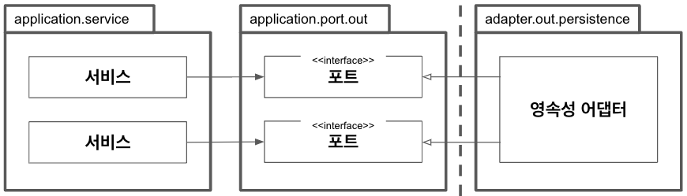
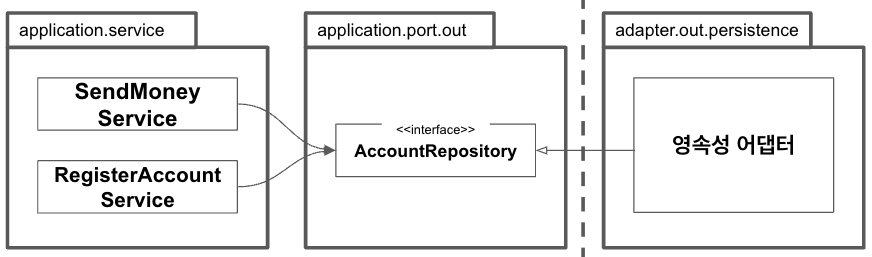
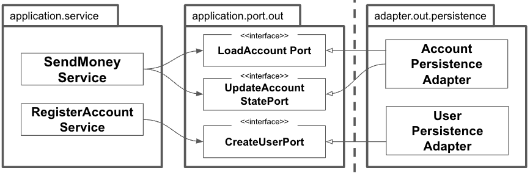
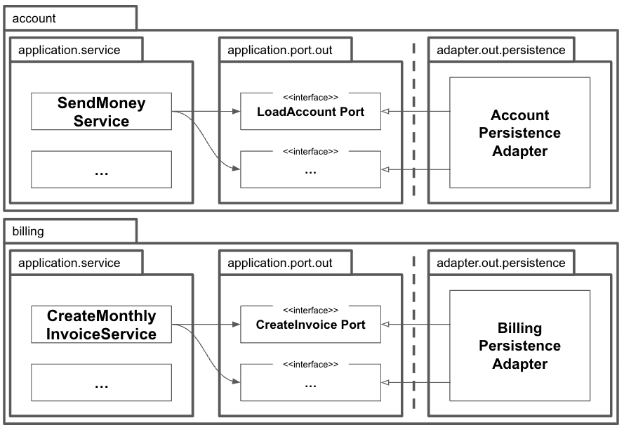

1장에서 전통적인 계층형 아키텍처에 대해 부정적으로 이야기하면서 이 아키텍처에서는 결국 모든 것이 영속성 계층에 의존하게 되어 '데이터베이스 주도 설계'가 된다고 이야기 했다.  
이번 장에서는 다른 계층이 영속성 계층에 의존하지 않도록 의존성을 역전시키기 위해 영속성 계층을 애플리케이션 계층의 플러그인으로 만드는 방법을 살펴보겠다.

## 의존성 역전

다음 그림은 영속성 어댑터가 애플리케이션 서비스에 영속성 기능을 제공하기 위해 어떻게 의존성 역전 원칙을 적용할 수 있을지 보여준다.

:::note

코어의 서비스가 영속성 어댑터에 접근하기 위해 포트를 사용한다.

:::

애플리케이션 서비스에서는 영속성 기능을 사용하기 위해 포트 인터페이스를 호출한다. 이 포트는 실제로 영속성 작업을 수행하고 데이터베이스와 통신할 책임을 가진 영속성 어댑터 클래스에 의해 구현된다.

육각형 아키텍처에서 영속성 어댑터는 '주도되는' 혹은 '아웃고잉' 어댑터다. 애플리케이션에 의해 호출될 뿐, 애플리케이션을 호출하지는 않기 때문이다.

포트는 사실상 애플리케이션 서비스와 영속성 코드 사이의 간접적인 계층이다. 영속성 문제에 신경쓰지 않고 도메인 코드를 개발하기 위해, 즉 영속성 계층에 대한 코드 의존성을 없애기 위해 이러한 간접 계층을 추가하고 있다는 사실을 잊지 말자. 이렇게 되면 영속성 코드를 리팩터링하더라도 코어 코드를 변경하는 결과로 이어지지 않는다.

자연스럽게 런타임에는 의존성은 애플리케이션 코어에서 영속성 어댑터로 향한다.

## 영속성 어댑터의 책임

영속성 어댑터는 일반적으로 어떤 일을 하는가? 01. 입력을 받는다. 02. 입력을 데이터베이스 포멧으로 매핑한다. 03. 입력을 데이터베이스로 보낸다. 04. 데이터베이스 출력을 애플리케이션 포맷으로 매핑한다. 05. 출력을 반환한다.

영속성 어댑터는 포트 인터페이스를 통해 입력을 받는다. 입력 모델은 인터페이스가 지정한 도메인 엔티티나 특정 데이터베이스 연산 전용 객체가 될 것이다.

그러고 나서 영속성 어댑터는 데이터베이스를 쿼리하거나 변경하는 데 사용할 수 있는 포맷으로 입력 모델을 매핑한다. 자바 프로젝트에서는 데이터베이스와 통신할 때 일반적으로 JPA를 사용하기 때문에 입력 모델을 데이터베이스 테이블 구조를 반영한 JPA 엔티티 객체로 매핑할 것이다.

핵심은 영속성 어댑터의 입력 모델이 영속성 어댑터 내부에 있는 것이 아니라 애플리케이션 코어에 있기 때문에 영속성 어댑터 내부를 변경하는 것이 코어에 영향을 미치지 않는다는 것이다.

다음으로 영속성 어댑터는 데이터베이스에 쿼리를 날리고 쿼리 결과를 받아온다.

마지막으로, 데이터베이스 응답을 포트에 정의된 출력 모델로 매핑해서 반환한다. 다시 한번 말하지만, 출력 모델이 영속성 어댑터가 아니라 애플리케이션 코어에 위치하는 것이 중요하다.

## 포트 인터페이스 나누기

서비스를 구현하면서 생기는 의문은 데이터베이스 연산을 정의하고 있는 포트 인터페이스를 어떻게 나눌 것인가다.

특정 엔티티가 필요로 하는 모든 데이터베이스 연산을 하나의 리포지토리 인터페이스에 넣어 두는게 일반적인 방법이다.



:::note

하나의 아웃고잉 포트 인터페이스에 모든 데이터베이스 연산을 모아두면 모든 서비스가 실제로는 필요하지 않은 메서드에 의존하게 된다.

:::

그럼 데이터베이스 연산에 의존하는 각 서비스는 인터페이스에서 단 하나의 메서드만 사용하더라도 하나의 '넓은' 포트 인터페이스에 의존성을 갖게 된다. 코드에 불필요한 의존성이 생겼다는 뜻이다.

필요하지 않는 메서드에 생긴 의존성은 코드를 이해하고 테스트하기 어렵게 만든다.

:::tip

"필요없는 화물을 운반하는 무언가에 의존하고 있으면 예상하지 못했던 문제가 생길 수 있다."

:::

인터페이스 분리 원칙(Interface Segregation Principle, ISP)은 이 문제의 답을 제시한다. 이 원칙은 클라이언트가 오로지 자신이 필요로 하는 메서드만 알면 되도록 넓은 인터페이스를 특화된 인터페이스로 분리해야 한다고 설명한다.


:::note

인터페이스 분리 원칙을 적용하면 불필요한 의존성을 제거하고 기존 의존성을 눈에 더 잘 띄게 만들 수 있다.

:::

이제 각 서비스는 실제로 필요한 메서드만 의존한다. 나아가 포트의 이름이 포트의 역할을 명확하게 잘 표현하고 있다. 테스트에서는 어떤 메서드를 모킹할지 고민할 필요가 없다. 왜냐하면 대부분의 경우 포트당 하나의 메서드만 있을 것이기 때문이다.

물론 모든 상황에 '포트 하나당 하나의 메서드'를 적용하지는 못할 것이다. 응집성이 높고 함께 사용될 때가 많기 때문에 하나의 인터페이스에 묶고 싶은 데이터베이스 연산들이 있을 수 있다.

## 영속성 어댑터 나누기

이전 그림에서는 모든 영속성 포트를 구현한 단 하나의 영속성 어댑터 클래스가 있었다. 그러나 모든 영속성 포트를 구현하는 한, 하나 이상의 클래스 생성을 금지하는 규칙은 없다. 다음과 같이 영속성 연산이 필요한 도메인 클래스(또는 DDD에서의 애그리거트) 하나당 하나의 영속성 어댑터를 구현하는 방식을 선택할 수 있다.



:::note

하나의 애그리거트당 하나의 영속성 어댑터를 만들어서 여러 개의 영속성 어댑터를 만들 수도 있다.

:::

이렇게 하면 영속성 어댑터들은 각 영속성 기능을 이용하는 도메인 경계를 따라 자동으로 나눠진다.

도메인 코드는 영속성 포트에 의해 정의된 명세를 어떤 클래스가 충족시키는지에 관심없다는 사실을 기억하자. 모든 포트가 구현돼 있기만 한다면 영속성 계층에서 하고 싶은 어떤 작업이든 해도 된다.

'애그리거트당 하나의 영속성 어댑터' 접근 방식 또한 나중에 여러 개의 바운디드 컨텍스트의 영속성 요구사항을 분리하기 위한 좋은 토대가 된다.



:::note

바운디드 컨텍스트 간의 경계를 명확하게 구분하고 싶다면 각 바운디드 컨텍스트가 영속성 어댑터(들)을 하나씩 가지고 있어야 한다.

:::

각 바운디드 컨텍스트는 영속성 어댑터를 하나씩 가지고 있다. '바운디드 컨텍스트'라는 표현은 경계를 암시한다. account 맥락의 서비스가 billing 맥락의 영속성 어댑터에 접근하지 않고, 반대로 billing의 서비스도 account의 영속성 어댑터에 접근하지 않는다는 의미다. 어떤 맥락이 다른 맥락에 있는 무엇인가를 필요로 한다면 전용 인커밍 포트를 통해 접근해야 한다.

## 스프링 데이터 JPA 예제

앞의 그림에서 본 AccountPersistenceAdapter를 구현한 코드를 보자. 이 어댑터는 데이터베이스로부터 계좌를 가져오거나 저장할 수 있어야 한다.

```java title="AccountPersistenceAdapter"
package buckpal.domain;

@AllArgsConstructor(access = AccessLevel.PRIVATE)
public class Account {
  @Getter private final AccountId id;
  @Getter private final ActivityWindow activityWindow;
  private final Money baselineBalance;

  public static Account withoutId(
    Money baselineBalance,
    ActivityWindow activityWIndow
  ) {
    return new Account(null, baselineBalance, activityWindow);
  }

  public static Account withId(
    AccountId accountId,
    Money baselineBalance,
    ActivityWindow activityWindow
  ) {
    return new Account(accountId, baselineBalance, activityWindow);
  }

  public Money calculateBalance() {
    // ...
  }

  public boolean withdraw(Money money, AccountId targetAccountId) {
    // ...
  }

  public boolean deposit(Money money, AccountId sourceAccountId) {
    // ...
  }
}
```

Account 클래스는 getter와 setter만 가진 간단한 데이터 클래스가 아니며 최대한 불변성을 유지하려 한다는 사실을 상기하자.

데이터베이스와의 통신에 스프링 데이터 JPA를 사용할 것이므로 계좌의 데이터베이스 상태를 표현하는 `@Entity` 애너테이션이 추가된 클래스도 필요하다.

```java
package buckpal.adapter.persistence;

@Entity
@Table(name = "account")
@Data
@AllArgsConstructor
@NoArgsConstructor
class AccountJpaEntity {
  @Id
  @GeneratedValue
  private long id;
}
```

다음은 activity 테이블을 표현하기 위한 코드다.

```java
package buckpal.adapter.persistence;

@Entity
@Table(name = "activity")
@Data
@AllArgsConstructor
class ActivityJpaEntity {
  @Id
  @GeneratedValue
  private Long id;

  @Column private LocalDateTime timestamp;
  @Column private Long ownerAccountId;
  @Column private Long sourceAccountId;
  @Column private Long targetAccountId;
  @Column private Long amount;
}
```

이 단계에서는 계좌의 상태가 ID 하나만으로 구성돼 있다. 나중에 사용자 ID 같은 필드가 추가될 것이다. 좀 더 흥미로운 엔티티는 특정 계좌에 대한 모든 활동을 들고 있는 ActivityJpaEntity다. JPA의 `@MoneyToOne`이나 `@OneToMany` 애너테이션을 이용해 ActivityJpaEntity와 AccountJpaEntity를 연결해서 관계를 표현할 수도 있었겠지만 데이터베이스 쿼리에 부수효과가 생길 수 있기 때문에 일단 이 부분은 제외하기로 결정했다.

다음으로 기본적인 CRUD 기능과 데이터베이스에서 활동들을 로드하기 위한 커스텀 쿼리를 제공하는 리포지토리 인터페이스를 생성하기 위해 스프링 데이터를 사용한다.

```java
interface AccountRepository extends JpaRepository<AccountJpaEntity, Long> {

}
```

다음은 ActivityRepository 코드다.

```java title="ActivityRepository"
interface ActivityRepository extends JpaRepository<ActivityJpaEntity, Long> {
  @Query("select a from ActivityJpaEntity a " +
    "where a.awnerAccountId = :ownerAccountId " +
    "and a.timestamp >= :since")
  List<ActivityJpaEntity> findByOwnerSince(
    @Param("ownerAccountId") Long ownerAccountId,
    @Param("since") LocalDateTime since
  );

  @Query("selct sum(a.amount) from ActivityJpaEntity a " +
    "where a.targetAccountId = :accountId " +
    "and a.ownerAccountId = :accountId " +
    "and a.timestamp < :unit")
  Long getDepositBalanceUntil(
    @Param("accountId") Long accountId,
    @Param("until") LocalDateTime until
  );

  @Query("select sum(a.amount) from ActivityJpaEntity a " +
    "where a.sourceAccountId = :accountId " +
    "and a.ownerAccountId = :accountId" +
    "and a.timestamp < :until")
  Long getWithdrawalBalanceUntil(
    @Param("accountId") Long accountId,
    @Param("until") LocalDateTime until
  );
}
```

스프링 부트는 이 리포지토리를 자동으로 찾고, 스프링 데이터는 실제로 데이터베이스와 통신하는 리포지토리 인터페이스 구현체를 제공하는 마법을 부린다.

JPA 엔티티와 리포지토리를 만들었으니 영속성 기능을 제공하는 영속성 어댑터를 구현해보자.

```java
@RequireArgsConstructor
@Component
class AccountPersistenceAdapter implements LoadAccountPort, UpdateAccountStatePort {
  private final AccountRepository accountRepository;
  private final ActivityRepository activityRepository;
  private final AccountMapper accountMapper;

  @Override
  public Account loadAccount(AccountId accountId, LocalDateTime baselineDate) {
    AccountJpaEntity account = accountRepository
      .findById(accountId.getValue())
      .orElseThrow(EntityNotFoundException::new);

    List<ActivityJpaEntity> activities =
      activityRepository.findByOwnerSince(
        accountId.getValue(),
        baselineDate
      );

    Long withdrawalBalance = orZero(activityRepository
      .getWithdrawalBalanceUntil(
        accountId.getValue(),
        baselineDate
      ));

    Long depositBalance = orZero(activityRepository
      .getDepositBalanceUntil(
        accountId.getValue(),
        baselineDate
      ));

    return accountMapper.mapToDomainEntity(
      account,
      activities,
      withdrawalBalance,
      depositBalance
    );
  }

  private Long orZero(Long value) {
    return value == null ? 0L : value;
  }

  @Override
  public void updateActivities(Account account) {
    for (Activity activity : account.getActivityWindow().getActivities()) {
      if (activity.getId() == null) {
        activityRepository.save(accountMapper.mapToJpaEntity(activity));
      }
    }
  }
}
```

영속성 어댑터는 애플리케이션에 필요한 LoadAccountPort와 UpdateAccountStatePort라는 2개의 포트를 구현했다.

데이터베이스로부터 계좌를 가져오기 위해 AccountRepository로 계좌를 불러온 다음, ActivityRepository로 해당 계좌의 특정 시간 범위 동안의 활동을 가져온다.

계좌의 상태를 업데이트하기 위해서는 Account 엔티티의 모든 활동을 순회하며 ID가 있는지 확인해야 한다. 만약 ID가 없다면 새로운 활동이므로 ActivityRepository를 이용해 저장해야 한다.

영속성 측면과의 타협 없이 풍부한 도메인 모델을 생성하고 싶다면 도메인 모델과 영속성 모델을 매핑하는 것이 좋다.

## 데이터베이스 트랜잭션은 어떻게 해야 할까?

트랜잭션 경계는 어디에 위치시켜야 할까?

트랜잭션은 하나의 특정한 유스케이스에 대해서 일어나는 모든 쓰기 작업에 걸쳐 있어야한다. 그래야 그중 하나라도 실패할 경우 다 같이 롤백될 수 있기 때문이다.

영속성 어댑터는 어떤 데이터베이스 연산이 같은 유스케이스에 포함되는지 알지 못하기 때문에 언제 트랜잭션을 열고 닫을지 결정할 수 없다. 이 책임은 영속성 어댑터 호출을 관장하는 서비스에 위임해야 한다.

자바와 스프링에서 가장 쉬운 방법은 `@Transactional` 애너테이션을 애플리케이션 서비스 클래스에 붙여서 스프링이 모든 public 메서드를 트랜잭션으로 감싸게 하는 것이다.

```java
package buckpal.application.service;

@Transactional
public class SendMoneyService implements SendMoneyUseCase {
  ...
}
```

## 유지보수 가능한 소프트웨어를 만드는 데 어떻게 도움이 될까?

도메인 코드에 플러그인처럼 동작하는 영속성 어댑터를 만들면 도메인 코드가 영속성과 관련된 것들로부터 분리되어 풍부한 도메인 모델을 만들 수 있다.

좁은 포트 인터페이스를 사용하면 포트마다 다른 방식으로 구현할 수 있는 유연함이 생긴다. 심지어 포트 뒤에서 애플리케이션이 모르게 다른 영속성 기술을 사용할 수도 있다. 포트의 명세만 지켜진다면 영속성 계층 전체를 교체할 수도 있다.
