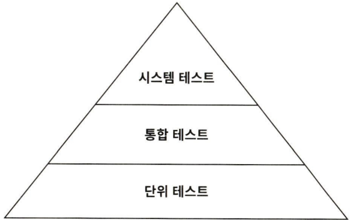

이번 장에서는 육각형 아키텍처에서의 테스트 전략에 대해 이야기한다.

## 테스트 피라미드



:::note

테스트 피라미드에 따르면 비용이 많이 드는 테스트는 지양하고 비용이 적게 드는 테스트를 많이 만들어야 한다.

:::

기본 전제는 만드는 비용이 적고, 유지보수하기 쉽고, 빨리 실행되고, 안정적인 작은 크기의 테스트들에 대해 높은 커버리지를 유지해야 한다는 것이다. 이 테스트는 하나의 '단위'(일반적으로 하나의 클래스)가 제대로 동작하는지 확인할 수 있는 단위 테스트들이다.

여러 개의 단위와 단위를 넘는 경계, 아키텍처 경계, 시스템 경계를 결합하는 테스트는 만드는 비용이 더 비싸지고, 실행이 더 느려지며 (기능 에러가 아닌 설정 에러로 인해) 깨지기 더 쉬워진다. 테스트 피라미드는 테스트가 비싸질수록 테스트의 커버리지 목표는 낮게 잡아야 한다는 것을 보여준다. 그렇지 않으면 새로운 기능을 만드는 것보다 테스트를 만드는 데 시간을 더 쓰게 되기 때문이다.

단위 테스트는 피라미드의 토대에 해당한다. 일반적으로 하나의 클래스를 인스턴스화하고 해당 클래스의 인터페이스를 통해 기능들을 테스트한다. 만약 테스트 중인 클래스가 다른 클래스에 의존한다면 의존되는 클래스들은 인스턴스화하지 않고 테스트하는 동안 필요한 작업들을 흉내 내는 목(mock)으로 대체한다.

피라미드의 다음 계층은 통합 테스트다. 이 테스트는 연결된 여러 유닛을 인스턴스화하고 시작점이 되는 클래스의 인터페이스로 데이터를 보낸 후 유닛들의 네트워크가 기대한대로 잘 동작하는지 검증한다. 이 책에서 정의한 통합 테스트에서는 두 계층 간의 경계를 걸쳐서 테스트할 수 있기 때문에 객체 네트워크가 완전하지 않거나 어떤 시점에는 목을 대상으로 수행해야 한다.

마지막으로 시스템 테스트는 애플리케이션을 구성하는 모든 객체 네트워크를 가동시켜 특정 유스케이스가 전 계층에서 잘 동작하는지 검증한다.

시스템 테스트 위에는 엔드투엔드 테스트층이 있을 수 있다.

## 단위 테스트로 도메인 엔티티 테스트하기

Account 엔티티를 떠올려보자. Account의 상태는 과거 특정 시점의 계좌 잔고와 그 이후의 입출금 내역으로 구성돼 있다. withdraw() 메서드가 기대한 대로 동작하는지 검증해보자.

```java
class AccountTest {
  @Test
  void withdrawalSucceeds() {
    AccountId accountId = new AccountId(1L);
    Account account = defaultAccount()
      .withAccountId(accountId)
      .withBaselineBalance(Money.of(555L))
      .withActivityWindow(new ActivityWindow(
        defaultActivity()
          .withTargetAccount(accountId)
          .withMoney(Money.of(999L)).build(),
        defaultActivity()
          .withTargetAccount(accountId)
          .withMoney(Money.of(1L)).build()
      )).build();

    boolean success = account.withdraw(Money.of(555L), new AccountId(99L));

    assertThat(success).isTrue();
    assertThat(account.getActivityWindow().getActivities()).hasSize(3);
    assertThat(account.calculateBalance()).isEqualTo(Money.of(1000L));
  }
}
```

위 코드는 특정 상태의 Account를 인스턴스화하고 withdraw() 메서드를 호출해서 출금을 성공했는지 검증하고, Account 객체의 상태에 대해 기대되는 부수효과들이 잘 일어났는지 확인하는 단위 테스트다.

이 테스트는 만들고 이해하는 것도 쉬운 편이고, 아주 빠르게 실행된다. 도메인 엔티티의 행동은 다른 클래스에 거의 의존하지 않기 때문에 다른 종류의 테스트는 필요하지 않다.

## 단위 테스트로 유스케이스 테스트하기

SendMoneyService의 테스트를 살펴보자. SendMoney 유스케이스는 출금 계좌의 잔고가 다른 트랜잭션에 의해 변경되지 않도록 락을 건다. 출금 계좌에서 돈이 출금되고 나면 똑같이 입금 계좌에 락을 걸고 돈을 입금시킨다. 그러고 나서 두 계좌에서 모두 락을 해제한다.

```java
class SendMoneyServiceTest {
  // ...

  @Test
  void transactionSucceeds() {
    Account sourceAccount = givenSourceAccount();
    Account targetAccount = givenTargetAccount();

    givenWithdrawalWillSucceed(sourceAccount);
    givenDepositWillSucceed(targetAccount);

    Money money = Money.of(500L);

    SendMoneyCommand command = new SendMoneyCommand(
      sourceAccount.getId(),
      targetAccount.getId(),
      money
    );

    boolean success = sendMoneyService.sendMoney(command);
    assertThat(success).isTrue();

    AccountId sourceAccountId = sourceAccount.getId();
    AccountId targetAccountId = targetAccount.getId();

    then(accountLock).should().lockAccount(eq(sourceAccountId));
    then(sourceAccount).should().withdraw(eq(money), eq(targetAccountId));
    then(accountLock).should().releaseAccount(eq(sourceAccountId));

    then(accountLock).should().lockAccount(eq(targetAccountId));
    then(targetAccount).should().withdraw(eq(money), eq(sourceAccountId));
    then(accountLock).should().releaseAccount(eq(targetAccountId));

    thenAccountsHaveBeenUpdated(sourceAccountId, targetAccountId);
  }
}
```

테스트의 가독성을 높이기 위해 행동-주도 개발(behavior driven development)에서 일반적으로 사용되는 방식대로 given/when/then 섹션으로 나눴다.

코드에는 없지만 테스트는 Mockito 라이브러리를 이용해 given...() 메서드의 목 객체를 생성한다. Mockito는 목 객체에 대해 특정 메서드가 호출됐는지 검증할 수 있는 then() 메서드도 제공한다.

테스트 중인 유스케이스 서비스는 상태가 없기 때문에 `then` 섹션에서 특정 상태를 검증할 수 없다. 대신 테스트는 서비스가 (모킹된) 의존 대상의 특정 메서드와 상호작용했는지 여부를 검증한다. 이는 테스트가 코드의 **행동** 변경뿐만 아니라 코드의 **구조** 변경에도 취약해진다는 의미가 된다. 자연스럽게 코드가 리팩터링되면 테스트도 변경될 확률이 높아진다.

그렇기 때문에 테스트에서 어떤 상호작용을 검증하고 싶은지 신중하게 생각해야 한다. **모든** 동작을 검증하는 대신 중요한 핵심만 골라 집중해서 테스트하는 것이 좋다. 만약 모든 동작을 검증하는 대신 중요한 핵심만 골라 집중해서 테스트하는 것이 좋다. 모든 동작을 검증하려고 하면 클래스가 조금이라도 바뀔 때마다 테스트를 변경해야 한다. 이는 테스트의 가치를 떨어뜨리는 일이다.

단위 테스트이긴 하지만 의존성이 상호작용을 테스트하고 있기 때문에 통합 테스트에 가깝다. 그렇지만 목으로 작업하고 있고 실제 의존성을 관리해야 하는 것은 아니기 때문에 완전한 통합 테스트에 비해 만들고 유지보수하기가 쉽다.

## 통합 테스트로 웹 어댑터 테스트하기

웹 어댑터는 HTTP를 통해 입력을 받고, 입력에 대한 유효성 검증을 하고, 유스케이스에서 사용할 수 있는 포맷으로 매핑하고, 유스케이스에 전달한다. 그리고 나서 유스케이스의 결과를 JSON으로 매핑하고 HTTP 응답을 통해 클라이언트에 반환했다.

웹 어댑터 테스트에서는 앞의 모든 단계들이 기대한 대로 동작하는지 검증해야 한다.

```java
@WebMvcTest(controllers = SendMoneyController.class)
class SendMoneyControllerTest {
  @Autowired
  private MockMvc mockMvc;

  @MockBean
  private SendMoneyUseCase sendMoneyUseCase;

  @Test
  void testSendMoney() throws Exception {
    mockMvc.perform(
      post("/accounts/send/{sourceAccountId}/{targetAccountId}/{amount}", 41L, 42L, 500).header("Content-Type", "application/json"))
    ).andExpect(status().isOk());

    then(sendMoneyUseCase).should().sendMoney(eq(new SendMoneyCommand(
      new AccountId(41L),
      new AccountId(42L),
      Money.of(500L)
    )));
  }
}
```

위 코드는 스프링 부트 프레임워크에서 SendMoneyController라는 웹 컨트롤러를 테스트하는 표준적인 통합 테스트 방법이다. testSendMoney() 메서드에서는 입력 객체를 만들고 목 HTTP 요청을 웹 컨트롤러에 보낸다. 요청 바디는 JSON 문자열의 형태로 입력 객체를 포함한다.

isOk() 메서드로 HTTP 응답 상태가 200임을 검증하고, 모킹한 유스케이스가 잘 호출됐는지 검증한다.

MockMvc 객체를 이용해 모킹했기 때문에 실제로 HTTP 프로토콜을 통해 테스트한 것은 아니다. 프레임워크가 HTTP 프로토콜에 맞게 모든 것을 적절히 잘 변환했다고 믿는 것이다.

## 통합 테스트로 영속성 어댑터 테스트하기

영속성 어댑터의 테스트에는 단위 테스트보다는 통합 테스트를 적용하는 것이 합리적이다. 단순히 어댑터의 로직만 검증하고 싶은 게 아니라 데이터베이스 매핑도 검증하고 싶기 때문이다.

```java
@DataJpaTest
@Import({ AccountPersistenceAdapter.class, AccountMapper.class })
class AccountPersistenceAdapterTest {
  @Autowired
  private AccountPersistenceAdapter adapterUnderTest;

  @Autowired
  private ActivityRepository activityRepository;

  @Test
  @Sql("AccountPersistenceAdapterTest.sql")
  void loadsAccount() {
    Account account = adapter.loadAccount(
      new AccountId(1L),
      LocalDateTime.of(2018, 8, 10, 0, 0)
    );

    assertThat(account.getActivityWindow().getActivities()).hasSize(2);
    assertThat(account.calculateBalance().isEqualTo(Money.of(500));
  }

  @Test
  void updatesActivities() {
    Account account = defaultAccount()
      .withBaselineBalance(Money.of(555L))
      .withActivityWindow(new ActivityWindow(
        defaultActivity()
          .withId(null)
          .withMoney(Money.of(1L)).build()
      )).build();

    adapter.updateActivities(account);

    assertThat(activityRepository.count()).isEqualTo(1);

    ActivityJpaEntity savedActivity = activityRepository.findAll().get(0);
    assertThat(savedActivity.getAmount()).isEqualTo(1L);
  }
}
```

loadAccount() 메서드에 대한 테스트에서는 SQL 스크립트를 이용해 데이터베이스를 특정 상태로 만든다. 그런 다음, 어댑터 API를 이용해 계좌를 가져온 후 SQL 스크립트에서 설정한 상태값을 가지고 있는지 검증한다.

updateActivities() 메서드에 대한 테스트는 반대로 동작한다. 새로운 계좌 활동을 가진 Account 객체를 만들어서 저장하기 위해 어댑터로 전달한다. 그러고 나서 ActivityRepository의 API를 이용해 이 활동이 데이터베이스에 잘 저장됐는지 확인한다.

이 테스트에서는 데이터베이스를 모킹하지 않았다는 점이 중요하다. 테스트가 실제로 데이터베이스에 접근한다. 데이터베이스를 모킹했더라도 테스트는 여전히 같은 코드 라인 수만큼 커버해서 똑같이 높은 커버리지를 보여줬을 것이다. 하지만 높은 커버리지도 불구하고 여전히 실제 데이터베이스와 연동했을 때 SQL 구문의 오류나 데이터베이스 테이블과 자바 객체 간의 매핑 에러 등으로 문제가 생길 확률이 높아진다.

이러한 이유로 영속성 어댑터 테스트는 실제 데이터베이스를 대상으로 진행해야 한다.

## 시스템 테스트로 주요 경로 테스트하기

피라미드의 최상단에 있는 시스템 테스트는 전체 어플리케이션을 띄우고 API를 통해 요청을 보내고, 모든 계층이 조화롭게 잘 동작하는지 검증한다.

시스템 테스트는 여러 개의 유스케이스를 결합해서 시나리오를 만들 때 더 빛이 난다. 각 시나리오는 사용자가 애플리케이션을 사용하면서 거쳐갈 특정 경로를 의미한다. 시스템 테스트를 통해 중요한 시나리오들이 커버된다면 최신 변경사항들이 애플리케이션을 망가뜨리지 않았음을 가정할 수 있고, 배포될 준비가 됐다는 확신을 가질 수 있다.

## 얼마만큼의 테스트가 충분할까?

라인 커버리지는 테스트 성공을 측정하는 데 있어서는 잘못된 지표다. 코드의 중요한 부분이 전혀 커버되지 않을 수 있기 때문에 100%를 제외한 어떤 목표도 완전히 무의미하다. 그리고 심지어 100%라 하더라도 버그가 잘 잡혔는지 확신할 수 없다.

나는 얼마나 마음 편하게 소프트웨어를 배포할 수 있느냐를 테스트의 성공 기준으로 삼으면 된다고 생각한다. 테스트를 실행한 후에 소프트웨어를 배포해도 될 만큼 테스트를 신뢰한다면 그것으로 된 것이다.

각각의 프로덕션 버그에 대해서 "테스트가 이 버그를 왜 잡지 못했을까?"를 생각하고 이에 대한 답변을 기록하고, 이 케이스를 커버할 수 있는 테스트를 추가해야 한다. 시간이 지나면 이 작업들이 배포할 때 마음을 편하게 해줄 것이고, 남겨둔 기록은 시간이 지날수록 상황이 개선되고 있음을 증명해줄 것이다.

다음은 육각형 아키텍처에서 사용하는 전략이다.

- 도메인 엔티티를 구현할 때는 단위 테스트로 커버하자
- 유스케이스를 구현할 때는 단위 테스트로 커버하자
- 어댑터를 구현할 때는 통합 테스트로 커버하자
- 사용자가 취할 수 있는 중요 애플리케이션 경로는 시스템 테스트로 커버하자

'구현할 때는'이라는 문구에 주목하자. 만약 테스트가 기능 개발 후가 아닌 개발 중에 이뤄진다면 하기 싫은 귀찮은 작업이 아니라 개발 도구로 느껴질 것이다.

하지만 새로운 필드를 추가할 때마다 테스트를 고치는 데 한 시간을 써야 한다면 뭔가 잘 못된 것이다. 테스트가 코드의 구조적 변경에 너무 취약할 것이므로 어떻게 개선할지 살펴봐야 한다. 리팩터링할 때마다 테스트 코드도 변경해야 한다면 테스트는 테스트로서의 가치를 잃는다.

## 유지보수 가능한 소프트웨어를 만드는 데 어떻게 도움이 될까?

**육각형 아키텍처**는 도메인 로직과 바깥으로 향한 어댑터를 깔끔하게 분리한다. 덕분에 핵심 도메인 로직은 단위 테스트로, 어댑터는 통합 테스트로 처리하는 명확한 테스트 전략을 정의할 수 있다.

입출력 포트는 테스트에서 아주 뚜렷한 모킹 지점이 된다. 각 포트에 대해 모킹할지, 실제 구현을 이용할지 선택할 수 있다. 만약 포트가 아주 작고 핵심만 담고 있다면 모킹하는 것이 아주 쉬울 것이다.

모킹하는 것이 너무 버거워지거나 코드의 특정 부분을 커버하기 위해 어떤 종류의 테스트를 써야 할지 모르겠다면 이는 경고 신호다. 이런 측면에서 테스트는 아키텍처의 문제에 대해 경고하고 유지보수 가능한 코드를 만들기 위해 인도하는 역할을 한다.
