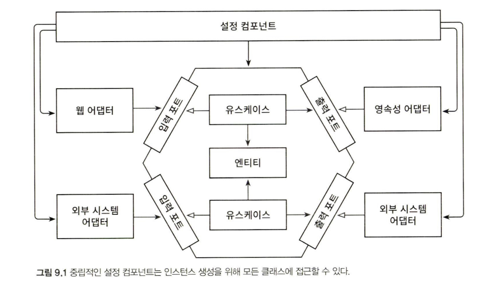

애플리케이션이 시작될 때 클래스를 인스턴스화하고 묶기 위해서 의존성 주입 메커니즘을 이용한다. 이번 장에서는 평범한 자바로 이를 어떻게 하는지, 그리고 스프링, 스프링 부터 프레임워크에서는 이를 각각 어떻게 하는지 살펴보겠다.

## 왜 조립까지 신경 써야 할까?

왜 유스케이스와 어댑터를 그냥 필요할 때 인스턴스화하면 안 되는 걸까? 그것은 코드 의존성이 올바른 방향을 가리키게 하기 위해서다. 모든 의존성은 안쪽으로, 애플리케이션의 도메인 코드 방향으로 향해야 도메인 코드가 바깥 계층의 변경으로부터 안전하다는 점을 기억하자.
유스케이스가 영속성 어댑터를 호출해야 하고 스스로 인스턴스화한다면 코드 의존성이 잘못된 방향으로 만들어진 것이다. 이것이 바로 아웃고잉 포트 인터페이스를 생성한 이유다. 유스케이스는 인터페이스만 알아야 하고, 런타임에 이 인터페이스의 구현을 제공 받아야 한다.

이 스타일의 유익한 효과는 코드를 훨씬 더 테스트하기 쉽다는 것이다. 한 클래스가 필요로 하는 모든 객체를 생성자로 전달할 수 있다면 실제 객체 대신 목으로 전달할 수 있고, 이렇게 되면 격리된 단위 테스트를 생성하기가 쉬워진다.

해답은 아키텍처에 대해 중립적이고 인스턴스 생성을 위해 **모든** 클래스에 대한 의존성을 가지는 설정 컴포넌트가 있어야 한다는 것이다.



이 설정 컴포넌트는 의존성 규칙에 정의된 대로 모든 내부 계층에 접근할 수 있는 원의 가장 바깥쪽에 위치한다.

설정 컴포넌트는 우리가 제공한 조각들로 애플리케이션을 조립하는 것을 책임진다. 이 컴포넌트는 다음과 같은 역할을 수행해야 한다.

- 웹 어댑터 인스턴스 생성
- HTTP 요청이 실제로 웹 어댑터로 전달되도록 보장
- 유스케이스 인스턴스 생성
- 웹 어댑터에 유스케이스 인스턴스 제공
- 영속성 어댑터 인스턴스 생성
- 유스케이스에 영속성 어댑터 인스턴스 제공
- 영속성 어댑터가 실제로 데이터베이스에 접근할 수 있도록 보장

보다시피 책임('변경할 이유')이 굉장히 많다. 단임 책임 원칙을 위반한다. 그러나 애플리케이션의 나머지 부분을 깔끔하게 유지하고 싶다면 이처럼 구성요소들을 연결하는 바깥쪽 컴포넌트가 필요하다. 그리고 이 컴포넌트는 작성하는 애플리케이션으로 조립하기 위해 애플리케이션을 구성하는 모든 컴포넌트를 알아야 한다.

## 평범한 코드로 조립하기

설정 컴포넌트를 구현하는 방법은 여러 가지다. 평범한 코드로 이러한 컴포넌트를 만들 수 있다.

```java
package copyeditor.configuration;

class Application {
  public static void main(String[] args) {
    AccountRepository accountRepository = new AccountRepository();
    ActivityRepository activityRepository = new ActivityRepository();

    AccountPersistenceAdapter accountPersistenceAdapter = new AccountPersistenceAdapter(accountRepository, activityRepository);

    SendMoneyUseCase sendMoneyUseCase = new SendMoneyUseService(accountPersistenceAdapter, accountPersistenceAdapter);

    SendMoneyController sendMoneyController = new SendMoneyController(sendMoneyUseCase);

    startProcessingWebRequests(sendMoneyController);
  }
}
```

자바에서는 애플리케이션이 main 메서드로부터 시작된다. main 메서드 안에서 웹 컨트롤러부터 영속성 어댑터까지, 필요한 모든 클래스의 인스턴스를 생성한 후 함께 연결한다.

이 평범한 코드 방식은 애플리케이션을 조립하는 가장 기본적인 방법이다. 하지만 단점이 있다.

첫 번째로, 앞의 코드는 웹 컨트롤러, 유스케이스, 영속성 어댑터가 단 하나씩만 있는 애플리케이션을 예로 든 것이다. 완전한 애플리케이션을 실행하기 위해서는 이러한 코드를 엄청 많이 만들어야 한다.

두 번째로, 각 클래스가 속한 패키지 외부에서 인스턴스를 생성하기 때문에 이 클래스들은 전부 public이어야 한다. 이렇게 되면 유스케이스가 영속성 어댑터에 직접 접근하는 것을 막지 못한다.

## 스프링의 클래스패스 스캐닝으로 조립하기

스프링 프레임워크를 이용해서 애플리케이션을 조립한 결과물을 애플리케이션 컨텍스트라고 한다. 애플리케이션 컨텍스트는 애플리케이션을 구성하는 모든 객체('bean')를 포함한다.

스프링은 애플리케이션 컨텍스트를 조립하기 위한 몇 가지 방법을 제공하는데 각기 장단점이 있다.

스프링은 클래스패스 스캐닝으로 클래스패스에서 접근 가능한 모든 클래스를 확인해서 @Component 애너테이션이 붙은 클래스를 찾는다. 그리고 나서 이 애너테이션이 붙은 각 클래스의 객체를 생성한다. 이때 클래스는 필요한 모든 필드를 인자로 받는 생성자를 가지고 있어야 한다.

```java
@RequiredArgsConstructor
@Component
class AccountPersistenceAdapter implements LoadAccountPort, UpdateAccountStatePort {
  private final AccountRepository accountRepository;
  private final ActivityRepository activityRepository;
  private final AccountMapper accountMapper;

  @Override
  public Account loadAccount(AccountId accountId, LocalDateTime baselineDate) {
    //...
  }
}
```

이 코드에서는 생성자를 직접 만들지 않고 Lombok 라이브러리의 @RequiredArgs Constructor 애너테이션을 이용해 모든 final 필드를 인자로 받는 생성자를 자동으로 생성했다.

그럼 스프링은 이 생성자를 찾아서 생성자의 인자로 사용된 @Component가 붙은 클래스를 찾고, 이 클래스들의 인스턴스를 만들어 애플리케이션 컨텍스트에 추가한다.

클래스패스 스캐닝 방식을 이용하면 아주 편리하게 애플리케이션을 조립할 수 있다. 적절한 곳에 @Component 애너테이션을 붙이고 생성자만 잘 만들어두면 된다.

하지만 클래스패스 스캐닝 방식에는 단점이 있다. 첫 번째로 클래스에 프레임워크에 특화된 애너테이션을 붙여야 한다는 점에서 침투적이다. 강경한 클린 아키텍처파는 이런 방식이 코드를 특정한 프레임워크와 결합시키기 때문에 사용하지 말아야 한다고 주장할 것이다.

일반적인 애플리케이션 개발에서는 필요하다면 한 클래스에 애너테이션 하나 정도는 용인할 수 있고, 리팰터링도 그리 어렵지 않게 할 수 있다.

하지만 다른 개발자들이 사용할 라이브러리나 프레임워크를 만드는 입장에서 사용하지 말아야 할 방법이다. 라이브러리 사용자가 스프링 프레임워크의 의존성에 엮이게 되기 때문이다.

## 스프링의 자바 컨피그로 조립하기

앞의 평범한 코드를 이용하는 방식과 비슷한데, 덜 지저분하고 프레임워크와 함께 제공되므로 모든 것을 직접 코딩할 필요가 없는 방식이다.

이 방식에서는 애플리케이션 컨텍스트에 추가할 빈을 생성하는 설정 클래스를 만든다.

예를들어, 모든 영속성 어댑터들의 인스턴스 생성을 담당하는 설정 클래스를 하나 만들어보자.

```java
@Configuration
@EnableJpaRepositories
class PersistenceAdapterConfiguration {
  @Bean
  AccountPersistenceAdapter accountPersistenceAdapter(
    AccountRepository accountRepository,
    ActivityRepository activityRepository,
    AccountMapper accountMapper
  ) {
    return new AccountPersistenceAdapter(
      accountRepository,
      activityRepository,
      accountMapper
    );
  }

  @Bean
  AccountMapper accountMapper() {
    return new AccountMapper();
  }
}
```

@Configuration 애너테이션을 통해 이 클래스가 스프링의 클래스패스 스캐닝에서 발견해야 할 설정 클래스임을 표시해둔다. 그러므로 사실 여전히 클래스패스 스캐닝을 사용하고 있는 것이기는 하다. 하지만 모든 빈을 가져오는 대신 설정 클래스만 선택하기 때문에 좋다.

이 방식에서는 클래스패스 스캐닝 방식과 달리 @Component 애너테이션을 코드 여기 저기에 붙이도록 강제하지 않는다. 그래서 애플리케이션 계층을 스프링 프레임워크에 대한 의존성 없이 깔끔하게 유지할 수 있다.

하지만 이 방법에도 문제점은 있다. 설정 클래스가 생성하는 빈이 설정 클래스와 같은 패키지에 존재하지 않는다면 이 빈들을 public으로 만들어야 한다.

## 유지보수 가능한 소프트웨어를 만드는 데 어떻게 도움이 될까?

스프링과 스프링 부트는 개발을 편하게 만들어주는 다양한 기능들을 제공한다. 그중 하나가 바로 애플리케이션 개발자로서 우리가 제공하는 클래스들을 이용해서 애플리케이션을 조립하는 것이다.

클래스패스 스캐닝은 아주 편리한 기능이다. 스프링에게 패키지만 알려주면 거기서 찾은 클래스로 애플리케이션을 조립한다. 이를 통해 애플리케이션 전체를 고민하지 않고도 빠르게 개발할 수 있다.

하지만 코드의 규모가 커지면 금방 투명성이 낮아진다. 어떤 빈이 애플리케이션 컨텍스트에 올라오는지 정확히 알 수 없고, 테스트에서 애플리케이션 컨텍스트의 일부만 독립적으로 띄우기가 어려워진다.

반면 애플리케이션 조립을 책임지는 전용 설정 컴포넌트를 만들면 애플리케이션의 이러한 책임으로부터 자유로워진다. 이 방식을 이용하면 서로 다른 모듈로부터 독립되어 코드 상에서 손쉽게 옮겨 다닐수 있는 응집도가 매우 높은 모듈을 만들 수 있다. 하지만 늘 그렇듯이 설정 컴포넌트를 유지하는데 약간의 시간을 추가로 들여야 한다.
