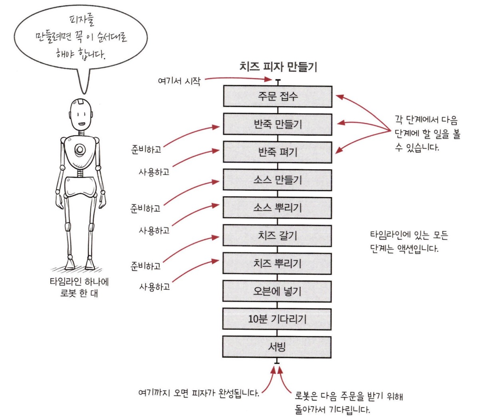

:::info 이번 장에서 살펴볼 내용

- 현실적인 문제에 함수형 사고를 적용해 봅시다.
- 소프트웨어 구조를 잡는 데 계층형 설계가 좋은 이유를 설명합니다.
- 액션을 타임라인으로 시각화해 봅니다.
- 타임라인을 사용하면 시간에 관한 문제를 잘 풀 수 있다는 것을 배웁니다.

:::

## 토니 피자에 오신 것을 환영합니다

피자 가게를 운영하는 토니는 로봇에 함수형 사고를 많이 사용했습니다. 다음은 토니가 적용한 것입니다.

### 파트 1: 액션과 계산, 데이터

토니는 요리 재료와 기타 필요 자원을 사용하는 코드를 액션으로 구분하고 나머지 코드는 계산으로 구분했습니다. 

### 파트 2: 일급 추상

가게 주방에는 많은 로봇이 함께 피자를 만들고 있습니다. 이것은 분산 시스템이라고 할 수 있습니다.

## 파트 1: 액션과 계산, 데이터

토니는 함수형 사고 중에 가장 먼저 액션과 계산, 데이터를 구분하는 것부터 시작했습니다. 함수형 프로그래머는 코드에서 가장 먼저 이 세가지를 구분하는데 쉽게 다룰 수 있는 부분과 조심히 다뤄야 할 부분을 명확하게 하기 위함입니다.

### 1. 액션

액션은 호출 횟수와 시점에 의존하는 것입니다. 오븐이나 배달차 같은 자원과 요리 재료를 사용하는 것은 액션입니다. 액션은 사용할 때 조심해야 합니다.

### 2. 계산

어떤 것을 결정하거나 계획하는 것은 계산입니다. 계산은 실행해도 다른 곳에 영향을 주지 않습니다. 계산은 아무 때나 사용해도 주방이 엉망진창 될 걱정이 없기 때문에 토니는 계산을 좋아합니다.

### 3. 데이터

토니는 변경 불가능한 데이터를 가능한 많이 쓰려고 합니다. 결제, 재고, 피자 조리법 같은 것이 데이터입니다.

## 변경 가능성에 따라 코드 나누기

### 계층화 설계 맛보기

함수형 사고로 코드를 구성하면 코드를 변경할 때 드는 비용이 줄어듭니다.

먼저 변경 가능성에 따라 코드를 나눠 봅시다. 위쪽으로 갈수록 자주 바뀌는 코드가 있고 아래쪽으로 갈수록 자주 바뀌지 않는 코드가 있는 그림을 그려봅시다.

각 계층은 그 아래에 있는 계층을 기반으로 만들어 집니다. 그래서 각 계층에 있는 코드는 더 안정적인 기반 위에 작성할 수 있습니다. 이런 구조로 소프트웨어를 만들면 코드를 쉽게 바꿀 수 있습니다. 아래에 있는 코드들은 위에 있는 코드보다 의존성이 많아 바꾸기 어렵지만 자주 바뀌지 않습니다.

함수형 프로그래머는 이 아키텍처 패턴이 계층을 만들기 때문에 **계층형 설계**라고 부릅니다. 계층형 설계는 일반적으로 비즈니스 규칙, 도메인 규칙, 기술 스택 계층으로 나눕니다.

계층형 설계로 만든 코드는 테스트, 재사용, 유지보수가 쉽습니다.

## 파트 2: 일급 추상

### 주방을 자동화하기

주방에는 로봇이 혼자 일하고 있었기 때문에 얼마 지나지 않아 확장성 문제가 생겼습니다. 토니는 고객이 원하는 속도로 피자를 만들 수 없습니다. 다음 **타임라인 다이어그램**은 로봇 한 대가 피자를 만들기 위한 액션들을 보여줍니다.

타임라인 다이어그램을 사용하면 액션이 시간 순서에 따라 어떻게 실행되는지 볼 수 있습니다. 액션은 실행 시점에 의존하기 때문에 실행 순서가 중요하다는 것을 잊지 마세요.

## 분산 시스템을 타임라인으로 시각화하기

여러 대의 로봇이 함께 일을 하는 것은 분산 시스템을 의미합니다. 분산 시스템에서 독립된 액션의 실행 순서는 어떻게 될지 모릅니다. 각각의 타임라인에서 처리되는 일은 순서가 섞여 누가 먼저 끝날지 알 수 없습니다.

### 각각의 타임라인은 다른 순서로 실행됩니다.

기본적으로 타임라인은 서로 순서를 맞출 수 있는 기능이 없습니다. 다른 타임라인 작업이 끝날 때까지 기다리라는 표시가 없어서 순서대로 다음 단계를 그냥 진행합니다. 서로 다른 타임라인에 있는 액션 간 실행 순서는 보장할 수 없습니다.

**타임라인을 서로 맞추지 않은 분산 시스템은 예측 불가능한 순서로 실행됩니다.** 로봇들이 반죽, 치즈, 소스 준비가 끝나면 피자를 만들도록 해야 합니다.

## 어려운 경험을 통해 분산 시스템에 대해 배운 것

순차적인 프로그램을 분산 시스템으로 바꾸는 것은 어렵다는 것을 알았습니다.

올바른 순서로 동작하는 프로그램을 만들려면 액션(시간에 의존적인)에 집중할 필요가 있다는 것도 알았습니다.

### 1. 기본적으로 타임라인은 서로 순서를 맞추지 않습니다.

반죽이 준비되지 않았는데도 다른 타임라인은 그냥 진행되었습니다. 타임라인은 순서를 맞춰야 합니다.

### 2. 액션이 실행되는 시간은 중요하지 않습니다.

일반적으로 소스 만드는 것이 제일 오래 걸리는 작업이지만 항상 그렇지는 않습니다. 그래서 각각의 타임라인의 순서와 관계없이 만들어야 합니다.

### 3. 드물지만 타이밍이 어긋나는 경우는 실제 일어납니다.

테스트할 때는 문제가 없었지만 실제 서비스에서는 문제가 생겼습니다. 저녁에 주문이 많이 들어오자 가끔 발생하는 오류는 더 많이 발생했습니다. 타임라인은 항상 올바른 결과를 보장해야 합니다.

### 4. 타임라인 다이어그램으로 시스템의 문제를 알 수 있습니다.

다이어그램을 보고 치즈가 제시간에 준비되지 않을 수 있다는 것을 알았습니다.

## 타임라인 커팅: 로봇이 서로를 기다릴 수 있게 하기

타임라인 커팅은 여러 타임라인이 동시에 진행될 때 서로 순서를 맞추는 방법입니다.

타임라인 커팅은 **고차 동작**으로 구현합니다. 각 타임라인은 독립적으로 동작하고 작업이 완료되면 다른 타임라인 끝나기를 기다리기 때문에 어떤 타임라인이 먼저 끝나도 괜찮습니다.

이렇게 타임라인의 시간을 맞추는 작업을 **커팅**(cutting) 이라고 부릅니다.

## 좋은 경험을 통해 타임라인에 대해 배운 것

- 컷이 있으면 점선 아래에 있는 것은 점선 위에 있는 것이 끝나야 실행할 수 있습니다.
- 컷이 있기 때문에 재료 준비하는 작업들의 실행 순서를 신경 쓰지 않고 피자 만드는 나머지 작업을 할 수 있습니다.

### 1. 타임라인 커팅으로 서로 다른 작업들을 쉽게 이해할 수 있습니다.

타임라인 컷을 그려 동시에 할 수 있는 재료 준비와 순서대로 해야 하는 피자 만들기를 분리했습니다. 타임라인 커팅으로 더 짧아진 타임라인을 실행 순서에 상관없이 이해할 수 있습니다.

### 2. 타임라인 다이어그램을 사용하면 시간에 따라 진행하는 작업을 쉽게 이해할 수 있습니다.

토니는 타임라인 다이어그램을 이해했기 때문에 동작 방법에 대해 확신할 수 있었습니다.

타임라인은 동시에 실행되는 분산 시스템을 시각화하기 좋습니다.

### 3. 타임라인 다이어그램은 유연합니다.

타임라인을 보고 쉽게 코드로 옮길 수 있었습니다. 그리고 타임라인 다이어그램으로 동시에 진행되는 작업을 쉽게 모델링할 수 있습니다.

## 결론

토니는 유지보수 비용을 줄이기 위해 액션과 계산에 계층화 설계를 사용했습니다. 토니는 로봇 여러 대로 주방 효율을 높이고 시간에 따라 발생하는 어려운 버그도 고쳤습니다.

## 요점 정리

- 액션과 계산 데이터를 구분하는 일은 함수형 프로그래머에게 가장 중요하고 첫 번째로 해야 하는 일입니다. 우리도 코드를 이런 식으로 구분하는 법을 배워야 합니다.
- 함수형 프로그래머는 유지보수를 잘 하기 위해 계층형 설계를 사용합니다. 각 계층은 코드의 변경 가능성에 따라 나눕니다.
- 타임라인 다이어그램은 시간에 따라 변하는 액션을 시각화하는 방법입니다.타임라인 다이어그램으로 액션이 다른 액션과 어떻게 연결되는지 볼 수 있습니다.
- 액션 간 협력을 위해 타임라인 커팅이라는 기술을 살펴봤습니다. 타임라인 커팅은 액션이 올바른 순서로 실행할 수 있도록 보장해 줍니다.
