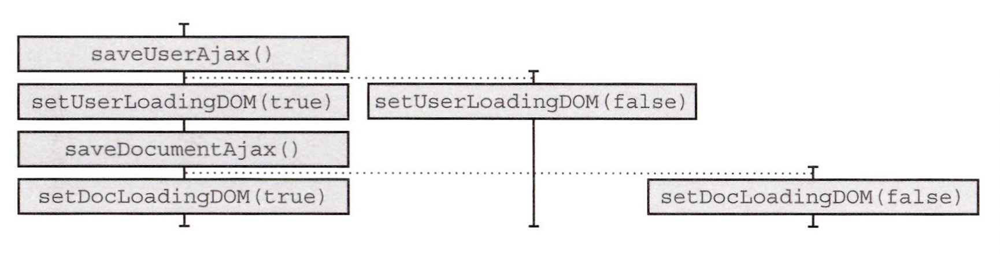
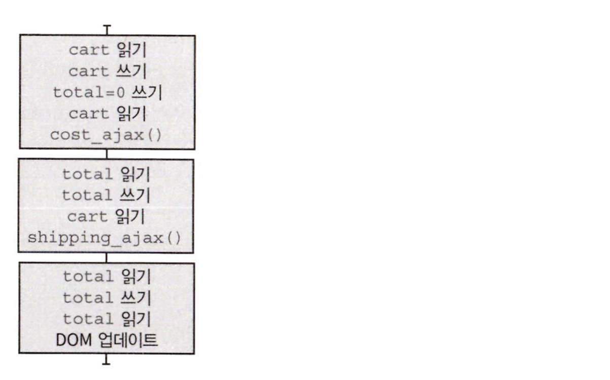

:::info 이번 장에서 살펴볼 내용

- 코드를 타임라인 다이어그램으로 그리는 방법을 배웁니다.
- 버그를 찾기 위해 타임라인 다이어그램 보는 법을 이해합니다.
- 타임라인끼리 공유하는 자원을 줄여 코드 설계를 개선하는 방법을 알아봅니다.

:::

## 버그가 있습니다!

장바구니에 제품을 추가하는 버튼에 대한 코드입니다. `add_item_to_cart()`는 버튼을 클릭할 때 실행되는 핸들러 함수입니다.

## 타임라인 다이어그램은 시간에 따라 어떤 일이 일어나는지 보여줍니다.

다음은 두 번 빠르게 클릭했을 때 어떤 일이 일어나는지 보여주는 타임라인 다이어그램입니다. **타임라인**은 액션을 순서대로 나열한 것입니다. **타임라인 다이어그램**은 시간에 따른 액션 순서를 시각적으로 표시한 것입니다. 다이어그램 옆으로 타임라인을 하나씩 추가하면 각 액션이 서로 어떻게 상호작용하고 간섭하는지 볼 수 있습니다.

## 두 가지 타임라인 다이어그램 기본 규칙

### 1. 두 액션이 순서대로 나타나면 같은 타임라인에 넣습니다.

타임라인에는 액션만 그립니다. 계산은 실행 시점에 영향을 받지 않기 때문에 그리지 않습니다.

### 2. 두 액션이 동시에 실행되거나 순서를 예상할 수 없다면 분리된 타임라인에 넣습니다.

액션이 서로 다른 스레드나 프로세스, 기계, 비동기 콜백에서 실행되면 서로 다른 타임라인에 표시합니다. 이 경우는 액션 두 개가 서로 다른 비동기 콜백에서 실행됩니다. 두 액션의 실행 시점이 무작위이기 때문에 어떤 액션이 먼저 실행될지 알 수 없습니다.

#### 요약

1. 액션은 순서대로 실행되거나 동시에 실행됩니다.
2. 순서대로 실행되는 액션은 같은 타임라인에서 하나가 끝나면 다른 하나가 실행됩니다.
3. 동시에 실행되는 액션은 여러 타임라인에서 나란히 실행됩니다.

## add-to-cart 타임라인 그리기: 단계 1

타임라인 다이어그램은 모두 세 단계로 그릴 수 있습니다.

1. 액션을 확인합니다.
2. 순서대로 실행되거나 동시에 실행되는 액션을 그립니다.
3. 플랫폼에 특화된 지식을 사용해 다이어그램을 단순하게 만듭니다.

### 1. 액션을 확인합니다.

밑줄 친 부분은 모두 액션입니다.

이 짧은 코드에 13개의 액션이 있습니다. 그리고 비동기 콜백 두 개가 있다는 것도 주의해야 합니다.

## add-to-cart 타임라인 그리기: 단계 2

### 2. 순서대로 실행되거나 동시에 실행되는 액션을 그립니다.

## 타임라인 다이어그램으로 동시에 실행되는 코드는 순서를 예측할 수 없다는 것을 알 수 있습니다.

타임라인 다이어그램은 순차적으로 실행되는 코드뿐만 아니라 동시에 실행되는 코드를 표현할 수 있습니다. 동시에 실행되는 코드는 실행 순서를 확신할 수 없습니다.

## 좋은 타임라인의 원칙

### 1. 타임라인은 적을수록 이해하기 쉽습니다.

타임라인이 하나인 시스템이 가장 이해하기 쉽습니다. 타임라인이 하나라면 모든 액션은 앞의 액션 다음에 바로 실행됩니다. 멀티스레드나 비동기 콜백, 클라이언트-서버 간 통신 등을 사용하려면 새로운 타임라인이 필요합니다. 새로운 타임라인은 항상 시스템을 이해하기 어렵게 만듭니다.

### 2. 타임라인은 짧을수록 이해하기 쉽습니다.

타임라인을 이해하기 쉽게 만드는 또 다른 방법은 타임라인의 단계를 줄이는 것입니다.

### 3. 공유하는 자원이 적을수록 이해하기 쉽습니다.

서로 다른 타임라인에 있는 두 액션이 서로 자원을 공유하지 않는다면 실행 순서에 신경 쓸 필요가 없습니다.

### 4. 자원을 공유한다면 서로 조율해야 합니다.

타임라인은 공유 자원을 안전하게 공유할 수 있어야 합니다. 안전하게 공유한다는 말은 올바른 순서대로 자원을 쓰고 돌려준다는 말입니다.

### 5. 시간을 일급으로 다룹니다.

액션의 순서와 타이밍을 맞추는 것은 어렵습니다. 타임라인 다루는 재사용 가능한 객체를 만들면 타이밍 문제를 쉽게 만들 수 있습니다.

## 타임라인 단순화하기

세 번째 단계는 플랫폼의 스레드 모델에 따라 다이어그램을 단순하게 만드는 일입니다. 

### 1. 하나의 타임라인에 있는 모든 액션을 하나로 통합합니다.

자바스크립트는 스레드가 하나이기 때문에 액션은 순서가 섞이지 않고 하나의 타임라인에서 실행됩니다. 타임라인은 다른 타임라인이 실행되기 전에 완료됩니다. 다이어그램에 점선이 있다면 타임라인 끝으로 옮깁니다.

### 2. 타임라인이 끝나는 곳에서 새로운 타임라인이 하나만 생긴다면 통합합니다.

첫 번째 타임라인이 끝나는 곳에 새로운 타임라인이 두 개 생기기 때문에 통합하지 않습니다.

## add-to-cart 타임라인 단순화하기: 단계 3

### 1. 하나의 타임라인에 있는 모든 액션을 하나로 통합합니다.

### 2. 타임라인이 끝나는 곳에서 새로운 타임라인이 하나만 생긴다면 통합합니다.

다이어그램에 있는 타임라인은 새로운 타임라인이 시작하면 끝납니다. 따라서 모든 타임라인을 하나의 타임라인으로 합칠 수 있습니다.

## 타임라인을 나란히 보면 문제가 보입니다.

앞에서 장바구니에 제품을 담기 위해 한 번 클릭했을 때는 합계가 올바르게 나왔습니다. 두 번 빠르게 클릭하면 버그가 발생했습니다.

다른 타임라인에 있고 박스는 떨어져 있기 때문에 순서가 섞일 수 있습니다. 이 다이어그램은 조금 바꿔볼 수 있습니다. 타임라인에 있는 단계들은 이벤트 큐가 순서대로 처리하는 것을 보장합니다.

## 자원을 공유하는 타임라인은 문제가 생길 수 있습니다.

### 공유하는 자원을 없애 문제를 해결할 수 있습니다.

실생 순서가 섞인 상태에서 각 타임라인이 전역변수에 접근하게 되면 버그가 생길 수 있습니다. 잘못된 순서로 실행된다면 분명 문제가 생길 것입니다.

다음 두 가지 방법으로 해결할 수 있습니다.

1. 전역변수를 지역변수로 바꾸기
2. 전역변수를 인자로 바꾸기

## 결론

이 장에서 타임라인 다이어그램을 그리고 다이어그램으로 버그를 찾는 방법을 배웠습니다. 또 자바스크립트 스레드 모델 지식을 사용해 타임라인을 단순화했습니다. 마지막으로 버그를 없애기 위해 공유하는 자원을 줄이는 원칙을 적용해 봤습니다.

## 요점 정리

- 타임라인은 동시에 실행될 수 있는 순차적 액션을 말합니다. 코드가 순서대로 실행되는지 동시에 실행되는지 알 수 있습니다.
- 서로 다른 타임라인에 있는 액션은 끼어들 수 있어서 여러 개의 실행 가능한 순서가 생깁니다. 실행 가능한 순서가 많으면 코드가 항상 올바른 결과를 내는지 알기 어렵습니다.
- 타임라인 다이어그램은 코드가 순서대로 실행되는지 동시에 실행되는지를 알려줍니다. 타임라인 다이어그램으로 서로 영향을 주는 부분이 어떤 부분인지 알 수 있습니다.
- 언어에서 지원하는 스레드 모델을 이해하는 것은 중요합니다.
- 자원을 공유하는 부분은 버그가 발생하기 쉽습니다. 공유 자원을 확인하고 없애면 코드가 더 좋아집니다.
- 자원을 공유하지 않는 타임라인은 독립적으로 이해하고 실행할 수 있습니다. 따라서 함께 생각해야 할 내용이 줄어듭니다.
