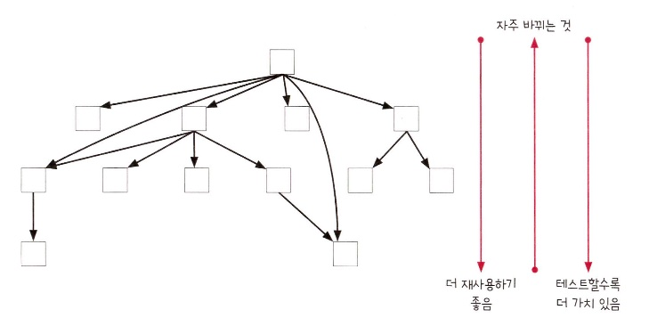
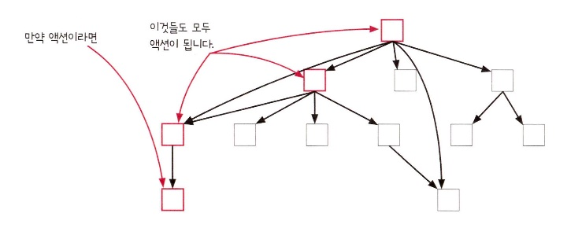

:::info 이번 장에서 살펴볼 내용

- 반응형 아키텍처로 순차적 액션을 파이프라인으로 만드는 방법을 배웁니다.
- 상태 변경을 다루기 위한 기본형을 만듭니다.
- 도메인과 현실 세계의 상호작용을 위해 어니언 아키텍처를 만듭니다.
- 여러 계층에 어니언 아키텍처를 적용하는 방법을 살펴봅니다.
- 전통적인 계층형 아키텍처와 어니언 아키텍처를 비교해 봅니다.

:::

이 장에서는 조금 더 높은 수준에서 설계와 아키텍처에 대해 살펴보려고 합니다. 두 가지 일반적인 패턴을 하나씩 살펴보겠습니다. **반응형 아키텍처**는 순차적인 액션을 표현하는 방식을 뒤집습니다. **어니언 아키텍처**는 함수형 프로그래밍으로 현실 세계를 다루기 위한 고수준의 개념입니다.

## 두 아키텍처 패턴은 독립적입니다.

두 패턴은 서로 다른 단계에서 사용합니다. 반응형 아키텍처는 순차적 액션 단계에 사용하고, 어니언 아키텍처는 서비스의 모든 단계에 사용합니다. 두 패턴은 함께 사용할 수 있지만 따로 사용할 수도 있습니다.


### 반응형 아키텍처

반응형 아키텍처는 코드에 나타난 순차적 액션의 순서를 뒤집습니다. 효과(effect)와 그 효과에 대한 원인을 분리해서 코드에 복잡하게 꼬인 부분을 풀 수 있습니다.

### 어니언 아키텍처

어니언 아키텍처는 웹 서비스나 온도 조절같은 현실 세계와 상호작용하기 위한 서비스 구조를 만듭니다.

## 반응형 아키텍처는 무엇인가요?

반응형 아키텍처의 핵심 원칙은 이벤트에 대한 반응으로 일어날 일을 지정하는 것입니다. 반응형 아키텍처는 웹 서비스와 UI에 잘 어울립니다. 웹 서비스는 웹 요청 응답에 일어날 일을 지정하고, UI는 버튼 클릭과 같은 이벤트 응답에 일어날 일을 지정하면 됩니다. 이런 것을 일반적으로 이벤트 핸들러라고 합니다.

## 반응형 아키텍처의 절충점

반응형 아키텍처는 코드에 나타난 순차적 액션의 순서를 뒤집습니다. X를 하고 Y 하는 대신, X가 일어나면 언제는 Y를 합니다. 이렇게 하면 코드를 읽기 쉽고 유지보수하기도 좋습니다. 

### 원인과 효과가 결합한 것을 분리합니다.

어떤 경우에는 원인과 효과를 분리하면 코드가 읽기 어려워집니다. 하지만 코드가 더 유연하고 하려고 하는 것을 정확하게 표현할 수 있습니다.

### 여러 단계를 파이프라인으로 처리합니다.

앞에서 데이터를 변환하는 단계를 파이프라인으로 처리했습니다. 파이프라인은 함수형 도구를 연결해서 만들었습니다. 계산을 조합하는 정말 멋진 방법이었습니다. 반응형 아키텍처로 이와 비슷하게 액션과 계산을 조합할 수 있습니다.

### 타임라인이 유연해집니다.

순서를 표현하는 방법을 뒤집으면 타임라인이 유연해집니다. 물론 이러한 유연성이 기대하지 않은 실행 순서로 이어진다면 좋지 않을 수도 있습니다. 하지만 익숙해지면 더 짧은 타임라인을 만들 수 있습니다.

이제 강력한 일급 상태 모델을 만들어 보려고 합니다. 상태는 애플리케이션에서 중요한 부분을 차지합니다. 함수형 프로그램에서도 마찬가지입니다.

## 셀은 일급 상태입니다.

장바구니는 언제 바뀔지 모릅니다. 전역변수이고 할당 연산자를 통해 값을 바꾸고 있습니다. 상태를 일급 함수로 만들어 봅시다. 전역변수를 몇 가지 동작과 함께 객체로 만듭니다. 다음은 변경 가능한 값을 일급 함수로 만드는 코드입니다.

```js
function ValueCell(initialValue) {
  var currentValue = initialValue;
  return {
    val: function() {
      return currentValue;
    },
    update: function(f) {
      var oldValue = currentValue;
      var newValue = f(oldValue);
      currentValue = newValue;
    }
  }
}
```

```js title="원래 코드"
var shopping_cart = {};

function add_item_to_cart(name, price) {
  var item = make_cart_item(name, price);
  shopping_cart = add_item(shopping_cart, item);

  var total = calc_total(shopping_cart);
  set_cart_total_dom(total);
  update_shipping_icons(shopping_cart);
  update_tax_dom(total);
}
```

```js title="셀을 적용한 코드"
var shopping_cart = ValueCell({});

function add_item_to_cart(name, price) {
  var item = make_cart_item(name, price);
  shopping_cart.update(function(cart) {
    return add_item(cart, item);
  });

  var total = calc_total(shopping_cart.val());
  set_cart_total_dom(total);
  update_shipping_icons(shopping_cart.val());
  update_tax_dom(total);
}
```

## ValueCell을 반응형으로 만들 수 있습니다.

변경 가능한 상태를 나타내는 새로운 기본형을 만들었습니다. 상태가 바뀔 때 X를 하도록 만들어야 합니다. 바로 만들어 봅시다. ValueCell 코드에 **감시자** 개념을 추가해 봅시다. 감시자는 상태가 바뀔 때마다 실행되는 핸들러 함수입니다.

```js title="원래 코드"
function ValueCell(initialValue) {
  var currentValue = initialValue;

  return {
    val: function() {
      return currentValue;
    },
    update: function(f) {
      var oldValue = currentValue;
      var newValue = f(oldValue);

      currentValue = newValue;
    }
  }
}
```

```js title="감시자를 적용한 코드"
function ValueCell(initialValue) {
  var currentValue = initialValue;
  var watchers = [];
  return {
    val: function() {
      return currentValue;
    },
    update: function(f) {
      var oldValue = currentValue;
      var newValue = f(oldValue);

      if(old !== newValue) {
        currentValue = newValue;
        watchers.forEach(function(watcher) {
          watcher(newValue, oldValue);
        }); 
      }
    },
    addWatcher: function(watcher) {
      watchers.push(watcher);
    }
  }
}
```

:::tip 용어 설명

**감시자(watcher)** 개념은 다른 이름으로 사용하기도 합니다.

- **감시자(watcher)**
- **옵저버(observer)**
- **리스너(listener)**
- **이벤트 핸들러(event handler)**
- **콜백(callback)**

:::

## 셀이 바뀔 때 배송 아이콘을 갱신할 수 있습니다.

shipping_cart 값을 가진 ValueCell에 update_shipping_icons()를 감시자로 등록해 봅시다. 이렇게 하면 장바구니가 바뀔 때 항상 배송 아이콘이 갱신됩니다.

```js title="원래 코드"
var shopping_cart = ValueCell({});

function add_item_to_cart(name, price) {
  var item = make_cart_item(name, price);
  shopping_cart.update(function(cart) {
    return add_item(cart, item);
  });

  var total = calc_total(shopping_cart.val());
  set_cart_total_dom(total);
  update_shipping_icons(shopping_cart.val());
  update_tax_dom(total);
}
```

```js title="고친 코드"
var shopping_cart = ValueCell({});

function add_item_to_cart(name, price) {
  var item = make_cart_item(name, price);
  shopping_cart.update(function(cart) {
    return add_item(cart, item);
  });

  var total = calc_total(shopping_cart.val());
  set_cart_total_dom(total);
  update_tax_dom(total);
}

shopping_cart.addWatcher(update_shipping_icons);
```

코드를 고치고 나서 두 가지 사실을 알 수 있습니다. 하나는 핸들러 함수가 더 작아졌다는 것입니다. 원래 하던 것보다 적은 일을 합니다. 그리고 아이콘 갱신을 직접하지 않습니다. 이 책임은 감시자로 넘어갔습니다. 또 다른 사실은 장바구니를 바꾸는 모든 핸들러에서 update_shipping_icons()를 부르지 않아도 된다는 것입니다. 이제 장바구니가 변경될 때 항상 update_shipping_icons()가 실행됩니다.

장바구니에 제품을 추가, 삭제, 수량 변경을 할 때마다 항상 배송 아이콘이 갱신됩니다. 예상한 대로 잘 동작합니다. 배송 아이콘은 항상 최신 장바구니 상태를 반영합니다.

다음 페이지에서 어떤 값이 바뀌면 따라서 바뀌는 파생된 값을 관리하는 기본형을 만들어 보겠습니다. 

## FormulaCell은 파생된 값을 계산합니다.

어떤 셀은 다른 셀의 값을 최신으로 반영하기 위해 파생될 수 있습니다. FormulaCell로 이미 있는 셀에서 파생한 셀을 만들 수 있습니다. 다른 셀의 변화가 감지되면 값을 다시 계산합니다.

```js
function FormulaCell(upstreamCell, f) {
  var myCell = ValueCell(f(upstreamCell.val()));
  upstreamCell.addWatcher(function() {
    myCell.update(function() {
      return f(upstreamCell.val());
    });
  });
  return {
    val: myCell.val,
    addWatcher: myCell.addWatcher
  }
}
```

FormulaCell은 값을 직접 바꿀 수 없습니다. 감시하던 상위(upstream) 셀 값이 바뀌면 FormulaCell 값이 바뀝니다. 상위 셀이 바뀌면 상위 값을 가지고 셀 값을 다시 계산합니다. FormulaCell에는 값을 바꾸는 기능은 없지만 FormulaCell을 감시할 수 있습니다.

FormulaCell을 감시할 수 있기 때문에 FormulaCell이 total 값이라면 total 값이 바뀔 때 실행할 액션을 추가할 수 있습니다.

```js title="원래 코드"
var shopping_cart = ValueCell({});

function add_item_to_cart(name, price) {
  var item = make_cart_item(name, price);
  shopping_cart.update(function(cart) {
    return add_item(cart, item);
  });

  var total = calc_total(shopping_cart.val());
  set_cart_total_dom(total);
  update_tax_dom(total);
}

shopping_cart.addWatcher(update_shipping_icons);
```

```js title="고친 코드"
var shopping_cart = ValueCell({});
var cart_total = FormulaCell(shopping_cart, calc_total);

function add_item_to_cart(name, price) {
  var item = make_cart_item(name, price);
  shopping_cart.update(function(cart) {
    return add_item(cart, item);
  });
}

shopping_cart.addWatcher(update_shipping_icons);
cart_total.addWatcher(set_cart_total_dom);
cart_total.addWatcher(update_tax_dom);
```

이제 장바구니가 바뀔 때 항상 DOM 3개가 갱신됩니다. 핸들러는 간단해졌기 때문에 해야할 일을 명확하게 하고 있습니다.

## 함수형 프로그래밍과 변경 가능한 상태

함수형 프로그래밍을 비롯해 모든 소프트웨어는 변경 가능한 상태를 잘 관리해야 합니다. 소프트웨어는 변화하는 현실 세계로부터 정보를 가져와 일부는 저장해야 합니다. 따라서 새로운 사용자와 사용자의 행동을 파악하는 것이 중요합니다. 상태가 외부 데이터베이스에 있는지 메모리에 있는지는 중요하지 않습니다. 중요한 것은 상태를 가능한 한 안전하게 사용하는 것입니다. 셀은 변경할 수 있지만 변경 불가능한 변수에 값을 담아두기 때문에 전역변수보다 더 안전합니다.

ValueCell의 update() 메서드를 사용하면 현재 값을 항상 올바르게 유지할 수 있습니다. update()를 사용할 때 계산을 넘기기 때문입니다. 계산은 현재 값을 받아 새로운 값을 리턴합니다. 현재 값이 도메인 상에서 올바른 값이고 계산이 항상 올바른 값을 리턴한다면 update()는 올바른 값으로 새로운 값을 계산하기 때문에 항상 올바른 값을 유지할 것입니다. ValueCell은 다른 타임라인에서 읽거나 쓰는 순서를 보장하지 않습니다. 하지만 어떤 값이 저장되어도 그 값이 항상 올바른 값이라는 것은 보장합니다.

:::note 용어 설명

많은 함수형 언어나 프레임워크에는 ValueCell과 같은 것이 있습니다.

- 클로저(Clojure): Atom
- 리액트(React): Redux store와 Recoil atom
- 엘릭서(Elixir): Agent
- 하스켈(Haskell): TVar

:::

## 반응형 아키텍처가 시스템을 어떻게 바꿨나요


반응형 아키텍처가 바꾼 시스템의 결과는 무엇인지 살펴봅시다. 반응형 아키텍처는 코드에 3가지 중요한 영향을 줍니다.

1. 원인과 효과가 결합된 것을 분리합니다.
2. 여러 단계를 파이프라인으로 처리합니다.
3. 타임라인이 유연해집니다.

## 원인과 효과가 결합한 것을 분리합니다.

이 책에서는 현재 장바구니에 있는 제품이 무료 배송 기준에 맞으면 무료 배송 아이콘을 표시하는 규칙이 있습니다. 구현하기 어려운 규칙입니다. 장바구니가 바뀌는 경우는 많이 있습니다. 제품을 추가할 때뿐만 아니라 제품을 삭제하거나 비울 때도 장바구니가 바뀝니다. 따라서 이런 코드에서 항상 배송 아이콘을 갱신해야 합니다.


일반적인 아키텍처에서는 장바구니를 바꾸는 모든 UI 이벤트 핸들러에 같은 코드를 넣어줘야 합니다. 반응형 아키텍처를 사용하면 원인과 효과가 결합한 것을 분리할 수 있습니다. 어떤 원인에 의해 장바구니가 변경되더라도 배송 아이콘을 갱신합니다.


배송 아이콘 갱신은 한 번만 만들면 됩니다. 정확히 말하면 **어떤 이유로든** 장바구니가 바뀔 때 배송 아이콘을 갱신합니다.

## 결합의 분리는 원인과 효과의 중심을 관리합니다.

여기서는 장바구니를 바꾸는 방법과 장바구니가 바뀔 때 해야할 일이 많이 있습니다. 앞으로 새로 추가될 수도 있습니다. 장바구니가 바뀔 때 해야할 일을 추가하기 위해 장바구니를 바꾸는 코드를 모두 고쳐야 합니다. 장바구니를 바꾸는 방법을 하나 추가해도 마찬가지 입니다.

원인과 결과가 모두 연결되어 있기 때문에 관리해야할 것이 m x n 이라고 할 수 있습니다. 전역 장바구니는 원인과 결과의 중심이라고 할 수 있습니다. 원인과 효과의 중심을 잘 관리해서 관리해야 할 것이 빠르게 늘어나지 않도록 해야 합니다.

이 문제는 원인과 효과를 분리하면 해결됩니다. 이벤트 핸들러는 장바구니를 바꾸는 일에만 신경쓰면 됩니다. 또 DOM을 갱신하는 곳에서는 DOM을 갱신하는 것만 신경쓰면 됩니다.

쿤제가 없는데 이 방법으로 분리하는 것은 좋지 않습니다. 코드에 액션을 순서대로 표현하는 것이 더 명확할 수도 있습니다. 장바구니처럼 원인과 효과의 중심이 없다면 분리하지 마세요.

## 여러 단계를 파이프라인으로 처리합니다.

함수형 도구는 간단한 함수이지만 복잡한 동작을 만들 수 있습니다. 그래서 간단한 함수가 재사용하기 더 좋다는 것을 알 수 있었습니다.

반응형 아키텍처도 간단한 액션과 계산을 조합해 복잡한 동작을 만들 수 있습니다. 조합된 액션은 파이프라인과 같습니다. 파이프라인은 작은 액션과 계산을 조합한 하나의 액션이라고 볼 수 있습니다.

만약 여러 단계가 있지만 데이터를 전달하지 않는다면 이 패턴을 사용하지 않는 것이 좋습니다. 데이터를 전달하지 않으면 파이프라인이라고 볼 수 없습니다. 따라서 올바른 반응형 아키텍처가 될 수 없습니다.

:::tip

반응형 아키텍처는 마이크로서비스 아키텍처로 인해 더 인기를 얻었습니다.

:::

## 타임라인이 유연해집니다.

반응형 아키텍처를 사용하면 타임라인이 유연해집니다. 순서를 정의하는 방법을 뒤집기 때문에 자연스럽게 타임라인이 작은 부분으로 분리됩니다.


타임라인이 많아도 문제가 없는 경우가 있습니다. 공유하는 자원이 없으면 타임라인이 많아져도 문제가 없습니다.


타임라인이 서로 다른 자원을 사용하기 때문에 안전하다고 할 수 있습니다.

## 어니언 아키텍처는 무엇인가요?

어니언 아키텍처는 현실 세계와 상호작용하기 위한 서비스 구조를 만드는 방법입니다.


어니언 아키텍처는 특정 계층이 꼭 필요하다고 강제하지 않습니다. 하지만 많은 경우에 위와 같이 3가지 큰 분류로 나눌 수 있습니다.

1. 현실 세계와 상호작용은 인터랙션 계층에서 해야 합니다.
2. 계층에서 호출하는 방향은 중심 방향입니다.
3. 계층은 외부에 어떤 계층이 있는지 모릅니다.

## 다시보기: 액션과 계산, 데이터

### 데이터

데이터가 가장 단순하기 때문에 데이터를 먼저 설명하겠습니다. 데이터는 이벤트에 대한 사실입니다. 숫자나 문자열 같은 것들이 데이터입니다. 데이터는 수동적이고 투명합니다.

### 계산

계산은 입력으로 출력을 만드는 연산입니다. 같은 입력을 주면 항상 같은 결과를 냅니다. 계산은 호출시점이나 횟수에 영향을 받지 않습니다. 실행 순서가 중요하지 않기 떄문에 타임라인에 표시하지 않습니다.

### 액션

액션은 바깥 세계에 영향을 주거나 받는 실행 가능한 코드입니다. 따라서 호출 시점과 횟수가 중요합니다. 데이터베이스나 API, 웹 요청과 상호작용하는 것은 모두 액션입니다.

액션에서 계산을 뺴내면 의도하지 않아도 어니언 아키텍처 구조가 됩니다. 어니언 아키텍처는 함수형 프로그래밍을 할 때 높은 차원에서 구조화하기 좋은 방법입니다.

## 다시보기: 계층형 설계

계층형 설계는 함수 호출관계를 기반으로 함수를 배치하는 방법입니다. 어떤 함수가 재사용하기 좋고 변경하기 쉬운지, 테스트할 가치가 높은 코드가 무엇인지 알 수 있습니다.



만약 어떤 박스가 액션이라면 박스 위쪽 경로에 있는 모든 박스는 액션이 됩니다.



## 전통적인 계층형 아키텍처

전통적인 아키텍처로 웹 API를 만들 때 계층이라고 하는 개념을 사용합니다.


전통적인 계층형 아키텍처는 데이터베이스를 기반으로 합니다. 도메인 계층은 데이터베이스 동작으로 만듭니다. 그리고 웹 인터페이스는 웹 요청을 도메인 동작으로 변환합니다.

이런 아키텍처는 함수형 스타일이 아닙니다. 데이터베이스 계층이 가장 아래 있다면 그 위에 있는 모든 것이 액션이 되기 때문에 함수형 스타일이 아닙니다. 모든 것이 계층에 쌓여있고 계산은 따로 관리되지 않고 우연히 사용됩니다. 함수형 아키텍처는 계산과 액션에 대한 명확한 규칙이 있어야 합니다.

## 함수형 아키텍처

함수형 아키텍처는 도메인 계층이 데이터베이스 계층에 의존하지 않습니다. 데이터베이스 동작은 값을 바꾸거나 데이터베이스에 접근하기 때문에 액션입니다. 아래 그림에서 액션과 계산을 구분하는 선을 그리고 라이브러리나 언어 기능과 계산을 구분하는 선을 그려 함수형 아키텍처를 표현할 수 있습니다.


함수형 개발자는 액션과 계산을 명확하기 구분하려고하고 도메인 로직은 모두 계산으로 만들어야 한다고 생각합니다. 따라서 데이터베이스를 도메인과 분리하는 것이 중요합니다. 가장 위에 있는 액션에서 도메인 규칙과 데이터베이스를 조합합니다.

위의 함수형 아키텍처 그림에서 각 점선 끝을 연결하면 어니언 아키텍처와 같은 모양이 됩니다.


## 변경과 재사용이 쉬워야 합니다.

어떤 의미에서 소프트웨어 아키텍처는 변화를 다루는 일입니다. 어떤 것이 바꾸기 쉬워야 하나요? 이 물음에 답을 할 수 있다면 아키텍처의 반은 결정한 것입니다.

어니언 아키텍처는 인터랙션 계층을 바꾸기 쉽습니다. 인터랙션 계층은 가장 위에 있어서 가장 바꾸기 쉽습니다. 도메인이 데이터베이스나 웹 요청에 의존하지 않기 때문에 인터랙션 계층에 속하는 데이터베이스나 서비스 프로토콜은 쉽게 바꿀 수 있습니다. 그리고 도메인 계층도 데이터베이스나 서비스 같은 것을 사용하지 않으므로 전부 계산으로 만들 수 있습니다.


중요하기 때문에 다시 정리해 봅시다. 어니언 아키텍처는 데이터베이스나 API 호출과 같은 외부 서비스를 바꾸기 쉽습니다. 가장 높은 계층에서 사용하기 때문입니다. 도메인 계층은 외부 서비스에 의존하지 않아서 테스트하기 좋습니다. 어니언 아키텍처는 좋은 인프라보다 좋은 도메인을 강조합니다.


전형적인 아키텍처에서 계층은 순서대로 쌓여있습니다. 웹 요청은 핸들러가 처리합니다. 핸들러는 데이터베이스에 접속하고 클라이언트에게 응답하기 위해 가장 높은 웹 계층으로 결과를 리턴합니다.

여기서 장바구니 합계를 계산하는 도메인 규칙은 데이터베이스에서 합계를 가져와 처리합니다. 도메인은 데이터베이스에 접근하기 때문에 계산이 아닙니다.

어니언 아키텍처는 경계선이 경사져 있어서 자세히 봐야 합니다. 웹 서버와 핸들러, 데이터베이스는 인터랙션 계층에 속합니다. cart_total()은 제품 가격을 가지고 장바구니 합계를 만드는 계산입니다. 장바구니가 어디에서 왔는지 모릅니다. 핸들러가 데이터베이스에서 장바구니를 가져와 도메인에 전달하는 역할을 합니다. 그래서 계층 구조가 다르지만 같은 일을 할 수 있습니다. 인터랙션 계층에서 값을 가져오고 도메인 계층에서 합산을 합니다.

도메인을 계산으로 만드는 것은 항상 가능합니다. 액션에서 계산을 빼내는 것이 좋습니다. 액션에서 계산을 빼내면 액션과 계산 모두 간단해집니다. 액션은 작은 로직을 갖는 하위 단계 액션이 됩니다. 하위 단계 액션이 되는 이유는 빼낸 도메인 계산과 액션을 상위 단계의 액션으로 조합할 수 있기 때문입니다.


더 구체적으로 답변하는 것은 어렵습니다. 어떤 경우에는 도메인이 액션이 되어야 하는 경우도 있기 때문입니다. 도메인 육칙이 계산이 될지 액션이 될지 고민할 때 다음 내용을 생각해 보세요.

1. 도메인 규칙은 도메인 용어를 사용합니다.
2. 가독성과 어울리는지 따져 봐야 합니다.

## 도메인 규칙은 도메인 용어를 사용합니다.

프로그램의 핵심 로직을 **도메인 규칙** 또는 **비즈니스 규칙**이라고 합니다. 모든 로직이 도메인 규칙이 아니므로 어떤 로직이 도메인 규칙인지 판단하기 위해 코드에 나타나는 용어를 참고할 수 있습니다. 다음과 같이 어떤 데이터베이스를 사용할지 결정하는 코드가 있습니다.

```js
var image = newImageDB.getImage('123');
if(image === undefined) {
  image = oldImageDB.getImage('123');
}
```

이 코드가 비즈니스에 중요한 부분이라고 해도 이 코드는 도메인 규칙이 아닙니다. 도메인 용어를 쓰지 않기 때문입니다. 도메인 규칙에는 **제품(product)**, **이미지(image)**, **가격(price)** 등의 용어를 사용합니다. **데이터베이스**는 도메인을 나타내는 용어가 아닙니다. 

이 코드는 바깥세상과 상호작용하는 인터랙션 계층에 속하는 코드입니다. 또 다른 예제를 봅시다. 아래 코드는 웹 요청이 실패할 때 재시도를 하는 로직입니다. 웹 요청이 실패하면 여러 번 재시도합니다.

```js
function getWithRetries(url, retriesLeft, success, error) {
  if(retriesLeft <= 0) {
    error('No more retries');
  } else {
    ajaxGet(url, success, function(e) {
      getWithRetries(url, retriesLeft - 1, success, error);
    })
  }
}
```

재시도가 비즈니스에 중요한 기능이라고 해도 비즈니스 규칙이 아닙니다. 마찬가지로 도메인 용어를 쓰지 않기 때문입니다. 이 코드는 불안정한 네트워크 문제를 해결하기 위한 코드입니다. 역시 인터랙션 계층에 속하는 코드입니다.

## 가독성을 따져 봐야 합니다.

도메인을 항상 계산으로 만들 수 있지만, 어떤 경우는 문맥에 따라 계산보다 액션이 읽기 좋은 경우가 있습니다.

가독성을 결정하는 요소는 여러 가지 있습니다. 다음은 가독성을 결정하는 몇 가지 요소입니다.

- 사용하는 언어
- 사용하는 라이브러리
- 레거시 코드와 코드 스타일
- 개발자들의 습관

앞에서 이야기한 어니언 아키텍처는 가장 이상적인 모습입니다. 100% 순수한 어니언 아키텍처를 만들면 된다고 쉽게 생각할 수 있습니다. 하지만 세상에 완벽한 것은 없습니다. 설계자의 역할 중 하나는 현실 세계의 문제와 이상적인 다이어그램 사이를 균형 있게 유지하는 것입니다.

### 코드의 가독성

일반적으로 함수형 코드는 읽기 좋습니다. 하지만 함수형 코드가 아닌 코드가 더 명확한 경우도 있습니다. 이때 얼마나 더 명확해지는지 봐야 합니다. 도메인 계층을 계산으로 만들어 인터랙션 계층과 분리하면서 읽기 좋은 코드를 만들려고 노력해야 합니다.

### 개발 속도

비즈니스 이유로 기능을 빨리 출시해야 하는 경우도 있습니다. 일반적으로 업무가 밀려오는 것은 좋지 않습니다. 이런 경우 많은 것을 타협하기 때문입니다. 이런 경우에도 나중에 아키텍처에 맞춰 코드를 정리할 준비를 하는 것이 좋습니다. 계산을 추출하고 함수형 도구로 코드를 연결하고 타임라인을 잘 관리하세요.

### 시스템 성능

시스템 성능과 타협해야 하는 때도 있습니다. 변경 가능한 데이터 구조는 불변 데이터 구조보다 빠릅니다. 성능 개선과 도메인을 계산으로 만드는 것은 따로 생각하는 것이 좋습니다. 최적화는 인터랙션 계층에서 하고 도메인 계층은 재사용 가능한 계산으로 만드는 것입니다.

## 결론

이 장에서는 높은 수준의 개념인 반응형 아키텍처와 어니언 아키텍처에 대해서 알아봤습니다. 반응형 아키텍처는 액션에 반응할 다른 액션을 지정해 순차적 액션의 순서를 바꿉니다. 어니언 아키텍처는 함수형 사고를 적용한다면 자연스럽게 따라오는 아키텍처입니다. 어니언 아키텍처는 코드의 모든 단계를 다루기 때문에 유용한 개념입니다.

## 요점 정리

- 반응형 아키텍처는 코드에 나타난 순차적 액션의 순서를 뒤집습니다. X를 하고 Y를 하는 것을 X가 발생하면 Y를 하도록 바꿉니다.
- 반응형 아키텍처는 액션과 계산을 조합해 파이프라인을 만듭니다. 파이프라인은 순서대로 발생하는 작은 액션들의 조합입니다.
- 읽고 쓰는 동작을 제한해 변경 가능한 일급 상태를 만들 수 있습니다. ValueCell은 스프레드시트에서 영향을 받아 만들었습니다. ValueCell로 반응형 파이프라인을 구현할 수 있습니다.
- 어니언 아키텍처는 넓은 범위에서 소프트웨어를 세 개의 계층으로 나눕니다. 인터랙션과 도메인, 언어 계층 입니다.
- 가장 바깥 인터랙션 계층은 액션으로 되어 있습니다. 도메인 계층과 액션을 사용하는 것을 조율합니다.
- 도메인 계층은 도메인 로직과 비즈니스 규칙과 같은 소프트웨어의 동작으로 되어 있습니다. 도메인 계층은 대부분 계산으로 구성됩니다.
- 언어 계층은 소프트웨어를 만들 수 있는 언어 기능과 라이브러리로 되어 있습니다.
- 어니언 아키텍처는 프랙털(fractal)입니다. 액션의 모든 추상화 수준에서 찾을 수 있습니다.
