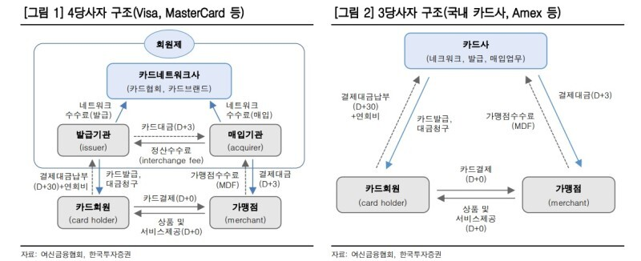

# 06. 판타스틱 플라스틱 - 카드의 탄생

카드는 현금 다음으로 많이 사용되는 결제 수단이자 가장 세계적인 결제수단이며 **표준화에 성공한 대표적 사례다.**

50여 년 전에 도입된 카드는 이제 상점에서 이뤄지는 모든 결제의 3분의 2를 차지한다. 매초마다 1만여 건의 카드 결제가 이뤄지며 카드 사용은 매년 10% 이상 꾸준히 증가하고 있다. 현금과 달리 **카드는 가장 세계화된 결제 수단**이다.

이제 우리는 물리적 플라스틱 카드 없이도 온라인에서 카드 결제를 할 수 있는 단계까지 왔다. 사기꾼들 때문에 카드 산업은 혁신할 수 있었고, 카드 공급업체 간의 경쟁 간의 경쟁이 도리어 엉뚱하게 가맹점에 부담하는 수수료를 높이기도 했다. 

최초의 신용카드는 매우 단순했다. 맥나마라와 슈나이더는 뉴욕의 레스토랑에서 사용할 수 있는 차지카드(Charge card)를 발행했다. 판지로 만들어진 초창기 차지카드 뒷면에는 다이너스 클럽 카드의 가맹점인 14개 레스토랑 상호가 적혀 있었다. 다이너스 클럽은 매달 카드 사용자들이 지난 30일 동안 사용한 비용에 대한 청구서를 보냈다. 레스토랑이 전체 지불액의 93%를 챙겼고 나머지는 다이너스 클럽이 수수료로 가져갔다. 이후 카드 소지자들도 비용을 부담하는 연회비 제도가 생겨났다.

맥나마라가 1952년에 매각하긴 했지만 다이너스 클럽 카드는 가맹점으 확보하고 지불 수단으로서 카드가 무엇인지를 대중에게 확실히 각인시켰다. 첫 출시 후 10년이 채 되기도 전에 다이너스 클럽 카드 소지자가 100만 명을 넘어섰다. 그 무렵 다이너스 클럽의 최대 경쟁업체는 탄탄한 재원을 기반으로 카드 시장에 진출한 아케리칸 익스프레스였다.

다이너스 클럽과 아멕스를 비롯해 다른 소규모 경쟁업체는 모두 사용자가 **매달 말 사용금액 전액을 갚아야 하는 차지카드엿다.** 그때까지도 차지카드는 종이로 제작됐다. 그리고 1959년 아멕스가 세계 최초의 플라스틱 신용카드를 선보였지만, 진정한 혁신은 비자의 전신인 뱅크아메리카드에서 시작되었다.

뱅크오브아메리카, 그리고 뱅크오브아메리카와 경쟁 관계에 있었으며 이후 마스터카드로 변신하게 되는 은행간카드협회는 세 가지 구조 변경을 통해 신용카드를 결제 시장의 완전한 '대세'로 만들어 버렸다. 첫째, 뱅크오브아메리카는 1950년대 말에 **할부 결제가 허용되는 진정한 '신용'카드를 도입**했다.

둘째, 1960년대 말 뱅크오브아메리카는 캘리포니아주 외의 지역에서의 카드 발급에 장애물이 되던 '주간 은행업무 금지' 규제를 교묘히 피할 방법을 찾아냈다. 그 방법은 **자사 시스템을 개방하고 다른 은행에 뱅크아메리카드를 발행할 수 있는 권한을 제공하는 것**이었다. 이는 차후 '4당사자 모델'(Four corner model)이라는 이름으로 알려진 결제 모델이자 현대 결제 시스템의 토대가 된 모델이다. 이 선택은 뱅크오브아메리카와 마스터카드의 성공에 주요한 역할을 했다.

4당사자의 첫 번째는 **카드 소지자**이고, 두 번째는 **가맹점**, 세 번째는 카드를 발행하는 **발행은행**(카드 소지자들의 은행), 네 번째는 **'매입은행'**이라고 알려진 가맹점 측 은행이다. 모델은 다음과 같이 작동한다. 먼저 카드 소지자가 가맹점에 카드를 제시하면, 가맹점이 매입은행에 해당 정보를 제공한다. 매입은행은 관련 내용을 다시 발행은행에 전달한다. 발행은행은 카드 소지자가 충분한 신용 혹은 잔액이 있는지 확인하고, 이를 충족하면 계좌에서 필요한 금액을 인출해 매입은행에 변제한다. 그리고 발행은행으로부터 돈을 받은 매입은행은 가맹점 계좌에 해당 금액을 입금한다.

뱅크아메리카의 세 번째 혁신은 **정산 수수료***Interchange fees였다. **소비자들은 결제를 하더라도 카드의 정산 수수료를 부담하지 않는다.** 이 구조는 소비자들에게 카드가 더욱 매력적으로 보이게 만들어 더 많은 소비자들을 유인하고, 카드 산업 전체가 원활하게 성장하도록 만든다.

대신, 가맹점 측 은행(매입은행)이 카드 소지자 측(발행은행)에 정산 수수료를 지불한다. 이 수수료는 카드회사(The card networks)가 요율을 결정하며, 지역과 카드 유형, 카맹점 유형에 따라 달라진다. 일반적으로 거래 가격의 1~3% 정도로 설정되며, 한 은행이 다른 은행에 지불하는 비용이지만 가맹점과 카드 소지자의 카드 거래 비용에 큰 영향을 미친다.

**카드 결제가 어떤 식으로 진행되는지 살펴보자.** 먼저 정산 수수료가 2%, 마크업 수수료가 0.5%라고 가정해보자. 카드 소지자가 100달러어치를 구매하면 발행은행이 '정산 수수료'를 떼고, 98달러를 매입은행에 전달한다. 매입은행은 처리 비용을 충당하기 위한 0.5달러의 마크업 수수료를 떼고, 가맹점에 97.5달러를 상환한다. 이런 과정을 통해 가맹점은 2.5달러의 '가맹점 수수료'(Merchant discount fees)를 제외한 나머지 금액을 받게 된다.

발행은행은 이 거래를 처리한 대가로 2%의 정산 수수료를 받는다. 그런데 무슨 명목으로 이 돈을 받는 것일까? 발행은행은 결제 처리비용보다 많은 수수료를 수취하는 대신, 카드 고객에게 공항 라운지 이용이나 구매 금액에 상응하는 캐쉬백등의 혜택을 제공함으로써 고객을 유치하는 역할을 맡고 있다.

표면적으로는 가맹점에게만 카드 수수료가 청구되는 방식은 카드 소지자에게 카드 거래가 무료라는 느낌을 주고, 심지어 카드 거래를 할수록 이익이라는 인상을 주는 동시에 가맹점들에게 모든 명시적 비용을 떠안기는 것이다. 카드 거래는 **어떤 결제 방안을 사용할지 결정하는 것은 판매자가 아니라 구매자**라는 사실을 기본 전체로 두고 있다.

하지만 **사실 소비자도 비용을 내고 있다.** 정산과 처리 수수료 같은 비용이 표면적으로는 카드 소지자가 아닌 가맹점에 부과될지 모르지만, 가맹점들은 대개 상품 가격을 높이는 방법으로 이런 비용을 고객에게 전가한다.

**수수료 기준이 가맹점의 유형에 따라 크게 차이가 난다.** 가맹점의 규모와 영향력에 따라 달라질 뿐 아니라 특정 가맹점의 위험도에 따라서도 수수료가 달라진다. 대형 슈퍼마켓은 구멍가게보다 수수료를 적게 내며, 윤락업소는 가장 높은 요율의 가맹점 수수료를 낸다. 그 이유는 이런 가맹점에서 거래한 고객들이 다음 날 아침 **거래를 부인할 가능성이 크기 때문이다.**

다음으로 높은 수수료를 내는 곳은 휴대전화, 노트북, 카메라 등 쉽게 재판매할 수 있는 제품을 취급하는 전자제품 판매업체들이다. (카드깡 목적으로 카드를 사용하는 소비자는 대금을 갚지 못할 가능성이 커서 높은 수수료를 부과한다.)