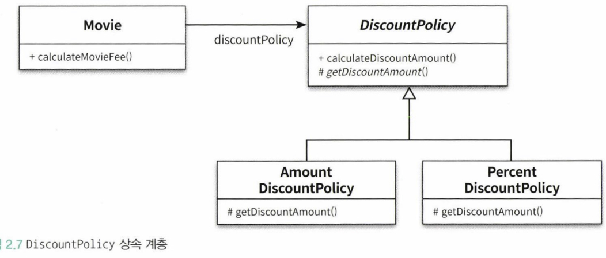
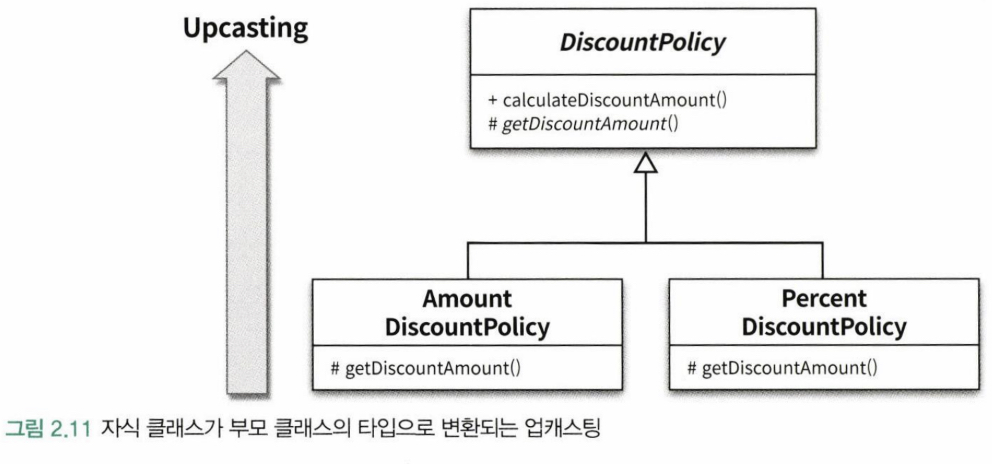
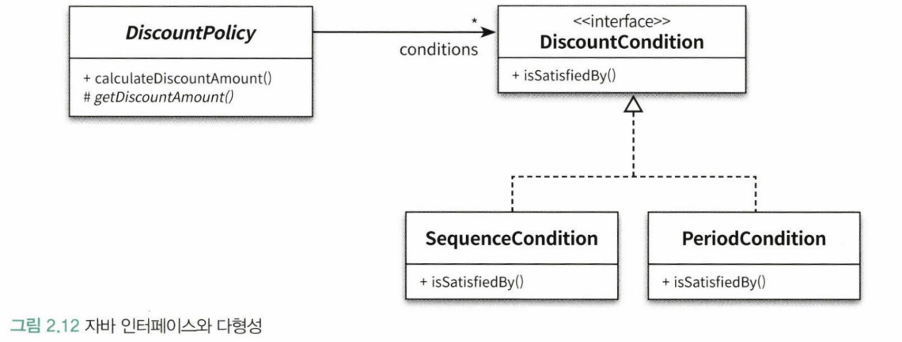
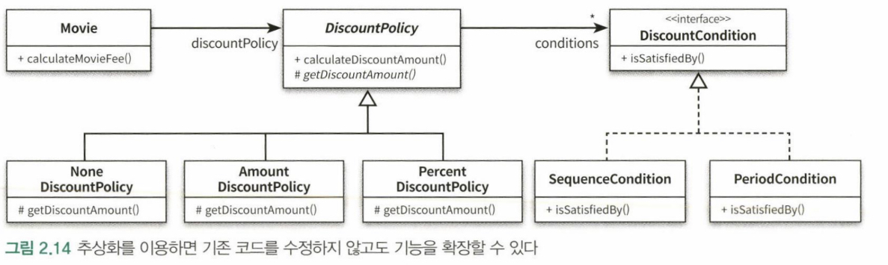
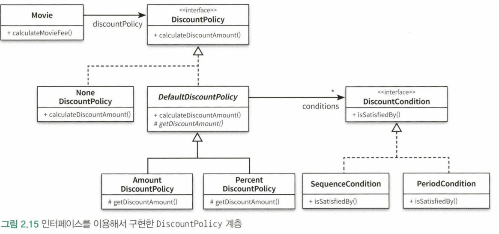

## 1) 협력, 객체, 클래스

객체지향은 객체를 지향하는 것이다. 객체지향 프로그래밍하는 동안 다음의 두 가지에 집중해야 한다.

첫째, 어떤 클래스가 필요한지를 고민하기 전에 어떤 객체들이 필요한지 고민하라. 클래스는 공통적인 상태와 행동을 공유하는 객체들을 추상화한 것이다. 따라서 클래스의 윤곽을 잡기 위해서는 어떤 객체들이 어떤 상태와 행동을 가지는지를 먼저 결정해야 한다.

둘째, 객체를 독립적인 존재가 아니라 기능을 구현하기 위해 협력하는 공동체의 일원으로 봐야 한다. 객체를 협력하는 공동체의 일원으로 바라보는 것은 설계를 유연하고 확장 가능하게 만든다. 객체들의 모양과 윤곽이 잡히면 공통된 특성과 상태를 가진 객체들을 타입으로 분류하고 이 타입을 기반으로 클래스를 구현하라.

## 2) 도메인 구조를 따르는 프로그램 구조

이 시점에서 도메인(domain)이라는 용어를 살펴보는 것이 좋다. `영화 예매 시스템`의 목적은 영화를 좀 더 쉽고 빠르게 예매하려는 사용자의 문제를 해결하는 것이다. 이처럼 문제를 해결하기 위해 사용자가 프로그램을 사용하는 분야를 **도메인**이라고 부른다.

## 3) 클래스 구현하기

도메인 개념들의 구조를 반영하는 적절한 클래스 구조를 만들었다면 코드를 구현해보자. 다른 개발자에 의해 개발된 클래스를 사용할 때 가장 중요한 것은 클래스의 결계를 구분 짓는 것이다. 클래스는 내부와 외부로 구분되며 훌륭한 클래스를 설계하기 위한 핵심은 어떤 부분을 외부에 공개하고 어떤 부분을 감출지를 결정하는 것이다.

클래스의 내부와 외부를 구분해야 하는 이유는 무엇일까? 그 이유는 경계의 명확성이 객체의 자율성을 보장하기 때문이다. 더 중요한 이유로 프로그래머에게 구현의 자유를 제공하기 때문이다.

### 자율적인 객체

먼저 두 가지 중요한 사실을 알아야 한다. 첫 번째 사실은 객체가 **상태(state)**와 **행동(behavior)**을 함께 가지는 복합적인 존재라는 것이다. 두 번째 사실은 객체가 스스로 판단하고 행동하는 **자율적인 존재**라는 것이다.

객체지향은 객체라는 단위 안에 데이터와 기능을 한 덩이로 묶음으로써 문제 영역의 아이디어를 적절하게 표현할 수 있게 했다. 이처럼 데이터와 기능을 객체 내부로 함께 묶는 것을 **캡슐화**라고 부른다.

객체 내부에 대한 접근을 통제하는 이유는 객체를 자율적인 존재로 만들기 위해서다. 객체지향의 핵심은 스스로 상태를 관리하고, 판단하고, 행동하는 자율적인 객체들의 공동체를 구성하는 것이다. 객체가 자율적인 존재로 우뚝 서기 위해서는 외부의 간섭을 최소화해야 한다. 외부에서는 객체가 어떤 상태에 놓여 있는지, 어떤 생각을 하고 있는지 알아서는 안 되며, 결정에 직접적으로 개입하려고 해서도 안 된다.

캡슐화와 접근제어는 객체를 두 부분으로 나눈다. 하나는 외부에서 접근 가능한 부분으로 이를 **퍼블릭 인터페이스(public interface)**라고 부른다. 다른 하나는 외부에서 접근 불가능하고 오직 내부에서만 접근 가능한 부분으로 이를 **구현(implementation)**이라고 부른다. **인터페이스와 구현의 분리(seperation of interface and implementation)** 원칙은 훌륭한 객체지향 프로그램을 만들기 위해 따라야 하는 핵심 원칙이다.

일반적으로 객체의 상태는 숨기로 행동만 외부에 공개해야 한다.

### 프로그래머의 자유

클래스 작성자는 클라이언트 프로그래머에게 필요한 부분만 공개하고 나머지는 꽁꽁 숨겨야 한다. 클라이언트 프로그래머가 숨겨 놓은 부분에 마음대로 접근할 수 없도록 방지함으로써ㅓ 클라이언트 프로그래머에 대한 영향을 걱정하지 않고도 내부 구현을 마음대로 변경할 수 있다. 이를 **구현 은닉(implementation hiding)**이라고 부른다.

객체의 외부와 내부를 구분하면 클라이언트 프로그래머가 알아야 할 지식의 양이 줄어들고 클래스 작성자가 자유롭게 구현을 변경할 수 있는 폭이 넓어진다. 따라서 클래스를 개발할 때마다 인터페이스와 구현을 깔끔하게 분리하기 위해 노력해야 한다.

설계가 필요한 이유는 변경을 관리하기 위해서라는 것을 기억하라. 객체지향 언어는 객체 사이의 의존성을 적절히 관리함으로써 변경에 대한 파급효과를 제어할 수 있는 다양한 방법을 제공한다. 객체의 변경을 관리할 수 있는 기법 중에서 가장 대표적인 것이 바로 접근제어다. 여러분은 변경될 가능성이 있는 세부적인 구현 내용을 private 영역 안에 감춤으로써 변경으로 인한 혼란을 최소화할 수 있다.

## 4) 협력하는 객체들의 공동체

객체지향의 장점은 객체를 이용해 도메인의 의미를 풍부하게 표현할 수 있다는 것이다. 따라서 의미를 좀 더 명시적이고 분명하게 표현할 수 있다면 객체를 사용해서 해당 개념을 구현하라. 그 개념이 비록 하나의 인스턴스 변수만 포함하더라도 개념을 명시적으로 표현하는 것은 전체적인 설계의 명확성과 유연성을 높이는 첫걸음이다.

영화를 예매하기 위해 Screening, Movie, Reservation 인스턴스들은 서로의 메서드를 호출하며 상호작용한다. 이처럼 시스템의 어떤 기능을 구현하기 위해 객체들 사이에 이뤄지는 상호작용을 **협력(Collaboration)**이라고 부른다.

## 5) 협력에 관한 짧은 이야기

객체는 다른 객체의 인터페이스에 공개된 행동을 수행하도록 **요청(request)**할 수 있다. 요청을 받은 객체는 자율적인 방법에 따라 요청을 처리한 후 **응답(response)**한다.

객체가 다른 객체와 상호작용할 수 있는 유일한 방법은 **메시지를 전송**하는 것뿐이다. 메시지를 수신한 객체는 스스로의 결정에 따라 자율적으로 메시지를 처리할 방법을 결정했다. 이처럼 수신된 메시지를 처리하기 위한 자신만의 방법을 **메서드**라고 부른다.

메시지와 메서드를 구분하는 것은 매우 중요하다. 객체지향 패러다임이 유연하고, 확장 가능하며, 재사용 가능한 설계를 낳는다는 명성을 얻게 된 배경에는 메시지와 메서드를 명확하게 구분한 것도 단단히 한몫한다. 메시지와 메서드의 구분에서부터 **다형성(polymorphism)**의 개념이 출발한다.

객체지향에서는 **상속(inheritance)**와 **다형성**이 중요하다. 그리고 그 기반에는 **추상화(abstraction)**라는 원리가 숨겨져 있다.

:::tip
추상클래스에서 부모 클래스에 기본적인 알고리즘의 흐름을 구현하고 중간에 필요한 처리를 자식 클래스에게 위임하는 디자인 패턴을 **TEMPLATE METHOD** 패턴이라고 부른다.
:::

## 6) 상속과 다형성

어떤 클래스가 다른 클래스에 접근할 수 있는 경로를 가지거나 해당 클래스의 객체의 메서드를 호출할 경우 두 클래스 사이에 의존성이 존재한다고 말한다.

코드의 의존성과 실행 시점의 의존성이 다를 수 있는데 유연하고, 쉽게 재사용할 수 있으며, 확장 가능한 객체지향 설계가 가지는 특징은 코드의 의존성과 실행 시점의 의존성이 다르다는 것이다.

코드의 의존성과 실행 시점의 의존성이 다르면 다를수록 코드를 이해하기 어려워진다. 코드를 이해하기 위해서는 코드뿐만 아니라 객체를 생성하고 연결하는 부분을 찾아야 하기 때문이다. 반면 코드의 의존성과 실행시점의 의존성이 다르면 다를수록 코드는 더 유연해지고 확장 가능해진다.

### 차이에 의한 프로그래밍

상속은 객체지향에서 코드를 재사용하기 위해 가장 널리 사용되는 방법이다. 상속을 이용하면 클래스 사이에 관계를 설정하는 것만으로 기존 클래스가 가지고 있는 모든 속성과 행동을 새로운 클래스에 포함시킬 수 있다.

상속은 기존 클래스를 기반으로 새로운 클래스를 쉽고 빠르게 추가할 수 있는 간편한 방법을 제공한다.

부모 클래스와 다른 부분만을 추가해서 새로운 클래스를 쉽고 빠르게 만드는 방법을 **차이에 의한 프로그래밍**이라고 부른다.

### 상속과 인터페이스

상속이 가치 있는 이유는 부모 클래스가 제공하는 모든 인터페이스를 자식 클래스가 물려받을 수 있기 때문이다. 이것은 상속을 바라보는 일반적인 인식과는 거리가 있는데 대부분의 사람들은 상속의 목적이 메서드나 인스턴스 변수를 재사용하는 것이라고 생각하기 떄문이다.

인터페이스는 객체가 이해할 수 있는 메시지의 목록을 정의한다는 것을 기억하라. 상속을 통해 자식 클래스는 자신의 인터페이스에 부모 클래스의 인터페이스를 포함하게 된다. 결과적으로 자식 클래스는 부모 클래스가 수신할 수 있는 모든 메시지를 수신할 수 있기 때문에 외부 객체는 자식 클래스를 부모 클래스와 동일한 타입으로 간주할 수 있다.

정리하면 자식 클래스는 상속을 통해 부모 클래스의 인터페이스를 물려받기 때문에 부모 클래스 대신 사용될 수 있다.

이처럼 자식 클래스가 부모 클래스를 대신하는 것을 **업캐스팅(upcasting)**이라고 부른다.

### 다형성

동일한 메시지를 전송해도 실제로 어떤 메서드가 실행될 것인지는 메시지를 수신하는 객체의 클래스가 무엇이냐에 따라 달라진다. 이를 **다형성**이라고 부른다.

다형성이란 동일한 메시지를 수신했을 때 객체의 타입에 따라 다르게 응답할 수 있는 능력을 의미한다. 따라서 다형적인 협력에 참여하는 객체들은 모두 같은 메시지를 이해할 수 있어야 한다. 다시 말해 인터페이스가 동일해야 한다는 것이다.

다형성을 구현하는 방법은 매우 다양하지만 메시지에 응답하기 위해 실행될 메서드를 컴파일 시점이 아닌 실행 시점에 결정한다는 공통점이 있다. 객체지향이 컴파일 시점의 의존성과 실행 시점의 의존성을 분리하고, 하나의 메시지를 선택적으로 서로 다른 메서드에 연결할 수 있는 이유가 바로 지연 바인딩이라는 메커니즘을 사용하기 때문이다.

상속을 이용하면 동일한 인터페이스를 공유하는 클래스들을 하나의 타입 계층으로 묶을 수 있다. 이런 이유로 대부분의 사람들은 다형성을 이야기할 때 상속을 함께 언급한다.

:::info 구현 상속과 인터페이스 상속
상속을 **구현 상속(implementation inheritance)**과 **인터페이스 상속(interface inheritance)**으로 분류할 수 있다. 흔히 구현 상속을 **서브클래싱(subclassing)**이라고 부르고 인터페이스 상속을 **서브타이핑(subtyping)**이라고 부른다. 순수하게 코드를 재사용하기 위한 목적으로 상속을 사용하는 것을 구현 상속이라고 부른다. 다형적인 협력을 위해 부모 클래스와 자식 클래스가 인터페이스를 공유할 수 있도록 상속을 이용하는 것을 인터페이스 상속이라고 부른다.

상속은 구현 상속이 아니라 인터페이스 상속을 위해 사용해야 한다. 대부분의 사람들은 코드 재사용을 상속의 주된 목적이라고 생각하지만 이것은 오해다. 인터페이스를 재사용할 목적이 아니라 구현을 재사용할 목적으로 상속을 사용하면 변경에 취약한 코드를 낳게 될 확률이 높다.
:::

### 인터페이스와 다형성

앞에서는 추상 클래스로 구현함으로써 자식 클래스들이 인터페이스와 내부 구현을 함께 상속받도록 만들었다. 그러나 종종 구현은 공유할 필요가 없고 순수하게 인터페이스만 공유하고 싶을 때가 있다. 이를 위해 **인터페이스**가 있다.

## 7) 추상화와 유연성

### 추상화의 힘

같은 계층에 속하는 클래스들이 공통으로 가질 수 있는 인터페이스를 정의하며 구현의 일부 또는 전체를 자식 클래스가 결정할 수 있도록 결정권을 위임한다.

추상화를 사용할 경우 두가지 장점이 있다. 첫 번째 장점은 추상화의 계층만 따로 떼어 놓고 살펴보면 요구사항의 정책을 높은 수준에서 서술할 수 있다는 것이다. 두 번째 장점은 추상화를 이용하면 설계가 좀 더 유연해진다는 것이다.

추상화를 사용하면 세부적인 내용을 무시한 채 상위 정책을 쉽고 간단하게 표현할 수 있다. 추상화의 이런 특징은 세부사항에 억눌리지 않고 상위 개념만으로도 도메인의 중요한 개념을 설명할 수 있게 한다. 추상화를 이용한 설계는 필요에 따라 표현의 수준을 조정하는 것을 가능하게 해준다.

추상화를 이용해 상위 정책을 기술한다는 것은 기본적인 애플리케이션의 협력 흐름을 기술한다는 것을 의미한다. 재사용 가능한 설계의 기본을 다르는 **디자인 패턴**이나 **프레임워크** 모두 추상화를 이용해 상위정책을 정의하는 객체지향의 메커니즘을 활용하고 있다.

:::note
추상화는 좀 더 일반적인 개념들을 표현한다.
:::

### 유연한 설계

책임의 위치를 결정하기 위해 조건문을 사용하는 것은 협력의 설계 측면에서 대부분의 경우 좋지 않은 선택이다. 항상 예외 케이스를 최소화하고 일관성을 유지할 수 있는 방법을 선택하라.

중요한 것은 기존 코드를 수정하지 않고 새로운 클래스를 추가하는 것만으로 애플리케이션의 기능을 확장할 수 있어야 한다는 것이다. 이처럼 추상화를 중심으로 코드의 구조를 설계하면 유연하고 확장 가능한 설계를 만들 수 있다.

추상화가 유연한 설계를 가능하게 하는 이유는 설계가 구체적인 상황에 결합되는 것을 방지하기 때문이다. **컨텍스트 독립성(context independency)**라고 불리는 이 개념은 프레임워크와 같은 유연한 설계가 필수적인 분야에서 그 진가를 발휘한다. (유연성이 필요한 곳에 추상화를 사용하라.)

### 추상 클래스와 인터페이스 트레이드오프

위의 그림에서 할인정책이 없는 NoneDiscountPolicy가 생겼다고 가정하자 NoneDiscoutPolicy 클래스를 보면 getDiscountAcount() 메서드가 어떤 값을 반환하더라도 상관이 없다는 사실을 알 수 있다. 부모 클래스인 DiscountPolicy에서 할인 조건이 없을 경우에는 getDiscountAmount() 메서드를 호출하지 않기 때문이다. 이것은 부모 클래스인 DiscountPolicy와 NoneDiscountPolicy를 개념적으로 결합시킨다. NoneDiscountPolicy의 개발자는 getDiscountAmount()가 호출되지 않을 경우 DiscountPolicy가 0원을 반환할 것이라는 사실을 가정하고 있기 떄문이다.

이 문제를 해결하는 방법은 DiscountPolicy를 인터페이스로 바꾸고 NoneDiscountPolicy가 DiscountPlicy의 getDiscountAmount() 메서드가 아닌 calculateDiscountAmount() 오퍼레이션을 오버라이딩하도록 변경하는 것이다.

이상적으로는 인터페이스를 사용하도록 변경한 설계가 더 좋을 것이다. 현실적으로는 NoneDiscountPolicy 만을 위해 인터페이스를 추가하는 것은 과하다는 생각이 들 수도 있을 것이다.

여기서 이야기하고 싶은 사실은 구현과 관련된 모든 것들이 트레이드오프의 대상이 될 수 있다는 사실이다.

### 코드 재사용

상속은 코드를 재사용하기 위해 널리 사용되는 방법이다. 하지만 코드 재사용을 위해서는 상속보다는 **합성**이 더 좋은 방법이다. 합성은 다른 객체의 인스턴스를 자신의 인스턴스 변수로 포함해서 재사용하는 방법을 말한다. 상속 대신 합성을 선호하는 이유는 무엇을까?

### 상속

**상속**은 객체지향에서 코드를 재사용하기 위해 널리 사용되는 기법이다. 하지만 두 가지 관점에서 설계에 안 좋은 영향을 미친다. 하나는 상속이 캡슐화를 위반한다는 것이고, 다른 하나는 설계를 유연하지 못하게 만든다는 것이다.

상속의 가장 큰 문제점은 캡슐화를 위반한다는 것이다. 상속을 이용하기 위해서는 부모 클래스의 내부 구조를 잘 알고 있어야 한다.

결과적으로 부모 클래스의 구현이 자식 클래스에게 노출되기 때문에 캡슐화가 약화된다. 캡슐화의 약화는ㄴ 자식 클래스가 부모 클래스에 강하게 결합되도록 만들기 때문에 부모 클래스를 변경할 때 자식 클래스도 함께 변경될 확률을 높인다. 결과적으로 상속을 과도하게 사용한 코드는 변경하기도 어려워진다.

상속의 두 번쨰 단점은 설계가 유연하지 않다는 것이다. 상속은 부모 클래스와 자식 클래스 사이의 관계를 컴파일 시점에 결정한다. 따라서 실행 시점에 객체의 종류를 변경하는 것이 불가능하다.

### 합성

인터페이스에 정의된 메시지를 통해서만 코드를 재사용하는 방법을 **합성**이라고 부른다.

합성은 상속이 가지는 두 가지 문제점을 모두 해결한다. 인터페이스에 정의된 메시지를 통해서만 재사용이 가능하기 때문에 구현을 효과적으로 캡슐화할 수 있다. 또한 의존하는 인스턴스를 교체하는 것이 비교적 쉽기 때문에 설계를 유연하게 만든다. 상속은 클래스를 통해 강하게 결합되는 데 비해 합성은 메시지를 통해 느슨하게 결합된다. 따라서 코드 재사용을 위해서는 상속보다는 합성을 선호하는 것이 좋은 방법이다.

그렇다고 상속을 사용하지 말라는 것은 아니다 대부분의 설계에서 상속과 합성을 함께 사용해야 한다. 코드를 재사용하는 경우에는 상속보다 합성을 선호하는 것이 옳지만 다형성을 위해 인터페이스를 재사용하는 경우에는 상속과 합성을 함께 조합해서 사용할 수 밖에 없다.

객체지향에서 가장 중요한 것은 애플리케이션의 기능을 구현하기 위해 협력에 참여하는 객체들 사이의 상호작용이다. 객체들은 협력에 참여하기 위해 역할을 부여받고 역할에 적합한 책임을 수행한다.

객체지향 설계의 핵심은 적절한 협력을 식별하고 협력에 필요한 역할을 정의한 후에 역할을 수행할 수 있는 적절한 객체에게 적절한 책임을 할당하는 것이다.
