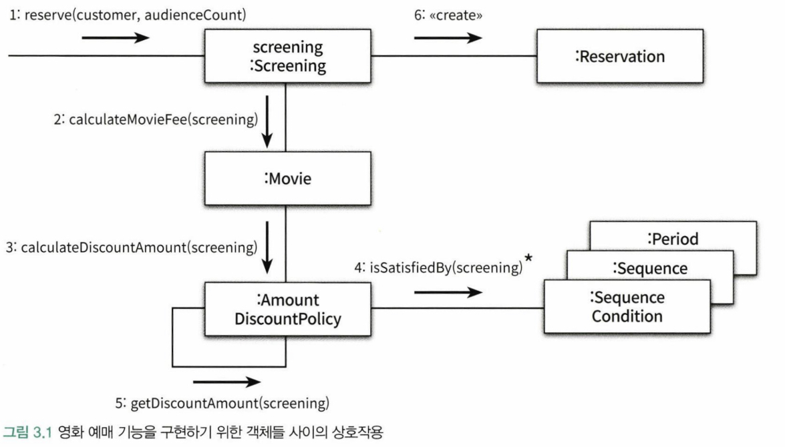
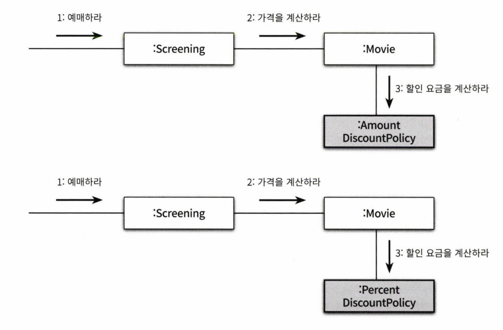

상속은 코드를 제사용할 수 있는 가장 널리 알려진 방법이지만 캡슐화의 측면에서 합성이 더 좋은 방법이라는 사실을 이해했을 것이다. 유연한 객체지향 프로그램을 위해서는 컴파일 시간 의존성과 실행 시간 의존성이 달라야 한다는 사실 역시 알게 됐다.

객체지향 패러다임의 관점에서 핵심은 역할(role), 책임(responsibility), 협력(collaboration)이다.

객체지향 설계의 핵심은 협력을 구성하기 위해 적절한 객체를 찾고 적절한 책임을 할당하는 과정에서 드러난다. 애플리케이션의 기능을 구현하기 위해 어떤 협력이 필요하고 협력을 위해 어떤 역할과 책임이 필요한지를 고민하지 않은 채 너무 이른 시기에 구현에 초점을 맞추는 것은 변경하기 어렵고 유연하지 못한 코드를 낳는 원인이 된다.

## 1) 협력

### 영화 예매 시스템 돌아보기

사용자가 영화 예매 시스템을 통해 영화를 예매할 수 있게 하려면 다양한 객체들이 참여하는 협럭을 구축해야 한다.

그림처엄 객체지향 원칙을 따르는 애플리케이션의 제어 흐름은 어떤 하나의 객체에 의해 통제되지 않고 다양한 객체들 사이에 균형있게 분배되는 것이 일반적이다. 객체들은 요청의 흐름을 따라 자신에게 분배된 로직을 실행하면서 애플리케이션의 전체 기능을 완성한다.

다양한 객체들이 영화 예매라는 기능을 구현하기 위해 메시지를 주고받으면서 상호작용한다. 이처럼 객체들이 애플리케이션의 기능을 구현하기 위해 수행하는 상호작용을 **협력**이라고 한다. 객체가 협력에 참여하기 위해 수행하는 로직을 **책임**이라고 부른다. 객체들이 협력 안에서 수행하는 책임들이 모여 객체가 수행하는 **역할**을 구성한다.

### 협력

객체지향 시스템은 자율적인 객체들의 공동체다. 협력은 객체지향의 세계에서 기능을 구현할 수 있는 유일한 방법이다. **메시지 전송**은 객체 사이의 협력을 위해 사용할 수 있는 유일한 커뮤니케이션 수단이다.

> 협력이란 어떤 객체가 다른 객체에게 무엇인가를 요청하는 것이다. 한 객체는 어떤 것이 필요할 때 다른 객체에게 전적으로 위임하거나 서로 협력한다. 즉, 두 객체가 상호작용을 통해 더 큰 책임을 수행하는 것이다.

메시지를 수신한 객체는 **메서드**를 실행해 요청에 응답한다. 여기서 객체가 메시지를 처리할 방법은 스스로 처리한다는 점이 중요하다. 외부 객체는 오직 메시지만 전송할 뿐이며 메시지를 어떻게 처리할지는 메시지를 수신한 객체가 직접 결정한다. 이것은 객체가 자신의 일을 스스로 처리할 수 있는 자율적인 존재라는 것을 의미한다.

자율적인 객체란 자신의 상태를 직접 관리하고 스스로의 결정에 따라 행동하는 객체다. 객체의 자율성을 보장하기 위해서는 필요한 정보와 정보에 기반한 행동을 같은 객체 안에 모아놓아야 한다.

결과적으로 객체를 자율적으로 만드는 가장 기본적인 방법은 내부 구현을 **캡슐화**하는 것이다. 캡슐화를 통해 변경에 대한 파급효과를 제한할 수 있기 때문에 자율적인 객체는 변경하기도 쉬워진다. 캡슐화를 유지하면 다른 객체와의 결합도를 느슨하게 유지할 수 있고 변경에 대한 여파가 확산되는 것을 막을 수 있다.

정리해보자. 자율적인 객체는 자신에게 할당된 책임을 수행하던 중에 필요한 정보를 알지 못하거나 외부의 도움이 필요한 경우 적절한 객체에게 메시지를 전송해서 협력을 요청한다. 메시지를 수신한 객체 역시 메시지를 처리하던 중에 직접 처리할 수 없는 정보나 행동이 필요한 경우 또 다른 객체에게 도움을 요청한다. 이처럼 객체들 사이의 협럭을 구성하는 일련의 요청과 응답의 흐름을 통해 애플리케이션의 기능이 구현된다.

### 협력이 설계를 위한 문맥을 결정한다.

객체지향은 객체를 중심에 놓는 프로그래밍 패러다임이다. 여기서 객체란 상태와 행동을 함께 캡슐화하는 실행 단위다.

애플리케이션 안에 객체가 필요하다면 그 이유는 단 하나여야 한다. 그 객체가 어떤 협력에 참여하고 있기 때문이다. 그리고 객체가 협력에 참여할 수 있는 이유는 협력에 필요한 적절한 행동을 보유하고 있기 때문이다.

Movie 객체는 어떤 행동을 수행할 수 있어야 할까? 영화라는 단어를 들었을 때는 대부분의 사람들은 극장에서 영화를 상영하는 장면을 상상할 것이고 자연스럽게 Movie 객체가 play라는 행동을 수행할 것이라고 생각할 것이다. 그러나 영화 예매 시스템 안의 Movie에는 영화를 상영하기 위한 어떤 코드도 포함돼있지 않다. Movie에 포함된 대부분의 메서드는 요금을 계산하는 행동과 관련된 것이다. 이것은 Movie가 영화를 예매하기 위한 협럭에 참여하고 있고 그 안에서 요금을 계산하는 책임을 지고 있기 때문이다.

Movie의 행동을 결정하는 것은 영화 예매를 위한 협력이다. 협력이라는 문맥을 고려하지 않고 Movie의 행동을 결정하는 것은 아무런 의미가 없다.

객체의 행동을 결정하는 것이 협력이라면 객체의 상태를 결정하는 것은 행동이다. 객체의 상태는 그 객체가 행동을 수행하는 데 필요한 정보가 무엇인지로 결정된다. 객체는 자신의 상태를 스스로 결정하고 관리하는 자율적인 존재이기 때문에 객체가 수행하는 행동에 필요한 상태도 함께 가지고 있어야 한다.

상태는 객체가 행동하는 데 필요한 정보에 의해 결정되고 행동은 협력 안에서 객체가 처리할 메시지로 결정된다. 결과적으로 객체가 참여하는 협력이 객체를 구성하는 행동과 상태 모두를 결정한다. 따라서 협력은 객체를 설계하는 데 필요한 일종의 **문맥(context)**을 제공한다.

## 2) 책임

### 책임이란 무엇인가

객체를 설계하기 위해 필요한 문맥인 협력이 갖춰졌다고 하자. 다음으로 할 일은 협력에 필요한 행동을 수행할 수 있는 적절한 객체를 찾는 것이다. 이때 협력에 참여하기 위해 객체가 수행하는 행동을 **책임**이라고 부른다.

책임이란 객체에 의해 정의되는 응집도 있는 행위의 집합으로, 객체가 유지해야 하는 정보와 수행할 수 있는 행동에 대해 개략적으로 서술한 문장이다. 즉 객체의 책임은 객체가 '무엇을 알고 있는가'와 '무엇을 할 수 있는가'로 구성된다.

##### 하는 것

- 객체를 생성하거나 계산을 수행하는 등의 스스로 하는 것
- 다른 객체의 행동을 시작시키는 것
- 다른 객체의 활동을 제어하고 조절하는 것

##### 아는 것

- 사적인 정보에 관해 아는 것
- 관련된 객체에 관해 아는 것
- 자신이 유도하거나 계산할 수 있는 것에 관해 아는 것

영화 예매 시스템에서 Screening의 책임은 무엇인가? 영화를 예매하는 것이다. Movie의 책임은 무엇인가? 요금을 계산하는 것이다. Screening은 영화를 예매할 수 있어야 한다. 이것은 하는 것과 관련된 책임이다. Screening은 자신이 상영할 영화를 알고 있어야 한다. 이것은 아는 것과 관련된 책임이다. Movie는 예매 가격을 계산할 책임을 진다. 이것은 하는 것과 관련되 책임이다. 또한 가격과 어떤 할인 정책이 적용됐는지도 알고 있어야 한다. 이것은 아는 것과 관련된 책임이다.

책임의 관점에서 '아는 것'과 '하는 것'이 밀접하게 연관돼 있다는 점이다. 객체는 자신이 맡은 책임을 수행하는 데 필요한 정보를 알고 있을 책임이 있다. 또한 객체는 자신이 할 수 없는 작업을 도와줄 객체를 알고 있을 책임이 있다. 어떤 책임을 수행하기 위해서는 그 책임을 수행하는 데 필요한 정보도 함께 알아야 할 책임이 있는 것이다.

> 객체지향 개발에서 가장 중요한 능력은 책임을 능숙하게 수프트웨어 객체에 할당하는 것
>
> - 크레이그 라만

객체지향 설계에서 가장 중요한 것은 책임이다. 객체에게 얼마나 적절한 책임을 할당하느냐가 설계의 전체적인 품질을 결정한다.

### 책임 할당

자율적인 객체를 만드는 가장 기본적인 방법은 책임을 수행하는 데 필요한 정보를 가장 잘 알고 있는 전문가에게 그 책임을 할당하는 것이다. 이를 INFORMATION EXPERT 패턴이라고 부른다.

객체들은 협력에 필요한 지식과 방법을 가장 잘 알고 있는 개체에게 도움을 요청한다. 요청에 응답하기 위해 필요한 이 행동이 객체가 수행할 책임으로 이어지는 것이다.

따라서 객체에게 책임을 할당하기 위해서는 먼저 협력이라는 문맥을 정의해야 한다. 협력을 설계하는 출발점은 시스템이 사용자에게 제공하는 기능을 시스템이 담당할 하나의 책임으로 바라보는 것이다.

영화 예매 시스템을 예로 들어 정보 전문가에게 책임을 할당하는 방법을 살펴보자. 시스템이 사용자에게 제공해야할 기능은 영화를 예매하는 것이고 이 기능을 시스템에 제공할 책임으로 할당할 것이다. 이 예에서는 *예매하라*라는 이름의 메시지로 협력을 시작하는 것이 좋을 것 같다.

메시지를 선택했으면 메시지를 처리할 적절한 객체를 선택해야 한다. 영화를 예매하는 책임을 어떤 객체에 할당해야 할까? 기본 전략은 정보 전문가에게 책임을 할당하는 것이다. 영화를 예매하기 위해서는 상영 시간과 기본 요금을 알아야 한다. 이 정보를 소유하고 있거나 해당 정보의 소유자를 가장 잘 알고 있는 전문가는 누구인가? Screening이다.

영화를 예매하기 위해서는 예매 가격을 계산해야 한다. 안타깝게도 Screening은 예매 가격을 계산하는데 필요한 정보를 충분히 알고 있지 않다. Screening은 예매에 대해서는 정보 전문가일지 몰라도 영화가격 자체에 대해서는 정보 전문가가 아니다. 이것은 Screening이 외부의 객체에게 가격 계산을 요청해야 한다는 것을 의미한다.

*가격을 계산하라*라는 이름의 새로운 메시지가 필요하다. 가격을 계산하는 데 필요한 정보를 가장 많이 알고 있는 정보 전문가를 선택해야 한다. 가격을 계산하기 위해서는 가격과 할인 정책이 필요하다. 이 모든 정보를 가장 잘 알고 있는 전문가는 Movie다. 가격을 계산할 책임을 Movie에게 할당하자.

협력을 설계하면서 객체의 책임을 식별해 나가는 과정에서 최종적으로 얻게 되는 결과물은 시스템을 구성하는 객체들의 인터페이스와 오퍼레이션의 목록이다.

### 책임 주도 설계

지금까지 살펴본 내용의 요점은 협력의 설계하기 위해서는 책임에 초점을 맞춰야 한다는 것이다. 어떤 책임을 선택하느냐가 전체적인 설계의 방향과 흐름을 결정한다. 이처럼 책임을 찾고 책임을 수행할 적절한 객체를 찾아 책임을 할당하는 방식으로 협력을 설계하는 방법을 **책임 주도 설계**라고 부른다.

- 시스템이 사용자에게 제공해야 하는 기능인 시스템 책임을 파악한다.
- 시스템 책임을 더 작은 책임으로 분할한다.
- 분할된 책임을 수행할 수 있는 적절한 객체 또는 역할을 찾아 책임을 할당한다.
- 객체가 책임을 수행하는 도중 다른 객체의 도움이 필요한 경우 이를 책임질 적절한 객체 또는 역할을 찾는다.
- 해당 객체 또는 역할에게 책임을 할당함으로써 두 객체가 협력하게 한다.

협력은 객체를 설계하기 위한 구체적인 문맥을 제공한다. 책임 주도 설계는 자연스럽게 객체의 구현이 아닌 책임에 집중할 수 있게 한다. 구현이 아닌 책임에 집중하는 것이 중요한 이유는 유연하고 견고한 객체지향 시스템을 위해 가장 중요한 재료가 바로 책임이기 때문이다.

### 메시지가 객체를 결정한다.

객체가 메시지를 선택하는 것이 아니라 메시지가 객체를 선택해야 하는 두 가지 중요한 이유가 있다.

첫째, 객체가 **최소한의 인터페이스**를 가질 수 있게 된다. 필요한 메시지가 식별될 때까지 객체의 퍼블릭 인터페이스에 어떤 것도 추가하지 않기 때문에 객체는 어플리케이션에 크지도, 작지도 않은 꼭 필요한 크기의 퍼블릭 인터페이스를 가질 수 있다.

둘째, 객체는 충분히 **추상적인 인터페이스**를 가질 수 있게 된다. 객체의 인터페이스는 무엇을 하는지는 표현해야 하지만 어떻게 수행하는지를 노출해서는 안된다.

결과적으로 협력을 구성하는 객체들의 인터페이스는 충분히 추상적인 동시에 최소한의 크기를 유지할 수 있어야 한다.

### 행동이 상태를 걸정한다.

객체가 존재하는 이유는 협력에 참여하기 위해서다. 따라서 객체는 협력에 필요한 행동을 제공해야 한다. 객체를 객체답게 만드는 것은 객체의 상태가 아니라 객체가 다른 객체에게 제공하는 행동이다.

객체의 행동은 객체가 협력에 참여할 수 있는 유일한 방법이다. 객체가 협력에 적합한지를 결정하는 것은 그 객체의 상태가 아니라 행동이다. 얼마나 적절한 객체를 창조했느냐는 얼마나 적절한 책임을 할당했느냐에 달려있고, 책임이 얼마나 적절한지는 협력에 얼마나 적절한가에 달려있다.

객체의 상태를 먼저 정의하고 상태에 필요한 행동을 결정하게 되면 객체의 내부 구현이 객체의 퍼블릭 인터페이스에 노출되도록 만들기 때문에 **캡슐화**를 저해한다. 객체의 내부 구현을 변경하면 퍼블릭 인터페이스도 함께 변경되고, 결국 객체에 의존하는 클라이언트로 변경의 영향이 전파된다. 객체의 내부 구현에 초점을 맞춘 걸계 방법을 **데이터-주도 설계**라고 부른다.

캡슐화를 위반하지 않도록 구현에 대한 결정을 뒤로 미루면서 객체의 행위를 고려하기 위해서는 항상 협력이라는 문맥 안에서 객체를 생각해야 한다. 협력 관계 속에서 다른 객체에게 무엇을 제공해야 하고 다른 객체로부터 무엇을 얻어야 하는지를 고민해야만 훌륭한 책임을 수확할 수 있다. 개별 객체의 상태와 행동이 아닌 시스템의 기능을 구현하기 위한 협력에 초점을 맞춰야만 응집도가 높고 결합도가 낮은 객체들을 창조할 수 있다.

중요한 것은 객체의 상태가 아니라 행동이다. 객체가 가질 수 있는 상태는 행동을 결정하고 나서야 결정할 수 있다. 그리고 그 행동이 바로 객체의 책임이 된다.

## 3) 역할

### 역할과 협력

객체는 협력이라는 주어진 문맥 안에서 특정한 목적을 갖게 된다. 객체의 목적은 협력 안에서 객체가 맡게 되는 책임의 집합으로 표시된다. 이처럼 객체가 어떤 특정한 협력 안에서 수행하는 책임의 집합을 **역할**이라고 부른다. 실제로 협력을 모델링할 때는 특정한 객체가 아니라 역할에게 책임을 할당한다고 생각하는 게 좋다.

### 유연하고 재사용 가능한 협력

역할이 중요한 이유는 역할을 통해 유연하고 재사용 가능한 협력을 얻을 수 있기 때문이다. 이해를 돕기 위해 역할이라는 개념을 고려하지 않고 객체에게 책임을 할당한다고 가정해보자. Movie가 가격을 계산하기 위해서는 할인 요금이 필요하다. 따라서 다음과 같이 *할인 요금을 계산하라*라는 메시지를 전송해서 외부의 객체에게 도움을 요청한다.

영화 예매 도메인에는 금액 할인 정책과 비율 할인 정책이라는 두 가지 종류의 가격 할인 정책이 존재하기 때문에 AmountDiscountPolicy 인스턴스와 PercentDicountPolicy 인스턴스라는 두 가지 종류의 객체가 _할인 요금을 계산하라_ 메시지에 응답할 수 있어야 한다. 그렇다면 두 종류의 객체가 참여하는 협력을 개별적으로 만들어야 할까?

안타깝게도 이런 방법으로 두 협력을 구현하면 대부분의 코드가 중복되고 말 것이다.

문제를 해결하기 위해서는 객체가 아닌 책임에 초점을 맞춰야 한다. 순수하게 책임의 관점에서 두 협력을 바라보면 AmountDiscountPolicy와 PercentDiscountPolicy 모두 할인 요금 계산이라는 동일한 책임을 수행한다는 사실을 알 수 있다. 따라서 객체라는 존재를 지우고 *할인 요금을 계산하라*라는 메시지에 응답할 수 있는 대표자를 생각하면 두 협력을 하나로 통합할 수 있을 것이다. 이것이 바로 *역할*이다.

:::tip

역할은 다른 것으로 교체할 수 있는 책임의 집합이다.

:::

여기서의 역할이 두 종류의 구체적인 객체를 포괄하는 **추상화**라는 점에 주목하라.

요점은 동일한 책임을 수행하는 역할을 기반으로 두 개의 협력을 하나로 통합할 수 있다는 것이다. 따라서 역할을 이용하면 불필요한 중복 코드를 제거할 수 있다. 그리고 협력이 더 유연해졌다. 이제 새로운 할인 정책을 추가하기 위해 새로운 협력을 추가할 필요가 없어졌다. DiscountPolicy 역할을 수행할 수 있는 어떤 객체라도 이 협력에 참여할 수 있게 됐다. 따라서 책임과 역할을 중심으로 협력을 바라보는 것이 바로 변경과 확장이 용이한 유연한 설계로 나아가는 첫걸음이다.

:::info

##### 역할의 구현

추상화라는 말에서 예상했겠지만 역할을 구현하는 가장 일반적인 방법은 **추상클래스**와 **인터페이스**를 사용하는 것이다. 추상 클래스는 책임의 일부를 구현해 놓은 것이고 인터페이스는 일체의 구현 없이 책임의 집합만을 나열해 놓았다는 차이가 있지만 둘 모두 역할을 정의할 수 있는 구현 방법이다.

:::

### 객체 대 역할

역할은 객체가 참여할 수 있는 일종의 슬롯이다. 따라서 유용하고 재사용 가능한 설계라는 문맥에서 역할의 중요성은 아무리 강조해도 지나치지 않을 것이다. 협력에 적합한 책임을 수행하는 대상이 한 종류라면 간단하게 객체로 간주한다. 만약 여러 종류의 객체들이 참여할 수 있다면 역할이라고 부르면 된다.

대부분의 경우에 어떤 것이 역할이고 어떤 것이 객체인지 불분명하다. 개인적인 견해는 설계 초반에는 적절한 책임과 협력의 큰 그림을 탐색하는 것이 가장 중요한 목표여야 하고 역할과 객체를 명확하게 구분하는 것은 그렇게 중요하지는 않다는 것이다. 따라서 애매하다면 단순하게 객체로 시작하고 반복적으로 책임과 협력을 정제해가면서 필요한 순간에 객체로부터 역할을 분리해내는 것이 가장 좋은 방법이다.

협력을 구체적인 객체가 아니라 추상적인 역할의 관점에서 설계하면 협력이 유연하고 재사용 가능해진다.

### 역할과 추상화

추상화를 이용한 설계가 가질 수 있는 두 가지 장점은 다음과 같다. 첫 번째 장점은 추상화 계층만을 이용하면 중요한 정책을 상위 수준에서 단순화할 수 있다는 것이다. 두 번째 장점은 설계가 좀 더 유연해진다는 것이다.

역할은 공통의 책임을 바탕으로 객체의 종류를 숨기기 때문에 이런 관점에서 역할을 객체의 추상화로 볼 수 있다. 따라서 추상화가 가지는 두 가지 장점은 협력의 관점에서 역할에도 동일하게 적용될 수 있다.

추상화의 첫 번째 장점은 세부 사항에 억눌리지 않고도 상위 수준의 정책을 쉽고 간단하게 표현할 수 있다는 것이다. 추상화를 적절하게 사용하면 불필요한 세부 사항을 생략하고 핵심적인 개념을 강조할 수 있다.

객체에게 중요한 것은 행동이라는 사실을 기억하라. 역할이 중요한 이유는 동일한 협력을 수행하는 개체들을 추상화할 수 있기 때문이다.

추상화의 두 번째 장점은 설계를 유연하게 만들 수 있다는 것이다. 협력 안에서 동일한 책임을 수행하는 객체들은 동일한 역할을 수행하기 때문에 서로 대체 가능하다. 따라서 역할은 다양한 환경에서 다양한 객체들을 수용할 수 있게 해주므로 협력을 유연하게 만든다.

협력 안에서 역할이라는 추상화를 이용하면 기존 코드를 수정하지 않고도 새로운 행동을 추가할 수 있다.
