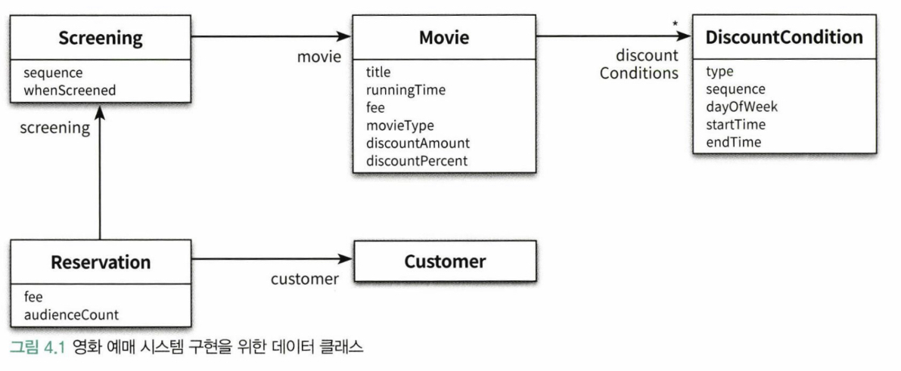
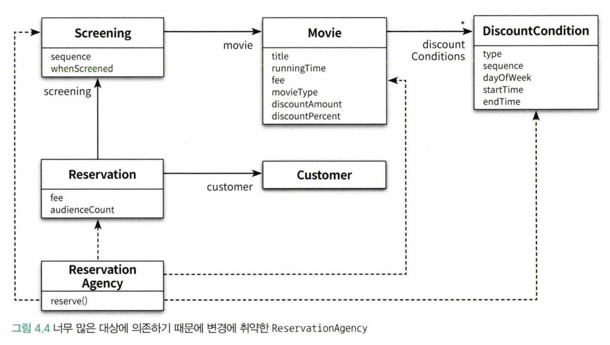
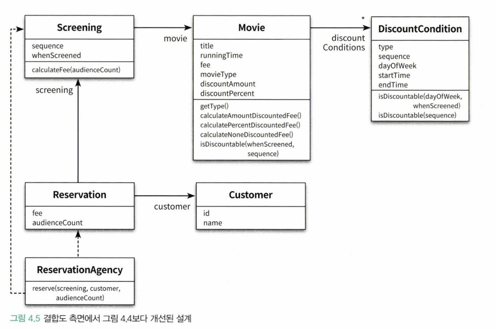

객체지향 설계의 핵심은 역할, 책임, 협력이다. 협력은 애플리케이션의 기능을 구현하기 위해 메시지를 주고받는 객체들 사이의 상호작용이다. 책임은 객체가 다른 객체와 협력하기 위해 수행하는 행동이고, 역할은 대체 가능한 책임의 집합이다.

책임 주도 설계라는 이름에서 알 수 있는 것처럼 역할, 책임, 협력 중에서 가장 중요한 것은 '책임'이다. 객체들이 수행할 책임이 적절하게 할당되지 못한 상황에서는 원활한 협력도 기대할 수 없을 것이다. 책임이 객체지향 애플리케이션 전체의 품질을 결정하는 것이다.

객체지향 설계란 올바른 객체에게 올바른 책임을 할당하면서 낮은 결합도와 높은 응집도를 가진 구조를 창조하는 활동이다. 이 정의에는 두 가지 관점이 있다. 첫 번째 관점은 객체지향 설계의 핵심이 책임이라는 것이다. 두 번째 관점은 책임을 할당하는 작업이 응집도와 결합도 같은 설계 품질과 깊이 연관돼 있다는 것이다.

설계는 변경을 위해 존재하고 변경에는 어떤 식으로든 비용이 발생한다. 훌륭한 설계란 합리적인 비용안에서 변경을 수용할 수 있는 구조를 만드는 것이다. 적절한 비용 안에서 쉽게 변경할 수 있는 설계는 응집도가 높고 서로 느슨하게 결합돼 있는 요소로 구성된다.

결합도와 응집도를 합리적인 수준으로 유지할 수 있는 중요한 원칙이 있다. 객체의 상태가 아니라 객체의 행동에 초점을 맞추는 것이다. 객체를 단순한 데이터의 집합으로 바라보는 시각은 내부 구현을 퍼블릭 인터페이스에 노출시키는 결과를 낳기 때문에 결과적으로 설계가 변경에 취약해진다. 책임은 객체의 상태에서 행동으로, 나아가 객체와 객체 사이의 상호작용으로 설계 중심을 이동시키고, 결합도가 낮고 응집도가 높으며 구현을 효과적으로 캡슐화하는 객체들을 창조할 수 있는 기반을 제공한다.

## 1) 데이터 중심의 영화 예매 시스템

데이터 중심의 관점에서 객체는 자신이 포함하고 있는 데이터를 조작하는 데 필요한 오퍼레이션을 정의한다. 책임 중심의 관점에서 객체는 다른 객체가 요청할 수 있는 오퍼레이션을 위해 필요한 상태를 보관한다. 데이터 중심의 관점은 객체의 상태에 초점을 맞추고 책임 중심의 관점은 객체의 행동에 초점을 맞춘다. 전자는 객체를 독립된 데이터 덩어리로 바라보고 후자는 객체를 협력하는 공동체의 일원으로 바라본다.

훌륭한 객체지향 설계는 데이터가 아니라 책임에 초점을 맞춰야 한다. 이유는 변경과 관련이 있다.

객체의 상태는 구현에 속한다. 구현은 불안정하기 때문에 변하기 쉽다. 구현에 관한 세부사항이 객체의 인터페이스에 스며들게 되어 캡슐화의 원칙이 무너진다. 결과적으로 상태 변경은 인터페이스의 변경을 초래하며 이 인터페이스에 의존하는 모든 객체에게 변경의 영향이 퍼지게 된다. 따라서 데이터에 초점을 맞추는 설계는 변경에 취약하다.

객체의 책임은 인터페이스에 속한다. 객체는 책임을 드러내는 안정적인 인터페이스 뒤로 책임을 수행하는 데 필요한 상태를 캡슐화함으로써 구현 변경에 대한 파장이 외부로 퍼져나가는 것을 방지한다. 따라서 책임에 초점을 맞추면 변경에 안정적인 설계를 얻을 수 있게 된다.

### 데이터를 준비하자

데이터 중심의 설계는 객체가 내부에 저장해야 하는 '데이터가 무엇인가'를 묻는 것으로 시작한다. 먼저 Movie에 저장될 데이터를 결정하는 것으로 설계를 시작하자.

```java
public class Movie {
  private String title;
  private Duration runningTime;
  private Money fee;
  private List<DiscountCondition> discountConditions;

  private MovieType movieType;
  private Money discountAmount;
  private double discountPercent;
}
```

데이터 중심의 Movie 클래스 역시 책임 중심의 Movie 클래스와 마찬가지로 영화를 표현하는 가장 기본적인 정보(title, runningTime, fee)를 인스턴스 변수로 포함한다. 하지만 기존의 설계와 동일한 부분은 여기까지다.

가장 두드러지는 차이점은 할인 조건의 목록(discountConditions)이 인스턴스 변수로 Movie 안에 직접 포함돼 있다는 것이다. 또한 할인 정책을 DiscountPolicy라는 별도의 클래스로 분리했던 이전 예제와 달리 금액 할인 정책에 사용되는 할인 금액(discountAmount)과 비율 할인 정책에 사용되는 할인 비율(discountPercent)을 Movie 안에서 직접 정의하고 있다.

movieType의 값이 AMOUNT_DISCOUNT라면 discountAmount에 저장된 값을 사용하고 PERCENT_DISCOUNT라면 discountPercent에 저장된 값을 사용한다. NONE_DISCOUNT인 경우에는 할인 정책을 적용하지 말아야 하기 때문에 discountAmount와 discountPercent 중 어떤 값도 사용하지 않는다.

```java
public enum MovieType {
  AMOUNT_DISCOUNT, // 금액 할인 정책
  PERCENT_DISCOUNT, // 비율 할인 정책
  NONE_DISCOUNT // 미적용
}
```

데이터 중심의 설계에서는 객체가 포함해야 하는 데이터에 집중한다. Movie 클래스의 경우처럼 객체의 종류를 저장하는 인스턴스 변수(movieType)와 인스턴스의 종류에 따라 배타적으로 사용될 인스턴스 변수(discountAmount, discountPercent)를 하나의 클래스 안에 함께 포함시키는 방식은 데이터 중심의 설계 안에서 흔히 볼 수 있는 패턴이다.

객체지향의 가장 중요한 원칙은 캡슐화이므로 내부 데이터가 객체의 엷은 막을 빠져나가 외부의 다른 객체들을 오염시키는 것을 막아야 한다. 이를 달성할 수 있는 가장 간단한 방법은 내부의 데이터를 반환하는 **접근자(accessor)**와 데이터를 변경하는 **수정자(mutator)**를 추가하는 것이다.

```java
public class Movie {
  public MovieType getMovieType() {
    return movieType;
  }

  public void setMovieType(MovieType movieType) {
    this.movieType = movieType;
  }

  ...
}
```

Movie를 구현하는 데 필요한 데이터를 결정했고 메서드를 이용해 내부 데이터를 캡슐화하는 데도 성공했다. 이제 할인 조건을 구현해보자. 영화 예매 도메인에는 순번 조건과 기간 조건이라는 두 가지 종류의 할인 조건이 존재한다. 순번 조건은 상영 순번을 이용해 할인 여부를 판단하고 기간 조건은 상영 시간을 이용해 할인 여부를 판단한다.

할인 조건을 구현하는데 필요한 데이터는 무엇인가? 이를 위해 할인 조건의 타입을 저장할 DiscountConditionType을 정의하자.

```java
public enum DiscountConditionType {
  SEQUENCE, // 순번 조건
  PERIOD // 기간 조건
}
```

할인 조건을 구현하는 DiscountCondition은 할인 조건의 타입을 저장할 인스턴스 변수인 type을 포함한다. 또한 movieType의 경우와 마찬가지로 순번 조건에서만 사용되는 데이터인 상영 순번(sequence)과 기간 조건에서만 사용되는 데이터가 포함된다.

```java
public class DiscountCondition {
  private DiscountConditionType type;

  private int sequence;

  private DayOfWeek dayOfWeek;
  private LocalTime startTime;
  private LocalTime endTime;
}
```

Screen, Reservation, Customer 클래스도 구현해보자.



## 2) 설계 트레이드오프

데이터 중심 설계와 책임 중심 설계의 장단점을 비교하기 위해 **캡슐화, 응집도, 결합도**를 사용하겠다.

### 캡슐화

상태와 행동을 하나의 객체 안에 모으는 이유는 객체의 내부 구현을 외부로부터 감추기 위해서다. 여기서 구현이란 나중에 변경될 가능성이 높은 어떤 것을 가리킨다. 객체지향이 강력한 이유는 한 곳에서 일어난 변경이 전체 시스템에 영향을 끼치지 않도록 파급효과를 적절하게 조절할 수 있는 장치를 제공하기 때문이다. 객체를 사용하면 변경 가능성이 높은 부분은 내부에 숨기고 외부에는 상대적으로 안정적인 부분만 공개함으로써 변경의 여파를 통제할 수 있다.

변경될 가능성이 높은 부분을 **구현**이라고 부르고 상대적으로 안정적인 부분을 **인터페이스**라고 부른다. 객체를 설계하는 가장 기본적인 아이디어는 변경의 정도에 따라 구현과 인터페이스를 분리하고 외부에서는 인터페이스에만 의존하도록 관계를 조절하는 것이다.

캡슐화는 외부에서 알 필요가 없는 부분을 감춤으로써 대상을 단순화하는 추상화의 한 종류다. 객체지향 설계의 가장 중요한 원리는 불안정한 구현 세부사항을 안정적인 인터페이스 뒤로 캡슐화하는 것이다.

> 복잡성을 다루기 위한 가장 효과적인 도구는 추상화다. 다양한 추상화 유형을 사용할 수 있지만 객체지향 프로그래밍에서 복잡성을 취급하는 주요한 추상화 방법은 캡슐화다.

설계가 필요한 이유는 요구사항이 변경되기 때문이고, 캡슐화가 중요한 이유는 불안정한 부분과 안정적인 부분을 분리해서 변경의 영향을 통제할 수 있기 때문이다. 따라서 변경의 관점에서 설계의 품질을 판단하기 위해 캡슐화를 기준으로 삼을 수 있다.

정리하면 캡슐화란 변경 가능성이 높은 부분을 객체 내부로 숨기는 추상화 기법이다. 변경될 수 있는 어떤 것이라도 캡슐화해야 한다. 이것이 바로 객체지향 설계의 핵심이다.

> 유지보수성이 목표다. 여기서 유지보수성이란 두려움 없이, 주저함 없이, 저항감 없이 코드를 변경할 수 있는 능력을 말한다. 만약 시스템이 완전히 캡슐화된다면 우리는 변경으로부터 완전히 자유로워질 것이다. 응집도, 결합도, 중복 역시 훌륭한 코드를 규정하는데 핵심적인 품질인 것이 사실이지만 캡슐화는 우리를 좋은 코드로 안내하기 때문에 가장 중요한 제1원리다.

### 응집도와 결합도

**응집도**는 모듈에 포함된 내부 요소들이 연관돼 있는 정도를 나타낸다. 모듈 내의 요소들이 하나의 목적을 위해 긴밀하게 협력한다면 그 모듈은 높은 응집도를 가진다. 모듈 내의 요소들이 서로 다른 목적을 추구한다면 그 모듈은 낮은 응집도를 가진다.

**결합도**는 의존성의 정도를 나타내며 다른 모듈에 대해 얼마나 많은 지식을 갖고 있는지를 나타내는 척도다. 어떤 모듈이 다른 모듈에 대해 너무 자세한 부분까지 알고 있다면 두 모듈은 높은 결합도를 가진다.

좋은 설계란 오늘의 기능을 수행하면서 내일의 변경을 수용할 수 있는 설계다. 그리고 좋은 설계를 만들기 위해서는 높은 응집도와 낮은 결합도를 추구해야 한다.

높은 응집도와 낮은 결합도를 가진 설계를 추구해야 하는 이유는 단 한가지다. 그것이 설계를 변경하기 쉽게 만들기 때문이다. 변경의 관점에서 응집도란 **변경이 발생할 때 모듈 내부에서 발생하는 변경의 정도**로 측정할 수 있다. 간단히 말해 하나의 변경을 수용하기 위해 하나의 모듈만 변경된다면 응집도가 높지만 다수의 모듈이 함께 변경돼야 한다면 응집도가 낮은 것이다.

응집도가 낮은 설계에서는 하나의 원인에 의해 변경해야 하는 부분이 다수의 모듈에 분산돼 있기 때문에 여러 모듈을 동시에 수정해야 한다. 응집도가 높을 수록 변경의 대상과 범위가 명확해지기 때문에 코드를 변경하기 쉬워진다. 오직 하나의 모듈만 수정하면 된다.

결합도 역시 변경의 관점에서 설명할 수 있다. 결합도는 **한 모듈이 변경되기 위해서 다른 모듈의 변경을 요구하는 정도**로 측정할 수 있다. 다시 말해 하나의 모듈을 수정할 때 얼마나 많은 모듈을 함께 수정해야 하는지를 나타낸다. 결합도가 높을수록 함께 변경해야 하는 모듈의 수가 늘어나기 때문에 변경하기가 어려워진다.

내부 구현을 변경했을 때 이것이 다른 모듈에 영향을 미치는 경우 두 모듈 사이의 결합도가 높다고 표현한다. 반면 퍼블릭 인터페이스를 수정했을 때만 다른 모듈에 영향을 미치는 경우에는 결합도가 낮다고 표현한다. 따라서 클래스의 구현이 아닌 인터페이스에 의존하도록 코드를 작성해야 낮은 결합도를 얻을 수 있다.

마지막으로 캡슐화의 정도가 응집도와 결합도에 영향을 미친다는 사실을 강조하고 싶다. 캡슐화를 지키면 모듈 안의 응집도는 높아지고 모듈 사이의 결합도는 낮아진다. 따라서 응집도와 결합도를 고려하기 전에 먼저 캡슐화를 향상시키기 위해 노력해야한다.

## 3) 데이터 중심의 영화 예매 시스템의 문제점

데이터 중심의 설계와 책임 중심의 설계는 기능적인 측면에서는 동일하지만 설계 관점에서 캡슐화를 다루는 방식이 다르다. 데이터 중심의 설계는 캡슐화를 위반하고 객체의 내부 구현을 인터페이스의 일부로 만든다. 반면 책임 중심의 설계는 객체의 내부 구현을 안정적인 인터페이스 뒤로 캡슐화한다.

캡슐화의 정도가 객체의 응집도와 결합도를 결정한다는 사실을 기억하라. 데이터 중심의 설계는 캡슐화를 위반하기 쉽기 때문에 책임 중심의 설계에 비해 응집도가 낮고 결합도가 높은 객체들을 양산하게 될 가능성이 높다.

요약하면 데이터 중심의 설계가 가잔 문제점은 다음과 같다.

- 캡슐화 위반
- 높은 결합도
- 낮은 응집도

### 캡슐화 위반

데이터 중심으로 설계한 Movie 클래스는 오직 메서드를 통해서만 객체의 내부 상태에 접근할 수 있다. 따라서 캡슐화의 원칙을 지키고 있는 것처럼 보인다. 하지만 접근자와 수정자 메서드는 객체 내부의 상태에 대한 어떤 정보도 캡슐화하지 못한다. getFee 메서드와 setFee 메서드는 Movie 내부에 Money 타입의 fee라는 이름의 인스턴스 변수가 존재한다는 사실을 퍼블릭 인터페이스에 노골적으로 드러낸다.

Movie가 캡슐화의 원칙을 어기게 된 근본적인 원인은 객체가 수행할 책임이 아니라 내부에 저장할 데이터에 초점이 맞춰줬기 때문이다. 객체에게 중요한 것은 책임이다. 설계할 때 협력에 관해 고민하지 않으면 캡슐화를 위반하는 과도한 접근자와 수정자를 가지게 되는 경향이 있다. 객체가 사용될 문맥을 추측할 수밖에 없는 경우 개발자는 어떤 상황에서도 해당 객체가 사용될 수 있게 최대한 많은 접근자 메서드를 추가하게 된다.

이처럼 접근자와 수정자에 과도하게 의존하는 설계 방식을 **추측에 의한 설계 전략**이라고 부른다. 이 전략은 객체가 사용될 협력을 고려하지 않고 객체가 다양한 상황에서 사용될 수 있을 것이라는 막연한 추측을 기반으로 설계를 진행한다. 따라서 프로그래머는 내부 상태를 드러내는 메서드를 최대한 많이 추가해야하며 결과적으로 대부분의 내부 구현이 퍼블릭 인터페이스에 그대로 노출된다.

### 높은 결합도

데이터 중심의 설계는 접근자와 수정자를 통해 내부 구현을 인터페이스의 일부로 만들기 때문에 캡슐화를 위반한다. 객체 내부의 구현이 객체의 인터페이스에 드러난다는 것은 클라이언트가 구현에 강하게 결합된다는 것을 의미한다. 그리고 더 나쁜 소식은 단지 객체의 내부 구현을 변경했음에도 이 인터페이스에 의존하는 모든 클라이언트도 함께 변경해야 한다는 것이다.

또 다른 단점은 여러 데이터 객체들을 사용하는 제어 로직이 특정 객체 안에 집중되기 때문에 하나의 제어 객체가 다수의 데이터 객체에 강하게 결합된다는 것이다. 이 결합도로 인해 어떤 데이터 객체를 변경하더라도 제어 객체를 함께 변경할 수밖에 없다.



데이터 중심의 설계는 전체 시스템을 하나의 거대한 의존성 덩어리로 만들어 버리기 때문에 어떤 변경이 발생하면 시스템 전체가 요동칠 수밖에 없다.

### 낮은 응집도

서로 다른 이유로 변경되는 코드가 하나의 모듈 안에 공존할 때 모듈의 응집도가 낮다고 말한다. 따라서 각 모듈의 응집도를 살펴보기 위해서는 코드를 수정하는 이유가 무엇인지 살펴봐야 한다.

낮은 응집도는 두 가지 측면에서 설계에 문제를 일으킨다.

- 변경의 이유가 서로 다른 코드들을 하나의 모듈 안에 뭉쳐놓았기 때문에 변경과 아무 상관이 없는 코드들이 영향을 받게 된다.
- 하나의 요구사항 변경을 반영하기 위해 동시에 여러 모듈을 수정해야 한다. 응집도가 낮은 경우 다른 모듈에 위치해야 할 책임의 일부가 엉뚱한 곳에 위치하게 된다.

현재의 설계는 새로운 할인 정책을 추가하거나 새로운 할인 조건을 추가하기 위해 하나 이상의 클래스를 동시에 수정해야 한다. 어떤 요구사항 변경을 수용하기 위해 하나 이상의 클래스를 수정해야 하는 것은 응집도가 낮다는 것이다.

## 4) 자율적인 객체를 향해

### 캡슐화를 지켜라

캡슐화는 설계의 제1원리다. 객체는 자신이 어떤 데이터를 가지고 있는지 내부에 캡슐화하고 외부에 공개해서는 안된다. 객체는 스스로의 상태를 책임져야 하며 외부에서는 인터페이스에 정의된 메서드를 통해서만 상태에 접근할 수 있어야 한다.

객체에게 의미 있는 메서드는 객체가 책임져야 하는 무언가를 수행하는 메서드다.

### 스스로 자신의 데이터를 책임지는 객체

우리가 상태와 행동을 객체라는 하나의 단위로 묶는 이유는 객체 스스로 자신의 상태를 처리할 수 있게하기 위해서다. 객체 내부에 저장되는 데이터보다 객체가 협력에 참여하면서 수행할 책임을 정의하는 오퍼레이션이 더 중요하다.

먼저 어떤 데이터를 관리해야 하는지 정해보자.

```java
public class DiscountCondition {
  private DiscountConditionType type;
  private int sequence;
  private DayOfWeek dayOfWeek;
  private LocalTime startTime;
  private LocalTime endTime;
}
```

다음으로 이 데이터에 대해 수행할 수 있는 오퍼레이션이 무엇인지 확인해보자. 할인 조건에는 순번 조건과 기간 조건의 두 가지 종류가 존재한다. DiscountCondition은 순번 조건일 경우에는 sequence를 이용해서 할인 여부를 결정하고, 기간 조건일 경우에는 dayOfWeek, startTime, endTime을 이용해 할인 여부를 결정한다.

두 가지 할인 조건을 판단할 수 있게 두 개의 isDiscountable 메서드가 필요할 것이다.

```java
public class DiscountCondition {
  public DiscountConditionType getType() {
    return type;
  }

  public boolean isDiscountable(DayOfWeek dayOfWeek, LocalTime time) {
    if (type != DiscountConditionType.PERIOD) {
      throw new IllegalArgumentException();
    }

    return this.dayOfWeek.equals(dayOfWeek) &&
      this.startTime.compareTo(time) <= 0 &&
      this.endTime.compareTo(time) >= 0;
  }

  public boolean isDiscountable(int sequence) {
    if (type != DiscountConditionType.SEQUENCD) {
      throw new IllegalArgumentException();
    }

    return this.sequence == sequence;
  }
}
```



두 번째 설계가 첫 번째 설계보다 내부 구현을 더 면밀하게 캡슐화하고 있다. 데이터를 처리하는 데 필요한 메서드를 데이터를 가지고 있는 객체 스스로 구현하고 있다. 따라서 이 객체들은 스스로를 책임진다고 말할 수 있다.

## 6) 데이터 중심 설계의 문제점

데이터 중심의 설계가 변경에 취약한 이유는 두 가지다.

- 데이터 중심의 설계는 본질적으로 너무 이른 시기에 데이터에 관해 결정하도록 강요한다.
- 데이터 중심의 설계에서는 협력이라는 문맥을 고려하지 않고 객체를 고립시킨 채 오퍼레이션을 결정한다.

### 데이터 중심 설계는 객체의 행동보다는 상태에 초점을 맞춘다.

데이터 중심 설계 방식에 익숙한 개발자들은 일반적으로 데이터와 기능을 분리하는 절차적 프로그래밍 방식을 따른다. 이것은 상태와 행동을 하나의 단위로 캡슐화하는 객체지향 패러다임에 반하는 것이다. 데이터 중심의 관점에서 객체는 그저 단순한 데이터의 집합체일 뿐이다. 이러 인해 접근자와 수정자를 과도하게 추가하게 되고 이 데이터 객체를 사용하는 절차를 분리된 별도의 객체 안에 구현하게 된다.

### 데이터 중심 설계는 객체를 고립시킨 채 오퍼레이션을 정의하도록 만든다.

객체지향 애플리케이션을 구현한다는 것은 협력하는 객체들의 공동체를 구축한다는 것을 의미한다. 따라서 협력이라는 문맥 안에서 필요한 책임을 결정하고 이를 수행할 적절한 객체를 결정하는 것이 가장 중요하다. 올바른 객체지향 설계의 무게 중심은 항상 객체의 내부가 아니라 외부에 맞춰져 있어야 한다.

안타깝게도 데이터 중심 설계에서 초점은 객체의 외부가 아니라 내부로 향한다.

객체의 인터페이스에 구현이 노출되면 협력이 구현 세부사항에 종속되고 이에 따라 객체의 내부 구현이 변경됐을 때 협력하는 객체 모두가 영향을 받을 수밖에 없다.
