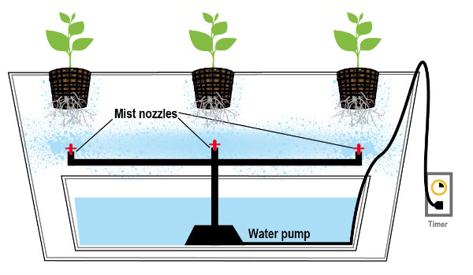

> 이글은 공부&기록 목적으로 https://brunch.co.kr/@ecotown/184 글을 그대로 가져왔습니다. 빠진 내용도 많이 있습니다.

# 수경재배 (hydroponics) 란?

토양 없이 작물을 생산하는 방법을 말한다. 식물을 재배할 때 토양은 없어도 되지만, 물은 반드시 있어야 한다. 대신 식물이 필요한 양분은 물에 녹여서 공급한다. 이를 양분배양액, 양액이라고 한다. 양액은 식물 뿌리에 직접 닿게 하거나, 암면처럼 뿌리 지지체 역할을 하는 불활성매체에 양액을 적시는 방법으로 공급한다.

전통적인 농법에서는 토양은 식물뿌리의 지지체이자 식물이 필요로 하는 양분을 공급하는 역할을 한다. 반면에 수경재배 농법에서는 식물은 양분을 흙이 아니라 물로부터 직접 흡수한다. 따라서 식물이 토양으로부터 뿌리를 통해 양분을 흡수하는 데 소요되는 에너지를 절약할 수 있다. 이 에너지는 잎의 성장이나 열매를 열글게 하는 데 사용될 수 있어 성장이 촉진되는 경향이 있다.

수경재배 농법을 사용하면 농사를 지을 때 식물의 생육상황을 좀 더 완전하게 통제할 수 있다. 물, 산소, 양분 등을 세밀하게 제어함으로써 식물 생물에 필요한 양만큼 양분 공급을 최적화할 수 있기 때문이다. 이는 식물의 생육촉진뿐 아니라 출하시기를 조절할 수 있다.

수경재배 농법에는 일반적으로 두 가지 기술이 사용된다.
- 식물 뿌리가 양액에 직접 접촉하여 충분한 양분과 산소를 직접 뿌리로 공급하는 방식
- 식물 뿌리가 암면과 같은 불활성 지지체에 고정하는 방식. 뿌리를 잡고 있는 구조물은 단지 물리적인 지지체 역할만 하며 공기와 수분이 통하기 쉬운 개방형 구조를 하고 있다.

## Hydroponics System

비용을 줄이고 생산성은 극대화할 수 있도록 다양한 방식의 무토양 재배기술을 사용한다.

뿌리를 양액에 직접 담그는 방식을 **순수수경(water culture)** 이라 하고, 뿌리가 지지체에 자리 잡게 하는 방식을 **고형배지형(medium culture)** 이라 한다.

- 순수수경 (water culture)
  - 식물의 뿌리를 지지하는 지지체 없이 배양액에 직접 접촉하는 방식으로, 재배방법에 따라 담액식(DWC, deep water culture), 박막식(NFT, nutrient film technique), 분무식(aeroponics), 모관식(capillary culture) 등으로 나눈다.
- 고형배지경(medium culture)
  - 뿌리를 지탱해주는 고형 지지체가 있는 상태에서 지지체에 양액을 공급해 키우는 방법이다. 지지체의 종류에 따라 무기물 지지체와 유기물 지지체로 나눈다. 무기물 지지체로는 펄라이트, 암면, 모래, 자갈, 폴리우레탄폼, 암면, 버미큘라이트 등이 사용된다. 유기물 지지체로는 피트모스, 코코섬유, 왕겨, 훈탄 등이 널리 사용된다. 이외에도 여러 배지를 섞어 사용하는 경우도 있는 데 이를 '혼합배지경'이라 한다.

### 1. 점적관수 방식의 수경재배 (Drip System)

식물이 자라는 트레이와 양액 저장조가 분리되어 있다. 양액 공급은 개별적인 튜빙을 이용하여 연결하고, 이 튜빙의 끝에 펌프를 연결하고 다른 한 쪽은 양액을 공급받는 식물체에 위치시킨다. 양액을 공급하는 펌프는 타이머와 연결하여 저장조의 양액을 개별 식물체 위쪽에서 방울방울 떨어뜨려 공급한다. 튜브의 끝에 연결된 방사체(emitter)의 종류를 달리하여 양액을 빠르게 또는 느리게 공급 속도를 조절한다. 양액의 폐액은 다시 재순환되거나 방류한다. 이는 수경재배 시스템의 구성과 뿌리 지지체 종류에 따라 달라진다. 이때 양액이 흐르는 펌프와 튜빙은 염류나 미네랄이 축적되어 막힐 수 있으므로 정기적으로 점검하는 게 중요하다.

- 기능 - 공급되는 물의 양은 방사체의 수와 배수 속도를 달리하여 개별 식물체 별로 다르게 조절할 수 있다.
- 지지체와 친화성 - 점적관개 시스템은 어떤 종류의 지지체에도 사용 가능한 것이 특징이다. 식물 지지체에는 코코넛 섬유부터 암면, 팽화점토펠릿, 또는 특이한 형태의 토양 지지체도 사용된다.

점적관수 수경재배 방법에는 두 가지 형태가 있다.

- (회수형 점적관수 시스템) 양액을 재사용하는 시스템을 말한다. 식물 뿌리를 통과한 과량의 양액을 다시 저장조로 되돌려 보네 양분 사용 효율성을 높인다. 이 방식에서는 정기적으로 양분의 농도를 검사해야 한다. 시간이 지날수록 식물이 양분을 흡수하면서 농도가 낮아지기 때문이다.
- (비회수형 점적관수 시스템) 양액을 재사용하지 않고 흘려보내는 방식이다. 이 방식은 pH와 양분 농도를 유지하기 쉽고, 설치비가 상대적으로 적게 든다는 장점이 있다. 또한 식물 병의 전염을 최소화하는 데도 유리하다.

### 2. 간헐흐름식 수경재배 (Ebb and Flow system/Flood and Drain System)

상대적으로 설치가 간단하고 운영이 쉽기 때문에 널리 사용되는 시스템이다. 점적관수처럼 간헐흐름식은 양액으로 채워진 저장조를 별도로 사용한다. 양액은 재배상자의 뿌리가 잠기도록 펌핑을 한다. 뿌리가 잠긴 후에는 펌프가 꺼지고 재배상자의 양액은 천천히 조장조로 되돌아간다.

펌프에 달린 타이머로 펌프를 작동시켜 주기적으로 생육 트레이의 식물 뿌리가 잠기도록 양액을 공급한다. 타이머는 식물의 크기, 온도, 습도, 사용되는 지지체 등에 따라 세팅을 달리한다. 자갈과 펄라이트 등 수분을 머금지 못하는 지지체를 사용할 경우에는 보수력이 있는 지지체 - 암면, 버미큘라이트, 코코넛 섬유 에 비해 좀 더 자주 양액을 공급해줘야 한다.

유거수 필터가 저장조로 되돌아오는 물을 거르기 때문에 유지관리가 비교적 쉽다. 단점으로는 저장탱크의 양액을 자주 점검하여 최적의 양분 농도, 산소, pH 수준을 맞추어야 한다는 것이다.

### 3. 담액식 수경재배 (Water Culture System)

식물을 양분과 산소가 충분한 용액에 담가 재배하는 방법을 말한다. 뿌리를 양액 속에 잠기게 하고, 네트와 같은 지지체를 이용하여 스러지지 않게 식물을 고정한다. 식물 뿌리가 계속 물에 잠겨 있기 때문에, 공기펌프를 24시간 계속 작동하는 것이 중요하다. 공기펌프가 멈추면 식물 뿌리에 바로 나쁜 영향이 나타난다.

- 과포화 산소 : 뿌리 주변으로 높은 농도의 산소 포화도를 유지하도록 한다. 이렇게 함으로써 뿌리 생장이 촉진되고 전반적으로 식물의 생육도 촉진된다. 폭기를 함으로써 뿌리의 수분과 양분의 흡수가 빨라지고 식물 세포의 성장과 활성이 전반적으로 향상된다.
- 쉬운 유지관리 : DWC 방식의 수경재배는 별로 관리가 필요치 않다. 펌프는 항상 켜져 있으므로 타이머나 컨트롤러는 불필요하다. 스프레이 노즐, 회수용 라인, 공급라인, 양분 저장조도 필요 없고, 물 공급 펌프가 막힐 걱정도 없다. 가장 나쁜 경우로는 에어버블을 만들어 내는 에어스톤이 막히는 것이다. 이를 방지하기 위해서는 정기적으로 에어스톤을 점검하고, 항상 비상용 공기펌프를 상비한다.

양액은 저장조에 정체되어 있기 때문에 펌프를 이용해서 산소를 용액에 불어넣어 적정한 산소농도를 유지하는 게 중요하다.

여기에는 네가지 폭기 방법이 주로 사용된다.

- 에어버블식: 어항에서처럼 에어스톤이 에어버블을 만드는 데 사용된다. 에어스톤은 다공성을 가지는 돌로서 양액 속에서 버블을 만들어 낸다.
- 폭포수식: 물이 떨어지면서 산소를 흡수해가는 방식이다. 높이가 높고 물의 양이 많을수록 떨어질 떄의 파문이 크고 산소포화도도 높아진다. 이 방법은 물을 대량으로 사용하는 대규모 상업용 수경재배에 사용된다.
- 순환형 담액식: 담액식 수경재배의 변형으로 간헐식 수경재배와 유사한 원리로 작동한다. 단지 차이점이라면 양액이 한번 들어가면 배출되지 않고 계속 유지된다는 점이 차이가 난다. 이 시스템에서는 폭포형 폭기 시스템이 사용된다.
- Deep water culture (DWC) : 담액식의 한 변형으로 담액식과 차이점은 뿌리가 잠기는 양분의 깊이다. DWC에서는 20~25 cm 깊이의 양액이 사용된다. 양분액의 깊이는 식물 뿌리의 크기, 양분과 물의 필요도, 또는 용기의 크기에 따라 달라진다.

담액식 수경재배는 기술적으로는 단순하고 사용이 쉽지만, 재배할 수 있는 식물의 종류는 제한된다. 뿌리가 양액에 잠기기 때문에, 일부 식물은 수분 과잉으로 고사한다. 따라서 상추와 같이 뿌리가 잠겨도 잘 자라는 식물 정도가 재배 가능하다.

### 4. 박막식 수경재배시스템 (Nutrient Film Technique, NFT system)

박막형 수경재배시스템(NTF)은 상추나 바질처럼 생육기간이 짧은 채소를 재배할 때 폭넓게 사용된다. 박막형 수경재배는 식물 양액을 좁은 파이프라인, 듀브, 재배상자 등 뿌리가 위치한 곳으로 끊임없이 흘려주는 시스템이다. 식물은 컵 망에서 키우는 데, 파이프나 재배상자의 경사를 만들어 자연적으로 양액이 흐르게 한다. 양액의 깊이는 수분막을 형성할 수 있을 정도의 깊이면 충분하다.

- 기능성 - NFT 시스템은 이동, 수정, 확장 또는 철거가 쉽다. 식물이 자라는 채널은 기울어진 벤치 형태로 계절별로 달라지는 식물의 크기에 따라 조밀하게 하거나 넓게 배치할 수 있다.
- 편의성 - 이 시스템은 크게 복잡하지 않다. 고장 날만한 부분이 별로 없기 때문이다. 펌프를 단지 24/7 동안, 밤이나 낮이나 가동하면 된다. 관개 사이클이나 빈도를 고민할 필요도 없다. 식물은 단지 자라는 데 필요한 만큼의 양분과 물을 흡수한다.

박막식 수경재배 방법은 널리 사용되고 있지만, 이 시스템은 속성으로 자라는 식물 - 상추, 채소 순, 허브류 등에 적당하다.

박막식 시스템은 양액을 연속적으로 재배상자나 파이프로 펌핑하여 부드러운 양분 흐름을 만들어 뿌리에 얇은 양분 막을 형성할 수 있게 한다. 뿌리를 통과한 배수액은 다시 저장조로 보낸다. 뿌리는 재배상자나 파이프의 공간에 떠서 노출시키고, 양분을 식물 뿌리를 통해 흘려보냄으로써 뿌리를 적시고 이를 통해서 뿌리가 양분과 수분을 흡수하도록 한다.

이 시스템은 지속적으로 양분액을 식물의 뿌리로 흘려보내기 때문에 타이머가 필요치 않고 별도의 관리에 따른 주의도 덜 들어간다. 박막형 수경재배에서는 양액의 흐름 속도와 재배상자나 파이프의 기울기가 시스템의 효율성을 결정하는 인자가 된다. 추천하는 기울기는 1:30에서 1:40 정도이다. 시스템을 설계할 때 식물이 자라는 재배상자나 파이프의 기울기를 조절할 수 있도록 하여 뿌리가 일정하게 자라고 흐름이 정체되지 않도록 해야 한다.

튜브형 생육판에서 추천되는 양액 흐름속도는 1-2 리터/분이다. 흐름속도는 어리고 예민한 식물일수록 성숙한 식물에 비해 느리게 한다. 흐름속도는 양분결핍 정도에 맞추어 조절한다. 박막기술은 전기가 나갈 경우 바로 식물 뿌리가 말라버릴 수 있으므로, 정기적으로 펌프와 전기설비를 점검하고 보수하는 게 중요하다.

### 5. 분무형 수경재배 (Aeroponics system)

고압의 펌프를 이용하여 양액을 아주 작은 입자 상태로 뿌리로 살포하는 시스템이다. 이 과정을 통해 수분뿐만 아니라 대량의 산소도 공급할 수 있다. 풍부한 산소는 곰팡이와 균류가 번식하는 것을 억제하는 효과가 있다.

- 양분과 수분의 사용량이 적다 : 분무형 수경재배는 평균적으로 양분과 수분을 다른 방법에 비해 더 적게 소모한다. 양분 흡수율이 높고, 뿌리 활착은 더 뛰어나다. 따라서 운영비용도 상대적으로 더 저렴한 특징이 있다.
- 더 적은 공간을 요구한다 : 수경재배를 시작할 때 그리 큰 공간을 요구하지 않는다. 수경재배 방법에 따라 다르지만 식물은 단층이 아니라 여러층으로 쌓아서 재배할 수 있어 공간 효율성이 더 높다.
- 뿌리의 산소 공급 문제가 발생하지 않기에 다른 방식과 다르게 밀식 재배가 가능

물을 가장 적게 사용하는 수경재배방법이다. 박막식 수경재배처럼 뿌리는 허공에 떠 있는 형태가 된다. 양액을 고압의 노즐을 통해 뿌려줌으로써 필요한 수분과 양분을 뿌리에 공급한다. 이 시스템은 뿌리가 공기를 가장 최대로 받을 수 있게 한다. 대신 뿌리에 전달하는 양분이 적기 때문에 좀 더 자주 뿌려주어야만 한다. 결과적으로 양액을 훨씬 더 자주 순환해야하기 때문에 산소포화도가 높아지고 이로인해 식물의 생육을 촉진하는 효과가 있다.

이 시스템이 각광받는 이유는 식물을 수직으로 층층이 재배하기 유리하다는 점 때문이다. 좁은 면적에서 식물 생산량을 최대로 늘릴 수 있다. 이 시스템에서는 분사되는 물방울이 작을수록 식물이 더 빨리 자라는 경향이 있다.

분사되는 물방울 크기에 따라 다음과 같이 세 가지 세부 시스템으로 나눈다.

- 저압분무식 수경재배 (soakaponics) : 분사되는 물방울의 크기가 커서 그리 효율적이지는 않다. 그렇지만 비용이 적게 들고 특별한 장비가 필요치 않아 널리 활용된다. 그렇지만 대규모 재배에서는 경제성이 떨어진다.
- 고압분무식 수경재배 (true aeroponics) 고압을 사용하는 시스템은 설치 비용이 많이 들고 기술적 난이도도 높지만 가장 효율적인 분무식 수경재배 방법이다. 고압(60~90 psi)으로 분사하여 미세한 물방울로 뿌리에 뿌려주어 충분한 산소와 양분을 공급한다. 식물의 생육이 빠르다.
- 초음파 안개 발생기 (ultrasonic fogger, fogponics) : 이 방법은 초음파를 이용해 미세방울을 만든다. 이 방법은 주로 전시용으로 많이 사용된다. 충분한 수분과 양분을 식물 뿌리에 공급하기는 쉽지 않아 실제 사용에는 제약이 많이 따른다.

## 수경재배에 사용되는 기질/불활성 지지체

수경재배용 지지체는 불활성이고 어떤 작물이든 자랄 수 있어야 한다. 지지체의 주요 기능은 식물이 뿌리를 활착하고 서 있을 수 있도록 고정하는 역할이다.

- 확장점토응집체: 구운 점토 펠릿으로 불활성의 중성 pH이다. 점토 펠릿은 1200 C 에서 구울 때 구조가 확장되면서 다공성 구조를 가져 수경재배에 활용하기 좋게 된다.
- 암면 : 화강암과 석회암을 녹여 목화 캔디처럼 작은 실을 만든다. 이를 사각형, 판형, 또는 실뭉치형으로 가공한다. 암면은 불활성으로 다공성의 난분해물질로 수분을 잘 흡수하는 특징이 있다. 사용하기 전에 중성 pH 용액에 담가 적절하게 pH를 조절해야 한다.
- 코코섬유/칩 : 코코넛 섬유는 천연물질이지만, 식물 생육에 가장 좋은 지지체이다. 코코섬유는 분해되기는 하지만 이로 인해 양분은 없다. 중성 pH, 보수력이 좋고 통기성도 우수하다. 코코섬유와 코코칩의 차이는 섬유의 크기에 따라 나눈다. 코코섬유가 더 작은 사이즈이다. 코코칩의 입자 사이즈가 클수록 뿌리의 통기성에 유리하다.
- 펄라이트 : 화산 유래 광물질로 초고온에서 형성될 때 다공성의 구조가 만들어졌다. 가볍고 흡수제로서의 특징을 가지고 있다. 중성 pH로 뛰어난 심지 효과를 가지고 있다. 단독으로도 사용되지만 화강암과 혼합해서 사용되기도 한다. 펄라이트는 가볍고 물에 뜨는 특성이 있어서 간헐흐름식 수경재배에는 적합하지 않다.
- 버미큘라이트 : 점토광물로 고온가열에 의해 확장된다. 펄라이트와 비슷한 특징을 가지고 있지만, 높은 양이온교환용량(CEC)를 가지고 있어서 양분을 붙잡아 놓는 데 유리하다.
- Grow stone : 재생 유리로 만들며 부정형의 다공성 물질이다. 심지로서 사용될 때 효과가 좋은 데 물을 10cm 위까지 이동시키는 능력이 있다.
- 강자갈 : 쉽게 구할 수 있고 값도 싸다. 부정형으로 폭기와 배수에 유용하다. 다른 지지체와 혼합으로 사용되기도 하지만 대개는 배수하는 데 사용된다.
- Floral foam : 가벼운 다공성 물질이다. 수분을 빨리 머금는 특징이 있고, 부수어서 다른 태로 사용할 수도 있다.
- 양모 (sheep wool) : 전망이 좋은 재생 가능한 지지체이다. 폭기와 수분 보유 능력 측면에서 코코넛 섬유나 암면에 비해 우수한 장점이 있다.

이외에도 왕겨, 모래, 자갈, 수분 흡수 폴리머 등도 인기가 있다. 만약 천연물질 유래의 지지체를 사용하려면 미생물 오염을 피하기 위해 사용 전에 살균을 하는 게 좋다.

## 어떤 양분을 양액에 첨가해야 할까?

생산자는 식물이 토양으로부터 얻을 모든 양분을 공급해줘야 한다. 수경재배가 유리한 점은 농부가 식물 상태에 맡게 최적의 양분을 공급해 줄 수 있다는 데 있다. 공급해야 할 양분의 종류는 당연히 식물의 종류와 생육 단계에 따라 달라진다.

식물 생육에 필요한 기본 양분으로는 질소, 구리, 황, 몰리브덴, 붕소, 염소, 칼륨, 아연, 마그네슘, 칼슘, 철, 망간, 인 등이다. 탄소, 산소, 수소 등은 대기로부터 흡수한다.

양액의 온도도 중요한데, 20-22 C 정도가 적당하다.

## 수경재배 기술의 장점

- 꾸준한 생산성. 최적의 시스템과 환경을 조절함으로써 안정적이고 꾸준한 작물 생산이 가능하다. 외부 기상변화에 대해서도 비교적 영향을 덜 받는다.
- 노지재배에 비해 물 사용량을 감소시킬 수 있다. 장치를 통해 물을 재사용할 수 있기 때문이다. 물이 환경적 제약 인자로 작용하는 건조지역에서는 수경재배가 신선한 채소를 생산하는 대안이 될 수 있다.
- 식물 생육 환경(온도, 양분 등)을 인위적으로 제어함으로써 작물의 생육속도를 어느정도 조절할 수 있다.
- 연중 생산과 조기 생산이 가능하므로 시설의 회전율을 높일 수 있다.
- 토양을 사용하지 않으니 토양 유래 질병으로부터 자유롭다.
- 한 곳에서 작물을 재배하니 병해충의 조기 관측에도 유리하다.
- 3차원적인 시설의 배치를 통해 공간을 효율적으로 사용할 수 있다. 더 적은 면적에서 더 많이 작물을 생산할 수 있어 토지 생산성이 증대된다.
- 양분 사용 효율도 높아진다. 뿌리에 양분을 직접 공급하기 때문에 양분 손실이 줄어든다.
- 자동화 장치를 이용하여 시설 제어가 가능함으로 노동력이 절감되고, 피복, 경운, 제초 등 일반적인 농업에 사용되는 농엽활동이 불필요하다.

## 수경재배 기술의 단점

- 수경재배의 가장 큰 단점은 물이 오염될 경우 발생하는 문제다. 물에서 살아가는 병해충이 전 농장에 빠르게 전염될 수 있기 떄문이다.
- 노지재배에 비해 초기 설치비가 많이 든다.
- 전원 공급에 문제가 생기면 펌프 작동이 멈추어 식물이 수분 부족으로 피해를 입을 수 있다.

## reference
- https://hydroponicsgrower.org/introduction-to-different-types-of-hydroponics-systems/
