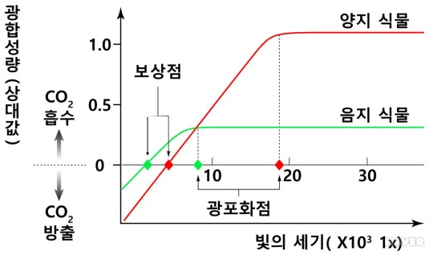

빛은 식물의 주요 대사 작용인 광합성을 유도하는 에너지이며 환경변화의 신호 역할을 합니다.
광합성이라는 것은 빛, 이산화탄소, 물 그리고 다수의 영양소를 이용하여 탄수화물을 생산하여 식물이 생장하는 것입니다.

## 광보상점 (light compensation point)

녹색식물의 광합성에서 호흡에 의한 탄산가스의 방출량과 광합성에 의한 탄산가스의 흡수량이 같아져서 외견상 **광합성량이 0**이 되는 광도다. 더 쉽게 말하면 식물이 물질대사를 통해 최소한의 생존 유효점이다.

광합성량과 호흡량이 같을 때의 빛세기를 보상점이라 하기 때문에 보상점 이하의 빛이 계속된다면 호흡량이 광합성량보다 많아진다. 이런 경우 소비되는 에너지량이 생산되는 에너지량보다 많아지므로 식물은 차츰 생장이 느려져서 죽게되며 보상점 이상의 빛이 계속된다면 식물의 생장은 커지게 된다.

식물이 안정적으로 생장하고 자라는데 적절한 광합성광량자밀도는 광보상점 대비 약 3~4배 정도 권장한다. 이럴 경우 식물의 호흡에 필요한 이산화탄소 농도 또한 높아야 한다. 통상 공기중의 이산화탄소 농도는 약 300~400ppm 이며 식물의 광합성이 활발하게 이루어져 생장이 커지려면 약 800~1,000이 권장선이다.

## 광포화점 (light saturation point)

식물의 광합성 속도가 한계에 이르러 더 이상 증가하지 않는 시점에서의 빛의 세기, 이산화탄소의 양, 온도 등은 광합성 속도를 결정하는 중요한 요인이다. 식물잎에 빛을 쏘이면 빛의 세기의 비례하며 광합성 속도는 빨라진다. 하지만 빛의 세기가 어느 정도에 이르면 광합성 속도는 더 이상 증가하지 않는다. 이를 **광포화점**이라고 한다.

다음은 식물의 광포화점과 광보상점에 대한 기준입니다. (형광램프 기준)
광량을 측정하는 기준이나 계산식이 형광등과 LED가 다르기 때문에 절대적인 기준은 아니지만 기본적인 기준을 될 수 있을 것이라 생각합니다.

| 채소   | 광보상점(PPFD) | 광포화점(PPFD) |
|--------|----------------|---------------|
| 인삼   | 500lx (6)      | 12,000lx (145)|
| 양배추 | 1,500lx (18)   | 25,000lx (302)|
| 피망   | 1,500lx (18)   | 30,000lx (302)|
| 상추   | 1,500lx (18)   | 25,000lx (278)|
| 호박   | 1,500lx (18)   | 45,000lx (695)|
| 강남콩 | 1,500lx (24)   | 12,000lx (191)|
| 가지   | 2,000lx (24)   | 40,000lx (665)|
| 완두콩 | 2,000lx (24)   | 40,000lx (484)|
| 배추   | 2,000lx (25)   | 11,000lx (180)|
| 오이   | 2,000lx (25)   | 55,000lx (748)|
| 토마토 | 3,000lx (36)   | 70,000lx (847)|
| 순무   | 4,000lx (42)   | 13,500lx (195)|
| 토란   | 4,000lx (41)   | 16,000lx (221)|
| 수박   | 3,000lx (36)   | 80,000lx (968)|

\* 광합성 광양자 밀도 (PPFD) : Photosynthetic Photon Flux Density 1㎡의 공간에 1초 동안 방사되는 광합성광량자 입자량 밀도.

\* 가정에서 혹은 식물재배 LED를 통해 위의 채소류를 재배하고자 할 때는 최소한 채소 각각의 **광보상점(PPFD)의 2~10배 이상**의 광원을 제공해줘야 광합성이 가능하며, 그 미만의 미흡한 광원일 때는 대부분 줄기만 신장하고 잎이 자라지 않는 **웃자람 현상**이 발생 함.

## Reference
- https://blog.naver.com/ifiu/220513155711
- https://blog.naver.com/k0ks0/221785040583
- https://terms.naver.com/entry.naver?docId=5781924&cid=62861&categoryId=62861
- https://saltyliving.tistory.com/101
