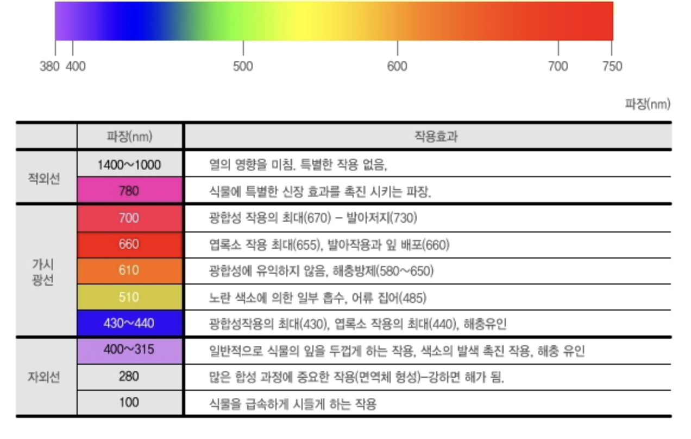

그동안의 연구결과로 보면 식물의 광합성에 필요한 빛(가시광선)의 파장대역은 400nm ~ 800nm 입니다.

즉 태양광만큼 광대한 에너지를 쓰지 않더라도 식물생장에 필요한 400nm ~ 800nm의 적정한 파장대의 빛 만으로 식물을 재배할 수 있다는 연구결과를 얻은 것 입니다.

그 외 세부적인 연구로 들어가면 식물의 질적 변화 즉 종자의 발아, 분화, 개화, 엽록소 합성, 마디 성장, 대사물질의 변화 등에 영향을 미치는 것이 있습니다만 기본적으로 외형적인 성장에는 큰 차이가 있지 않습니다.

현재 기술을 기준으로 경제성과 효과를 기준으로 보면 LED가 가장 나은 선택이라고 할 수 있습니다.

식물에 따라 적합한 파장대의 광을 제공함으로써 식물의 생장이나 대사체를 증진시킬 수 있습니다.

| 스펙트럼 | 색상 | 특성 |
|----------|-----|-----|
| ~ 280nm | uv | 양자수율과 광합성 속도가 크게 감소합니다. |
| 380nm ~ 430nm | 보라색 | 식물이 꽃을 피우도록 장려합니다. 생산을 증가시킵니다. 색소 침착을 촉진하고 식물 잎을 두껍게 하며 해출을 예방하는 데 사용할 수 있습니다. |
| 430nm ~ 450nm | 남색 | 뿌리와 잎에 사용되면 식물의 녹색색상을 부여하는데 도움이 됩니다. 엽록소 흡수는 439nm와 469nm에서 최고점에 이릅니다. 청색 스펙트럼은 가장 효율적으로 흡수되는 스펙트럼으로 주로 영양 성장을 촉진합니다. |
| 450nm ~ 500nm | 파란색 | 뿌리와 잎 성장을 담당하고 식물 구조를 강하게 유지합니다. |
| 500nm ~ 525nm | 청록색 | 식물에서 최소한으로 사용되므로 대부분의 실내 성장조명에서 이 스펙트럼을 제거합니다. |
| 520nm ~ 565nm | 초록색 | 미량 영양소 이용 증가, 광합성 강화 |
| 565nm ~ 590nm | 노란색 | 뿌리와 잎이 건강하게 자라도록 돕고 terpenes을 증가시킵니다. 엽록소 혜택이 없습니다. 조류의 피코에리트린과 피코시아닌 수용체에 효율적으로 흡수됩니다. |
| 590nm ~ 625nm | 주황색 | 식물의 광합성에 필요한 에너지를 공급합니다. |
| 625nm ~ 750nm | 빨간색 | 여름 태양을 시뮬레이션하고 뿌리 성장과 꽃 형성을 촉진합니다. 660nm는 꽃이 피는 데 가장 중요한 파장입니다. 종자발아 및 꽃이 피는 속도를 높입니다.|

| 스펙트럼 | 색상 | 특성 |
|----------|-----|-----|
| 10nm ~ 400nm | UV Light | uv 광선은 광합성에 기여하지 않으며 아직 연구중이지만 연구에서 uv 광선은 꽃의 색 프로필, 향기 및 풍미를 향상 시킬 수 있는 테르펜과 안토시아닌의 생산을 증가시키는 것으로 나타났습니다. |
| 400nm ~ 525nm | BLUE Light | 광합성에 기여하고 식물의 형태 형성에 영향을 주어 식물이 더 촘촘하게 자랍니다. 맛, 향, 색상 및 영양을 포함한 전반적인 식물 건강과 품질을 향상시킵니다. 식물의 밀도와 뿌리 발달을 촉진시키는데 도움이 됩니다. |
| 400nm ~ 700nm | PAR Light | 식물이 광합성을 위해 사용할 수 있는 스팩트럼 범위이므로 성장에 가장 중요한 빛의 범위입니다. 많은 과학자들이 원적외선도 광합성에 기여한다는 연구결과로 400nm ~ 750nm으로 확장해야한다고 주장합니다. |
| 500nm ~ 600nm | GREEN Light | 식물 전체의 광합성 효율을 높이고 캐노피에 침투하여 아래쪽 잎의 성장을 촉진합니다. |
| 600nm ~ 700nm | RED Light | 광합성에 기여하고 바이오매스를 증가시킵니다. 잎의 확장과 줄기 성장에 필수적입니다. 식물의 개화, 광주기, 발아조절에 도움을 줍니다. 적색광은 LED를 사용하여 생성하는 가장 효율적인 조명이므로 유용합니다. 즉 전력 와트당 가장 많은 빛을 얻을 수 있다는 의미입니다. |
| 700nm ~ 750nm | PAR-RED Light | 최근 연구에 따르면 이전에 무시되었던 스팩트럼이지만 식물 성장에 엄청난 이점을 줄 수 있는 것으로 밝혀졌습니다. 잎과 줄기의 확장과 신장을 촉진시킵니다. 캐노피에 침투하여 아래쪽 잎의 성장을 촉진합니다. 660~680nm 파장과 함께 사용하면 에머슨 효과를 통해 식물의 광합성 속도가 증가합니다. 이전 믿음과는 달리 광합성에도 기여하는 것으로 나타났습니다. |

## 에머슨 효과

식물이나 녹조에서 680 nm(빨강)보다 긴 파장의 빛을 주면 갑자기 양자 수량(1개의 광양자에서 환원할 수 있는 탄산가스의 분자수)이 저하된다. 이것을 레드드롭이라고 부른다. 그런데 700nm 적색광과 동시에 650nm 청색광 정도의 조금 파장이 짧은 빛을 주면 양자 수량의 저하가 보이지 않게 된다. 각각 단독으로 조사했을 경우의 합보다 높은 양자 수율을 얻을 수 있다.

청색 및 적색광의 복사에 근자외선을 가하면 광합성 량이 촉진된다. 이것을 에머슨 효과라고 한다. 

## 여러 파장들의 조명

### Daylight LED with cool light

식물 묘목과 샐러드, 허브와 같은 식용 녹색 식물에 적합. 청색광은 식물의 성장 단계에 적합하며 식물의 잎과 줄기의 성장을 지원합니다.

### Neutral LED

온실 식물과 실내 일반 조명입니다.

### Full Spectrum

식물에 필요한 모든 광량이 포함되어 있지만 따뜻한 빛 톤에 초점을 맞추어 꽃이 피는 관염 식물과 열매를 맺는 식용 식물에 적합합니다.

## 용어
- chlorophyll(크로로필): 엽록소
- 양자수율: 광화학 반응에서 실제로 화학 변화를 일으킨 분자 수와 흡수된 광장자 수의 비율
- terpenes(테르펜): 숲에서 얻을 수 있는 중요한 물질에 테르펜이 있다. 피톤치드가 주로 미생물에 대항하기 위한 항균물질인 반면, 테르펜은 피톤치드 역할도 하면서 그 외 복합적인 작용을 한다. 신체에 흡수되면 신체의 활성을 높이고, 피를 잘 돌게 하며, 심리가 안정되며, 살균작용도 겸한다. 중요한 것은 생리활성을 촉진하며 다양한 약리작용 외에 오감을 만족시켜 정서적인 안정을 준다.

## Reference

- https://www.naturehills.com/blog/post/keep-indoor-plants-healthy-with-full-spectrum-LED-grow-lights
- www.voltlighting.com/fl1-full-cycle-led-grow-light-120v
- https://brunch.co.kr/@jupiter/170
- https://blog.naver.com/atago59/222132004636
