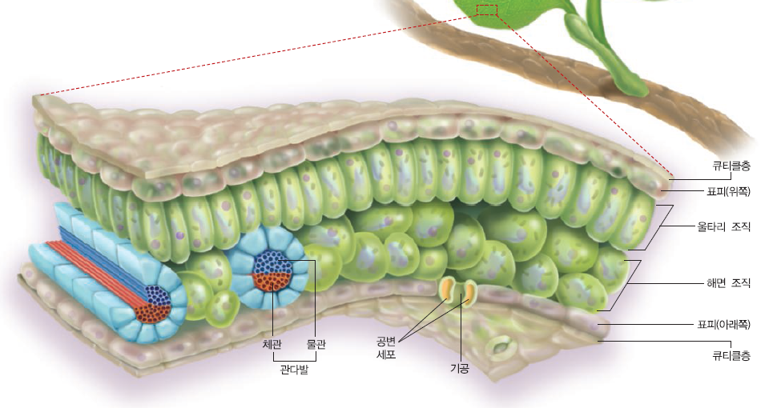
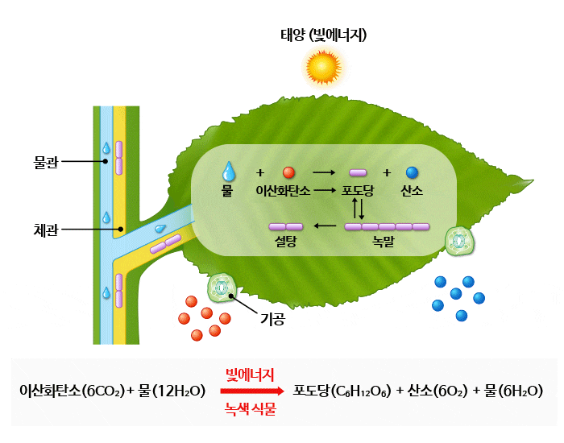

:::info 정보

이글은 공부&기록 목적으로 https://trip2science.tistory.com/60 글을 그대로 가져왔습니다. 빠진 내용도 많이 있습니다.

:::

식물이 스스로 양분을 만들어내는 과정을 광합성이라고 한다. 광합성을 한 문장으로 정리하면 식물이 빛 에너지를 이용하여 이산화탄소와 물로부터 포도당과 산소를 만드는 과정이다. 여기서 포도당은 당의 일종으로, 주로 식물의 에너지원으로 쓰인다. 탄소, 수소, 산소로 이루어져 있다.

광합성은 엽록체라는 곳에서 일어나는데 식물의 잎을 구성하는 울타리 조직과 해면 조직에 많이 들어있다.

식물이 광합성을 하기 위해서는 빛, 이산화탄소, 그리고 물이 필요하다.

#### 1) 빛
엽록체의 엽록소에서 흡수한 빛에너지는 광합성이 일어날 때 화학 에너지로 전환되어 포도당에 저장된다. 
#### 2) 이산화탄소
이산화탄소는 포도당을 구성하는 탄소와 산소의 공급원이다. 공기중의 이산화탄소는 잎의 기공을 통해 흡수되어 광합성에 쓰인다.
#### 3) 물
물은 포도당을 구성하는 수소의 공급원이다. 뿌리에서 흡수된 물은 물관을 통해 잎까지 운반되어 광합성에 쓰인다.

대부분의 식물은 물에 잘 녹는 포도당을 곧 녹말로 전환하여 낮 동안 엽록체에 저장한다. 엽록체에 저장된 이러한 양분은, 식물의 다른 부분으로 이동하여 생명활동에 필요한 에너지원으로 사용되거나 저장된다.

광합성을 통해 만들어지는 것 중에는 **산소**도 있다. 식물이 광합성을 할 때 산소 기체도 만들어지기 때문이다. 광합성으로 만들어진 산소는 자신의 호흡에 쓰이고, 남은 것은 기공을 통해 공기중으로 방출되어 다른 생물의 호흡에도 쓰인다.

<!--  -->

### 정리
식물 잎의 엽록체에서 태양의 빛에너지를 이용해 잎의 기공으로 들어온 이산화탄소와 뿌리에서 흡수하여 물관을 통해 운반된 물로부터 포도당을 합성한다. 광합성 과정에서 생성된 산소는 잎의 기공으로 방출되고, 포도당은 물에 녹지않는 녹말로 전환되어, 낮 동안 잎에 저장되었다가 밤에 이동하기 쉬운 형태로 바뀌어 체관을 통해 식물체 전체로 운반된다.

## Reference
- https://trip2science.tistory.com/60
