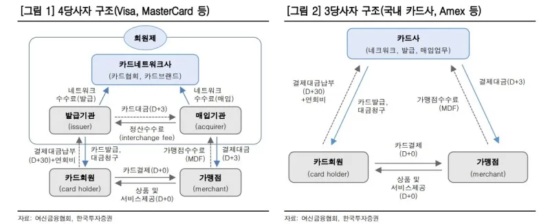
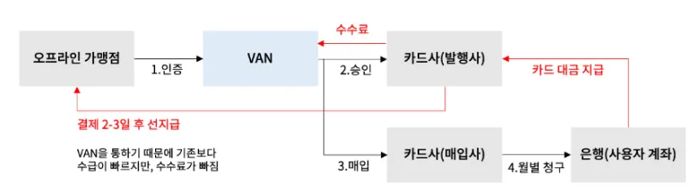

## 신용카드의 정의

**여신전문금융업법**에서는 신용카드를 다음과 같이 정의한다.

<u>“신용카드란 이를 제시함으로써 반복하여 신용카드 가맹점에서 결제할 수 있는 증표로 신용카드업자가 발행한 것을 말한다. 이때 금전채무의 상환, 관련 법률에서 정하는 금융투자 상품, 사행성 게임물의 이용대가 및 이용에 따른 금전의 지급, 기타 사행행위 등은 결제 대상에서 제외된다.”</u>

## 3당사자, 4당사자

신용카드 결제시스템 구조는 3당사자 모델, 4당사자 모델로 나눌 수 있다.
우리나라는 3당사자 모델로 되어 있으나 미국의 경우 3당사자와 4당사자 모델이 혼용되어 있는 구조로 되어 있다.
여기서는 3당사자 모델만 소개한다.

### 3당사자 구조

3당사자는 회원, 카드사, 가맹점으로 구성된다.

카드사는 고객에게 카드를 발급하며 카드를 발급받은 고객을 회원(CardHolder)라고 한다. 그리고 회원이 카드를 결제할 수 있도록 가맹계약을 맺어야 한다. 회원이 발급받은 카드는 카드사가 가맹 계약을 맺은 가맹점에서만 카드를 사용할 수 있다.

오프라인 매장이 카드가맹점이 되려면 9개 카드사와 모두 계약을 해야하는데 번거롭기 때문에 van사와 계약을 할 때 pos기나 카드결제 단말기(cat)을 설치하게 되면 van사 직원이 가게 사장님으로 부터 서류를 받아 대신해서 계약을 진행하는 경우가 많다.

## 발급사(issuer)와 매입사(acquirer)

### 발급사 (issuer)

- 발급사는 신용카드를 발급하는 은행이나 금융기관을 가리킨다.
- 사용자는 신용카드를 제공하고, 해당 카드를 사용하여 지출할 수 있는 권한을 부여한다.
- 고객에게 카드발급, 카드 활성화, 카드 해지, 결제 승인 등의 서비스를 제공한다.
- 카드 사용으로 발생하는 결제금액에 대해 고객에게 청구서를 발송하고, 고객이 지불한 금액을 수수료와 함께 매입사로 송금한다.

### 매입사 (acquirer)

- 매입사는 상인이나 가맹점에게 카드결제를 허용할 수 있도록 하는 금융기관을 말한다.
- card-holder: 상점에서 소비자가 신용카드로 결제를 할 때 그 금액을 상점에 미리 지불하고 나중에 소비자로부터 그 금액을 회수한다.
- merchant: 가맹점으로 부터 매출 전표를 매입하고 카드 가맹점에 대금을 입금해 주는 가맹점 대상 업무를 한다.
- 국내 매입사는 9개 사 뿐이다.
  - 현대, 농협, 비씨, 삼성, 롯데, 신한, 국민, 하나, 우리

### 발급사와 매입사가 같거나 다른 이유

대부분 카드사들이 매입사와 발급사의 업무를 병행하고 있다. 매입사는 9개사 뿐 이지만 발급사는 다양하다.
특히 체크카드는 각 은행이 발급사 역할을 할 수 있어서 은행별 체크카드가 있다.

국내의 대규모 카드사의 경우에는 매입사와 발급사가 같다.
하지만 제주은행이나 NH농협카드와 같은 소규모 카드사나 은행은 다른 카드사가 매입을 대신하며 가맹점을 공유하기도 한다.
미국은 발급사와 매입사 산업이 철저히 분리되어 있지만 우리나라는 결제망, 인프라 구성 및 운용이 많이 들어서 대형 카드사에 매입을 위임하는 경우가 많다.

## Reference

- https://yozm.wishket.com/magazine/detail/1115/
- https://www.pay2pay.co.kr/board/view?bId=1&wr_id=3212
- https://anodos.tistory.com/entry/신용카드-시장에서의-발급사issuer와-매입사acquirer
- https://dabinlee.tistory.com/20
- https://yuweol.tistory.com/528
- https://docs.tosspayments.com/resources/glossary/card