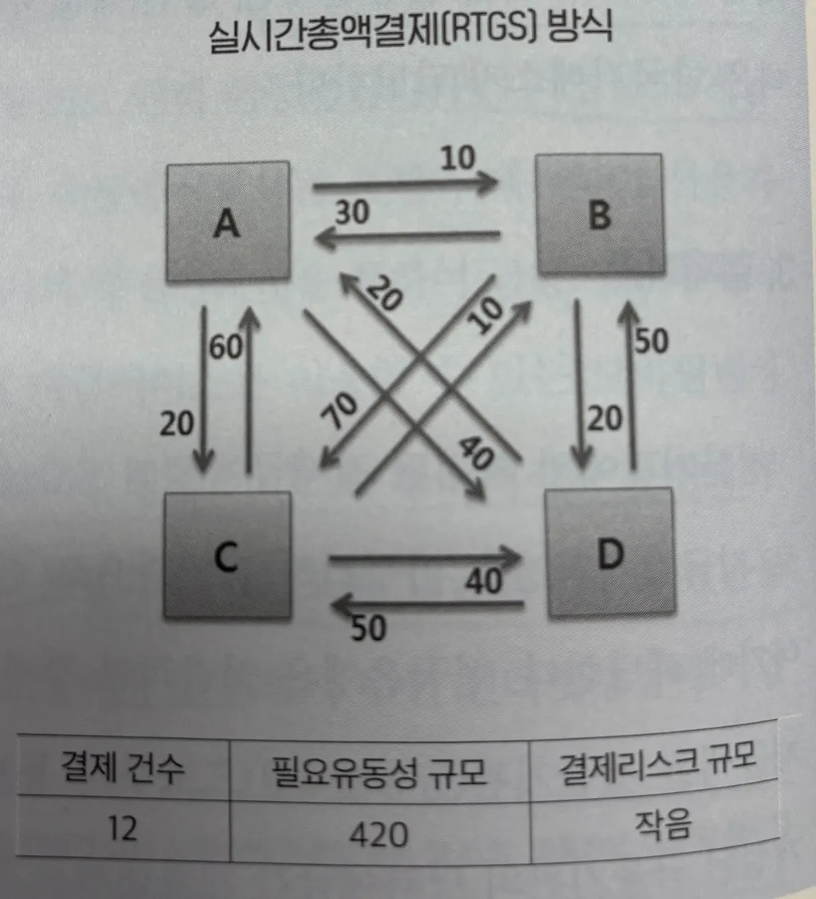

지급결제는 크게 자금결제시스템, 증권결제시스템, 외환결제시스템으로 구분할 수 있는데 여기서는 자금결제시스템만 소개한다.

:::info

우리가 일상적으로 사용하는 ‘결제(Payment)’와 학술적 의미의 ‘결제(Settlement)’는 엄연히 다른 개념이다. 우리는 물건을 사고 대금을 지불할 때 ‘결제(Payment)’라는 표현을 쓰지만 이 행위를 학술적으로 표현하면 ‘지급’ 또는 ‘지불’이라고 한다.

:::

# 지급결제
경제주체들이 경제활동에 따른 채권,채무관계를 해소하는 행위를 지급결제라고 한다. 식사후 카드로 대금을 지불하는 것, 부모님이 인터넷뱅킹으로 용돈을 송금하는 것, 기업이 어음등으로 원자재 구입대금을 지급하는 것, 계좌이체로 종업원에게 급여를 지급하는 것 모두 지급결제의 예라고 할 수 있다.

법적으로 간단히 말하면 결제는 **채무를 이행하는 방법**이다. 대개의 상황에서 채무를 이행하려면 돈이 필요하다. 지폐는 빚을 청산하기 위해 일반적으로 통용되는 방법이다.

## 지급, 청산 결제
지급결제의 3단계는 지급, 청산, 결제 이다.

### 지급(payment)

지급이란 소비자, 구매자 및 채무자 등이 재화 및 서비스를 수취하고 이에 대한 대가로 소비자 등이 현금 또는 카드등을 통해 화폐적 가치를 이전하는 행위이다.

우리가 사용하는 지급결제수단은 크게 현금과 비현금이 있다. 현금은 국가가 보장한 지급결제수단이기에 지급과 동시에 결제가 완료되지만, 비현금 지급결제수단은 금융기관간 자금이체 과정을 통해 현금으로 전환되며 이를 위해 "지급 -> 청산 -> 결제"의 세 단계가 필요하다. (비현금 결제수단에는 어음, 수표, 카드(신용/체크), 계좌이체 등이 있다.)

비현금지급수단으로 지급이 이루어지게 되면 지급인이 자신의 지급채무를 해소하기 위하여 수취인 앞으로 자금이체를 의뢰하는 지급지시(Payment order)를 송부하고, 수취인이 이를 수신하게 되는데, 이는 지급결제의 시작 단계이다.

### 청산(clearing)

청산은 현금이외의 지급수단으로 지급이 이루어졌을때 금융기관들이 서로 주고 받을 금액을 계산하는 것이다. 청산기관(clearing house)이 거래당사자 간에 개입해 결제를 위해 송부된 계좌이체, 어음, 수표 등의 지급수단을 확인한 후 최종적으로 수취하거나 지급해야할 차액을 산출하게 된다. (이연차액결제(DNS) 방식)

자금결제시스템의 경우 **금융결제원**이 청산을 취합하여 확정한다.

### 결제(settlement)

결제는 청산과정을 통해 계산된 금액을 지급하여 완결시키는 과정으로 각 금융기관이 중앙은행에 개설한 당좌예금계좌 간 자금이체 등을 통하여 지급은행에서 수취은행으로 실제로 자금이 이동되어 최종적으로 채권&채무관계를 종결하게 된다.

자금결제시스템의 경우 **한국은행**이 결제를 담당하며, 매일 11시에 이루어진다.

### 결제(settlement) 두 방식

결제는 두가지 방식이 있다.

#### 🔸 실시간총액결제 방식 (RTGS: Real Time Gross Settlement)

실시간총액결제 방식은 결제 금액이 커 결제시점 관리가 중요한 거액결제 시스템에서 주로 사용한다. 금융기관등이 한국은행에 지급 요청할 경우 즉시 건별로 결제가 이루어져 신용리스크가 없는 장점이 있다. 그러나 건별로 요청 금액만큼의 자금이 필요해 결제에 필요한 유동성이 과다 요구되는 단점이 있다.

- 지급과 결제 사이의 시간이 길수록 금융 리스크가 커진다. 실시간 총액결제방식은 이 시간을 최소한으로 하여 리스크를 줄인다.

[거액결제시스템(large-value payment system)]에서 사용

#### 🔹 이연차액결제 방식 (DNS: Deferred Net Settlement)

이연차액결제 방식은 지급이 소액&대량으로 인해 매번 총액으로 결제를 완료시키기 보다는 일정기간 동안의 모든 지급&수취 자금을 서로 차감한 후 차액을 한번만 결제하고 결제유동성을 크게 절감하는등 결제효율성을 크게 높일 수 있다. 그러나 결제 이연에 따라 신용리스크가 증가하게 되는 단점이 있다.

[소액결제시스템(retail payment system)]에서 사용: 우리가 사용하는 지급결제는 모두 이연차액결제 방식으로 이루어진다고 보면 된다.

## Reference
- https://product.kyobobook.co.kr/detail/S000200710559
- https://www.bok.or.kr/portal/main/contents.do?menuNo=200345
- https://2e.co.kr/news/articleView.html?idxno=210291
- https://product.kyobobook.co.kr/detail/S000211683948