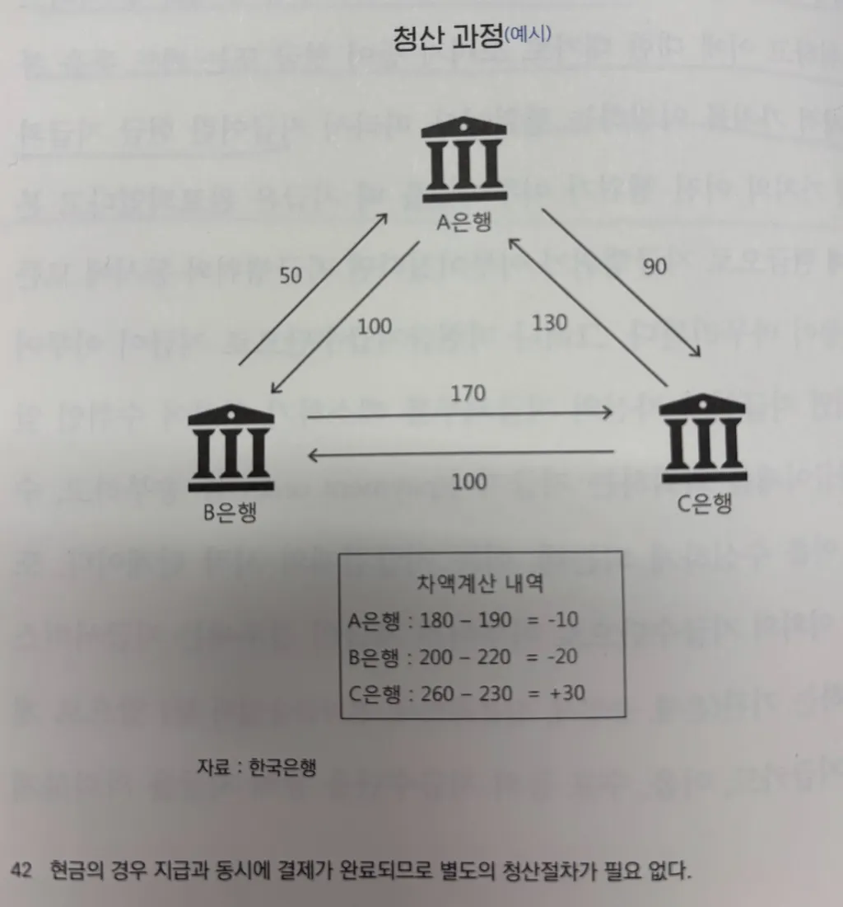

지급결제는 **자금결제시스템·증권결제시스템·외환결제시스템**으로 구분할 수 있지만, 여기서는 **자금결제시스템**만 다룬다.

:::info
우리가 일상적으로 사용하는 ‘결제(Payment)’와 학술적 의미의 ‘결제(Settlement)’는 엄연히 다른 개념이다.  
일반적으로는 물건을 사고 대금을 지불할 때 ‘결제(Payment)’라고 표현하지만, 학술적으로는 이를 ‘지급’ 또는 ‘지불’이라 한다.
:::

# 1. 지금결제란?

경제주체들이 경제활동에서 발생한 **채권·채무 관계를 해소하는 행위**가 바로 지급결제다.  
예를 들어

- 식사 후 카드로 대금을 지불하는 것  
- 부모님이 인터넷뱅킹으로 용돈을 송금하는 것  
- 기업이 어음으로 원자재 대금을 지급하는 것  
- 계좌이체로 종업원에게 급여를 지급하는 것  

모두 지급결제의 사례다.

법적으로 보면 결제는 **채무를 이행하는 수단**이다. 대부분의 경우 채무 이행에는 돈이 필요하며, 지폐는 빚을 청산하기 위해 일반적으로 통용되는 방법이다.

## 2. 지급·청산·결제 3단계

지급결제 과정은 **지급 → 청산 → 결제**의 세 단계로 이루어진다.

### 2-1. 지급 (payment)

소비자·구매자·채무자가 재화나 서비스를 받고 **현금 또는 카드를 이용해 화폐적 가치를 이전**하는 행위다.

- **현금**은 국가가 보장한 지급수단이므로 지급과 동시에 결제가 완료된다.  
- **비현금** 지급수단(어음, 수표, 카드, 계좌이체 등)은 금융기관 간 자금이체를 거쳐 현금으로 전환되므로 **지급 → 청산 → 결제** 3단계를 거친다.

비현금 지급수단으로 지급이 이루어지면, 지급인은 **지급지시(Payment order)** 를 통해 수취인에게 자금이체를 의뢰하고 수취인이 이를 수신하면서 지급결제가 시작된다.

### 2-2. 청산 (clearing)

현금이 아닌 지급수단으로 거래가 이뤄질 때, 금융기관들이 **상호 주고받을 금액을 계산**하는 과정이다.  
**청산기관(clearing house)** 은 계좌이체·어음·수표 등을 확인한 뒤 최종 **수취·지급 차액**을 산출한다(이연차액결제, DNS 방식).  

자금결제시스템에서는 **금융결제원**이 청산을 취합·확정한다.

### 2-3. 결제 (settlement)

청산으로 확정된 금액을 **실제 자금이체로 완결**하는 단계다.  
각 금융기관이 중앙은행에 개설한 **당좌예금계좌** 간 자금이체를 통해 지급은행에서 수취은행으로 자금이 이동하면서 최종적으로 채권·채무가 소멸한다.  

자금결제시스템에서는 **한국은행**이 결제를 담당하며, 결제는 **매일 11시**에 이뤄진다.

  

### 2-4. 결제의 두 가지 방식

#### 2-4-1. 실시간총액결제 방식 (RTGS: Real-Time Gross Settlement)

- 거액결제시스템(large-value payment system)에서 사용.  
- 각 결제 요청이 들어올 때마다 **건별·실시간**으로 처리되어 신용리스크가 없지만, 건별로 자금을 확보해야 하므로 **유동성 부담**이 크다.  
- 지급과 결제 사이 시간을 최소화해 리스크를 줄인다.

#### 2-4-2. 이연차액결제 방식 (DNS: Deferred Net Settlement)

- 소액결제시스템(retail payment system)에서 사용.  
- 일정 기간 모든 지급·수취 자금을 **차감하여 한 번에 결제**하므로 결제 유동성을 절감하고 효율성을 높인다.  
- 결제 이연으로 **신용리스크**가 증가할 수 있다는 단점이 있다.  
- 일상적인 소액 지급결제는 대부분 이 방식을 따른다.

## 3. 자금결제 시스템

### 3-1. 거액결제 시스템 – 한은금융망

거액결제시스템은 금융기관 간 거래되는 **원화 거액 자금**을 실시간으로 결제하는 RTGS 방식이며, 중앙은행인 **한국은행**이 직접 운영한다. 이를 **한은금융망**이라고 부른다.

#### 3-1-1. 한은금융망 구축 및 가동

과거에는 이연차액결제(DNS) 방식이 일반적이었으나, **신용리스크** 문제로 각국 중앙은행이 **RTGS** 방식으로 전환했다.  
RTGS는 결제가 완료되면 취소할 수 없어 **결제리스크를 원천적으로 제거**할 수 있다.

2009년 한은금융망 재구축 시 RTGS를 기본으로 하되, 일부 거래에 **차액결제**를 도입한 **혼합형 결제시스템**을 운영 중이다.

#### 3-1-2. 한은금융망의 운영 및 관리

- 참가 요건: 한국은행과의 **당좌예금거래 약정**, 재무 건전성, 예상 이용 건수, 전문 인력 등.  
- 참가 기관: 1997년 158개 → 외환위기 이후 감소 → 2025년 현재 **은행 52개, 비은행 84개**(총 136개).  
- 2022년 기준 **일평균 결제 금액 524.3조 원**, **연간 결제 건수 2.33만 건**.

### 3-2. 소액결제 시스템

현금이 아닌 비현금 지급수단을 이용한 거래는 **다수 은행**이 관여하므로 은행 간 자금결제가 필요하다.  
예를 들어 갑이 A은행을 통해 B은행의 을에게 송금하면, B은행은 을에게 먼저 자금을 지급한 후 A은행에 이를 청구한다.

- 일평균(2022년) **99.3조 원, 3.6천만 건**이 처리된다.  
- 소액결제는 수많은 거래를 **차액결제** 방식으로 처리해 결제 건수·금액을 대폭 축소하고 비용을 절감한다.

## Reference
- https://product.kyobobook.co.kr/detail/S000200710559
- https://www.bok.or.kr/portal/main/contents.do?menuNo=200345
- https://2e.co.kr/news/articleView.html?idxno=210291
- https://product.kyobobook.co.kr/detail/S000211683948