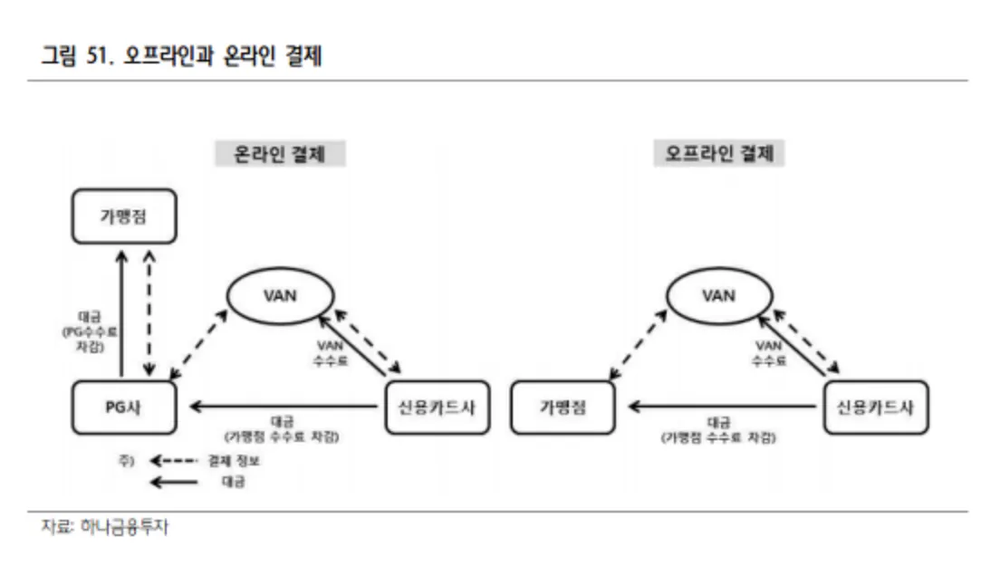

## PG 개념

<u>온라인에서 재화의 구입 또는 용역의 이용에 있어서 지급결제정보를 송신하거나 수신하는 것 또는 그 대가의 정산을 대행하거나 매개하는 업무</u>를 **전자지급결제대행업**이라 한다. (전자금융거래법 제2조 제19호)

> PG가 온라인에서만 이루어진다고 했지만, 오프라인 가맹점이 PG를 도입하는 케이스도 많아지고 있다. 이유는 정산의 편의성, 간편결제제공(네이버페이, 카카오페이)등이다. 하지만 수수료가 비싸기 때문에 가맹점은 득실을 잘 판단해서 도입해야한다.

전자지급결제대행 서비스를 '**PG(Payment Gateway)**'라고 부르는데, 전자지급결제대행업자는 자체 결제시스템을 통해 가맹점의 결제대행을 수행하는 업체(이하 "제1차 PG사")를 지칭한다. 예를들어 고객이 인터넷 쇼핑몰에서 물건을 구입하면서 신용카드로 결제하는 경우, 해당 물건 구입 대금은 고객 -> 카드사 -> 전자지급결제대행업자 -> 인터넷 쇼핑몰 순으로 대금 결제가 진행된다.

- PG사는 온라인 사업자를 대신하여 카드사, 은행, 간편결제사 등과 계약을 맺고, 결제승인 및 정산을 대행하는 전자결제 서비스를 제공하는 업체다.
- 미국과 달리 한국에서는 가맹점이 소비자의 카드 정보를 저장할 수 없기 때문에 **온라인 결제는 반드시 PG사를 통해야 한다.**
- PG사는 하나의 **대형 가맹점**처럼 동작하며, 소규모 가맹점의 결제를 대신 처리한다. (예: 온라인 카드 결제시 카드사 앱에 'KG이니시스'나 '나이스페이먼츠'가 가맹점명으로 찍히는 것은 PG사가 중개한 거래이기 때문이다.)
- 카드사는 매출이 큰 가맹점에는 낮은 수수료를 적용하고, 작은 가맹점에는 높은 수수료를 요구하는데, PG사가 대형 가맹점 역할을 하면서 소규모 가맹점에게 수수료 혜택을 줄 수 있는 구조가 된다.
  - 다만 실제로는 PG 대행 수수료가 포함되어, **직접 카드사와 계약하는 것보다 수수료가 더 높을 수 있다.**
- 그럼에도 불구하고 여러 카드사의 정산을 대신 처리해주기 때문에, **가맹점은 정산 및 판매에 집중할 수 있는 장점**이 있다.

## PG 역할

- PG사는 **결제 대행 및 정산 대행 서비스**를 제공한다.
- 온라인 쇼핑몰을 비롯해 최근에는 오프라인 매장에서도 간편결제 연동을 위한 PG 서비스 제공 사례**가 증가하고 있다.
- 상점과 계약한 정산일에 따라 여러 카드사에서 발생한 매출을 **한 번에 정산**해주어 현금 흐름 파악이 용이하다.
- 신용카드 외에도 계좌이체, 휴대폰 결제, 무통장 입금, 상품권 등 **다양한 결제 수단**을 지원한다.

## PG와 VAN의 차이

| 항목 | PG | VAN |
| --- | --- | --- |
| 기능 | 결제 대행, 정산 대행, 다양한 결제 수단 지원 | 카드 승인 중계 |
| 결제 수단 | 카드, 계좌이체, 간편결제 등 온라인 중심 | 오프라인 카드결제 중심 |
| 정산 주체 | PG사 (통합 정산) | 카드사 (개별 정산) |
| 수익 구조 | 거래 금액 기반 수수료 | 거래 건수 기반 수수료 |
| 활용 범위 | 온라인/모바일/QR/오프라인 간편결제 | 오프라인 단말기 기반 |
| 부가 서비스 | 환불, 매출 리포트, 간편결제 지원 등 | 제한적, 일부 유료 |

- VAN은 결제 데이터를 카드사에 전달하는 통신망 역할을 하며, **결제 승인만 처리**하고 정산은 하지 않는다.
- PG는 VAN을 통해 승인 과정을 진행하되, **정산은 PG가 직접 수행**하여 수수료를 차감한 후 가맹점에 입금한다.

## VAN만 사용시 단점

- 카드사마다 정산 계좌를 등록하고, 입금일이 상이해 **매출 확인 및 정산이 복잡**하다.
  - 예: 신한카드 D+2일, 삼성카드 D+3일
- 수수료 차감 내역이나 정확한 입금액 파악이 어려워 **정산 누락 위험**이 있다.
- 카드 외 결제수단(간편결제, 무통장입금 등) 지원불가
- **개별 카드사 사이트에서 수동으로 확인**해야 하며, 자동화된 리포트나 통합 정산이 제공되지 않는다.

## PG를 사용할 경우 차이

- PG는 다양한 결제 수단을 한 곳에서 제공하며, **정산을 자동으로 통합 처리**해준다.
- **소규모 가맹점 입장에서는 정산·회계의 부담이 줄고**, 판매에 집주할 수 있다.
  - 모든 카드사들에 대한 정산을 일괄 적용한다. D+n or 월정산 등.
  - 정산계좌도 PG 한 곳에만 등록하고 관리할 수 있다.
  - 환불&CS등을 각 카드사로 요청하는게 아닌 한 곳에서 처리할 수 있다.
- PG가 하나의 가맹점 역할을 하므로, 고객의 영수증에는 가맹점명 대신 PG사 명칭이 표시된다.
- 다만, **PG사의 수수료가 존재하므로 카드사 직접 계약보다 비용이 높을 수 있음**은 고려해야 한다.

## 결제시장 변화 및 PG사의 위상 변화

- 과거에는 카드사와 VAN사가 주도하던 오프라인 중심 시장 구조였으나 **모바일 결제, 간편결제의 성장**으로 PG사의 영향력이 확대되고 있다.    
- PG사가 거래를 중개하면 카드사 입장에서는 **누가, 얼마나 썼는지는 알 수 있지만 ‘어디서’ 사용했는지는 알 수 없다.**
- 이로 인해 PG사가 **결제 플랫폼에서 ‘갑’으로 전환되는 현상**이 발생 중이다.
- VAN사 중 **PG사를 보유한 곳은 경쟁력 상승**, **PG 없는 중소 VAN사는 입지가 축소**되는 추세다.
- 카드사 역시 PG를 거친 거래에 대해 **‘결제처 식별 기술’을 통해 보완**하고 있다.
- PG사 경쟁 심화로 온라인뿐 아니라 **오프라인 POS 시장에도 진출**하고 있으나, 대표적으로 **토스페이먼츠의 POS 보급 사례처럼 성과는 제한적**인 상황이다.

## 수익구조

### 1) 결제 수수료 (가맹점 수수료)

- **PG사의 핵심 수익원**
- 가맹점으로부터 거래 건당 수수료 또는 거래 금액의 일정 비율을 수취
- 일반적으로 결제 금액의 2.5%~3.5% 수준

### 2) 정산 지연에 따른 이자 수익 (정산 Float)

- PG사는 카드사로부터 결제 대금을 받아 **가맹점에 입금하기 전까지 일정 기간 자금을 보유한다.**
- 이 기간 동안 **보유한 정산금을 운용하거나 이자 수익을 취하는 구조**입니다.

> 특히 거래량이 큰 PG사일수록 이자 수익이 무시할 수 없는 수준
> 

### 3) 가입비 및 연관리비 (선택적 수익)

- 일부 PG사는 초기 서비스 계약 시 **가입비**를 받고,
- 연간 유지/보수 명목으로 **연관리비**를 부과하기도 합니다.
- 최근에는 경쟁 심화로 인해 대부분의 PG사들이 무료 정책으로 전환했지만, **특수 업종이나 맞춤 서비스의 경우 여전히 존재**합니다.

## 2024년 PG사 매출 현황

| PG사 | 2024년 매출 |
| --- | --- |
| NHN KCP | 1조 340억원 |
| 토스페이먼츠 | 8165억원 |
| KICC | 7550억원 |
| KG이니시스 | 6764억원 |
| NICE | 6288억원 |

## Reference

- https://www.pay2pay.co.kr/board/view?bId=1&wr_id=3212
- https://brunch.co.kr/@smj3667/11
- https://platum.kr/archives/209263
