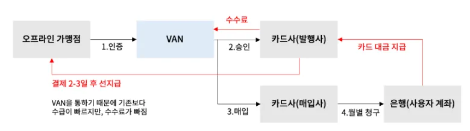

:::info
이글은 공부&기록 목적으로 https://blog.naver.com/dagreen29/223302168523 글을 그대로 가져왔습니다. 빠진 내용도 많이 있습니다.
:::

# VAN 개념

VAN(Value Added Network)은 통신망 사업자로부터 통신회선을 빌려서 독자적인 통신망을 구성하고, 거기에 어떤 가치를 부가한 통신망을 의미하는 것으로 정의에 따르면 다양한 통신 업종이 있을 수 있는데 VAN이라는 용어는 거의 확정적으로 신용카드 거래를 통신망을 통해 중계하는 중계 사업자를 지칭하는 고유명사가 되었다.

우리나라는 신용카드 산업이 매우 활성화되어 있다. 주요 카드사만해도 8개인데 (삼성, 하나, 농협, 현대, 롯데, 신한, 우리, 비씨) 가맹점이 8개의 카드사와 모두 망을 뚫고 계약할 수는 없다. 그래서 VAN사가 카드사 사이에서 공통 중계 업무를 담당한다.

만약 VAN사가 없다면 가맹점이 카드사와 직접 결제망을 뚫어야 했기 때문에 가맹점마다 지원되는 카드가 달라서 중구난방이었을 것이다.

# VAN사가 하는 일

VAN사는 **승인업무** 와 **매입업무**를 중계한다.

## 승인

<small>출처: 재정포럼 2018년 9월호, 김재진 한국조세재정연구원</small>

카드사에서 이 고객이 회원인지, 거래정지자인지, 카드한도가 남아있는지, 카드가 유효한지, 이상거래탐지(FDS)등을 검증하는 단계가 "승인"이다.

**참고)**
- 신용카드: 카드 한도가 차감되는거지 실제로 돈이 이동하진 않는다.
- 체크카드: 승인 시점에 카드사로 바로 돈이 빠져나간다.

## 매입
승인이 끝나면, A 가게 주인은 돈을 받지 못한다. 이때 필요한게 **"매입"**이다.
(신용카드로 가맹점에서 결제하는게 일종의 채권발행 행위이다.)

VAN사는 승인 내역을 토대로 카드사에 매입을 청구한다. 그럼 고객은 카드사로 대금을 납부하고, 카드사는 그 돈 중 일부를 (카드 수수료를 제외하고) A 가게한테 돌려준다. (정산)

**매입: 승인 결과에 대해 가맹점이 카드사로부터 매출대금 입금을 요청하는 것**

## 매입방식

### 1. DDC(Data Draft Capture) (=자동매입)
- 매입방식 중 근본 (전체 가맹점의 95%가 이용)
- 자동매입이라고 부름. 가맹점에서 별도 조치안해도 VAN사에서 알아서 카드사로 청구한 다음에 결과를 가맹점으로 던져줌 (매입주체: VAN사)
- 유사: DESC(=DSC) (electronic signature capture) DDC와 동일하나 서명패드로 전자서명된거임
  - 요즘은 DDC = DESC(DSC) 이다. 종이전표에 서명을 받는 경우가 거의 없고, 서명없는 거래(5만원 이하 거래도 있으니)

### 2. Host DDC(DESC)
- DDC가 한단계 진화한 느낌
- 가맹점이 주체가 되는 방식의 DDC이다.
- 가맹점과 VAN 사이에는 EDI 방식, VAN과 카드사 사이는 DDC방식이다.
  - 구간별로 매입 방식이 다르다.
- 여전히 카드사로 청구하는 주체는 VAN사 이지만, 매입 파일을 생성하는건 가맹점이다. 청구 책임은 VAN사에게 있다.

### 3. EDI(Electronic Data Interchange)
- 주로 온라인 가맹점이나 대형가맹점에서 쓰는데 "매입파일 생성 + 청구"를 가맹점이 직접한다.
  - VAN사를 안거치진 않는다. VAN은 by-pass만 한다.
- 대형가맹점에서 이걸 왜 쓰냐? 청구 주기를 본인들이 관리하고 싶거나 청구 수수료를 절감하고 싶어서 쓴다.

### 4. EDC(Electronic Data Capture) (=카드사자체매입)
- VAN사가 제일 싫어하는 매입방식 -> 카드사에서 직접 매입하는 방식이다.
- 승인은 VAN사를 통해 발생했지만 매입은 갑자기 VAN사를 빼버린다. 이렇게 하면 카드사 입장에서는 매입 수수료를 VAN사에 지급하지 않아도 되어서 이득이다.
  - 비씨카드를 시작으로 롯데, 삼성, 신한카드 등 일부 카드사에서 이렇게 하는걸로 알고 있다.
  - DDC의 경우 카드사는 밴사에 매입 수수료 명목으로 건당 10~17원을 지급하는 반면 EDC로 전환할 경우 매입 수수료가 6원 안팎까지 줄어든다.
  - https://www.etnews.com/20231122000220
- 유사: ESC (가운데 S는 signature)

### 정리
1. DDC: VAN사가 매입 파일 생성 (매출전표 영수증 수거)
2. DESC(=DSC): VAN사가 매입 파일 생성 (매출전표 영수증 비수거)
  - 서명데이터를 전자로 받아 VAN사에서 저장하고 일괄 청구
3. Host DDC: 가맹점이 매입파일 생성해서 전달해주면(EDI), VAN사가 DDC 방식으로 청구
4. EDI: 대형가맹점에서 매출을 확정해서 매입파일 생성, VAN사는 이걸 받아 카드사로 바이패스
5. EDC(=ESC): 대표적으로 비씨에서 쓰는 방식. 승인은 VAN사를 통하지만 매입에서는 카드사 자체 매입

# VAN사가 돈을 버는 법
오프라인 결제를 할 때 가게 사장님들은 VAN사에 수수료를 지급하지 않는다. 대신 정산 받을 때 제외되는 카드수수료 안에 VAN 수수료가 녹아져있다.

카드사로부터 받는 VAN 수수료는 크게 두 개가 있다.
1. 승인에 대한 수수료 (승인피)
2. 매입에 대한 수수료 (매입피)

그런데 이렇게 VAN사가 받는 수수료는 오로지 100% VAN사의 몫은 아니다. 하위에 영업해준 대리점들한테 일부를 떼어서 나눠줘야 한다.

카드사가 매입방식을 EDC(Electronic Data Capture)(=카드사 자체매입)로 바꾸고 있는 추세다. 이렇게 되면 VAN 수수료의 일부인 매입피가 사라져버린다. (카드사 입장에서는 수수료의 60%가량을 줄일 수 있다.)

참고) VAN 수수료가 2018년 7월 전에는 정액제였다.(지금은 정률제)
- 정액제: 결제 금액과 상관없이 정해진 수수료를 받음
- 정률제: 결제 금액의 일정 비율을 수수료로 받음
- 1만원 이하의 소액결제가 급증하고 있는 상황으로 카드사 부담이 가중된다고 판단해 VAN 수수료를 정액제에서 정률제로 전면 개편되었다.
- 추가로 정부는 영세가맹점의 카드수수료 부담을 낮추기 위해 VAN사의 수수료를 낮추길 계속 바래왔다. VAN 수수료가 낮아지지 않으면 카드사의 부담이 커진다.

사실상 VAN산업이 사양산업이라고 많이들 하는 이유가 위에서 설명했듯이 VAN의 수익구조가 환경 + 제도적인 영향을 매우 많이 받았기 때문이다. 일단 수수료 떼고 떼이는 산업이다보니 이해관계자도 많은 편이고, 제일 큰 건 카드 수수료가 낮아지면 VAN수수료도 같이 낮아질 수 밖에 없는 구조다.

<small>출처: 재정포럼 2018년 9월호, 김재진 한국조세재정연구원</small>

- VAN 수수료는 VAN사가 수행한 업무와 방식에 따라 차이가 있기 때문에 a라고 가정한다.
- 오프라인 가맹점이 소비자에게 재화나 서비스를 공급하게 되면 신용카드 회사는 가맹점 수수료 80원(영세가맹점의 신용카드 수수료는 0.8% - 2018년)을 제외한 9,920원을 가맹점에 지급하고 VAN사에 VAN 수수료 a원을 지급한다.
- 2025년에는 연매출 3억원 이하 사업자는 신용카드 수수료가 0.4%로 더 줄었다.
