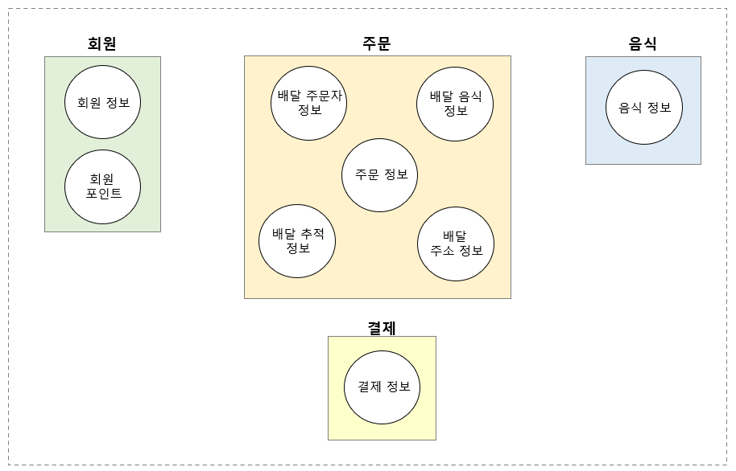

# 2023.07.09

## 1. 개발자 온보딩 가이드

어느분이 "개발자 온보딩 가이드"라는 책을 요약해주셨는데 공감되는 문장 몇 개 들고왔다.
- 사이드 프로젝트는 “해결하고 싶은 문제” 가 있을 때 “이를 해결할 도구를 이용” 한다는 목표가 있어야 한다.
  - 어떤 것을 “배워야 해서” 라는 이유로 프로젝트를 하는 것은 추천하지 않는다 (동기부여가 별로 안됨)
- 기술 부채 ?
  - 이 용어를 남용하지 말라.
    - 내가 동의하지 않는 기술적 의사결정 or 별로 마음에 들지 않는 코드라고 ‘기술 부채’ 라고 부를 수는 없다.
- 설계
  - 문서를 작성하는 과정에서 불명확한 부분이 드러나기도 한다
  - 구현을 하다보면 계속해서 뜻밖의 일이 발생함.
    - 코드를 작성하면서 크게 달라 지는 부분이 있다면 설계 문서도 반드시 업데이트 해야 함.
  - 설계 시작 전 “문제 영역, 요구사항을 이해” 해야 한다
  - 문제를 정의 : 해결하고자 하는 문제를 정의 하고 이해하기
    - 이 과정에서 문제가 없거나 해결할 필요조차 없다는 것을 알 수도 있음
    - 내가 이해하는 문제가 이해관계자들이 바라보는 시선과 같은지 확인

## 2. 회사에서 폴더구조 정하기

회사에서 4개의 프로젝트를 하나의 프로젝트로 합치는 작업을 시작하기 전 가장 중요한 폴더구조 정하는 논의를 했다. 아직 완벽하게 마무리가 된 건 아닌데 큰 틀은 정해져서 어떤 흐름으로 정하게 되었는지 기록하고자 한다.

### 1) 원칙

이전에 내가 적은 폴더링에 대한 생각을 ppt로 발표했고 폴더링에 대한 큰 윈칙을 정해보았다.
1. 연관된 것은 같은 폴더에 두자 (연관된 == 도메인이 같은)
2. 모르는 사람도 헷갈리지 않는 구조를 만들자

### 2) common과 domains

- 공통 로직&컴포넌트와 도메인에 종속된 로직&컴포넌트를 분리하자. 
- 도메인은 어떻게 구분해야할까? 지금 프로젝트 구조인 payment, account, money, payment-card 그리고 home 이렇게 구분하는게 맞을까?
  - payment와 payment-card는 합치는게 맞을 것 같다.
  - domain 구분이 너무 애매하다. account뿐 아니라 escrow, kyc, address도 domain으로 올라가야하는게 아닐까? 전부다 구분하는게 좋을 것 같다.
- 만약 payment에서 account 에 구현되어있는 컴포넌트를 사용해야하는 경우가 생기면 어떻게 해야할까?
  - 그럴때 common으로 해당 컴포넌트를 옮기고 common에 있는걸 두 도메인에서 가져다 사용하면되지 않을까?
  - payment에서 account의 컴포넌트를 바로 참조하는건 어떨까?
  - 그렇게 되면 의존성이 꼬여서 나중에 찾아가기도 힘들고 유지보수하기도 어려울 것 같다. 공통되는게 생기면 상위로 올리는게 좋을 것 같다.

### 3) shared

- common 폴더에서 여러 도메인에서 가져다가 사용하고 도메인로직이 들어간 컴포넌트와 아토믹한 컴포넌트를 분리하면 좋을 것 같다. 컴포넌트 뿐아니라 utils, hooks들도 common에 들어갈 것 같은데 이것들도 구분이 필요할 것 같다.
- common > cash-receipt, dialog 이렇게 폴더링이 되면 혼란이 있을 것 같다. common에는 비즈니스 로직이 들어가있지 않은 디자인 시스템 컴포넌트 그리고 delay, format같은 utils와 hooks들 만 넣고 shared에는 도메인 로직이 어느정도 들어간 컴포넌트와 hooks들이 들어가면 좋을 것 같다.
- api, recoil store, storage 들도 shared에 들어갈 것 같다.

### 4) services

- 도메인 로직들이 포함되지는 않으나 여러 곳에서 사용되는 외부 라이브러리들을 wrapping하는 것들을 폴더로 모아두어도 좋을 것 같다. bridge, ga, sdk, sentry등이 들어갈 것 같다. 여기서 초기화나 wrapping을 한 번 할 것 같다.

### 5) domains와 pages

- domains로 붙히는게 너무 애매하다. domains 하위에 있는건 page로 구분한 것이기 때문에 next의 아키텍쳐를 따라가서 pages로 붙히는건 어떨까?
  - domains로 붙히면 그 기준이 너무 애매해진다. 만약 domains로 한다면 지금처럼 payment, account, money, home 4개로 고정하는게 좋을 것 같다. 그게 아니면 path나 page를 기준으로 그룹핑을하고 폴더명은 pages로 정하는게 좋을 것 같다.

### 6) page 파일과 components

- page의 폴더링은 path 구조와 동일하게 가져가는게 좋을 것 같다. 그리고 루트 path인 경우 폴더명을 index로 가져가자.
- page 파일과 그 파일을 구성하는 components들을 어디에 위치시키면 좋을까?
- page 파일은 정말 page initialize hoc 로직이나 meta 속성들만 정의되면 좋을 것 같다.
- components들은 따로 components 폴더에 모아두면 어떨까? 그리고 Page 컴포넌트는 이와 확실히 구분하여 index로 파일명을 지어도될 것 같다.
- 만약 components들에서 공통적으로 사용하는 컴포넌트라면 어디에 둬야할까? shared에 둬야할까?
- 상위 도메인 (pages)와 공통으로 쓰는게 아니기에 pages > payment 밑에 shared 폴더를 두고 사용하면 어떨까? 여기에는 components, hooks, utils 3개의 폴더만 들어가도될 것 같다.
- 추가로 shared는 첫 deps에만 두는게 좋을 것 같다. 아니면 폴더링이 매우 복잡해질 것 같다.

### 7) 기타

- 폴더명을 복수형으로 사용하면 폴더명 지을 때 혼란이 있을것 같다. 일관되게 단수형으로 사용하면 좋을 것 같다.

### 8) 폴더 구조

| 1 level | 2 level | 3 level |
|:--:|:--:|:--:|
|  |  |  |

### 논의 이후 다시 고민해봐야 할 부분

#### page 바로 하위로 들어가야하는건 어떤 것인가? 그 기준은 뭘까?

- 처음에 정한 기준은 path 였다. www.abc.com/d/ 이런 경우 d가 page 바로 하위에 들어갈 것이다. d는 왜 도메인 뒤 첫 path일까? 만약 기존 e,f,g 가 첫 path인 경우 d가 기존 도메인과 성격이 너무 틀려서 새로운 상위 도메인으로 만든 것인가?

- 도메인을 상위 도메인, 하위 도메인으로 구분시켜보자 그리고 상위 도메인을 page 바로 하위로 두면 될 것 같다. 그럼 상위 도메인 하위 도메인 나누는 기준은 뭘까?

- 상위 도메인 폴더(page 폴더 바로 하위) 밑에 하위 도메인 컴포넌트들이 component 폴더 혹은 path(page)로 들어갈 것이고 그중 다른 상위 도메인에서도 가져다 사용하는 하위 도메인 컴포넌트들은 shared로 이동시키게 될 것이다.

- 만약 e 도메인의 flow에서 상위 도메인 d의 컴포넌트를 사용하는 경우에는 어떻게 해야할까? d 상위 컴포넌트 하위 컴포넌트 중 공통 컴포넌트로 사용할 컴포넌트를 shared로 올리면 된다.

- 그 반대도 동일하다. page가 없던 e 밑에 있던 하위 도메인 d가 page가 생기게 되면 d를 상위 도메인으로 올리고 d domain에서 공통 컴포넌트를 shared에 두어 e와 d에서 같이 사용하면 된다.

- 여기까지는 확실히 정리되었다. 다시 처음으로 돌아가자. 기존 domain과 성격이 다른 domain, 그리고 페이지가 새로 나온 domain을 상위 도메인이라고 부르는게 맞을까? 애매모호한 기준은 주관적이어서 점점 그 기준이 흐릿해지고 구조가 깨지기 시작한다. 우리는 그 기준을 확실히 정할 필요가 있다.

#### 도메인은 뭘까? 그리고 상위 도메인, 하위 도메인은 어떻게 나누는가?

참고: https://happycloud-lee.tistory.com/94

- 도메인은 사전적 의미로 '영역', '집합'입니다.
- DDD에서 말하는 Domain은 **비즈니스 Domain**입니다.
- 비즈니스 Domain은 **유사한 업무의 집합**입니다.
- 어플리케이션은 비즈니스 Domain별로 나누어 설계 및 개발될 수 있습니다.

##### DDD란?

- **비즈니스 Domain별로 나누어 설계**하는 방식입니다.
- DDD의 **핵심 목표는 "Loosely coupling", "High cohesion"입니다. (애플리케이션 또는 그 안의 모듈간의 의존성은 최소화하고, 응집성은 최대화)
- DDD는 Strategic Design과 Tactical Design으로 나눌 수 있습니다. **Strategic Design은 개념 설계**이고 **Tactical Design은 프로그래밍하기 위한 구체적 설계**라고할 수 있습니다.

##### Domain Model

- Core Domain: 비즈니스 목적 달성을 위한 핵심 도메인으로 차별화를 위해 가장 많은 투자가 필요함
- Supporting Sub-Domain: 핵심 도메인을 지원하는 도메인
- Generic Subdomains: 공통 기능(메일, SSO 등) 도메인

##### Domain 분해 예제: 온라인 음식 주문 업무

주문, 주문중계, 음식점업무, 배당대행의 최상위 도메인을 정의하고 각 도메인을 서브도메인으로 분해함. 서비도메인은 유사한 업무를 그룹핑한 것임.

- 상위 도메인
  - 회원, 주문, 음식, 결제
- 하위 도메인
  - 회원 : 회원 정보, 회원 포인트
  - 주문 : 배달 주문자, 배달 정보, 주문 정보, 배달 추적 정보, 배달 주소 정보
  - 음식 : 음식 정보
  - 결제 : 결제 정보

#### 결론

- 도메인은 **유사한 업무의 집합**으로 특정한 문제를 해결하기 위한 기능들의 집합이라고 생각할 수 있다.
- 상위 도메인 하위 도메인의 구분은 상위 도메인을 어떻게 정하느냐에 따라 달라진다. 비즈니스를 역할별로 쪼개면 상위 도메인이 된다.
- 구분이 애매한 경우 팀원들간 협의하에 정하면 되는데 FE의 경우 page 로 구분하면 쉽게 해결할 수 있다.
