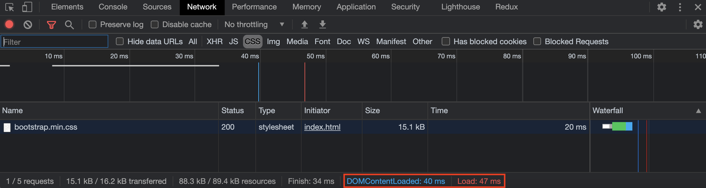

## Overview

script 태그의 `async` 와 `defer`에 대해서 공부하던 중 `DOMContentLoaded`와 `load` 이벤트에 대해서 알게되었고 두 이벤트에 대해 정리하였습니다.

<!--truncate-->

## Docs

공식문서에는 다음과 같이 말하고 있습니다.

> `DOMContentLoaded` 이벤트는 초기 HTML 문서를 완전히 불러오고 분석했을 때 발생합니다. 스타일 시트, 이미지, 하위 프레임의 로딩은 기다리지 않습니다.
>
> [DOMContentLoaded :: MOZ](https://developer.mozilla.org/ko/docs/Web/API/Window/DOMContentLoaded_event)
>
> `load` 이벤트는 리소스와 그것에 의존하는 리소스들의 로딩이 완료되면 실행됩니다.
>
> [load :: MOZ](https://developer.mozilla.org/ko/docs/Web/API/Window/load_event)

Chrome dev tool에서 측정해보면 \`DOMContentLoaded\`가 stylesheet와 img등의 리소스와는 상관없다는 것을 확인할 수 있습니다.



## async & defer

script 태그 `async` 와 `defer` 는 언제 script가 언제 실행되는지에 따라서 구분이 됩니다. `async`의 경우 script가 로드되면 바로 수행이 되는 반면(dom parsing을 block할 수 있다.) `defer`는 script가 로드 되고, dom parsing이 끝난 후에 실행이 되는 차이점이 있습니다. <br/>
이 차이점말고도 다른 차이점이 있는데, `async`의 경우 `window.load` 이벤트가 실행되기 전에 script의 실행을 보장하고, `defer`의 경우에는 `domContentLoaded` 이벤트가 발생하기 전에 script를 실행하는 것을 보장합니다.

```html
<!DOCTYPE html>
<html lang="ko">
  <head>
    <meta charset="utf-8" />
    <meta name="viewport" content="width=device-width, initial-scale=1" />

    <script defer src="./defer.js"></script>
    <script async src="./async.js"></script>
    <script src="./sample.js"></script>
    <link
      rel="stylesheet"
      href="https://cdnjs.cloudflare.com/ajax/libs/twitter-bootstrap/4.0.0-alpha/css/bootstrap.min.css"
    />
    <script>
      console.log("in head");
      window.addEventListener("DOMContentLoaded", function () {
        console.log("DOMContentLoaded is loaded");
      });

      window.onload = function () {
        console.log("window is loaded");
      };
    </script>
    <title>React App</title>
  </head>
  <body>
    <noscript>You need to enable JavaScript to run this app.</noscript>
    <div id="root"></div>
    <script>
      console.log("end of body");
    </script>
  </body>
</html>
```

다음과 같은 결과가 콘솔에 찍혔습니다.

```shell
async
in sample
in head
end of body
defer
DOMContentLoaded is loaded
window is loaded
```

## 마무리

전통적인 성능 측정 방식은 브라우저에서 발생하는 이벤트를 사용하는 것이었습니다. 웹 페이지가 로딩될 때 DOMContentLoaded, load 이벤트가 발생하며, 각 이벤트가 발생하는 시점으로 성능을 측정하게 되는데, DOMContentlLoaded 이벤트, load 이벤트 발생 시점이 빠를수록, 그리고 두 이벤트 발생 구간의 폭이 좁을수록 성능이 좋다고 말합니다.

하지만 현재는 DOMContentLoaded or load 가 user가 screen에서 실제로 보는 것과 차이가 있기에 FCP(First Contentful Paint)로 성능을 측정합니다. FCP는 이지가 처음 로드되기 시작한 시점을 기준으로 뷰포트 내에 가장 큰 이미지 또는 텍스트 블록의 렌더링 시간을 측정합니다.

## Reference

- [주요 렌더링 경로 성능 분석 :: developers.google.com](https://developers.google.com/web/fundamentals/performance/critical-rendering-path/analyzing-crp)
- [DOMContentLoaded :: MOZ](https://developer.mozilla.org/en-US/docs/Web/API/Window/DOMContentLoaded_event)
- [성능 최적화 :: TOAST UI](https://ui.toast.com/fe-guide/ko_PERFORMANCE)
